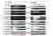
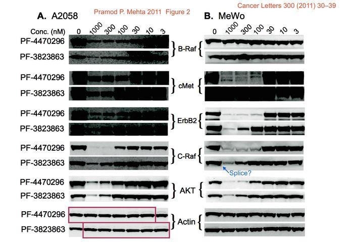

This Science Vigilante Calls Out Bogus Results in Prestigious Journals

# This Science Vigilante Calls Out Bogus Results in Prestigious Journals

## With pressure to “publish or perish,” some scientists fake their research results. Elisabeth Bik spends her days correcting them.

[Gemma Milne](https://onezero.medium.com/@gemmamilnewriter?source=post_page-----eb5a414c7f76----------------------)

[Nov 6](https://onezero.medium.com/this-science-vigilante-calls-out-bogus-results-in-prestigious-journals-eb5a414c7f76?source=post_page-----eb5a414c7f76----------------------) · 6 min read

Credit: Michel & Co

Elisabeth Bik spends her days trawling scientific papers, life sciences papers in particular, looking for signs of image manipulation. Put another way, she plays a backward game of “spot the difference” (backward because it’s more like “spot the similarity”) to seek out fraudulent work posing as science. She does this for free, week after week, along with other online science misconduct sleuths, in the pursuit of correcting the record upon which the world’s knowledge is based.

She is a self-appointed, image-manipulation detective — the Sherlock Holmes of science fraud.

It started with plagiarism before plagiarism became easy to catch. After reading about its prevalence in scientific papers, Bik, who had a 15-year career as a microbiology researcher, searched Google Scholar and found her own work had been copied. Then she set about finding other instances of this particular fraud. On one such investigation, she found a PhD thesis that not only had plagiarized text, but also an image that was reused throughout. The author had been trying to pass off the same image as a series of distinct results. “[The image] was mirrored, or turned around, but it had a very distinct little smear, which I recognized,” she says.

After reporting the fraudulent thesis to the university, resulting in its retraction, Bik realized she’d stumbled upon a new, strange hobby. “That was something I was good at, recognizing these patterns,” she says, “and so I started doing that more and more.” She soon found herself going through swaths of research papers during her evenings and weekends, and looking forward to getting home from her day job to continue.

It wasn’t long before Bik had amassed a huge collection of fraudulent papers. In 2016, [she co-authored a paper](https://mbio.asm.org/content/7/3/e00809-16.abstract) revealing the fruits of her labor. Within her manual search of more than 20,000 pieces of biomedical research, 4% contained manipulated images. She reported those 800 papers, and she’s continued searching, sharing, and reporting ever since.

One of the initial 800 papers she reported was by Min-Jean Yin, who led the Pfizer California cancer lab at the time of the paper’s publication. It contained duplicated images of western blots, a common test used to detect specific protein molecules. The images produced from the test *are* the data, so editing them essentially amounts to chopping and changing results to fit whatever hypothesis the scientist is trying to prove.

After Bik reported the abnormalities both on popular research discussion forum PubPeer as well as on the science misconduct blog [For Better Science](https://forbetterscience.com/2017/05/23/pfizer-announces-more-retractions-for-sacked-lab-head-min-jean-yin-whistleblower-revealed/), Pfizer not only fired Yin but also opened up a larger investigation into her years of work at their lab. This led them to retract many of her published papers focused on cancer therapeutics.

*Image from the PubPeer listing questioning of one of Yin’s 2011 papers, with the red box annotating a copied crop. Credit: *[*PubPeer*](https://pubpeer.com/publications/64FDCF71589ED7672F69D2C70456EE)

Bik is prolific on PubPeer and on Twitter, where she posts multicolored annotated graphics that point out how images have been manipulated to nearly 40,000 followers. “I’ve been a very quiet microbiologist until a few years ago when I joined Twitter,” she says with a laugh.

After earning a PhD in the Netherlands, 15 years at Stanford, and a few years in the science startup scene, this year, both Bik and her husband decided to take the leap into working on personal projects instead of for companies. Looking for fraud in research is more than just a fun hobby for Bik. “I’ve found this niche that I feel I can make a difference in,” she says. “I felt it was calling me.”

Bik often picks open-access journals, as they’re easier to flick through, or papers that are requested by other scientists who are tipping her off. “What I’m doing now is going into all the image manipulation cases I’ve already found and finding other papers by the same author, which could be in other journals.”

> “My goal is not to have people disciplined; my goal is to correct the science.”

Living off savings, Bik reckons she has about a year’s leeway to work on her image manipulation sleuthing and hopes to find a way of monetizing her expertise as a science misconduct consultant to journals.

Published work in prestigious academic journals is the main currency of the science world, and career progression, respect, and compensation are often linked to publishing reputation. The most significant journals only publish research with big implications and strong evidence that represents a leap in knowledge, not just an incremental addition. Unfortunately, this can’t always be achieved through grit, hard work, and the right area of research, so some scientists succumb to “publish or perish” pressure by editing their images to show clearer results, re-using images to convey “desirable” scientific claims, or photoshopping their graphs to back up false, but exciting findings.

Other scientists may spend years of time and huge amounts of research funding trying to build upon false science. “My goal is not to have people disciplined; my goal is to correct the science,” Bik explains.

Despite Bik’s work finding these manipulations, she estimates that only 30% of those papers have been corrected or retracted. “By tweeting about it, I hope to accomplish two things,” she explains. “First, put pressure on journals to react, like those viral videos where people are mistreated on airplanes. And second, make them aware that fraud happens, so when they see a paper, they know what to look for.”

Journals are notoriously bad at handling scientific misconduct. Sometimes this failing is understandable: Correcting or retracting a published paper could mean getting in touch with a myriad of authors, who may have since changed universities, never reply, or be unable to produce the original data. It requires time and patience to hunt down either the rationale for an honest mistake or the admission of misconduct, and it reduces the bottom line of these profit-making enterprises.

But sometimes the lack of investigation is unjustified. Journals have been known to reject complaints that aren’t submitted correctly through their complex and out-of-date online systems, or — more worryingly — come from anonymous submissions. Ivan Oransky, co-founder of Retraction Watch, which keeps track of scientific retractions, says: “I would love for scientists, journals, and universities who refuse to take seriously anonymous complaints and allegations about papers to tell me how they feel about the anonymous whistle-blower [who brought forth concerns about President Donald Trump’s dealings with Ukraine].”

Because reputation is paramount in science, anonymity is often required.

Much of the sleuthing is done by active scientists who use pseudonyms for fear of being ousted by their university or ostracized by the affected researchers. One such sleuth is [Smut Clyde](https://twitter.com/SmutClyde) who, like Bik, spends huge amounts of time finding irregularities, knowing that their anonymous posts may not be accepted by the journals. “There are an awful lot of scientists [committing fraud]. Just picking out one or two doesn’t really make much of a difference — it’s just a drop in the ocean,” they told *OneZero*. “The best we can hope for is to raise awareness that the ocean is rather full already and ultimately shift the incentives. It’s more long-term than identifying one particular person who is up to no good.”

Bik is well-known and well-respected within the science misconduct community, not only for the prolific nature of her work but also because she writes and reports under her own name. In some ways, then, Bik is a surrogate for so many. She posts and reports publicly, often after being tipped off to papers from those who aren’t able to do it themselves: “Every day I get a new request.”

“I hope more people join me in the image manipulation search, as I feel we need more people doing this. There’s so many papers and I feel we need to clean ship.”

It’s the volunteers, the puzzle aficionados, the ones who do it because they feel they must, that are holding science to account. Conan Doyle’s fictional Sherlock Holmes famously inspired changes in police reporting; maybe one day the tenacity and sharp eyes of Bik and the rest of the image manipulation sleuths might inspire the institutions of science to do the same.