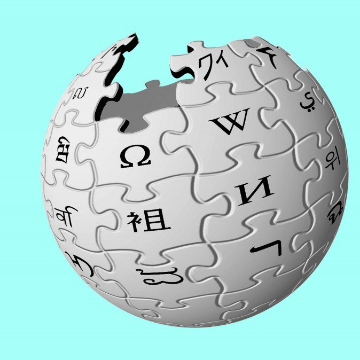

This algorithm browses Wikipedia to auto-generate textbooks

This algorithm browses Wikipedia to auto-generate textbooks

https://www.technologyreview.com/s/612726/this-algorithm-browses-wikipedia-to-auto-generate-textbooks/

Wikipedia is a valuable resource. But it’s not always obvious how to collate the content on any given topic into a coherent whole.