This is Why I'll Never be an Adult

### [This is Why I'll Never be an Adult](http://hyperboleandahalf.blogspot.co.uk/2010/06/this-is-why-ill-never-be-adult.html)

I have repeatedly discovered that it is important for me not to surpass my capacity for responsibility.  Over the years, this capacity has grown, but the results of exceeding it have not changed.

Normally, my capacity is exceeded gradually, through the accumulation of simple, daily tasks.

[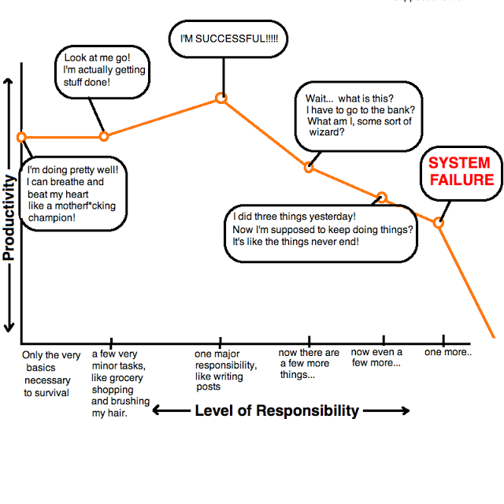](http://1.bp.blogspot.com/_D_Z-D2tzi14/TBpWM3wxI1I/AAAAAAAADFk/6ROBYJkpuuQ/s1600/responsibility1.png)

But a few times a year, I spontaneously decide that I'm ready to be a *real* adult.  I don't know why I decide this; it always ends terribly for me.  But I do it anyway.  I sit myself down and tell myself how I'm going to start cleaning the house every day and paying my bills on time and replying to emails before my inbox reaches quadruple digits.  Schedules are drafted.  Day-planners are purchased.  I stock up on fancy food because I'm also planning on morphing into a master chef and actually cooking instead of just eating nachos for dinner every night.   I prepare for  my new life as an adult like some people prepare for the apocalypse.

The first day or two of my plans usually goes okay.

.png)

[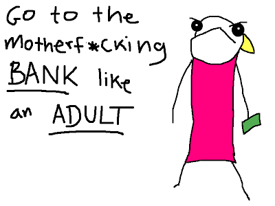](http://4.bp.blogspot.com/_D_Z-D2tzi14/TBpOY-GY8TI/AAAAAAAADFE/eboe6ItMldg/s1600/responsibility11.png)

[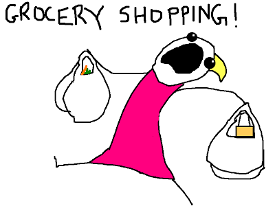](http://2.bp.blogspot.com/_D_Z-D2tzi14/TBpOglLvLgI/AAAAAAAADFM/I7_IUXh6v1I/s1600/responsibility10.png)

[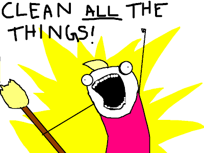](http://1.bp.blogspot.com/_D_Z-D2tzi14/TBpOnhVqyAI/AAAAAAAADFU/8tfM4E_Z4pU/s1600/responsibility12(alternate).png)

For a little while, I actually feel grown-up and responsible.  I strut around with my head held high, looking the other responsible people in the eye with that knowing glance that says "*I understand.  I'm responsible now too*.  *Just look at my groceries*."

At some point, I start feeling self-congratulatory.

[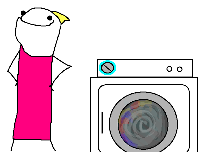](http://4.bp.blogspot.com/_D_Z-D2tzi14/TBpS80wMY5I/AAAAAAAADFc/mtYQWuQVpBs/s1600/responsibility2.png)

This is a mistake.

I begin to feel like I've accomplished my goals.  It's like I think that adulthood is something that can be earned like a trophy in one monumental burst of effort and then admired and coveted for the rest of one's life.

[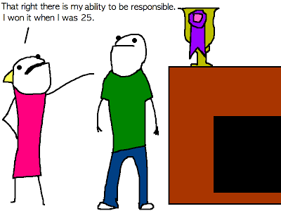](http://3.bp.blogspot.com/_D_Z-D2tzi14/TBpa3lAAFQI/AAAAAAAADFs/8IVZ-jzQsLU/s1600/responsibility14.png)

[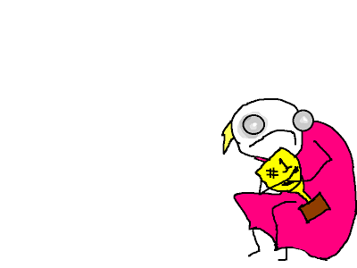](http://1.bp.blogspot.com/_D_Z-D2tzi14/TBpc--3N7WI/AAAAAAAADF0/TR9UqVr4oiE/s1600/responsibility15.png)

What usually ends up happening is that I completely wear myself out. Thinking that I've earned it, I give myself permission to slack off for a while and recover. Since I've exceeded my capacity for responsibility in such a dramatic fashion, I end up needing to take more recovery time than usual. This is when the guilt-spiral starts.

The longer I procrastinate on returning phone calls and emails, the more guilty I feel about it.  The guilt I feel causes me to avoid the issue further, which only leads to more guilt and more procrastination.  It gets to the point where I don't email someone for fear of reminding them that they emailed me and thus giving them a reason to be disappointed in me.

Then the guilt from my ignored responsibilities grows so large that merely carrying it around with me feels like a huge responsibility.  It takes up a sizable portion of my capacity, leaving me almost completely useless for anything other than consuming nachos and surfing the internet like an attention-deficient squirrel on PCP.

At some point in this endlessly spiraling disaster, I am forced to throw all of my energy into trying to be an adult again, just to dig myself out of the pit I've fallen into. The problem is that I enter this round of attempted adulthood already burnt out from the last round. I can't not fail.

2.png)

[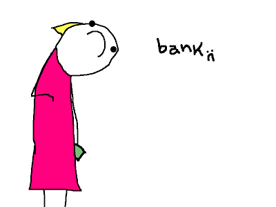](http://3.bp.blogspot.com/_D_Z-D2tzi14/TBpoFlGo7RI/AAAAAAAADGM/FXlxJPoxxQQ/s1600/responsibility3.png)

[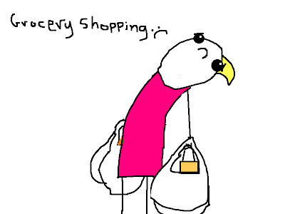](http://3.bp.blogspot.com/_D_Z-D2tzi14/TBpoOlpMa_I/AAAAAAAADGU/CfZVMM9MqsU/s1600/responsibility102.png)

[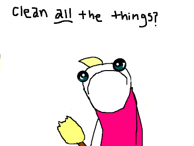](http://4.bp.blogspot.com/_D_Z-D2tzi14/TBpoVLLDgCI/AAAAAAAADGc/iqux8px_V-s/s1600/responsibility12(alternate)2.png)

It always ends the same way.  Slumped and haggard, I contemplate the seemingly endless tasks ahead of me.

[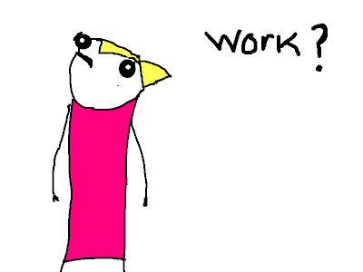](http://2.bp.blogspot.com/_D_Z-D2tzi14/TBpqGvZ7jVI/AAAAAAAADGk/hDTNttRLLks/s1600/responsibility8.png)

And then I rebel.

[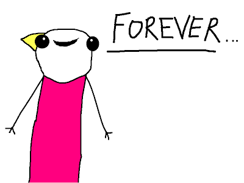](http://1.bp.blogspot.com/_D_Z-D2tzi14/TBptrVKv1tI/AAAAAAAADHE/F2LJp4-_Mpk/s1600/responsibility16.png)

[Tweet this!](http://hyperboleandahalf.blogspot.co.uk/2010/06/this-is-why-ill-never-be-adult.html#)

Posted byAllieat[12:55 PM](http://hyperboleandahalf.blogspot.co.uk/2010/06/this-is-why-ill-never-be-adult.html)