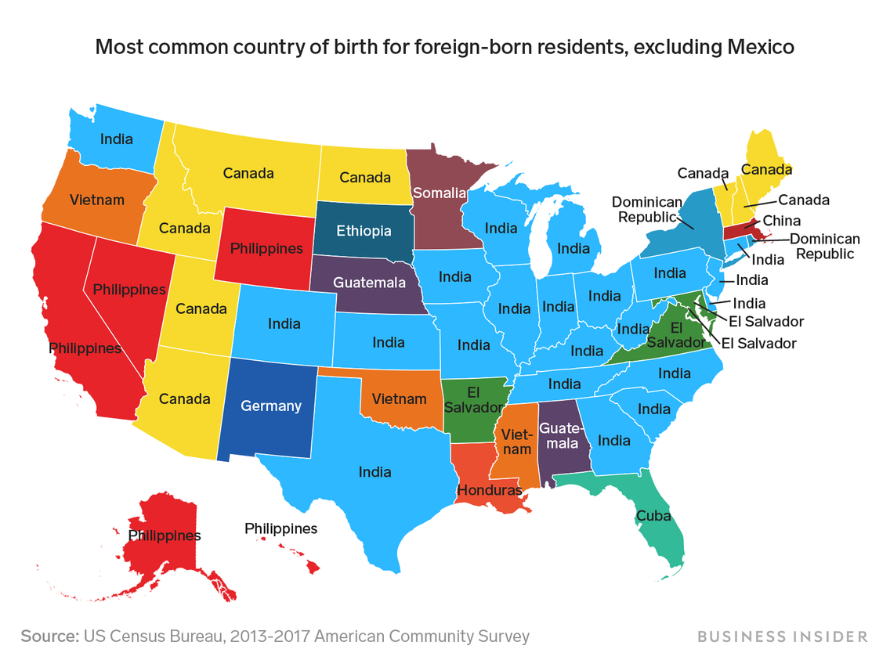

This map shows where each state's largest immigrant group comes from, excluding Mexico

# This map shows where each state's largest immigrant group comes from, excluding Mexico

[Andy Kiersz](https://www.businessinsider.com/author/andy-kiersz)

Apr. 18, 2019, 10:39 AM

         [](https://www.linkedin.com/shareArticle?mini=true&url=https%3A%2F%2Fwww.businessinsider.com%2Fwhere-do-immigrants-come-from-map-most-common-countries-2019-4%3Fr%3DUS%26IR%3DT%3Futm_source%3Dlinkedin%26utm_medium%3Dreferral%26utm_content%3Dtopbar%26utm_term%3Ddesktop%26referrer%3Dlinkedin&title=This+map+shows+where+each+state%27s+largest+immigrant+group+comes+from%2C+excluding+Mexico&summary=Using+data+from+the+US+Census+Bureau%2C+we+found+the+country%2C+excluding+Mexico%2C+that+was+the+most+common+birthplace+for+foreign-born+residents+in+each+state.)  

 

      Business Insider/Andy Kiersz, data from US Census Bureau

- The US is a nation of [immigrants](https://www.businessinsider.com/category/immigration).
- Using data from the US Census Bureau, we found the country that was the most common birthplace for foreign-born residents in each state (excluding Mexico, which was the most common country of birth for immigrants in 32 states).
- Many states have large immigrant populations from India.
- [Visit BusinessInsider.com for more stories.](https://www.businessinsider.com/?hprecirc-bullet)

The US is a nation of [immigrants](https://www.businessinsider.com/category/immigration) from all around the world.

The US Census Bureau's [American Community Survey](https://www.census.gov/programs-surveys/acs/) asks millions of people every year detailed questions about their social, economic, and demographic situations. One of the questions asks respondents what their country of birth is. The Census Bureau pooled together survey responses from between 2013 and 2017, allowing the bureau's statisticians to publish estimates of how many people in the foreign-born populations of each state and the District of Columbia came from various countries.

The percentage of the population [born outside the US varies widely from state to state](https://www.businessinsider.com/percentage-immigrants-born-outside-united-states-by-state-2018-12). Among those immigrant populations, countries of origin also vary widely.

For 32 states, the most common country of birth among respondents who said they were born outside the US was Mexico. Therefore, the map above looks at the country other than Mexico that is the birthplace of the most foreign-born respondents in the survey.

India tops that list in 21 states. Several states have Canada as a major source of immigrants. Several Asian, African, and Central American countries also have large immigrant populations in various states.

- Read more:
- [Here's how many people in each state were born outside the US](https://www.businessinsider.com/percentage-immigrants-born-outside-united-states-by-state-2018-12)
- [2 maps that show how every state's economy would suffer if Trump shuts down the US-Mexico border](https://www.businessinsider.com/trump-mexico-border-shutdown-threat-state-trade-map-2019-4)
- [This map shows that each US state is basically its own country](https://www.businessinsider.com/state-vs-country-gdp-map-2019-3)
- [Here's the highest-paying job in every US state](https://www.businessinsider.com/highest-paying-job-in-every-us-state-2019-2)

###  NOW WATCH: [Here's how the map of the United States has changed in 200 years](https://www.businessinsider.com/animated-map-of-200-years-us-border-territory-changes-2016-1)

 More:  [Maps](https://www.businessinsider.com/category/maps)  [Immigration](https://www.businessinsider.com/category/immigration)  [BI Graphics](https://www.businessinsider.com/category/bi-graphics)

[  ](https://popup.taboola.com/en/?template=colorbox&utm_source=businessinsider&utm_medium=referral&utm_content=thumbnails-feed-c-3x1:below-main-column%20|%20Card%201:)

[Taboola Feed ](https://popup.taboola.com/en/?template=colorbox&utm_source=businessinsider&utm_medium=referral&utm_content=thumbnails-feed-c-3x1:below-main-column%20|%20Card%201:)

[(L)](http://www.readersdigest.co.uk/er12?&source=TB&medium=6&term=rd-rll-native-desktop-2&utm_source=taboola&utm_medium=referral&utm_campaign=2075315)[Don't Trust Equity Release? Over 60s Should Learn The TruthSponsored by Reader’s Digest Equity Release](http://www.readersdigest.co.uk/er12?&source=TB&medium=6&term=rd-rll-native-desktop-2&utm_source=taboola&utm_medium=referral&utm_campaign=2075315)

Undo

[(L)](http://mortgageafterlife.com/trending/33-delicious-superfoods-can-prevent-heart-attacks-obesity/?utm_source=taboola&utm_medium=businessinsider&utm_campaign=1854866&utm_term=15%2B+Surprising+Foods+That+Naturally+Unclog+Arteries+Like+Magic&utm_content=http%3A%2F%2Fcdn.taboola.com%2Flibtrc%2Fstatic%2Fthumbnails%2F6e4e8bdc65ddeef579c8e33cab2fcabc.jpg)[15+ Surprising Foods That Naturally Unclog Arteries Like MagicSponsored by Mortgage After Life](http://mortgageafterlife.com/trending/33-delicious-superfoods-can-prevent-heart-attacks-obesity/?utm_source=taboola&utm_medium=businessinsider&utm_campaign=1854866&utm_term=15%2B+Surprising+Foods+That+Naturally+Unclog+Arteries+Like+Magic&utm_content=http%3A%2F%2Fcdn.taboola.com%2Flibtrc%2Fstatic%2Fthumbnails%2F6e4e8bdc65ddeef579c8e33cab2fcabc.jpg)

Undo

[(L)](https://www.fisherinvestments.com/en-gb/campaigns/definitive-guide-to-retirement-income/4j/?v=&PC=TABTA21EI5&CC=DVZ2&alleycode=XX&utm_source=Taboola&utm_medium=Native&utm_campaign=RON_Desktop&utm_term=businessinsider&utm_content=How+Far+Does+%C2%A31+Million+Go+in+Retirement%3F)[How Far Does £1 Million Go in Retirement?Sponsored by Fisher Investments UK eBook](https://www.fisherinvestments.com/en-gb/campaigns/definitive-guide-to-retirement-income/4j/?v=&PC=TABTA21EI5&CC=DVZ2&alleycode=XX&utm_source=Taboola&utm_medium=Native&utm_campaign=RON_Desktop&utm_term=businessinsider&utm_content=How+Far+Does+%C2%A31+Million+Go+in+Retirement%3F)

Undo

[(L)](http://www.labtrk.com/12fa3800-9e43-4e06-b62a-ca050d27b464?CampaignID=%7Bcampaign%7D&Site=businessinsider&Thumbnail=http%3A%2F%2Fcdn.taboola.com%2Flibtrc%2Fstatic%2Fthumbnails%2F6f032be5d3faceda21d7c4ca7f71919d.jpeg&Title=Top+Doctor+Has+Advice+for+Stopping+Joint+Inflammation&ad=3&utm_source=taboola&utm_medium=p_desk)[Top Doctor Has Advice for Stopping Joint InflammationSponsored by Jupiter Laboratories JointFuel360 Supplement](http://www.labtrk.com/12fa3800-9e43-4e06-b62a-ca050d27b464?CampaignID=%7Bcampaign%7D&Site=businessinsider&Thumbnail=http%3A%2F%2Fcdn.taboola.com%2Flibtrc%2Fstatic%2Fthumbnails%2F6f032be5d3faceda21d7c4ca7f71919d.jpeg&Title=Top+Doctor+Has+Advice+for+Stopping+Joint+Inflammation&ad=3&utm_source=taboola&utm_medium=p_desk)

Undo

[(L)](https://handlingfinance.com/beckham-makes-staggering-investment/?site=businessinsider&site_id=782&thumbnail=https%3A%2F%2Fhandlingfinance.com%2Fwp-content%2Fuploads%2F2019%2F05%2Fdavid-beckham-at-royal-wedding-t.jpg&title=Beckham+Makes+Staggering+Investment&timestamp=2019-05-19+12%3A03%3A29&platform=Desktop&campaign_id=2199256)[Beckham Makes Staggering InvestmentSponsored by HandlingFinance](https://handlingfinance.com/beckham-makes-staggering-investment/?site=businessinsider&site_id=782&thumbnail=https%3A%2F%2Fhandlingfinance.com%2Fwp-content%2Fuploads%2F2019%2F05%2Fdavid-beckham-at-royal-wedding-t.jpg&title=Beckham+Makes+Staggering+Investment&timestamp=2019-05-19+12%3A03%3A29&platform=Desktop&campaign_id=2199256)

Undo

[(L)](http://www.businessinsider.com/uber-lyft-drivers-reveal-the-things-you-should-never-do-on-a-ride-2019-5?amp_js_v=0.1&usqp=mq331AQHCAEoAaABAQ==)[Uber and Lyft drivers reveal the things you should never do while taking a ride](http://www.businessinsider.com/uber-lyft-drivers-reveal-the-things-you-should-never-do-on-a-ride-2019-5?amp_js_v=0.1&usqp=mq331AQHCAEoAaABAQ==)

Undo

[(L)](https://www.businessinsider.com/high-school-sprinter-matthew-boling-ted-ginn-race-bet-2019-5)[The high school sprinter putting up Olympic-level times has accepted an NFL wide receiver's open challenge to a $10,000 race](https://www.businessinsider.com/high-school-sprinter-matthew-boling-ted-ginn-race-bet-2019-5)

Undo

[(L)](https://www.businessinsider.com/the-nastiest-cruise-ships-2019-5)[These are the 8 nastiest cruise ships](https://www.businessinsider.com/the-nastiest-cruise-ships-2019-5)

Undo

[(L)](http://www.businessinsider.com/us-military-iran-firepower-show-of-force-info-pictures-details-2019-5)[The US is sending a ton of firepower to take on Iran — here's everything headed its way](http://www.businessinsider.com/us-military-iran-firepower-show-of-force-info-pictures-details-2019-5)

Undo

[(L)](http://www.directexpose.com/smart-knowledge-quiz/?utm_source=talas&utm_campaign=MSN_SAFE_M_TS_DE_UK_D_KnowledgeQuiz_v4_2412-We+Can+Guess+Your+Education+Level+In+The+First+5+Questions-https%3A%2F%2Fstorage.googleapis.com%2Fcaw-uploads%2F2f0672d7-ed29-4382-a330-7e1f0f6f3913.png&utm_term=businessinsider&utm_medium=MSN_SAFE_M_TS_DE_UK_D_KnowledgeQuiz_v4_2412&utm_content=newnext)[We Can Guess Your Education Level In The First 5 QuestionsSponsored by DirectExpose](http://www.directexpose.com/smart-knowledge-quiz/?utm_source=talas&utm_campaign=MSN_SAFE_M_TS_DE_UK_D_KnowledgeQuiz_v4_2412-We+Can+Guess+Your+Education+Level+In+The+First+5+Questions-https%3A%2F%2Fstorage.googleapis.com%2Fcaw-uploads%2F2f0672d7-ed29-4382-a330-7e1f0f6f3913.png&utm_term=businessinsider&utm_medium=MSN_SAFE_M_TS_DE_UK_D_KnowledgeQuiz_v4_2412&utm_content=newnext)

Undo

[(L)](http://rfvtgb.novelodge.com/worldwide/wd40?utm_medium=taboola&utm_source=taboola&utm_campaign=ta-nl-wd40-des-uk-26049d&utm_term=businessinsider)[The One WD40 Trick Everyone Should Know AboutSponsored by Novelodge](http://rfvtgb.novelodge.com/worldwide/wd40?utm_medium=taboola&utm_source=taboola&utm_campaign=ta-nl-wd40-des-uk-26049d&utm_term=businessinsider)

Undo

[(L)](http://rfvtgb.crowdyfan.com/worldwide/heart-attack-cancer?utm_medium=taboola&utm_source=taboola&utm_campaign=ta-cf-heart-attack-des-uk-safe-msn-1512d&utm_term=businessinsider)[15+ Foods That Naturally Clear Your ArteriesSponsored by Crowdy Fan](http://rfvtgb.crowdyfan.com/worldwide/heart-attack-cancer?utm_medium=taboola&utm_source=taboola&utm_campaign=ta-cf-heart-attack-des-uk-safe-msn-1512d&utm_term=businessinsider)

Undo

[(L)](https://www.businessinsider.com/white-house-size-layout-in-photos-2019-5)[Trump once reportedly complained the White House is a 'dump.' Photos show how surprisingly small it is.](https://www.businessinsider.com/white-house-size-layout-in-photos-2019-5)

Undo

[(L)](http://www.businessinsider.com/why-your-home-isnt-selling-according-to-realtors-2019-5?amp_js_v=a2&amp_gsa=1)[11 things that make a home unsellable, according to real-estate agents](http://www.businessinsider.com/why-your-home-isnt-selling-according-to-realtors-2019-5?amp_js_v=a2&amp_gsa=1)

Undo

[(L)](http://www.businessinsider.com/cruise-ship-workers-reveal-most-annoying-things-passengers-do-2019-5)[Cruise ship workers reveal the 7 most annoying things passengers do](http://www.businessinsider.com/cruise-ship-workers-reveal-most-annoying-things-passengers-do-2019-5)

Undo

[(L)](https://www.businessinsider.com/australian-election-results-prime-minister-morrisons-shock-victory-results-2019-5)[Australia's shock election results are drawing comparisons to Trump's 2016 win](https://www.businessinsider.com/australian-election-results-prime-minister-morrisons-shock-victory-results-2019-5)

Undo

[(L)](https://www.businessinsider.com/former-flight-attendant-the-worst-things-passengers-can-do-2019-5)[A former flight attendant says these are the 2 worst things passengers can do](https://www.businessinsider.com/former-flight-attendant-the-worst-things-passengers-can-do-2019-5)

Undo

[(L)](https://www.desertorder.com/?r=tabdo1ena38&utm_source=taboola&utm_medium=referral)[Play this Game for 1 Minute and see why everyone is addictedSponsored by Desert Order](https://www.desertorder.com/?r=tabdo1ena38&utm_source=taboola&utm_medium=referral)

Undo

[(L)](http://adtopia.club/native/track.php?acid=148&acsrc=1&acacnt=TABOOLA1A&cid=2228460&crvid=221132984&pubid=businessinsider&ts=2019-05-19+12%3A03%3A29&title=Santander+To+Issue+%C2%A31.6+Billion+To+The+Public+%28Look+Up+Your+Name%29+It%27s+Not+Too+Late%21&platform=Desktop&click_id=CjAzYzQzN2I2ZC1lYWI5LTQ5NzktYTM5My03Mzc0NjcxMmMwN2QtdHVjdDNjODc1YzgSCmltc2xhYnMtc2M&utm_source=taboola&utm_medium=referral)[Santander To Issue £1.6 Billion To The Public (Look Up Your Name) It's Not Too Late!Sponsored by Financial Guru](http://adtopia.club/native/track.php?acid=148&acsrc=1&acacnt=TABOOLA1A&cid=2228460&crvid=221132984&pubid=businessinsider&ts=2019-05-19+12%3A03%3A29&title=Santander+To+Issue+%C2%A31.6+Billion+To+The+Public+%28Look+Up+Your+Name%29+It%27s+Not+Too+Late%21&platform=Desktop&click_id=CjAzYzQzN2I2ZC1lYWI5LTQ5NzktYTM5My03Mzc0NjcxMmMwN2QtdHVjdDNjODc1YzgSCmltc2xhYnMtc2M&utm_source=taboola&utm_medium=referral)

Undo

[(L)](https://otty.com/products/the-otty-hybrid-mattress?variant=7683067609139&utm_source=taboola&utm_medium=referral)[The £450 Mattress That The UK Is LovingSponsored by The Otty Mattress](https://otty.com/products/the-otty-hybrid-mattress?variant=7683067609139&utm_source=taboola&utm_medium=referral)

Undo

[(L)](https://trendscheck.net/pure-eco-spa-uk?utm_source=taboola&utm_medium=referral&utm_campaign=taboola_uk_desk_pes3&utm_site=businessinsider&utm_siteid=782&utm_thumbnail=http%3A%2F%2Fcdn.taboola.com%2Flibtrc%2Fstatic%2Fthumbnails%2F57bc38d17ab28c697cea4eefea3b6eab.jpg&utm_title=This+Shower+Head+Is+Breaking+Sales+Records+In+The+UK)[This Shower Head Is Breaking Sales Records In The UKSponsored by Trendscheck](https://trendscheck.net/pure-eco-spa-uk?utm_source=taboola&utm_medium=referral&utm_campaign=taboola_uk_desk_pes3&utm_site=businessinsider&utm_siteid=782&utm_thumbnail=http%3A%2F%2Fcdn.taboola.com%2Flibtrc%2Fstatic%2Fthumbnails%2F57bc38d17ab28c697cea4eefea3b6eab.jpg&utm_title=This+Shower+Head+Is+Breaking+Sales+Records+In+The+UK)

Undo

[(L)](https://www.businessinsider.com/mark-zuckerberg-secretly-bought-59-million-lake-tahoe-property-2019-5)[Mark Zuckerberg spent about $59 million to secretly buy two adjacent private waterfront estates in Lake Tahoe last winter](https://www.businessinsider.com/mark-zuckerberg-secretly-bought-59-million-lake-tahoe-property-2019-5)

Undo

[(L)](http://www.businessinsider.com/iphone-vs-android-google-better-than-apple-2019-5)[I’m a loyal iPhone user, but after switching to Android for 2 weeks I found 3 things Google does better than Apple](http://www.businessinsider.com/iphone-vs-android-google-better-than-apple-2019-5)

Undo

[(L)](http://www.businessinsider.com/best-used-cars-to-buy-2019-5?amp_js_v=a2&amp_gsa=1)[The 7 best used cars to buy](http://www.businessinsider.com/best-used-cars-to-buy-2019-5?amp_js_v=a2&amp_gsa=1)

Undo

[(L)](http://misspennystocks.com/insurance/celebrities-thought-long-gone-not-planning-retirement-just-yet?utm_source=taboola&utm_medium=businessinsider&utm_campaign=1457928&utm_term=At+Age+74+Sam+Elliott+is+More+Than+Gorgeous&utm_content=http%3A%2F%2Fcdn.taboola.com%2Flibtrc%2Fstatic%2Fthumbnails%2Fcc491f919249342da0d179b9ef2e71e8.jpg)[At Age 74 Sam Elliott is More Than GorgeousSponsored by Miss Penny Stocks](http://misspennystocks.com/insurance/celebrities-thought-long-gone-not-planning-retirement-just-yet?utm_source=taboola&utm_medium=businessinsider&utm_campaign=1457928&utm_term=At+Age+74+Sam+Elliott+is+More+Than+Gorgeous&utm_content=http%3A%2F%2Fcdn.taboola.com%2Flibtrc%2Fstatic%2Fthumbnails%2Fcc491f919249342da0d179b9ef2e71e8.jpg)

Undo

[(L)](http://therapyjoker.com/celeb-therapy/celebrity-houses-may?utm_source=taboola&utm_medium=businessinsider&utm_campaign=2124380&utm_term=Brian+May%27s+Mansion+Is+Anything+But+Modest&utm_content=http%3A%2F%2Fcdn.taboola.com%2Flibtrc%2Fstatic%2Fthumbnails%2Fbde2ebafd3b884f916b864639c5a4572.jpg&id=2019-05-19+12%3A03%3A30)[Brian May's Mansion Is Anything But ModestSponsored by Therapy Joker](http://therapyjoker.com/celeb-therapy/celebrity-houses-may?utm_source=taboola&utm_medium=businessinsider&utm_campaign=2124380&utm_term=Brian+May%27s+Mansion+Is+Anything+But+Modest&utm_content=http%3A%2F%2Fcdn.taboola.com%2Flibtrc%2Fstatic%2Fthumbnails%2Fbde2ebafd3b884f916b864639c5a4572.jpg&id=2019-05-19+12%3A03%3A30)

Undo

[(L)](https://www.drivingelectric.com/your-questions-answered/547/how-electric-cars-work-will-blow-your-mind?utm_source=taboola&utm_medium=cpc&utm_campaign=TBElectricCarsGuide&utm_content=businessinsider)[This Is How Electric Cars Work - It Will Blow Your Mind!Sponsored by DrivingElectric](https://www.drivingelectric.com/your-questions-answered/547/how-electric-cars-work-will-blow-your-mind?utm_source=taboola&utm_medium=cpc&utm_campaign=TBElectricCarsGuide&utm_content=businessinsider)

Undo

[(L)](https://www.businessinsider.com/jim-mattis-reportedly-called-hr-mcmaster-an-unstable-a-hole-2019-5)[Jim Mattis reportedly called H.R. McMaster an 'unstable a--hole' when he didn't know McMaster was still on the phone](https://www.businessinsider.com/jim-mattis-reportedly-called-hr-mcmaster-an-unstable-a-hole-2019-5)

Undo

[(L)](https://www.businessinsider.com/cruise-ship-employee-reveals-one-question-you-should-always-ask-2019-5)[A former Royal Caribbean employee reveals the one question you should always ask cruise ship workers](https://www.businessinsider.com/cruise-ship-employee-reveals-one-question-you-should-always-ask-2019-5)

Undo

[(L)](https://www.businessinsider.com/trump-attacks-prosecutors-at-ceremony-for-fallen-officers-2019-5)[Trump used a speech at a ceremony for slain police officers to attack prosecutors](https://www.businessinsider.com/trump-attacks-prosecutors-at-ceremony-for-fallen-officers-2019-5)

Undo

[(L)](https://www.mylotto24.co.uk/lotteries/eurojackpot?ticketQuicktipp=true&ejp_subscription=false&ejp_jackpotHunter=false&ejp_numberOfBlocks=4&ejp_numberOfTickets=1&ejp_duration=1&ejp_drawCycle=next&vaid=DISMOBEJP4f1&vaid=DISMOBEJP4f1&campaignId=DISMOBEJP4f1&campaignId=DISMOBEJP4f1&partnerId=1UKNATTABO&advertisementId=0011903072002019991&wt_mc=1UKNAT.TABO.0011903072002.019991&utm_source=1UKNAT&utm_medium=TABO&utm_campaign=0011903072002&utm_content=01&utm_term=9991&marketingId=2027393_201456299_businessinsider)[EuroJackpot - New customers get 4 rows for the price of 1 on the 8,000,000£ jackpotSponsored by MyLotto24](https://www.mylotto24.co.uk/lotteries/eurojackpot?ticketQuicktipp=true&ejp_subscription=false&ejp_jackpotHunter=false&ejp_numberOfBlocks=4&ejp_numberOfTickets=1&ejp_duration=1&ejp_drawCycle=next&vaid=DISMOBEJP4f1&vaid=DISMOBEJP4f1&campaignId=DISMOBEJP4f1&campaignId=DISMOBEJP4f1&partnerId=1UKNATTABO&advertisementId=0011903072002019991&wt_mc=1UKNAT.TABO.0011903072002.019991&utm_source=1UKNAT&utm_medium=TABO&utm_campaign=0011903072002&utm_content=01&utm_term=9991&marketingId=2027393_201456299_businessinsider)

Undo

[(L)](http://adtopia.club/native/track.php?acid=142&acsrc=1&acacnt=TAB3PPIPCR&cid=2228922&crvid=221211331&pubid=businessinsider&ts=2019-05-19+12%3A03%3A30&title=Barclay%27s+Owes+%C2%A39.6+Billion+To+Customers+%28Check+For+Your+Name%29&platform=Desktop&click_id=CjAzYzQzN2I2ZC1lYWI5LTQ5NzktYTM5My03Mzc0NjcxMmMwN2QtdHVjdDNjODc1YzgSHW1waW5ub3ZhdGlvbnMtcHBpLWJhcmNsYXlzLXNj)[Barclay's Owes £9.6 Billion To Customers (Check For Your Name)Sponsored by PPI Claims Revealed](http://adtopia.club/native/track.php?acid=142&acsrc=1&acacnt=TAB3PPIPCR&cid=2228922&crvid=221211331&pubid=businessinsider&ts=2019-05-19+12%3A03%3A30&title=Barclay%27s+Owes+%C2%A39.6+Billion+To+Customers+%28Check+For+Your+Name%29&platform=Desktop&click_id=CjAzYzQzN2I2ZC1lYWI5LTQ5NzktYTM5My03Mzc0NjcxMmMwN2QtdHVjdDNjODc1YzgSHW1waW5ub3ZhdGlvbnMtcHBpLWJhcmNsYXlzLXNj)

Undo

[(L)](http://adtopia.club/native/track.php?acid=177&acsrc=1&acacnt=TABOOLA1TCG&cid=1717588&crvid=215594358&pubid=businessinsider&ts=2019-05-19+12%3A03%3A30&title=Halifax+To+Issue+%C2%A319+Billion+To+The+Public+%28Look+Up+Your+Name%29+-+No+Phone+Calls&platform=Desktop&click_id=CjAzYzQzN2I2ZC1lYWI5LTQ5NzktYTM5My03Mzc0NjcxMmMwN2QtdHVjdDNjODc1YzgSE2ltc2xhYnMtcXVpY2twcGktc2M&utm_source=taboola&utm_medium=referral)[Halifax To Issue £19 Billion To The Public (Look Up Your Name) - No Phone CallsSponsored by Financial Guru](http://adtopia.club/native/track.php?acid=177&acsrc=1&acacnt=TABOOLA1TCG&cid=1717588&crvid=215594358&pubid=businessinsider&ts=2019-05-19+12%3A03%3A30&title=Halifax+To+Issue+%C2%A319+Billion+To+The+Public+%28Look+Up+Your+Name%29+-+No+Phone+Calls&platform=Desktop&click_id=CjAzYzQzN2I2ZC1lYWI5LTQ5NzktYTM5My03Mzc0NjcxMmMwN2QtdHVjdDNjODc1YzgSE2ltc2xhYnMtcXVpY2twcGktc2M&utm_source=taboola&utm_medium=referral)

Undo

[by Taboola](https://popup.taboola.com/en/?template=colorbox&utm_source=businessinsider&utm_medium=referral&utm_content=organic-thumbnails-e:Right%20Rail%20Thumbnails:)

Videos You May Like

[(L)](https://www.businessinsider.com/beyonce-jay-z-net-worth-music-first-billionaire-couple-money-billion-2019-4)[Beyoncé and Jay-Z have a combined net-worth of $1.26 billion. See how 'music's first billionaire couple' spends their money.](https://www.businessinsider.com/beyonce-jay-z-net-worth-music-first-billionaire-couple-money-billion-2019-4)

Undo

[(L)](https://www.businessinsider.com/avengers-infinity-war-thanos-killed-half-all-life-earth-endangered-species-2019-4)[There are 7.7 billion humans on Earth today. Here's what would actually happen if Thanos destroyed 50% of all life on the planet.](https://www.businessinsider.com/avengers-infinity-war-thanos-killed-half-all-life-earth-endangered-species-2019-4)

Undo

[(L)](https://www.businessinsider.com/sam-adams-spearheaded-craft-beer-industry-worth-26-billion-see-inside-legendary-factory-2019-5)[Samuel Adams spearheaded the craft beer craze that's now a $26 billion industry in America. See inside the legendary factory](https://www.businessinsider.com/sam-adams-spearheaded-craft-beer-industry-worth-26-billion-see-inside-legendary-factory-2019-5)

Undo

[(L)](https://www.businessinsider.com/avengers-endgame-end-credits-hidden-meaning-behind-mobius-strip-2019-4)[The hidden meaning behind the 'Avengers: Endgame' end credits](https://www.businessinsider.com/avengers-endgame-end-credits-hidden-meaning-behind-mobius-strip-2019-4)

Undo

[by Taboola](https://popup.taboola.com/en/?template=colorbox&utm_source=businessinsider&utm_medium=referral&utm_content=ab_thumbnails-a_2x1:Right%20Rail%20Thumbnails%202nd:)

From The Web

[(L)](https://i.geistm.com/l/HFUK_Balanced_Trueself?bcid=59aef758405be32fc9d9b8c0&bhid=5be20a637e7a63b8412bd0bc&utm_campaign=UK_0_PC_PRO_BRO_WCV_DIS-PCT-50-2_TB_GeistM_TB_D_Balanced_Trueself_RON2019&utm_content=UK_0_PC_PRO_BRO_WCV_DIS-PCT-50-2_TB_GeistM_TB_D_Balanced_Trueself_RON2019&c=geistmtbBD12&utm_medium=geistm&utm_source=taboola)[The "Brilliant" Meal Delivery Kit Everyone Is Raving AboutTrueself for HelloFresh](https://i.geistm.com/l/HFUK_Balanced_Trueself?bcid=59aef758405be32fc9d9b8c0&bhid=5be20a637e7a63b8412bd0bc&utm_campaign=UK_0_PC_PRO_BRO_WCV_DIS-PCT-50-2_TB_GeistM_TB_D_Balanced_Trueself_RON2019&utm_content=UK_0_PC_PRO_BRO_WCV_DIS-PCT-50-2_TB_GeistM_TB_D_Balanced_Trueself_RON2019&c=geistmtbBD12&utm_medium=geistm&utm_source=taboola)

Undo

[(L)](http://track.adtopia.club/native_track.php?value=eGh4RVhYTXlBSERLaW9KdzZHam5EVFhXWktaWGNHUWFzZU1WR2psOGpYdz0=&cid=2171821&crvid=214388714&pubid=businessinsider&ts=2019-05-19+12%3A03%3A29&title=Barclays+To+Refund+%C2%A39+Billion+To+Customers+%28Look+Up+Your+Name%29&platform=Desktop&click_id=CjAzYzQzN2I2ZC1lYWI5LTQ5NzktYTM5My03Mzc0NjcxMmMwN2QtdHVjdDNjODc1YzgSI2xvbmRvbmJyaWRnZXBlcmZvcm1hbmNlbWVkaWEtcHBpLXNj&utm_source=taboola&utm_medium=referral)[Barclays To Refund £9 Billion To Customers (Look Up Your Name)Smart Finances](http://track.adtopia.club/native_track.php?value=eGh4RVhYTXlBSERLaW9KdzZHam5EVFhXWktaWGNHUWFzZU1WR2psOGpYdz0=&cid=2171821&crvid=214388714&pubid=businessinsider&ts=2019-05-19+12%3A03%3A29&title=Barclays+To+Refund+%C2%A39+Billion+To+Customers+%28Look+Up+Your+Name%29&platform=Desktop&click_id=CjAzYzQzN2I2ZC1lYWI5LTQ5NzktYTM5My03Mzc0NjcxMmMwN2QtdHVjdDNjODc1YzgSI2xvbmRvbmJyaWRnZXBlcmZvcm1hbmNlbWVkaWEtcHBpLXNj&utm_source=taboola&utm_medium=referral)

Undo

Sponsored Financial Content

[(L)](https://www.dianomi.com/cms/register-interest/?utm_source=network&utm_medium=smartad_sponsor_link)

[(L)](https://www.dianomi.com/cms/register-interest/?utm_source=network&utm_medium=smartad_sponsor_link)

[(L)](https://www.dianomi.com/cms/register-interest/?utm_source=network&utm_medium=smartad_sponsor_link)[ Download your Guide to Mastering the 2019 Financial Market  Alvexo](https://www.dianomi.com/brochures.epl?pn=21479&offer=6217106&savid=106144&said=2211&adv=6233&unique_id=XOFGC3@ltUUEjBkNYqx3VQAAAAE&smartreferer=https%3A%2F%2Fwww%2Ebusinessinsider%2Ecom%2Fwhere%2Ddo%2Dimmigrants%2Dcome%2Dfrom%2Dmap%2Dmost%2Dcommon%2Dcountries%2D2019%2D4%3Fr%3DUS%26IR%3DT)

[ Need help with a complex bridging case? We got this.  InterBay Commercial](https://www.dianomi.com/click.epl?pn=43891&offer=11404323&savid=116220&said=2211&adv=6233&unique_id=XOFGC3@ltUUEjBkNYqx3VQAAAAE&smartreferer=https%3A%2F%2Fwww%2Ebusinessinsider%2Ecom%2Fwhere%2Ddo%2Dimmigrants%2Dcome%2Dfrom%2Dmap%2Dmost%2Dcommon%2Dcountries%2D2019%2D4%3Fr%3DUS%26IR%3DT)

[ Bayer shares hit after $2bn Roundup weedkiller damages  Financial Times](https://www.dianomi.com/click.epl?pn=45733&offer=11828897&savid=120240&said=2211&adv=6233&unique_id=XOFGC3@ltUUEjBkNYqx3VQAAAAE&smartreferer=https%3A%2F%2Fwww%2Ebusinessinsider%2Ecom%2Fwhere%2Ddo%2Dimmigrants%2Dcome%2Dfrom%2Dmap%2Dmost%2Dcommon%2Dcountries%2D2019%2D4%3Fr%3DUS%26IR%3DT)

[ Commodity ETFs for your core portfolio. Capital at risk.  iShares | Professional clients](https://www.dianomi.com/click.epl?pn=36694&offer=9657923&savid=112330&said=2211&adv=6233&unique_id=XOFGC3@ltUUEjBkNYqx3VQAAAAE&smartreferer=https%3A%2F%2Fwww%2Ebusinessinsider%2Ecom%2Fwhere%2Ddo%2Dimmigrants%2Dcome%2Dfrom%2Dmap%2Dmost%2Dcommon%2Dcountries%2D2019%2D4%3Fr%3DUS%26IR%3DT)

[ What are the 5 hottest trends to watch in 2019?  eToro](https://www.dianomi.com/click.epl?pn=41369&offer=10878962&savid=109931&said=2211&adv=6233&unique_id=XOFGC3@ltUUEjBkNYqx3VQAAAAE&smartreferer=https%3A%2F%2Fwww%2Ebusinessinsider%2Ecom%2Fwhere%2Ddo%2Dimmigrants%2Dcome%2Dfrom%2Dmap%2Dmost%2Dcommon%2Dcountries%2D2019%2D4%3Fr%3DUS%26IR%3DT)

###   Popular

 [       ####  I’m a loyal iPhone user, but after switching to Android for 2 weeks I found 3 things Google does better than Apple](https://businessinsider.com/iphone-vs-android-google-better-than-apple-2019-5)