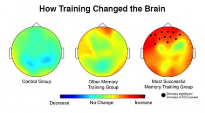
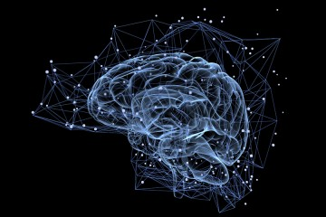
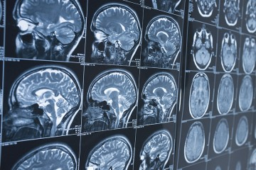
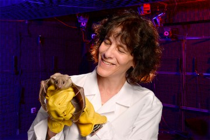
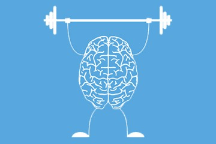
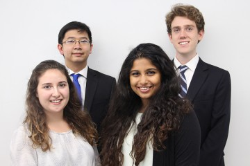

This training exercise boosts brain power, Johns Hopkins researchers say

# This training exercise boosts brain power, Johns Hopkins researchers say

## Results suggest it's possible to train the brain like other body parts, with targeted workouts

[The Best Way to Train Yor Brain: A Game](https://www.youtube.com/watch?v=vZZPMcs482M)

**Video: Len Turner**

ByJill Rosen
 / Published  ** Oct 17

One of the two brain-training methods most scientists use in research is significantly better in improving memory and attention, Johns Hopkins University researchers found. It also results in more significant changes in brain activity.

Though this exercise didn't make anyone smarter, it greatly improved skills people need to excel at school and at work. These results, [published this week by the *Journal of Cognitive Enhancement*](https://link.springer.com/article/10.1007/s41465-017-0044-1), suggest it's possible to train the brain like other body parts—with targeted workouts.

  "People say cognitive training either works or doesn't work. We showed that it matters what kind of training you're doing."

—Kara J. Black

Former JHU post-doctoral fellow

"People say cognitive training either works or doesn't work. We showed that it matters what kind of training you're doing," said lead author [Kara J. Blacker](http://scienceoflearning.jhu.edu/about-us/our-experts/kara-blacker), a former Johns Hopkins post-doctoral fellow in psychological and brain sciences. "This one task seems to show the most consistent results and the most impact on performance and should be the one we focus on if we're interested in improving cognition through training."

Scientists trying to determine if brain exercises make people smarter have had mixed results. Johns Hopkins researchers suspected the problem wasn't the idea of brain training, but the type of exercise researchers chose to test it. They decided to compare directly the leading types of exercises and measure people's brain activity before and after training; that had never been attempted before, according to Blacker, now a researcher at the Henry M. Jackson Foundation for Advancement of Military Medicine, Inc.

First, the team assembled three groups of participants, all young adults. Everyone took an initial battery of cognitive tests to determine baseline working memory, attention, and intelligence. Everyone also got an electroencephalogram, or EEG, to measure brain activity. Then, everyone was sent home to practice a computer task for a month. One group used one leading brain exercise while the second group used the other. The third group practiced on a control task.

The training programs Johns Hopkins compared are not the commercial products sold to consumers, but tools scientists rely on to test the brain's working memory.

   

Everyone trained five days a week for 30 minutes, then returned to the lab for another round of tests to see if anything about their brain or cognitive abilities had changed.

The researchers found that the group that practiced what's known as a "dual n-back" exercise showed a 30 percent improvement in their working memory. That was nearly double the gains made by the group working with the other common task, known as "complex span." The dual n-back group also showed significant changes in brain activity in the prefrontal cortex, the critical region responsible for higher learning.

The dual n-back is a memory sequence test in which people must remember a constantly updating sequence of visual and auditory stimuli. The Johns Hopkins participants saw squares flashing on a grid while hearing letters. They had to remember if the square they just saw and the letter they heard were both the same as one round back. As the test got harder, they had to recall squares and letters two, three, and four rounds back. It's similar to the children's electronic game Simon, but instead of just recalling sounds and colors, participants have to remember the current sequence and the one a few rounds back.

The other test, called complex span, also involves remembering items in a sequence. There's a distraction for people between items, but they don't need to continually update the items in their mind.

The findings demonstrate that the dual n-back is a better regimen to train working memory, which is what people rely on to temporarily hold details in their mind like phone numbers and directions. These skills are vital to how people perform in school and at work, when tasks are new and you can't just rely on old knowledge and habits, says co-author [Susan Courtney](http://pbs.jhu.edu/directory/susan-courtney/), a Johns Hopkins neuroscientist and professor of psychological and brain sciences.

"The findings suggest that this particular task is changing something about the brain," Courtney said. "There's something about sequencing and updating that really taps into the things that only the pre-frontal cortex can do, the real-world problem-solving tasks."

The next step, the researchers say, is to figure out why dual n-back is so good at improving working memory, then figure out how to make it even more effective so that it can become a marketable, or even clinically useful, brain training program.

"The biggest lesson here was that—yes—intensive training strengthens cognition and the brain, but we still don't understand why and how," Courtney said. "We can't just jump onto a video game and expect that's going to cure all of our cognitive problems. We need more targeted interventions."

Co-authors included Serban Negoita, a former Johns Hopkins student who's now a Johns Hopkins Medicine research program coordinator; and [Joshua B. Ewen](https://www.kennedykrieger.org/patient-care/faculty-staff/joshua-ewen), a neurologist with Johns Hopkins and the Kennedy Krieger Institute.

Tagged [brain science](https://hub.jhu.edu/tags/brain-science/articles), [science of learning institute](https://hub.jhu.edu/tags/science-learning-institute/articles)

0  comments

###### You might also like

 

Science of Learning

##### [Six proposals get seed funding](https://hub.jhu.edu/2017/09/14/science-of-learning-institute-seed-grants/)

 ** Sep 14

 

Brain science

##### [Serotonin: The key to unlocking Alzheimer's?](https://hub.jhu.edu/2017/08/18/serotonin-alzheimers-dementia/)

 ** Aug 18

 

##### [Mapping the brain, neuron by neuron](https://hub.jhu.edu/2017/08/10/mapping-brain-fruit-fly-connectome/)

 ** Aug 10

 

Sound science

##### [Exploring how bats navigate](https://hub.jhu.edu/2017/08/09/bat-echolocation-navigation-research/)

 ** Aug 9

###### Trending

 

Mental exercise

##### [Training for your brain](https://hub.jhu.edu/2017/10/17/brain-training-exercise/)

 ** Oct 17  **Video

 

Undergraduate research

##### [Obstruction reduction](https://hub.jhu.edu/2017/09/27/assistent-fixes-nasal-blockages-collegiate-inventors-competition/)

 ** Sep 27

 

Campus eats

##### [Pop-up dining](https://hub.jhu.edu/2017/10/19/haenyo-pop-up-restaurant-takes-over-pekopeko-ramen/)

 ** 2 days ago

 

Interdisciplinary scholars

##### [Medieval scholar named BDP](https://hub.jhu.edu/2017/10/18/chris-cannon-linguistics-medievalist-bloomberg-distinguished-professor/)

 ** Oct 18

 

Faculty honors

##### [Seven join National Academy of Medicine](https://hub.jhu.edu/2017/10/16/seven-faculty-elected-to-national-academy-of-medicine/)

 ** Oct 16

 

Cybersecurity

##### [KRACK in the code](https://hub.jhu.edu/2017/10/17/krack-software-flaw-affects-wi-fi-devices-matt-green-avi-rubin/)

 ** Oct 17

 

Visual art

##### [Amy Sherald to speak at JHU](https://hub.jhu.edu/2017/10/16/amy-sherald-artist-paints-michelle-obama-portrait/)

 ** Oct 16

 

Exhibits

##### [Curators' picks from 'Bibliomania'](https://hub.jhu.edu/2017/10/19/bibliomania-peabody-exhibit/)

 ** 2 days ago