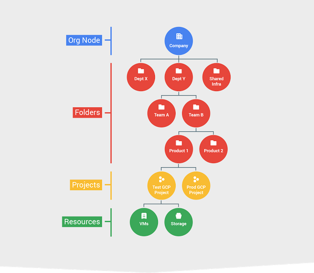

This week in Google Cloud — “Welcome to us-east4, GPUs for ML, inside TPUs, and your data via…

# This week in Google Cloud — “Welcome to us-east4, GPUs for ML, inside TPUs, and your data via client libs”

Following a previous post quantifying the performance of a Tensor Processing Unit (TPU), this past week offered an [**in-depth look at Google’s first TPU**](http://goo.gl/p8XGFJ)**.**

This week was also busy with a number of announcements :

- •the [**beta launch of Folders**](http://goo.gl/bZQAJf), an additional IAM layer under Organization for arranging GCP resources to match your company’s structures.
- •[New region! 3 zones. **Northern Virginia**](http://goo.gl/OyC87k) (us-east4). Many more to come!
- •[**64 vCPU** machine types](http://goo.gl/51x5n2) (both custom and predefined) are now available to all (GA)
- •[**GPUs for Cloud Machine Learning Engine**](http://goo.gl/tQJwBp) are now available to all with an SLA
- •Use Google Cloud [**Client Libraries** to store files, save entities, and log data](http://goo.gl/oQqjhg). These are Generally Available (GA) in seven server-side languages: C#, Go, Java, Node.js, PHP, Python and Ruby.

Chris Sells has an [update for **Windows on GCP**](http://goo.gl/ZJWMcu) (hint: it’s doing very well).

What does a **cloud-native ETL** architecture look like with GCP? Here’s [a solution](http://goo.gl/4N6trl) using Google BigQuery, Cloud Dataflow, Pub/Sub, and App Engine (Cron)

Reuven Lax, one of the core engineers behind Cloud Dataflow started a series —[ “After Lambda: **Exactly-once processing** in Google Cloud Dataflow, Part 1”](http://goo.gl/FPYMWf)

GCP elsewhere on the interwebs :

- •[Google VP Eric Brewer on open source, innovation and the economics of cloud](http://goo.gl/EtEX3p) (architecht.io)
- •[The Google Cloud Platform won’t box you in](http://goo.gl/qSBgI9) (networkworld.com)
- •[Google’s potential for upside](http://goo.gl/bVXLuT) (redmonk.com)
- •[Updating Google Maps with Deep Learning and Street View](http://goo.gl/mdwvE8) (research.googleblog.com)
- •[FedRAMP announced that GCP will participate in the JAB-FedRAMP authorization process](http://goo.gl/0iG6Jj) (fedramp.gov)
- •[Stackdriver Monitoring And Ruby](http://goo.gl/XB22kv) (medium.com)
- •[Interpreting 23andme Raw Genome Data with Google Genomics and BigQuery](http://goo.gl/gNKaK8) (medium.com)
- •[Lessons on data culture from Ocado](http://goo.gl/dBHBVl) (redmonk.com)
- •[Debugging Node.js with Chrome DevTools](http://goo.gl/ZtWvDM) (medium.com)
- •[How Google Cloud will bring AI, machine learning to enterprise software](http://goo.gl/vmFkBt) (medium.com)
- •[HSBC taps Google Compute Platform for Hadoop, is ‘cloud first’ for ML and big data](http://goo.gl/YQliQx) (451research.com, paywall)
- •[How the TensorFlow team handles open source support](http://goo.gl/wirmxv) (oreilly.com)
- •[5 Q’s for Ed Kearns, Chief Data Officer at NOAA](http://goo.gl/0IP7kS) (datainnovation.org)

ICYMI

- •[IPv6 Termination for HTTP(S), SSL Proxy, and TCP Proxy Load Balancing](http://goo.gl/9K4Riv)
- •[Using Cloud CDN cache keys](http://goo.gl/6kU5Jh)

This week’s [GCP Podcast episode #00076](http://goo.gl/oEzf1G) is a conversation with Daniel Smith about Kubernetes 1.6

Next ’17 Rewind (short summaries of Next ’17 sessions) so far :

- •[Stretching Your DevOps Dollar with App Engine](http://goo.gl/Bmvvja)
- •[Take Your ASP.NET Apps to the Next Level with Google Cloud](http://goo.gl/uLPjD2)
- •[Moving existing applications to Google Cloud Platform](http://goo.gl/52WW4W)

The growing playlist is [here](http://goo.gl/g5c5dt).

Finally, the picture of the week comes from the [beta launch of Folders](http://goo.gl/bZQAJf) :

That’s it for this week!
-Alexis