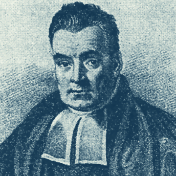

Thomas Bayes and the crisis in science – TheTLS

Thomas Bayes and the crisis in science – TheTLS

https://www.the-tls.co.uk/articles/public/thomas-bayes-science-crisis/

David Papineau argues that it is crucial for scientists to start heeding the lessons of the eighteenth-century statistician Thomas Bayes