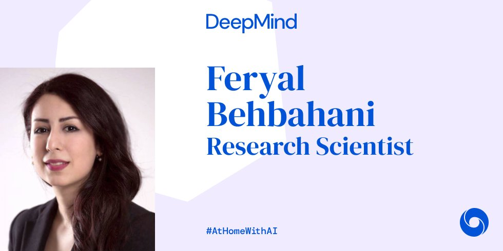
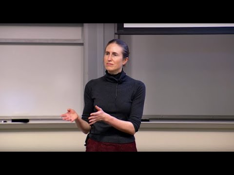
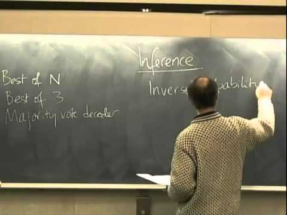

Thread by @DeepMind: For students and others interested in expanding their knowledge of AI during this period, we thought it might be helpful to ask our research…

For students and others interested in expanding their knowledge of AI during this period, we thought it might be helpful to ask our researchers what they consider to be the most impactful and insightful resources available to use [#AtHomeWithAI](https://threadreaderapp.com/hashtag/AtHomeWithAI) (1/9)**

Today’s suggestions are from research scientist Feryal Behbahani [@FeryalMP](https://twitter.com/FeryalMP)! [#AtHomeWithAI](https://threadreaderapp.com/hashtag/AtHomeWithAI)  **

Want to know more about reinforcement learning? She recommends [@EmmaBrunskill](https://twitter.com/EmmaBrunskill)’s’ online lecture series from [@StanfordEng](https://twitter.com/StanfordEng). Watch them here:

 

 [  **Stanford CS234: Reinforcement Learning | Winter 2019 | Lecture 1 - Introduction** Professor Emma Brunskill, Stanford University https://stanford.io/3eJW8yT Professor Emma Brunskill Assistant Professor, Computer Science Stanford AI for Huma... https://bit.ly/3eAArB9 https://bit.ly/3eAArB9

 [#AtHomeWithAI](https://threadreaderapp.com/hashtag/AtHomeWithAI)**

For a more practical and hands-on introduction to Deep Reinforcement Learning, Feryal points to “Spinning up in Deep RL” from [@OpenAI](https://twitter.com/OpenAI). Try it here: [bit.ly/2KfQbvw](https://bit.ly/2KfQbvw)  [#AtHomeWithAI](https://threadreaderapp.com/hashtag/AtHomeWithAI)**

For those looking for lectures, slides and Colabs on various [#DeepLearning](https://threadreaderapp.com/hashtag/DeepLearning) techniques, [@FeryalMP](https://twitter.com/FeryalMP) highlights [@Khipu_AI](https://twitter.com/Khipu_AI) as a favourite. She suggests working through the collection of practical notebooks here:

 

 [  **khipu-ai/practicals-2019** Practical notebooks for Khipu 2019, held in Universidad de la República in Montevideo. - khipu-ai/practicals-2019 https://bit.ly/2KkDX4U https://bit.ly/2KkDX4U

 [#AtHomeWithAI](https://threadreaderapp.com/hashtag/AtHomeWithAI)**

Looking for something that gives an insightful background on neural networks, backpropagation, autoencoders, & more? She recommends the [@CompSciOxford](https://twitter.com/CompSciOxford) ML course - taught by DeepMind research scientist, [@NandoDF](https://twitter.com/NandoDF)! Work through it here: [bit.ly/3fj6YvU](https://bit.ly/3fj6YvU)  [#AtHomeWithAI](https://threadreaderapp.com/hashtag/AtHomeWithAI)**

Keen to understand multi-task and meta-learning methods? Feryal suggests watching the new lecture series by [@chelseabfinn](https://twitter.com/chelseabfinn), assistant professor [@Stanford](https://twitter.com/Stanford) and [@GoogleAI](https://twitter.com/GoogleAI). Watch them all here:

 

 [  **Stanford CS330: Multi-Task and Meta-Learning, 2019 | Lecture 1 - Introduction & Overview** Enjoy the videos and music you love, upload original content, and share it all with friends, family, and the world on YouTube. https://bit.ly/3bowUUl https://bit.ly/3bowUUl

 [#AtHomeWithAI](https://threadreaderapp.com/hashtag/AtHomeWithAI)**

Looking to better understand the interplay between neuroscience and AI? [@FeryalMP](https://twitter.com/FeryalMP) suggests ‘Brain Inspired”, a podcast hosted by [@pgmid](https://twitter.com/pgmid), a favourite for anyone interested in hearing from some of the best minds in that space. Listen here: [bit.ly/2ysvGco](https://bit.ly/2ysvGco)  [#AtHomeWithAI](https://threadreaderapp.com/hashtag/AtHomeWithAI)**

mentions’s final suggestion is for those who want to understand information theory, pattern recognition and neural networks. Watch the late David MacKay’s fantastic in-depth lecture series here:

 

 [  **Lecture 1: Introduction to Information Theory** Lecture 1 of the Course on Information Theory, Pattern Recognition, and Neural Networks. Produced by: David MacKay (University of Cambridge) Author: David Ma... https://bit.ly/2xJ7NgC https://bit.ly/2xJ7NgC

Have your own suggestions for [#AtHomeWithAI](https://threadreaderapp.com/hashtag/AtHomeWithAI)? Let us know!**