Time Series Analysis and Forecasting with ARIMA - Kanoki

# Time Series Analysis and Forecasting with ARIMA

Posted on [April 30, 2020](https://kanoki.org/2020/04/30/time-series-analysis-and-forecasting-with-arima-python/)

In the previous [post](https://kanoki.org/2020/04/27/time-series-analysis-data-visualization/)we have seen how to visualize a time series data. In this post we will discuss how to do a time series modelling using ARMA and ARIMA models. Here AR stands for Auto-Regressive and MA stands for Moving Average

Before we start discussing the ARIMA models, we should know the stationarity of time series

## **Stationary Process**

A time series is called to be stationary if there is no change in mean, variance and covariance of the observations over a period of time.

The process remains in a state of statistical equilibrium

In other words a process is said to be stationary if the joint distribution of observations does not change and remain same when the origin of time is shifted by amount k

This means that the mean and variance are constant and do not depend on time. There are two types of stationary processes: Strict & Weak Stationary Process

Stationary Process
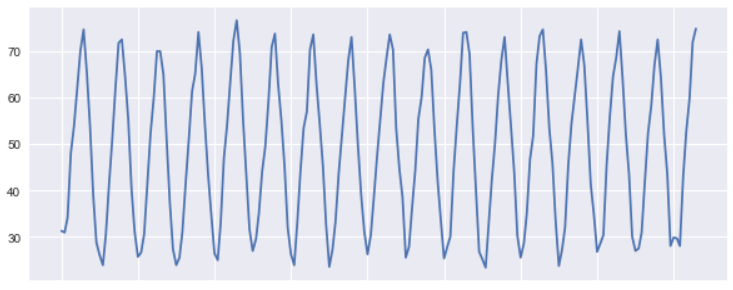
Non Stationary Process
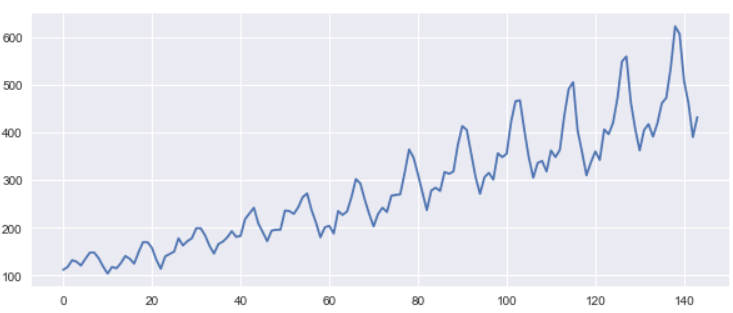

## **What is ARIMA?**

ARIMA stands for Auto-Regressive Integrated Moving Average and it’s one of the widely used time series models for forecasting

It also accounts for the pattern of growth/decline in the data or noise between consecutive time points

ARIMA are applied to data that shows Non-Stationarity and difference of successive observations are taken to eliminate the non-stationarity. Sometimes more than one difference of successive observation is required to get a modified stationary model

That’s the reason it is called as an Integrated model because the stationary model that is fitted to the modified series has to be summed or integrated to provide a model for the original non-stationary series

## **ARIMA Modelling Procedure**

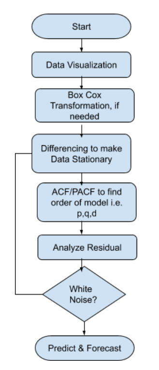

We should be fitting the ARIMA model to a Stationary and non-seasonal time series data and follow the procedure described in the above flow chart

- First thing is you should plot the data to find hidden patterns, trends and other behavior
- Decompose the data to know the underlying Trend and Seasonality in the data
- To stabilize and normalize the data you can use the Box-Cox transformation. It is a way to transform data that ordinarily do not follow a normal distribution
- Plot ACF/PACF to determine the order for the ARIMA model i.e. p,d and q values. Alternatively, you can also use AICc and BICc to determine the p,q,d values. Choose the one where AICc and BICc is lowest
- Verify the Residuals and ensure it looks like white noise otherwise try a modified model with different values of p,q and d. Remember Residuals which are white noise can do a forecast

## **Let’s get Started**

### **Load Dataset**

We will be using the Monthly Temperature datatset of Armori City. You can download it from this [link](https://www.kaggle.com/akioonodera/monthly-temperature-of-aomori-city)

|     |     |
| --- | --- |
| 1 2 3 4 5 6 7 8 9 10 11 12 13 | import pandas as  pd import statsmodels.api as  sm import matplotlib.pyplot as  plt import seaborn as  sns sns.set(rc={'figure.figsize':(15,6)}) %matplotlib  inline df  =  pd.read_csv('./monthly_temperature_aomori_city.csv') df['DATE']  =  pd.to_datetime(df[['year',  'month']].assign(DAY=1)) df.drop(['year','month'],inplace=True,axis=1) df['temperature']  =  df['temperature']*(9/5)+32 df.set_index('DATE',inplace=True) df.to_csv('./monthly_temperature_aomori_city_updt.csv',index=True) df.head() |

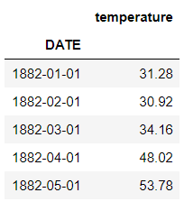

## **Basic Analysis and Data Visualization**

Let’s draw a simple line plot for first 200 rows to understand the pattern in the data and how the temperature is trending. It looks like that a Cyclic pattern is followed here

|     |     |
| --- | --- |
| 1 2 | plt.figure(figsize=(10,4)) plt.plot(df[:200].temperature) |

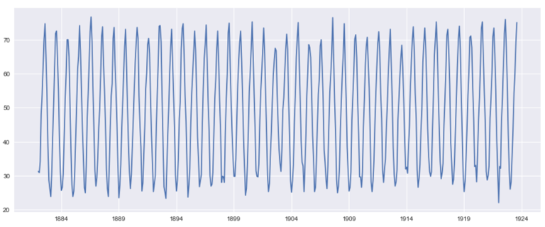

We will draw a Box and Whisker plot for first 5 years to understand the data distribution and get a quick five point summary for the data

|     |     |
| --- | --- |
| 1   | df&#91;:120].boxplot(figsize=(15,6),by='year',column='temperature',vert=False) |

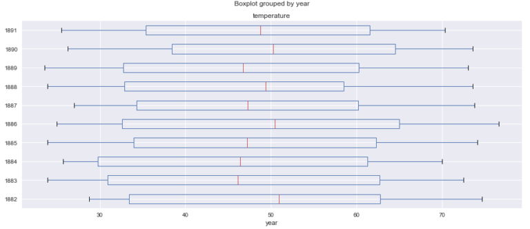

If you are looking for in-depth tutorial on Time Series Analysis and Visualization you can check [this](https://kanoki.org/2020/04/27/time-series-analysis-data-visualization/)blog, which is part 1 of this time series analysis blogs

## **Data Decomposition**

To further analyze the time series data, Decomposition helps to remove the seasonality from the data.

Basically Decomposition has three components that is shown in the graphs below i.e Trend, Seasonality and Residual

You have to choose a model type also additive or multiplicative. We have taken an additive model because the seasonality doesn’t varies much from start to end of the years

|     |     |
| --- | --- |
| 1 2 3 | decomposition  =  sm.tsa.seasonal_decompose(df.temperature,  model='additive') plt.rcParams["figure.figsize"]  =  [16,9] fig  =  decomposition.plot() |

**Trend**
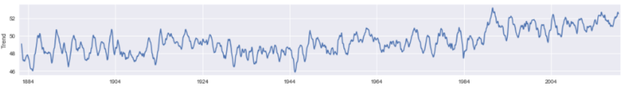
**Seasonality**
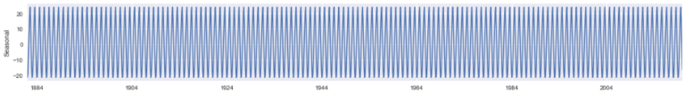
**Residual**
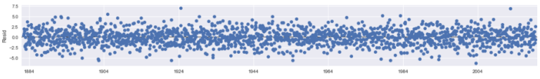

## **Check Stationarity**

ARIMA model works better on a Non-Stationary data and the first thing that we should be checking is the Stationarity of the data. The Augmented Dickey-Fuller test can be used to test the null hypothesis that the series is non-stationary

The ADF test helps to understand whether a change in Y is a linear trend or not. If there is a linear trend but the lagged value cannot explain the change in Y over time, then our data will be deemed non-stationary

|     |     |
| --- | --- |
| 1 2 3 4 5 6 7 8 9 | from statsmodels.tsa.stattools import adfuller def check_stationarity(timeseries):     result  =  adfuller(timeseries,autolag='AIC')     dfoutput  =  pd.Series(result[0:4],  index=['Test Statistic','p-value','#Lags Used','Number of Observations Used'])     print('The test statistic: %f'  %  result[0])     print('p-value: %f'  %  result[1])     print('Critical Values:')     for  key,  value in  result[4].items():         print('\t%s: %.3f'  %  (key,  value)) |

|     |     |
| --- | --- |
| 1   | check_stationarity(df.temperature) |

The value of test statistics is less than 5% critical value and p-value is also less than 0.05 so we can reject the null hypothesis and Alternate Hypothesis that time series is Stationary seems to be true

|     |     |
| --- | --- |
| 1 2 3 4 5 6 | The test statistic:  -2.936397 p-value:  0.041276 Critical Values: 1%:  -3.434 5%:  -2.863 10%:  -2.568 |

There is nothing unusual about the time plot and there appears to be no need to do any data adjustments. There is no evidence of changing variance also so we will not do a Box-Cox transformation.

## **How to determine AR(p),MA(q) and I(d) values for ARIMA model?**

So what does model order of ARIMA(2,1,3) means? It means 2nd order Auto-Regressive (AR) and 3rd order Moving Average (MA). You can think it as ARIMA( AR(p), I(d), MA(q))

So the d is Integrated I(d) part that is decided based on number of times you have to do a data difference to make it stationary. We will learn more about it in the next section

### **What is the best way to select the value of p,q and d?**

- For Moving Average order i.e. q you have to look at the Auto Correlation Factor(ACF) graph. You need some experience to keenly look at the graphs and significant lags and corresponding Correlations to determine the value
- Similarly for the Auto-Regressive order i.e. p you have to look at the partial correlation factor (pacf) graph
- Another Alternate way is to find the set of models with the lowest AIC values Akaike’s Information Criterion
- For determining AIC you have to fit the model with different combination of p,q and d and look for the lowest AIC value

## **Differencing Data to achieve Stationarity. Also Determine value of d**

Our Data is stationary but just to showcase how data differencing works we will assume that our Time Series data is not Stationary

We will also do a log transform of the original data to make the seasonality same throughout the data

|     |     |
| --- | --- |
| 1 2 3 | import numpy as  np ts_temp_log  =  np.log(df) ts_temp_log |

So Basically you have to subtract the value with their previous value to get the difference in data. We will use numpy.diff() function to achieve that

|     |     |
| --- | --- |
| 1 2 3 | ts_temp_log_diff  =  np.diff(ts_temp_log.temperature) plt.plot(ts_temp_log_diff) |

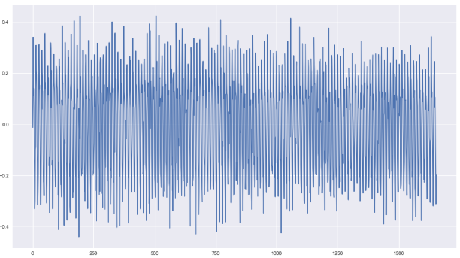

The differenced data looks stationary so we don’t have to go for any further differencing

Again, After our first data differencing we will check the stationarity of data using the ADF test.

This time the p-value is 0 which is very good and the test statistics is also less than the 5% critical

|     |     |
| --- | --- |
| 1   | check_stationarity(ts_temp_log_diff) |

|     |     |
| --- | --- |
| 1 2 3 4 5 6 | The test statistic:  -15.725118 p-value:  0.000000 Critical Values: 1%:  -3.434 5%:  -2.863 10%:  -2.568 |

The value of d will be 1 because we have done the data difference one time to achieve stationarity

## **Determine P and Q value from ACF and PACF plot**

Once our data is set to stationary then the next task is to determine the appropriate value of ARIMA model i.e. p and q

We can learn some important properties of our time series data with the help of Auto Correlation(ACF) and Partial Auto Correlation (PACF) graphs.

This provide useful descriptive properties for understanding which model can be used for time series forecasting

ACF measures the linear relationships between observations at different time lags.

In other words, ACF is used to understand if there exists a correlation between a time series data point with another point as a function of their time difference

The Partial Auto Correlation factor(PACF) is the partial correlation between the two points at a specific lag of time.

Plotting the partial autocorrelative functions one could determine the appropriate lags **p** in an AR (**p**) model or in an extended ARIMA (**p**,**d**,**q**) model

|     |     |
| --- | --- |
| 1 2 | from statsmodels.graphics.tsaplots import plot_acf plot_acf(ts_temp_log_diff,lags=10) |

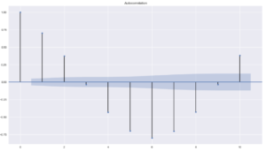

|     |     |
| --- | --- |
| 1 2 3 | from statsmodels.graphics.tsaplots import plot_pacf plt.figure(figsize=(10,2)) plot_pacf(ts_temp_log_diff,lags=10) |

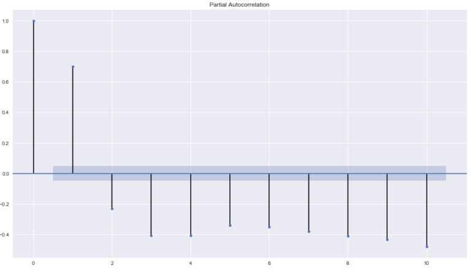

From the PACF plot we can see a significant correlation at lag of 2. So the PACF suggests an AR(2) model. So an inital order for the model will be (2,0,3)

Remember our d value is 0 because our data was stationary before differencing.

Alternatively, you can also use auto arima to find the appropriate value of p,q and d

## **AUTO ARIMA**

So if you want to know the value of p,q and d without much of pain then use [Auto arima](http://alkaline-ml.com/pmdarima/0.9.0/index.html).

It’s a python library inspired from the auto arima package in R which is used to find the best fit ARIMA model for the univariate time series data

|     |     |
| --- | --- |
| 1 2 3 4 5 6 7 8 | import pyramid as  pm auto_arima_fit  =  pm.auto_arima(df,  start_p=1,  start_q=1,                              max_p=3,  max_q=3,  m=12,                              start_P=0,  seasonal=True,                              d=1,  D=1,  trace=True,                              error_action='ignore',                              suppress_warnings=True,                              stepwise=True) |

|     |     |
| --- | --- |
| 1 2 3 | Fit ARIMA:  order=(1,  1,  1)  seasonal_order=(0,  1,  1,  12);  AIC=7044.189,  BIC=7071.210,  Fit time=29.769  seconds Fit ARIMA:  order=(0,  1,  0)  seasonal_order=(0,  1,  0,  12);  AIC=8721.729,  BIC=8732.538,  Fit time=0.218  seconds Fit ARIMA:  order=(1,  1,  0)  seasonal_order=(1,  1,  0,  12);  AIC=8072.542,  BIC=8094.159,  Fit time=5.261  seconds |

This will help to choose the best value of p,q and d based on the lowest AIC and BIC values

## **Fit an ARIMA model**

Now we have to fit our data to the ARIMA using the order of model (2,0,3) determined above using ACF and PACF plot.

This sets the lag value to 2 for autoregression AR(2) and uses a data difference order of 0 since our time series is stationary, and uses a moving average model of 3.

|     |     |
| --- | --- |
| 1 2 3 4 | from statsmodels.tsa.arima_model import ARIMA mod  =  ARIMA(df.temperature,order=(2,0,3)) results  =  mod.fit() print(results.summary()) |

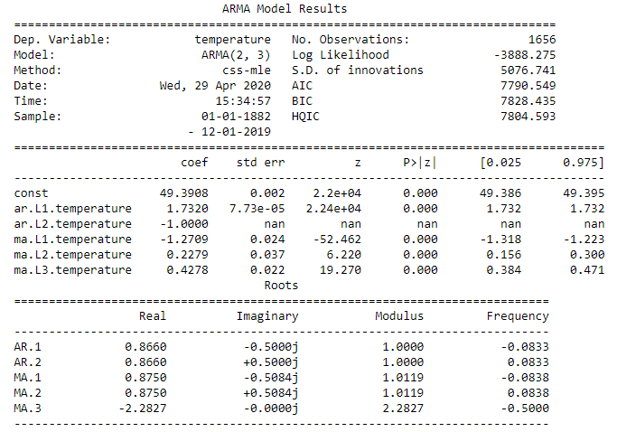

## **Residuals Diagnosis**

A model residuals is difference between the predicted and expected value and can be verified using the fitted model property resid().

Residual object is of type ndarray so we will store it in a Dataframe for plotting

In the below line plot we don’t see any large residuals and all of them are within their upper and lower limits

|     |     |
| --- | --- |
| 1 2 | residuals  =  pd.DataFrame(results.resid) residuals.plot() |

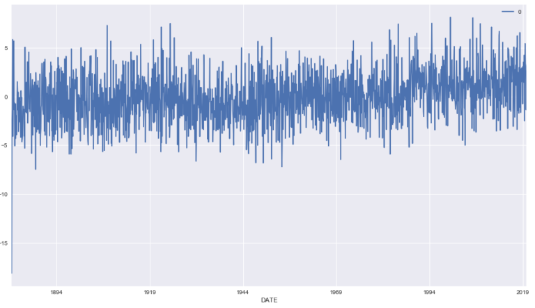

Next we will check if these residuals are normally distributed and looks Gaussian or not. So we will plot the density plot to check this. This looks normal with a long left tail and centered at Zero

|     |     |
| --- | --- |
| 1   | residuals.plot(kind='kde') |

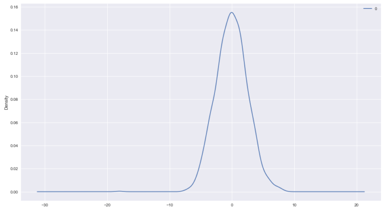

The mean of the residual is close to Zero and there is no significant correlation also that we can see in the pacf plot for residuals

|     |     |
| --- | --- |
| 1   | residuals.describe() |

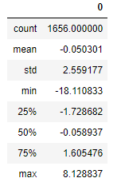

|     |     |
| --- | --- |
| 1   | plot_pacf(residuals) |

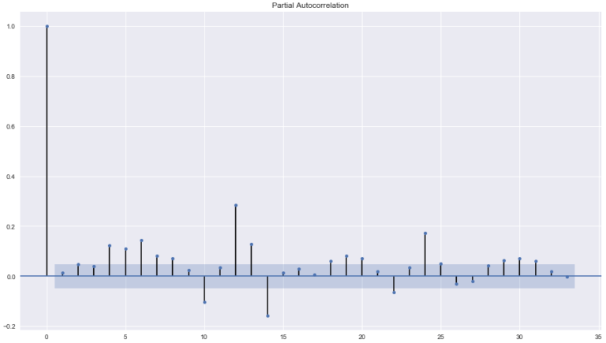

The residual diagnostics looks like a white noise since 95% of our sample autocorrelations is between the two blue lines and it meets all our criteria for a good forecast and prediction.

So Let’s go ahead and evaluate the Predicted and Expected Values

## **Arima Predict**

Now we will use predict() function of Arimaresults objects to make predictions.

Predict function takes a start and end parameters to specify the index at which to start and stop the prediction

We could have done it another way also by splitting the train and test data and then comparing the test values with the predicted values

In our case we want to validate the predicted and expected value of first three years 1882-1885. so we will give a start value of 0 and end value of 36 and that will return an ndarray of predicted values

Using this returned value and the original value we will plot this and visualize how the predicted and real values differ. The red lines in the graph are original values and green are predicted values

|     |     |
| --- | --- |
| 1 2 3 4 | from math import sqrt from sklearn.metrics import mean_squared_error plt.plot(df.temperature[:36],color='r') plt.plot(results.predict(0,36),color='g') |

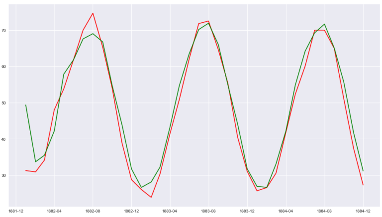

This looks good so far but how to quantify how the score of predicted vs Expected values. For this we will calculate the Root Mean Square Error values using Scipy

|     |     |
| --- | --- |
| 1 2 | rmse  =sqrt(mean_squared_error(df.temperature,  results.predict())) print(rmse) |

|     |     |
| --- | --- |
| 1   | 2.56 |

## **Forecast**

Next and Final Step to forecast the temperature of upcoming years i.e. Out of Sample Forecast. We will use the forecast method of statsmodel for this task.

You can pass steps as one of the parameter i.e. number of out of sample forecasts from the end of the sample

And can provide the confidence interval(alpha) for your forecast too
This function will return following three values:

- **Forecast **: Array of Out of Sample forecast
- **stderr** : Array of the standard error of the forecasts
- **confidence Interval** : 2d array of the confidence interval for the forecast

We are forecasting the temperature for next 3 years i.e. 36 months so our steps will be 36 and for a confidence interval of 95% we will pass the alpha value as 0.05

|     |     |
| --- | --- |
| 1 2 3 | n=36 forecast,err,ci  =  results.forecast(steps=n,0.05) df_forecast  =  pd.DataFrame({'forecast':forecast},index=pd.date_range(start='1/1/2020',  periods=n,  freq='MS')) |

### **Forecast Interval**

The confidence interval of the forecast is also returned by the ARIMAResult object.

It is stored in a variable ci above and this is how the interval value looks like

|     |     |
| --- | --- |
| 1   | ci  |

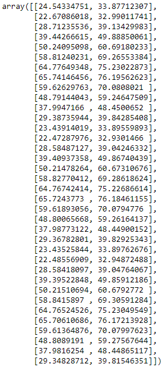

Now we will plot the forecast value which is shown as red line for year 2020 thru 2023 in the below graph.

The blue strip that you see around the line is the forecast interval which is drawn with the help of fill_between() api of matplotlib

|     |     |
| --- | --- |
| 1 2 3 4 5 6 7 8 9 10 | ax  =  df[1600:].temperature.plot(label='observed',  figsize=(20,  15)) df_forecast.plot(ax=ax,label='Forecast',color='r') ax.fill_between(df_forecast.index,                 ci[:,0],                 ci[:,1],  color='b',  alpha=.25) ax.set_xlabel('Year') ax.set_ylabel('Temp') plt.legend() plt.show() |

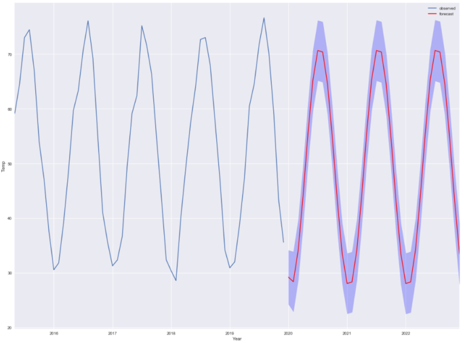

## **Conclusion**

Here are the key points that we discussed about time series modelling with ARIMA:

- Time Series Data Visualization is an important step to understand for analysis & forecasting and finding out the patterns in data
- Dickey-Fuller test performed to determine if the data is stationary or not. It’s necessary to check the stationarity before fitting the data to ARIMA
- Decomposition helps to remove the seasonality from the data and three components of decomposition are Trend, Seasonality and Residual
- Data differencing helps to remove stationarity from data and to determine the value of d
- Plot Auto-Correlation(ACF) and Partial Auto-Correlation (PACF) graph to determine the value of p and q
- Auto Arima package used to determine the value of p,q and d by evaluating the value of Akaike’s Information Criterion (AIC)
- Residual diagnosis is an important step post fitting the ARIMA model to evaluate if forecasting can be done with the fitted model or not
- Residual property of ARIMAResult object used for the Residual Analysis. If the residual is a white noise then we are good and ready for forecasting
- Cross validation and RMSE (Root Mean Square Error) calculated using the Predict function
- Out of sample forecast calculated using the Forecast function and gives forecast interval too

## **What’s Next?**

There are few topics which I have not explained in detail like Additive and Multiplicative Model, Determine the p,q value by reading the ACF and PACF plot and using SARIMAX function for time series data with seasonality. So I would be covering those topics separately in my upcoming posts

Facebook has an open source tool [Prophet](http://so%20i%20would%20be%20covering%20those%20topics%20separately%20in%20my%20upcoming%20posts/)for forecasting time series data and in my next post I will be using prophet to evaluate and compare the forecasting results with python statsmodel

**Jupyter Notebook Github Link:**  https://github.com/min2bro/Time_Series_ARIMA/blob/master/Time%20Series%20Modelling%20-%20ARIMA.ipynb

* * *

[Facebook0](https://www.facebook.com/sharer/sharer.php?u=https://kanoki.org/2020/04/30/time-series-analysis-and-forecasting-with-arima-python/&display=popup&ref=plugin&src=share_button)[Tweet0](https://twitter.com/share?url=https://kanoki.org/2020/04/30/time-series-analysis-and-forecasting-with-arima-python/&text=Time%20Series%20Analysis%20and%20Forecasting%20with%20ARIMA)[![](data:image/svg+xml,%3csvg version='1.1' xmlns='http://www.w3.org/2000/svg' width='22.84375' height='32' viewBox='0 0 731 1024' data-evernote-id='1930' class='js-evernote-checked'%3e%3cpath d='M0 341.143q0-61.714 21.429-116.286t59.143-95.143 86.857-70.286 105.714-44.571 115.429-14.857q90.286 0 168 38t126.286 110.571 48.571 164q0 54.857-10.857 107.429t-34.286 101.143-57.143 85.429-82.857 58.857-108 22q-38.857 0-77.143-18.286t-54.857-50.286q-5.714 22.286-16 64.286t-13.429 54.286-11.714 40.571-14.857 40.571-18.286 35.714-26.286 44.286-35.429 49.429l-8 2.857-5.143-5.714q-8.571-89.714-8.571-107.429 0-52.571 12.286-118t38-164.286 29.714-116q-18.286-37.143-18.286-96.571 0-47.429 29.714-89.143t75.429-41.714q34.857 0 54.286 23.143t19.429 58.571q0 37.714-25.143 109.143t-25.143 106.857q0 36 25.714 59.714t62.286 23.714q31.429 0 58.286-14.286t44.857-38.857 32-54.286 21.714-63.143 11.429-63.429 3.714-56.857q0-98.857-62.571-154t-163.143-55.143q-114.286 0-190.857 74t-76.571 187.714q0 25.143 7.143 48.571t15.429 37.143 15.429 26 7.143 17.429q0 16-8.571 41.714t-21.143 25.714q-1.143 0-9.714-1.714-29.143-8.571-51.714-32t-34.857-54-18.571-61.714-6.286-60.857z' data-evernote-id='2495' class='js-evernote-checked'%3e%3c/path%3e%3c/svg%3e)Pin0](https://pinterest.com/pin/create/button/?url=https://kanoki.org/2020/04/30/time-series-analysis-and-forecasting-with-arima-python/&media=&description=Time%20Series%20Analysis%20and%20Forecasting%20with%20ARIMA)[LinkedIn0](https://www.linkedin.com/shareArticle?mini=true&url=https://kanoki.org/2020/04/30/time-series-analysis-and-forecasting-with-arima-python/)

### Related Posts:

- [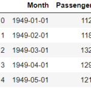Time Series Data Visualization](https://kanoki.org/2020/04/27/time-series-analysis-data-visualization/)
- [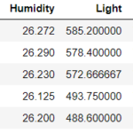Resample and Interpolate time series data](https://kanoki.org/2020/04/14/resample-and-interpolate-time-series-data/)
- [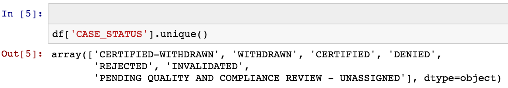Exploratory Analysis of H1B Visa](https://kanoki.org/2017/05/15/exploratory-analysis-of-h1b-visa/)
- [Sort Pandas Dataframe and Series](https://kanoki.org/2020/01/28/sort-pandas-dataframe-and-series/)
- [Data Analysis - World Happiness Report - 2016](https://kanoki.org/2017/07/18/data-analysis-world-happiness-report-2016/)
- [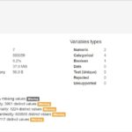Pandas Exploratory Data Analysis: Data Profiling…](https://kanoki.org/2019/01/15/pandas-exploratory-data-analysis-data-profiling/)