Time Series Data Visualization - Kanoki

# Time Series Data Visualization

Posted on [April 27, 2020](https://kanoki.org/2020/04/27/time-series-analysis-data-visualization/)

## **Visualizing Time Series data with Python**

In this post we will discuss data exploration techniques of time series data sets. We will discuss how plotting, histograms and other methods to visualize the time series data can be applied

Graphical Analysis of Time Series data is an important step of time series analysis and helps to provides an insight on the data and understand what data is telling us

Ad

[](https://googleads.g.doubleclick.net/aclk?sa=l&ai=C8Rfd_8CuXouTH_ekzAa9_bKoBcPE3phc8IP1748LwI23ARABIMHSsk1gu76ug9AKoAHzlv7OAsgBBqkCx_fbbcqJpT6oAwHIA8MEqgTvAU_QoaSNSMStUAEOYQnW3Sm4RQlNSzWATeBbMsI7iKJO4bJKTC6exsEaIcj3ghmc4PMm6FK7kz8IJmJ8RjDt_CZM5RwEVho5YzJt8HDAnFMQ730395Tr0HHFrXUvCJkZkfiu-RJQ_5KJ1ejaqAmE66OtF8kjBw9_BmAmmDxeugFLeQVxseoSNj5zdSJJIQiSrzbVLb0T0-okOsXK61UGC7HYdou0JFu8vO7qonN5jyuvvySqXPSikUh0DTn7SJUAQZEJcUSPtjXzUutF1BlscXXpKpg0WtLsbxANJONI1T19_eb9wzRr7dpLOYj2XSzdwATR3dO0pgKgBjeAB_XogbEBqAeOzhuoB9XJG6gHk9gbqAe6BqgH8NkbqAfy2RuoB6a-G6gH7NUbqAfz0RuoB-zVG6gHltgbqAfC2hvYBwHSCAkIjOOAEBABGB6xCf_JCAY7AYrMgAoBmAsByAsB2BMK&ae=1&num=1&sig=AOD64_1IijrnOHV_OcSfglxPr6052zPMYg&client=ca-pub-1898260049766578&nb=9&adurl=https://subscriptions.mapcite.com/%3Futm_campaign%3D6780201348%26utm_source%3Dgoogle%26utm_medium%3Dcpc%26utm_content%3D425218655453%26utm_term%3Dvisualize%2520data%26adgroupid%3D79030447825%26gclid%3DEAIaIQobChMIy46rw-CX6QIVdxLTCh29vgxVEAEYASAAEgKGi_D_BwE)

[Online & Excel SaaS Platform](https://googleads.g.doubleclick.net/aclk?sa=l&ai=C8Rfd_8CuXouTH_ekzAa9_bKoBcPE3phc8IP1748LwI23ARABIMHSsk1gu76ug9AKoAHzlv7OAsgBBqkCx_fbbcqJpT6oAwHIA8MEqgTvAU_QoaSNSMStUAEOYQnW3Sm4RQlNSzWATeBbMsI7iKJO4bJKTC6exsEaIcj3ghmc4PMm6FK7kz8IJmJ8RjDt_CZM5RwEVho5YzJt8HDAnFMQ730395Tr0HHFrXUvCJkZkfiu-RJQ_5KJ1ejaqAmE66OtF8kjBw9_BmAmmDxeugFLeQVxseoSNj5zdSJJIQiSrzbVLb0T0-okOsXK61UGC7HYdou0JFu8vO7qonN5jyuvvySqXPSikUh0DTn7SJUAQZEJcUSPtjXzUutF1BlscXXpKpg0WtLsbxANJONI1T19_eb9wzRr7dpLOYj2XSzdwATR3dO0pgKgBjeAB_XogbEBqAeOzhuoB9XJG6gHk9gbqAe6BqgH8NkbqAfy2RuoB6a-G6gH7NUbqAfz0RuoB-zVG6gHltgbqAfC2hvYBwHSCAkIjOOAEBABGB6xCf_JCAY7AYrMgAoBmAsByAsB2BMK&ae=1&num=1&sig=AOD64_1IijrnOHV_OcSfglxPr6052zPMYg&client=ca-pub-1898260049766578&nb=0&adurl=https://subscriptions.mapcite.com/%3Futm_campaign%3D6780201348%26utm_source%3Dgoogle%26utm_medium%3Dcpc%26utm_content%3D425218655453%26utm_term%3Dvisualize%2520data%26adgroupid%3D79030447825%26gclid%3DEAIaIQobChMIy46rw-CX6QIVdxLTCh29vgxVEAEYASAAEgKGi_D_BwE)

[Ad   Award-winning geofencing platform gives you start-to-finish assistance to…]()

[Mapcite](https://googleads.g.doubleclick.net/aclk?sa=l&ai=C8Rfd_8CuXouTH_ekzAa9_bKoBcPE3phc8IP1748LwI23ARABIMHSsk1gu76ug9AKoAHzlv7OAsgBBqkCx_fbbcqJpT6oAwHIA8MEqgTvAU_QoaSNSMStUAEOYQnW3Sm4RQlNSzWATeBbMsI7iKJO4bJKTC6exsEaIcj3ghmc4PMm6FK7kz8IJmJ8RjDt_CZM5RwEVho5YzJt8HDAnFMQ730395Tr0HHFrXUvCJkZkfiu-RJQ_5KJ1ejaqAmE66OtF8kjBw9_BmAmmDxeugFLeQVxseoSNj5zdSJJIQiSrzbVLb0T0-okOsXK61UGC7HYdou0JFu8vO7qonN5jyuvvySqXPSikUh0DTn7SJUAQZEJcUSPtjXzUutF1BlscXXpKpg0WtLsbxANJONI1T19_eb9wzRr7dpLOYj2XSzdwATR3dO0pgKgBjeAB_XogbEBqAeOzhuoB9XJG6gHk9gbqAe6BqgH8NkbqAfy2RuoB6a-G6gH7NUbqAfz0RuoB-zVG6gHltgbqAfC2hvYBwHSCAkIjOOAEBABGB6xCf_JCAY7AYrMgAoBmAsByAsB2BMK&ae=1&num=1&sig=AOD64_1IijrnOHV_OcSfglxPr6052zPMYg&client=ca-pub-1898260049766578&nb=1&adurl=https://subscriptions.mapcite.com/%3Futm_campaign%3D6780201348%26utm_source%3Dgoogle%26utm_medium%3Dcpc%26utm_content%3D425218655453%26utm_term%3Dvisualize%2520data%26adgroupid%3D79030447825%26gclid%3DEAIaIQobChMIy46rw-CX6QIVdxLTCh29vgxVEAEYASAAEgKGi_D_BwE)

[Open](https://googleads.g.doubleclick.net/aclk?sa=l&ai=C8Rfd_8CuXouTH_ekzAa9_bKoBcPE3phc8IP1748LwI23ARABIMHSsk1gu76ug9AKoAHzlv7OAsgBBqkCx_fbbcqJpT6oAwHIA8MEqgTvAU_QoaSNSMStUAEOYQnW3Sm4RQlNSzWATeBbMsI7iKJO4bJKTC6exsEaIcj3ghmc4PMm6FK7kz8IJmJ8RjDt_CZM5RwEVho5YzJt8HDAnFMQ730395Tr0HHFrXUvCJkZkfiu-RJQ_5KJ1ejaqAmE66OtF8kjBw9_BmAmmDxeugFLeQVxseoSNj5zdSJJIQiSrzbVLb0T0-okOsXK61UGC7HYdou0JFu8vO7qonN5jyuvvySqXPSikUh0DTn7SJUAQZEJcUSPtjXzUutF1BlscXXpKpg0WtLsbxANJONI1T19_eb9wzRr7dpLOYj2XSzdwATR3dO0pgKgBjeAB_XogbEBqAeOzhuoB9XJG6gHk9gbqAe6BqgH8NkbqAfy2RuoB6a-G6gH7NUbqAfz0RuoB-zVG6gHltgbqAfC2hvYBwHSCAkIjOOAEBABGB6xCf_JCAY7AYrMgAoBmAsByAsB2BMK&ae=1&num=1&sig=AOD64_1IijrnOHV_OcSfglxPr6052zPMYg&client=ca-pub-1898260049766578&nb=8&adurl=https://subscriptions.mapcite.com/%3Futm_campaign%3D6780201348%26utm_source%3Dgoogle%26utm_medium%3Dcpc%26utm_content%3D425218655453%26utm_term%3Dvisualize%2520data%26adgroupid%3D79030447825%26gclid%3DEAIaIQobChMIy46rw-CX6QIVdxLTCh29vgxVEAEYASAAEgKGi_D_BwE)

Data visualization is a crucial step and should be the first step before starting with time series modelling

it’s important to know before modelling that how the variables are correlated, what are the value ranges and how it is effected by the time period. Is the data is consistent and uniform and many more aspects of a data can be learnt using Graphical analysis

## **Dataset**

For this post we are going to use the Airline Passenger data from this Kaggle link:

Data Download Link: https://www.kaggle.com/rakannimer/air-passengers

Ad

[](https://googleads.g.doubleclick.net/aclk?sa=l&ai=COn6b_8CuXp22H4OmzAbM9rTwDIrxsbZbuKbXgJgKsJAfEAEgwdKyTWC7vq6D0AqgAfGv7-ICyAEGqAMByAPDBKoE8gFP0O8crl7UP8OHvgDw4_Oc-D2L47-Ig2xmozBoeviFl5BZxoYpJ39Ea9C4lZ1C7Ho2lNmTwlkBlU1KkBXX_wiT4lrUBFZbxhbcD8HUZmhMMWfLPPLm27hT-9gkEnrFUCN_JvVE1_qwk43PAAs2zJCBCIT9LxHhD6p4YBp925h4poyr5ESM3HFAKPcu4QsKIdhzkOmwXIbApJCnQj2o9PlygZiEK8Fd2ETYqft2NZKDJcuOvB7rlyxZXntF-nnR6qTpRs0n3x8O6s2mPsn9GKkggtl9tKSWqD8CjCP0RmistZa5I4G62IeH2lDP8le3PuWyKMAE1-u-uLMCoAY3gAf3z5CdAagHjs4bqAfVyRuoB5PYG6gHugaoB_DZG6gH8tkbqAemvhuoB-zVG6gH89EbqAfs1RuoB5bYG6gHwtob2AcB0ggJCIzjgBAQARgesQmB83mudduZbIAKAZgLAcgLAdgTDA&ae=1&num=1&sig=AOD64_0jMSd1xfVjVyeCLvxA8GPVZ6EDKw&client=ca-pub-1898260049766578&nb=9&adurl=https://infograpia.com/%3Futm_source%3Dgoogle%26utm_medium%3Ddisplay%26utm_campaign%3Ddisplay_websites%26utm_term%3Dresponsive_text_ads%26gclid%3DEAIaIQobChMI3bGrw-CX6QIVAxPTCh1MOw3OEAEYASAAEgKAHfD_BwE)

[1500+ PowerPoint Infographics](https://googleads.g.doubleclick.net/aclk?sa=l&ai=COn6b_8CuXp22H4OmzAbM9rTwDIrxsbZbuKbXgJgKsJAfEAEgwdKyTWC7vq6D0AqgAfGv7-ICyAEGqAMByAPDBKoE8gFP0O8crl7UP8OHvgDw4_Oc-D2L47-Ig2xmozBoeviFl5BZxoYpJ39Ea9C4lZ1C7Ho2lNmTwlkBlU1KkBXX_wiT4lrUBFZbxhbcD8HUZmhMMWfLPPLm27hT-9gkEnrFUCN_JvVE1_qwk43PAAs2zJCBCIT9LxHhD6p4YBp925h4poyr5ESM3HFAKPcu4QsKIdhzkOmwXIbApJCnQj2o9PlygZiEK8Fd2ETYqft2NZKDJcuOvB7rlyxZXntF-nnR6qTpRs0n3x8O6s2mPsn9GKkggtl9tKSWqD8CjCP0RmistZa5I4G62IeH2lDP8le3PuWyKMAE1-u-uLMCoAY3gAf3z5CdAagHjs4bqAfVyRuoB5PYG6gHugaoB_DZG6gH8tkbqAemvhuoB-zVG6gH89EbqAfs1RuoB5bYG6gHwtob2AcB0ggJCIzjgBAQARgesQmB83mudduZbIAKAZgLAcgLAdgTDA&ae=1&num=1&sig=AOD64_0jMSd1xfVjVyeCLvxA8GPVZ6EDKw&client=ca-pub-1898260049766578&nb=0&adurl=https://infograpia.com/%3Futm_source%3Dgoogle%26utm_medium%3Ddisplay%26utm_campaign%3Ddisplay_websites%26utm_term%3Dresponsive_text_ads%26gclid%3DEAIaIQobChMI3bGrw-CX6QIVAxPTCh1MOw3OEAEYASAAEgKAHfD_BwE)

[Ad   Download 1500+ Customizable Infographics]()

[Infograpia.com](https://googleads.g.doubleclick.net/aclk?sa=l&ai=COn6b_8CuXp22H4OmzAbM9rTwDIrxsbZbuKbXgJgKsJAfEAEgwdKyTWC7vq6D0AqgAfGv7-ICyAEGqAMByAPDBKoE8gFP0O8crl7UP8OHvgDw4_Oc-D2L47-Ig2xmozBoeviFl5BZxoYpJ39Ea9C4lZ1C7Ho2lNmTwlkBlU1KkBXX_wiT4lrUBFZbxhbcD8HUZmhMMWfLPPLm27hT-9gkEnrFUCN_JvVE1_qwk43PAAs2zJCBCIT9LxHhD6p4YBp925h4poyr5ESM3HFAKPcu4QsKIdhzkOmwXIbApJCnQj2o9PlygZiEK8Fd2ETYqft2NZKDJcuOvB7rlyxZXntF-nnR6qTpRs0n3x8O6s2mPsn9GKkggtl9tKSWqD8CjCP0RmistZa5I4G62IeH2lDP8le3PuWyKMAE1-u-uLMCoAY3gAf3z5CdAagHjs4bqAfVyRuoB5PYG6gHugaoB_DZG6gH8tkbqAemvhuoB-zVG6gH89EbqAfs1RuoB5bYG6gHwtob2AcB0ggJCIzjgBAQARgesQmB83mudduZbIAKAZgLAcgLAdgTDA&ae=1&num=1&sig=AOD64_0jMSd1xfVjVyeCLvxA8GPVZ6EDKw&client=ca-pub-1898260049766578&nb=1&adurl=https://infograpia.com/%3Futm_source%3Dgoogle%26utm_medium%3Ddisplay%26utm_campaign%3Ddisplay_websites%26utm_term%3Dresponsive_text_ads%26gclid%3DEAIaIQobChMI3bGrw-CX6QIVAxPTCh1MOw3OEAEYASAAEgKAHfD_BwE)

[Open](https://googleads.g.doubleclick.net/aclk?sa=l&ai=COn6b_8CuXp22H4OmzAbM9rTwDIrxsbZbuKbXgJgKsJAfEAEgwdKyTWC7vq6D0AqgAfGv7-ICyAEGqAMByAPDBKoE8gFP0O8crl7UP8OHvgDw4_Oc-D2L47-Ig2xmozBoeviFl5BZxoYpJ39Ea9C4lZ1C7Ho2lNmTwlkBlU1KkBXX_wiT4lrUBFZbxhbcD8HUZmhMMWfLPPLm27hT-9gkEnrFUCN_JvVE1_qwk43PAAs2zJCBCIT9LxHhD6p4YBp925h4poyr5ESM3HFAKPcu4QsKIdhzkOmwXIbApJCnQj2o9PlygZiEK8Fd2ETYqft2NZKDJcuOvB7rlyxZXntF-nnR6qTpRs0n3x8O6s2mPsn9GKkggtl9tKSWqD8CjCP0RmistZa5I4G62IeH2lDP8le3PuWyKMAE1-u-uLMCoAY3gAf3z5CdAagHjs4bqAfVyRuoB5PYG6gHugaoB_DZG6gH8tkbqAemvhuoB-zVG6gH89EbqAfs1RuoB5bYG6gHwtob2AcB0ggJCIzjgBAQARgesQmB83mudduZbIAKAZgLAcgLAdgTDA&ae=1&num=1&sig=AOD64_0jMSd1xfVjVyeCLvxA8GPVZ6EDKw&client=ca-pub-1898260049766578&nb=8&adurl=https://infograpia.com/%3Futm_source%3Dgoogle%26utm_medium%3Ddisplay%26utm_campaign%3Ddisplay_websites%26utm_term%3Dresponsive_text_ads%26gclid%3DEAIaIQobChMI3bGrw-CX6QIVAxPTCh1MOw3OEAEYASAAEgKAHfD_BwE)

This data set contains monthly count of passengers for an airline from year 1949 thru 1957

We will load the dataset in a pandas dataframe and convert the Months column to a datettime object and will rename the column #Passenger to Passenger

|     |     |
| --- | --- |
| 1 2 3 4 5 | import pandas as  pd df  =  pd.read_csv('./AirPassengers.csv') df&#91;'Month'] = pd.to_datetime(df&#91;'Month']) df.columns  =  &#91;'Month','Pass'] df.head() |

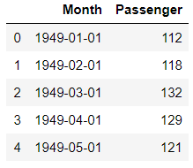

This dataset is nicely formatted and sampled and is in a much better shape. We don’t have to worry about missing values, Non discrete data and Outlier detection.

## **Time Series Analysis with Line Plot**

Our first step to visualize this dataset is same as any other dataset i.e. to plot a simple line plot

This is a univariate data so we will have Month on X-axis and Number of Passengers on Y-Axis. We can also choose the linestyle, marker color for each data points and marker size as well

Ad

[](https://googleads.g.doubleclick.net/aclk?sa=l&ai=CWlUI_8CuXsH6H7PGzAaFyYSQD5LznrZcyfK--poLm9LJ_5EOEAEgwdKyTWC7vq6D0AqgAYHFw8YDyAEGqQK6h-fSHWyyPqgDAcgDwwSqBO0BT9Ahh_o4VuCrypVccY5Xyyz255LslgYZUlcmTa5zTdoTUEBOIdB3j0ZLe7xdzyj78WAo9-IZ0zcol9tSmM317XKg5vQdHn1VW-xzSSbN_2nSbFqJfrZaDpwUgHzhJbTZ2f434aEuWXzCKoSVOwFU1W-9FqcW7fNb8sVFvxCUyQ9l5SRvANcgn4-yKePobcU270XlZ1EnJWsk2eesiP4nQ8HEP5V8xq-ZhXpGkoESmoCH2EkztnuhQXZMn0guBrzM7-BDa8BQ_bwmkGDdQuyBIg0bAeYxDTMobvYd6UR88gHWomu895RsAcpLnuiEwATCiryHywKgBjeAB-e6vDmoB47OG6gH1ckbqAeT2BuoB7oGqAfw2RuoB_LZG6gHpr4bqAfs1RuoB_PRG6gH7NUbqAeW2BuoB8LaG9gHAdIICQiM44AQEAEYHrEJLMvUo8hgcqOACgGYCwHICwHYEw0&ae=1&num=1&sig=AOD64_049K9_3KsxfXYsMU3Koqap-XZA0Q&client=ca-pub-1898260049766578&nb=9&adurl=https://www.powerusersoftwares.com/powerpoint-templates-icons-addin%3Fgclid%3DEAIaIQobChMIgfarw-CX6QIVMyPTCh2FJAHyEAEYASAAEgJFlPD_BwE)

[Templates, icons, maps, charts](https://googleads.g.doubleclick.net/aclk?sa=l&ai=CWlUI_8CuXsH6H7PGzAaFyYSQD5LznrZcyfK--poLm9LJ_5EOEAEgwdKyTWC7vq6D0AqgAYHFw8YDyAEGqQK6h-fSHWyyPqgDAcgDwwSqBO0BT9Ahh_o4VuCrypVccY5Xyyz255LslgYZUlcmTa5zTdoTUEBOIdB3j0ZLe7xdzyj78WAo9-IZ0zcol9tSmM317XKg5vQdHn1VW-xzSSbN_2nSbFqJfrZaDpwUgHzhJbTZ2f434aEuWXzCKoSVOwFU1W-9FqcW7fNb8sVFvxCUyQ9l5SRvANcgn4-yKePobcU270XlZ1EnJWsk2eesiP4nQ8HEP5V8xq-ZhXpGkoESmoCH2EkztnuhQXZMn0guBrzM7-BDa8BQ_bwmkGDdQuyBIg0bAeYxDTMobvYd6UR88gHWomu895RsAcpLnuiEwATCiryHywKgBjeAB-e6vDmoB47OG6gH1ckbqAeT2BuoB7oGqAfw2RuoB_LZG6gHpr4bqAfs1RuoB_PRG6gH7NUbqAeW2BuoB8LaG9gHAdIICQiM44AQEAEYHrEJLMvUo8hgcqOACgGYCwHICwHYEw0&ae=1&num=1&sig=AOD64_049K9_3KsxfXYsMU3Koqap-XZA0Q&client=ca-pub-1898260049766578&nb=0&adurl=https://www.powerusersoftwares.com/powerpoint-templates-icons-addin%3Fgclid%3DEAIaIQobChMIgfarw-CX6QIVMyPTCh2FJAHyEAEYASAAEgJFlPD_BwE)

[Ad   Work 50% faster with thousands of templates, icons and charts]()

[Power-user](https://googleads.g.doubleclick.net/aclk?sa=l&ai=CWlUI_8CuXsH6H7PGzAaFyYSQD5LznrZcyfK--poLm9LJ_5EOEAEgwdKyTWC7vq6D0AqgAYHFw8YDyAEGqQK6h-fSHWyyPqgDAcgDwwSqBO0BT9Ahh_o4VuCrypVccY5Xyyz255LslgYZUlcmTa5zTdoTUEBOIdB3j0ZLe7xdzyj78WAo9-IZ0zcol9tSmM317XKg5vQdHn1VW-xzSSbN_2nSbFqJfrZaDpwUgHzhJbTZ2f434aEuWXzCKoSVOwFU1W-9FqcW7fNb8sVFvxCUyQ9l5SRvANcgn4-yKePobcU270XlZ1EnJWsk2eesiP4nQ8HEP5V8xq-ZhXpGkoESmoCH2EkztnuhQXZMn0guBrzM7-BDa8BQ_bwmkGDdQuyBIg0bAeYxDTMobvYd6UR88gHWomu895RsAcpLnuiEwATCiryHywKgBjeAB-e6vDmoB47OG6gH1ckbqAeT2BuoB7oGqAfw2RuoB_LZG6gHpr4bqAfs1RuoB_PRG6gH7NUbqAeW2BuoB8LaG9gHAdIICQiM44AQEAEYHrEJLMvUo8hgcqOACgGYCwHICwHYEw0&ae=1&num=1&sig=AOD64_049K9_3KsxfXYsMU3Koqap-XZA0Q&client=ca-pub-1898260049766578&nb=1&adurl=https://www.powerusersoftwares.com/powerpoint-templates-icons-addin%3Fgclid%3DEAIaIQobChMIgfarw-CX6QIVMyPTCh2FJAHyEAEYASAAEgJFlPD_BwE)

[Open](https://googleads.g.doubleclick.net/aclk?sa=l&ai=CWlUI_8CuXsH6H7PGzAaFyYSQD5LznrZcyfK--poLm9LJ_5EOEAEgwdKyTWC7vq6D0AqgAYHFw8YDyAEGqQK6h-fSHWyyPqgDAcgDwwSqBO0BT9Ahh_o4VuCrypVccY5Xyyz255LslgYZUlcmTa5zTdoTUEBOIdB3j0ZLe7xdzyj78WAo9-IZ0zcol9tSmM317XKg5vQdHn1VW-xzSSbN_2nSbFqJfrZaDpwUgHzhJbTZ2f434aEuWXzCKoSVOwFU1W-9FqcW7fNb8sVFvxCUyQ9l5SRvANcgn4-yKePobcU270XlZ1EnJWsk2eesiP4nQ8HEP5V8xq-ZhXpGkoESmoCH2EkztnuhQXZMn0guBrzM7-BDa8BQ_bwmkGDdQuyBIg0bAeYxDTMobvYd6UR88gHWomu895RsAcpLnuiEwATCiryHywKgBjeAB-e6vDmoB47OG6gH1ckbqAeT2BuoB7oGqAfw2RuoB_LZG6gHpr4bqAfs1RuoB_PRG6gH7NUbqAeW2BuoB8LaG9gHAdIICQiM44AQEAEYHrEJLMvUo8hgcqOACgGYCwHICwHYEw0&ae=1&num=1&sig=AOD64_049K9_3KsxfXYsMU3Koqap-XZA0Q&client=ca-pub-1898260049766578&nb=8&adurl=https://www.powerusersoftwares.com/powerpoint-templates-icons-addin%3Fgclid%3DEAIaIQobChMIgfarw-CX6QIVMyPTCh2FJAHyEAEYASAAEgJFlPD_BwE)

We will rename the x and y axis label as Year and Passenger

|     |     |
| --- | --- |
| 1 2 3 4 | df.plot(x='Month',y='Passenger',figsize=(15,6),linestyle='--',  marker='*',  markerfacecolor='r',color='y',markersize=10) plt.xlabel('Years') plt.ylabel('Passengers') |

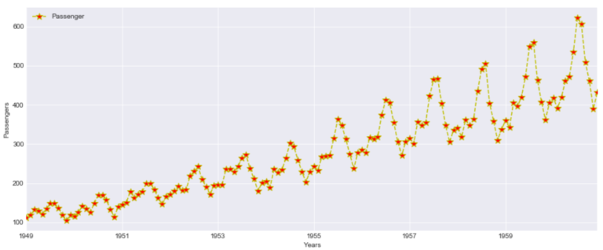

This plot is quite informative and we can see an upward trend here. With every passing years the passenger count is increasing and there is a seasonality in data also

What is Seasonality? Every year the passenger counts increases for a month and then goes down again and same effect is repeated every year

Ad

[](https://googleads.g.doubleclick.net/aclk?sa=l&ai=CSQJM_8CuXpOpIYbjzAaa5ZK4A5Od7bBYyfq8w8QL0cvDpY4OEAEgwdKyTWC7vq6D0AqgAfj2-ogDyAEGqQK6h-fSHWyyPqgDAcgDwwSqBO4BT9CQ9mbicO7d8FY1cKvL2DQlBY_HDdtyfhHGucfz-ydihTcr8vDy080uHpZgClDn-4rIQvyU0GdololCpHZGmnCW06L1pGgkdubJk4QpqeEP632n4Ecen1BgtY03mXxbjE0hUiWDofmn1rm7WkvEUJUiX7wg8YWE7GlCNAt4xmv8DC8VzXKSqJtRXXDVf6yLMTgjEaiKpox6gr7QdUc4DwMok7r-1blvn9vtuOE8pNKgfo5R6-ztb4vHVlq3EavW0XOK198y53g3eheFI-zwctv4Ap6W-w588tTRYVkCe-TTqAgnmRGdOGjUDK7aRcAEgPjfxtABoAY3gAfwiIV3qAeOzhuoB9XJG6gHk9gbqAe6BqgH8NkbqAfy2RuoB6a-G6gH7NUbqAfz0RuoB-zVG6gHltgbqAfC2hvYBwHSCAkIjOOAEBABGB6xCdDzqKQO6iHygAoBigp0aHR0cHM6Ly93d3cuYWZmaWxpYmFuay5kZS9zY3JpcHRzL2NsaWNrLnBocD9ob3A9Ym9keWZva3VzYWZmaWxpYXRlJmFjY291bnRJZD1iMzZiODkyOCZkYXRhMT1nYWVuc2J2YSZkZXN0dXJsPXtscHVybH2YCwHICwHgCwHYEww&ae=1&num=1&sig=AOD64_2acO_eT-WGbEq8GgRxrnTV04GPcg&client=ca-pub-1898260049766578&nb=9&adurl=https://gutbacteriabalance.com/%3Fgclid%3DEAIaIQobChMI06Stw-CX6QIVhjHTCh2asgQ3EAEYASAAEgI4KfD_BwE)

[This 1 harms your gut and lead to IBS and Bellyfat](https://googleads.g.doubleclick.net/aclk?sa=l&ai=CSQJM_8CuXpOpIYbjzAaa5ZK4A5Od7bBYyfq8w8QL0cvDpY4OEAEgwdKyTWC7vq6D0AqgAfj2-ogDyAEGqQK6h-fSHWyyPqgDAcgDwwSqBO4BT9CQ9mbicO7d8FY1cKvL2DQlBY_HDdtyfhHGucfz-ydihTcr8vDy080uHpZgClDn-4rIQvyU0GdololCpHZGmnCW06L1pGgkdubJk4QpqeEP632n4Ecen1BgtY03mXxbjE0hUiWDofmn1rm7WkvEUJUiX7wg8YWE7GlCNAt4xmv8DC8VzXKSqJtRXXDVf6yLMTgjEaiKpox6gr7QdUc4DwMok7r-1blvn9vtuOE8pNKgfo5R6-ztb4vHVlq3EavW0XOK198y53g3eheFI-zwctv4Ap6W-w588tTRYVkCe-TTqAgnmRGdOGjUDK7aRcAEgPjfxtABoAY3gAfwiIV3qAeOzhuoB9XJG6gHk9gbqAe6BqgH8NkbqAfy2RuoB6a-G6gH7NUbqAfz0RuoB-zVG6gHltgbqAfC2hvYBwHSCAkIjOOAEBABGB6xCdDzqKQO6iHygAoBigp0aHR0cHM6Ly93d3cuYWZmaWxpYmFuay5kZS9zY3JpcHRzL2NsaWNrLnBocD9ob3A9Ym9keWZva3VzYWZmaWxpYXRlJmFjY291bnRJZD1iMzZiODkyOCZkYXRhMT1nYWVuc2J2YSZkZXN0dXJsPXtscHVybH2YCwHICwHgCwHYEww&ae=1&num=1&sig=AOD64_2acO_eT-WGbEq8GgRxrnTV04GPcg&client=ca-pub-1898260049766578&nb=0&adurl=https://gutbacteriabalance.com/%3Fgclid%3DEAIaIQobChMI06Stw-CX6QIVhjHTCh2asgQ3EAEYASAAEgI4KfD_BwE)

[Ad   This 1 Food harms your Bowel and leads to irritable bowel syndrome and…]()

[BodyFokus](https://googleads.g.doubleclick.net/aclk?sa=l&ai=CSQJM_8CuXpOpIYbjzAaa5ZK4A5Od7bBYyfq8w8QL0cvDpY4OEAEgwdKyTWC7vq6D0AqgAfj2-ogDyAEGqQK6h-fSHWyyPqgDAcgDwwSqBO4BT9CQ9mbicO7d8FY1cKvL2DQlBY_HDdtyfhHGucfz-ydihTcr8vDy080uHpZgClDn-4rIQvyU0GdololCpHZGmnCW06L1pGgkdubJk4QpqeEP632n4Ecen1BgtY03mXxbjE0hUiWDofmn1rm7WkvEUJUiX7wg8YWE7GlCNAt4xmv8DC8VzXKSqJtRXXDVf6yLMTgjEaiKpox6gr7QdUc4DwMok7r-1blvn9vtuOE8pNKgfo5R6-ztb4vHVlq3EavW0XOK198y53g3eheFI-zwctv4Ap6W-w588tTRYVkCe-TTqAgnmRGdOGjUDK7aRcAEgPjfxtABoAY3gAfwiIV3qAeOzhuoB9XJG6gHk9gbqAe6BqgH8NkbqAfy2RuoB6a-G6gH7NUbqAfz0RuoB-zVG6gHltgbqAfC2hvYBwHSCAkIjOOAEBABGB6xCdDzqKQO6iHygAoBigp0aHR0cHM6Ly93d3cuYWZmaWxpYmFuay5kZS9zY3JpcHRzL2NsaWNrLnBocD9ob3A9Ym9keWZva3VzYWZmaWxpYXRlJmFjY291bnRJZD1iMzZiODkyOCZkYXRhMT1nYWVuc2J2YSZkZXN0dXJsPXtscHVybH2YCwHICwHgCwHYEww&ae=1&num=1&sig=AOD64_2acO_eT-WGbEq8GgRxrnTV04GPcg&client=ca-pub-1898260049766578&nb=1&adurl=https://gutbacteriabalance.com/%3Fgclid%3DEAIaIQobChMI06Stw-CX6QIVhjHTCh2asgQ3EAEYASAAEgI4KfD_BwE)

[Open](https://googleads.g.doubleclick.net/aclk?sa=l&ai=CSQJM_8CuXpOpIYbjzAaa5ZK4A5Od7bBYyfq8w8QL0cvDpY4OEAEgwdKyTWC7vq6D0AqgAfj2-ogDyAEGqQK6h-fSHWyyPqgDAcgDwwSqBO4BT9CQ9mbicO7d8FY1cKvL2DQlBY_HDdtyfhHGucfz-ydihTcr8vDy080uHpZgClDn-4rIQvyU0GdololCpHZGmnCW06L1pGgkdubJk4QpqeEP632n4Ecen1BgtY03mXxbjE0hUiWDofmn1rm7WkvEUJUiX7wg8YWE7GlCNAt4xmv8DC8VzXKSqJtRXXDVf6yLMTgjEaiKpox6gr7QdUc4DwMok7r-1blvn9vtuOE8pNKgfo5R6-ztb4vHVlq3EavW0XOK198y53g3eheFI-zwctv4Ap6W-w588tTRYVkCe-TTqAgnmRGdOGjUDK7aRcAEgPjfxtABoAY3gAfwiIV3qAeOzhuoB9XJG6gHk9gbqAe6BqgH8NkbqAfy2RuoB6a-G6gH7NUbqAfz0RuoB-zVG6gHltgbqAfC2hvYBwHSCAkIjOOAEBABGB6xCdDzqKQO6iHygAoBigp0aHR0cHM6Ly93d3cuYWZmaWxpYmFuay5kZS9zY3JpcHRzL2NsaWNrLnBocD9ob3A9Ym9keWZva3VzYWZmaWxpYXRlJmFjY291bnRJZD1iMzZiODkyOCZkYXRhMT1nYWVuc2J2YSZkZXN0dXJsPXtscHVybH2YCwHICwHgCwHYEww&ae=1&num=1&sig=AOD64_2acO_eT-WGbEq8GgRxrnTV04GPcg&client=ca-pub-1898260049766578&nb=8&adurl=https://gutbacteriabalance.com/%3Fgclid%3DEAIaIQobChMI06Stw-CX6QIVhjHTCh2asgQ3EAEYASAAEgI4KfD_BwE)

Let’s continue our Exploratory Analysis and we will resample this data Quarterly i.e. 3 months and then visualize it on a Quarterly data plot

|     |     |
| --- | --- |
| 1 2 | df1  =df.set_index('Month').resample('3M').mean() df1.head() |

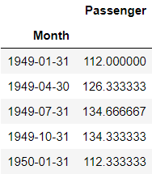
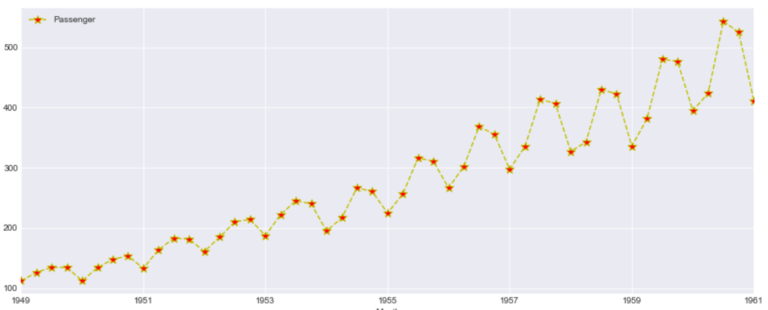

This looks more clear and the Quarterly data points i.e. Red markers are visible for each year. However the trend and Seasonality in the data is same as seen above

## **Scatter Matrix**

A Scatter plot in time series is as important than with any other data. Here we are plotting the difference between adjacent time points using Pandas diff() function and plotted a diff plot between passenger and GDP

|     |     |
| --- | --- |
| 1   | df.diff().plot(figsize=(20,6),kind='scatter',x  =  'GDP',  y  =  'Passenger',color='black') |

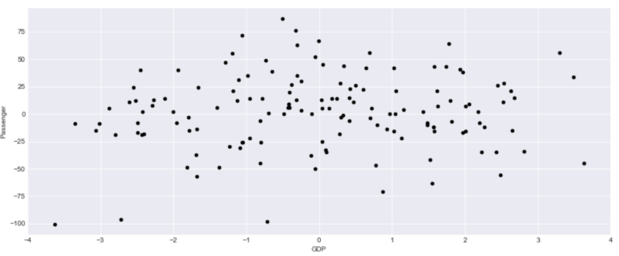

This data looks bit informative and we can see there is a correlation with GDP and Passenger count. So what we are interested to find out here is How a change in GDP will impact the Passengers travelling in airplanes

Another Aspect of this graph is the negative change in GDP also sees some surge in Passenger count so there is a correlation but the relationship are not as strong.

[](https://googleads.g.doubleclick.net/aclk?sa=l&ai=CU_bD_8CuXvHFIKWFzAagppTgAtrTqdJazYyr7fQKxMfMqpYOEAEgwdKyTWC7vq6D0AqgAa73mdIDyAECqQIVznM5sdCnPqgDAcgDyQSqBPYBT9AOWo2Q90Yg8bkWKVRiDYLF5XG85itIyZuslWv_BIg6-FsiWuO5tZIXerYRiO14gC-Qdzrate_N4re6Wkbl6gMxLrv3XFXCixCmok_VwHuiNH4P829HH3m1TMogNUpDbeHpACvhDEFcvIyxTkmIOq2L7Zh3ZObqkN3z0j4XNTRdJ9hvi9L-qBtd9QQF6gelRx3x4nsglOUkacstayxW-H25tGIwEpKBDjzvlgFmmBp0nqeW-b9s0-2NSpjvyQgPKgtVXaJN5F2r01yhJ0--IMeM_MuWcLh6ubb8LAHHoMyHw32prmQBElOQYOc1JMAC9pzFmizJwASbuovQgAKgBgKAB7qI5i2oB47OG6gH1ckbqAeT2BuoB7oGqAfw2RuoB_LZG6gHpr4bqAfs1RuoB_PRG6gH7NUbqAeW2BuoB8LaG9gHAdIICQiM44AQEAEYHrEJaLaWSCNJvVOACgGYCwHICwHYEww&ae=1&num=1&sig=AOD64_0T99cAhGzYe6_NBVyzU3fXxzUxKg&client=ca-pub-1898260049766578&nb=17&adurl=https://foreverspin.com/%3Fc%3Dss1%26gclid%3DEAIaIQobChMIscGsw-CX6QIVpQLTCh0gEwUsEAEYASAAEgIGPfD_BwE)

Can we forecast the passenger count based on the change in GDP?

## **Time Series Lag Plot**

A lag plot helps to check if a time series data set is random or not. A random data will be evenly spread whereas a shape or trend indicates the data is not random.

It is a scatter plot where one data point is plotted against the other with a fixed amount of lag. So a first order lag plot is using a lag of 1

For plotting lag chart we can use Pandas lag_plot() function. The x-axis contains y(t) and y-axis contains the data point after 1 lag point i.e. y(t+1)

|     |     |
| --- | --- |
| 1   | pd.plotting.lag_plot(df&#91;'Passenger']) |

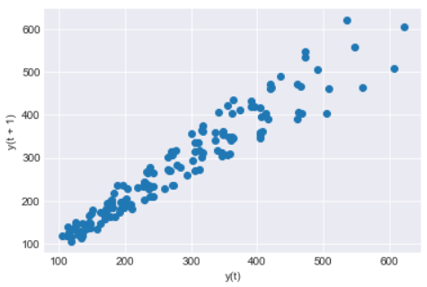

So we can see a linear trend in our data and the data set is not Random. There is no outliers as such also detected in this data set

Lag can also be useful to identify the suitable time series model for the data. So looking at this linear trend for our data a Auto Regressive model will be good

## **Heatmap and Hexbin Plot**

We will make a 2D histogram or a density heatmap using matplotlib hist2d() function with Year on X-axis and Number of Passengers on Y-axis

|     |     |
| --- | --- |
| 1 2 3 | x=df&#91;'Year'] y=df&#91;'Passenger'] plt.hist2d(x,  y) |

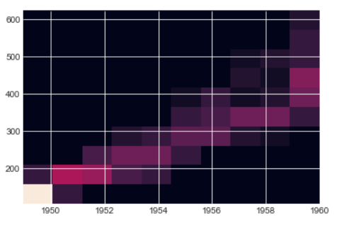

The below hexbin plot looks better than the heatmap and the trend is also quite evident from this hexbin too. You can see growing Passengers with every year

In both heatmap above and hexbin below the count of passenger are colored and shows the number of passengers for each Year

[](https://googleads.g.doubleclick.net/aclk?sa=l&ai=C3ki__8CuXuXdH-ngzAahg7fYCpOsnJZaiKar4-MKsJAfEAEgwdKyTWC7vq6D0AqgAfGv7-ICyAEGqAMByAPDBKoE-wFP0CtDUKsirssDJ9XhZFIOmf--UsfuLqaXlxDXaOYV8oXi2N75edEIIj5mbnaW_V_QiErr87nbxlmBgLVedKmShPz6MNWvooQ7U_xHel4kAmOJJPQKj-9fb-DFUdPpy4ZyEVp25ypz1ne0SZYZlgi3hjk9e7oKoBwilnmaZt4WEwa06EVTo05lwrGRMzoHfg5uLHam0X02NZj0B9L1xwIEIjtH364L6K_ncf0wFai6A3c4uM3SP0pLbPfN-KPYHcc5Nh0P1g6ZNE_AkRmc3qrwvwzx8X2KRbgP2QRMdN-B1fl1ZPkUxzj2iKN37SY_QSPfD7m8WE-X-qOHasAEm_uyvKgCoAY3gAf3z5CdAagHjs4bqAfVyRuoB5PYG6gHugaoB_DZG6gH8tkbqAemvhuoB-zVG6gH89EbqAfs1RuoB5bYG6gHwtob2AcB0ggJCIzjgBAQARgesQn9NaRG1UYKooAKAZgLAcgLAdgTDA&ae=1&num=1&sig=AOD64_285ejtmQ7C1Vv5l2b5Zyxg1l-B4Q&client=ca-pub-1898260049766578&nb=9&adurl=https://infograpia.com/%3Futm_source%3Dgoogle%26utm_medium%3Ddisplay%26utm_campaign%3Ddisplay_websites_worldwide%26utm_term%3Dnew_images%26gclid%3DEAIaIQobChMIpdmrw-CX6QIVaTDTCh2hwQ2rEAEYASAAEgLH2vD_BwE)

[2019's Best PowerPoint Infographics](https://googleads.g.doubleclick.net/aclk?sa=l&ai=C3ki__8CuXuXdH-ngzAahg7fYCpOsnJZaiKar4-MKsJAfEAEgwdKyTWC7vq6D0AqgAfGv7-ICyAEGqAMByAPDBKoE-wFP0CtDUKsirssDJ9XhZFIOmf--UsfuLqaXlxDXaOYV8oXi2N75edEIIj5mbnaW_V_QiErr87nbxlmBgLVedKmShPz6MNWvooQ7U_xHel4kAmOJJPQKj-9fb-DFUdPpy4ZyEVp25ypz1ne0SZYZlgi3hjk9e7oKoBwilnmaZt4WEwa06EVTo05lwrGRMzoHfg5uLHam0X02NZj0B9L1xwIEIjtH364L6K_ncf0wFai6A3c4uM3SP0pLbPfN-KPYHcc5Nh0P1g6ZNE_AkRmc3qrwvwzx8X2KRbgP2QRMdN-B1fl1ZPkUxzj2iKN37SY_QSPfD7m8WE-X-qOHasAEm_uyvKgCoAY3gAf3z5CdAagHjs4bqAfVyRuoB5PYG6gHugaoB_DZG6gH8tkbqAemvhuoB-zVG6gH89EbqAfs1RuoB5bYG6gHwtob2AcB0ggJCIzjgBAQARgesQn9NaRG1UYKooAKAZgLAcgLAdgTDA&ae=1&num=1&sig=AOD64_285ejtmQ7C1Vv5l2b5Zyxg1l-B4Q&client=ca-pub-1898260049766578&nb=0&adurl=https://infograpia.com/%3Futm_source%3Dgoogle%26utm_medium%3Ddisplay%26utm_campaign%3Ddisplay_websites_worldwide%26utm_term%3Dnew_images%26gclid%3DEAIaIQobChMIpdmrw-CX6QIVaTDTCh2hwQ2rEAEYASAAEgLH2vD_BwE)

Ad

[Infograpia.com](https://googleads.g.doubleclick.net/aclk?sa=l&ai=C3ki__8CuXuXdH-ngzAahg7fYCpOsnJZaiKar4-MKsJAfEAEgwdKyTWC7vq6D0AqgAfGv7-ICyAEGqAMByAPDBKoE-wFP0CtDUKsirssDJ9XhZFIOmf--UsfuLqaXlxDXaOYV8oXi2N75edEIIj5mbnaW_V_QiErr87nbxlmBgLVedKmShPz6MNWvooQ7U_xHel4kAmOJJPQKj-9fb-DFUdPpy4ZyEVp25ypz1ne0SZYZlgi3hjk9e7oKoBwilnmaZt4WEwa06EVTo05lwrGRMzoHfg5uLHam0X02NZj0B9L1xwIEIjtH364L6K_ncf0wFai6A3c4uM3SP0pLbPfN-KPYHcc5Nh0P1g6ZNE_AkRmc3qrwvwzx8X2KRbgP2QRMdN-B1fl1ZPkUxzj2iKN37SY_QSPfD7m8WE-X-qOHasAEm_uyvKgCoAY3gAf3z5CdAagHjs4bqAfVyRuoB5PYG6gHugaoB_DZG6gH8tkbqAemvhuoB-zVG6gH89EbqAfs1RuoB5bYG6gHwtob2AcB0ggJCIzjgBAQARgesQn9NaRG1UYKooAKAZgLAcgLAdgTDA&ae=1&num=1&sig=AOD64_285ejtmQ7C1Vv5l2b5Zyxg1l-B4Q&client=ca-pub-1898260049766578&nb=1&adurl=https://infograpia.com/%3Futm_source%3Dgoogle%26utm_medium%3Ddisplay%26utm_campaign%3Ddisplay_websites_worldwide%26utm_term%3Dnew_images%26gclid%3DEAIaIQobChMIpdmrw-CX6QIVaTDTCh2hwQ2rEAEYASAAEgLH2vD_BwE)

[Open](https://googleads.g.doubleclick.net/aclk?sa=l&ai=C3ki__8CuXuXdH-ngzAahg7fYCpOsnJZaiKar4-MKsJAfEAEgwdKyTWC7vq6D0AqgAfGv7-ICyAEGqAMByAPDBKoE-wFP0CtDUKsirssDJ9XhZFIOmf--UsfuLqaXlxDXaOYV8oXi2N75edEIIj5mbnaW_V_QiErr87nbxlmBgLVedKmShPz6MNWvooQ7U_xHel4kAmOJJPQKj-9fb-DFUdPpy4ZyEVp25ypz1ne0SZYZlgi3hjk9e7oKoBwilnmaZt4WEwa06EVTo05lwrGRMzoHfg5uLHam0X02NZj0B9L1xwIEIjtH364L6K_ncf0wFai6A3c4uM3SP0pLbPfN-KPYHcc5Nh0P1g6ZNE_AkRmc3qrwvwzx8X2KRbgP2QRMdN-B1fl1ZPkUxzj2iKN37SY_QSPfD7m8WE-X-qOHasAEm_uyvKgCoAY3gAf3z5CdAagHjs4bqAfVyRuoB5PYG6gHugaoB_DZG6gH8tkbqAemvhuoB-zVG6gH89EbqAfs1RuoB5bYG6gHwtob2AcB0ggJCIzjgBAQARgesQn9NaRG1UYKooAKAZgLAcgLAdgTDA&ae=1&num=1&sig=AOD64_285ejtmQ7C1Vv5l2b5Zyxg1l-B4Q&client=ca-pub-1898260049766578&nb=8&adurl=https://infograpia.com/%3Futm_source%3Dgoogle%26utm_medium%3Ddisplay%26utm_campaign%3Ddisplay_websites_worldwide%26utm_term%3Dnew_images%26gclid%3DEAIaIQobChMIpdmrw-CX6QIVaTDTCh2hwQ2rEAEYASAAEgLH2vD_BwE)

|     |     |
| --- | --- |
| 1   | ax  =  df.plot.hexbin(x='Year',  y='Passenger',  gridsize=20) |

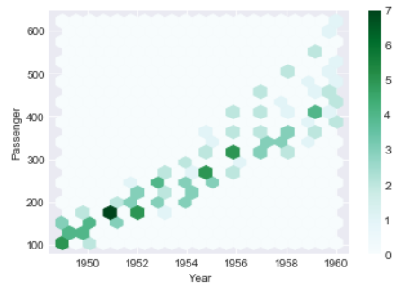

## **3D Visualization of Time Series Plot**

Let’s create two additional columns i.e. Month and Year. We will extract the values of these columns from the Month column

|     |     |
| --- | --- |
| 1 2 3 | df&#91;'Month_name']=df&#91;'Month'].dt.month df&#91;'Year']=df&#91;'Month'].dt.year df.head() |

[](https://googleads.g.doubleclick.net/aclk?sa=l&ai=ClCXS_8CuXvnuH86mzAaNuJmAC5_QssFc5sPEi60Lv-EeEAEgwdKyTWC7vq6D0AqgAeGjpesCyAECqAMByAPJBKoE8QFP0OBw6EXhSsgoJHWH4Abw9r6jBpLFkN7gsRwGL82LMPIVQ3kDoB6__RQes9e5eIRII9mq1VR5khyj6LG_g9ZX0Q69PzoSjyVVSNu0QcsPdQnc9ZbXA4iciWG88rZkjjBsJPjebLVkeh4qpGlAgQcCL1SiLWXvS-Y1pE6VeDUhrWt_NqH89Nq3VsYnbZ3ga2p708iecFuQEIUfe23aW9UpjpnJ93TE40s94eugRv45AxoUt5ujT1O8NxlihC2THpoU6CMUkfyInyjEo9LOfP-GKZoH2tVecGexWD5f-It20iUGQDg3CFzNiNEOeL0trq_KwASqz6_s8AKgBgKAB-SZjl2oB47OG6gH1ckbqAeT2BuoB7oGqAfw2RuoB_LZG6gHpr4bqAfs1RuoB_PRG6gH7NUbqAeW2BuoB8LaG9gHAdIICQiM44AQEAEYHrEJ62fC9R-YT7OACgGYCwHICwHYEww&ae=1&num=1&sig=AOD64_3rK0t2LQjhZueQy5oOYyDg8mTWRw&client=ca-pub-1898260049766578&nb=17&adurl=https://roselinlin.com/collections/best-seller-1121%3Fadp%3D1646090,1843990,7545012,3276001,1722797,1988376%26gclid%3DEAIaIQobChMIueqrw-CX6QIVThPTCh0NXAawEAEYASAAEgJjh_D_BwE)

This is how our new dataframe looks like with two additional columns for Month and Year

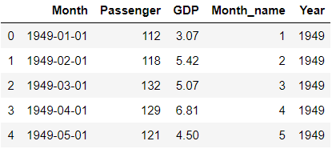

We will plot a 3-Dimension plot of our data using two datetime dimension i.e. X-axis is Month Name and Y-axis is Year and third dimension Z-axis is Number of Passengers

This Graph doesn’t show any extra insight than 2D graph seen before but a 3D Visualization gives much more better shape than a 2D graph because of data paucity and randomness

|     |     |
| --- | --- |
| 1 2 3 4 5 6 7 8 | from mpl_toolkits import mplot3d ax  =  plt.axes(projection='3d') # Data for three-dimensional scattered points ydata  =  df&#91;'Year'] xdata  =  df&#91;'Month_name'] zdata  =  df&#91;'Passenger'] ax.scatter3D(xdata,  ydata,  zdata,  c=zdata,  cmap='Vega10_r'); |

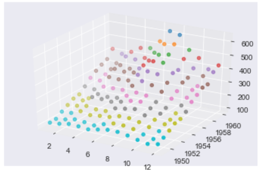

## **Moving Average and Exponential Weighted Moving Average (EWMA)**

Moving Average(MA) and Exponential Weighted Moving Average(EWMA) is a rolling window function and is very critical steps for time series analysis which is used to aggregate the data and compress it.

These functions are used to smooth the data to remove outliers and noise from the data and allowing the patterns and trends in data more visible and standout. It will smooth out short-term fluctuations and highlight longer-term trends or cycles

Moving Average is calculated by taking the mean of set of data within a fixed window size in a data set. The window size can start from 2 onwards

Let’s calculate the moving average of Passenger column in our dataset with a window size of 3 . We will calculate the average of the passengers count for every 3 months and store it in a new column called Rolling Mean

Pandas has a rolling() function to calculate the rolling mean of a dataframe or Series

|     |     |
| --- | --- |
| 1   | df&#91;'rolling_mean']=df&#91;'Pass'].rolling(12).mean() |

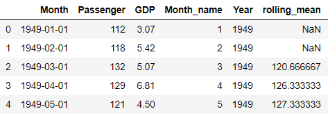

The first two values of rolling_mean Column is NaN because the window size is set to 3 so it will start by calculating the mean of first 3 months of 1949 i.e. Row # 0,1 and 2 and then Row# 1,2 and 3

Exponential Smoothing(EWMA) unlike moving average which doesn’t treat all the data points equally while smoothing. Most of the time in a Time series data we want to treat the most recent data with more weight than the previous data

n EWMA we are weighting the more recent points higher than the lags or lesser recent points. You can read more about smoothing and EWMA in this [post](https://kanoki.org/2020/04/23/how-to-remove-outliers-in-python/)

Let’s Calculate the EWMA for our data using Pandas ewm() function with a smoothing level of 0.6. You can try with different alpha levels and check the output and use the most appropriate alpha level for your data

|     |     |
| --- | --- |
| 1   | df&#91;'EWM_ALPHA_06'] = df&#91;'Passenger'].ewm(alpha=0.2).mean() |

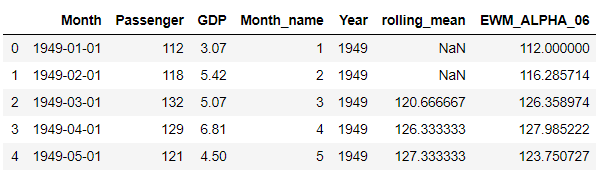

Now let’s plot these two Columns rolling means and EWMA with the original data and check how does the new smoothed values look like

|     |     |
| --- | --- |
| 1 2 3 4 5 6 | df.reset_index().plot(figsize=(15,6),kind='line',x  =  'index',  y  =  'Passenger') plt.grid(True) plt.plot(df&#91;'rolling_mean'],label='roll_mean',color='r') plt.plot(df&#91;'EWM_ALPHA_06'],label='ewma',color='g') plt.legend(loc=2) plt.show() |

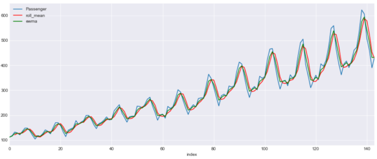

This is a line graph with three lines. Blue line shows the original data and red is for rolling mean with a window of 3 and green is for EWMA with a alpha 0.6

## **Box and Whisker Plot**

We will draw a box plot grouped by Year to visualize the data distribution for Passenger count by Year .

The whiskers at the end of each box shows the Inter-Quartile Range and any data point above or below this whiskers are considered as an outlier

You can read more about Inter-Quartile Range and Whiskers in this [post](https://kanoki.org/2020/04/23/how-to-remove-outliers-in-python/)

|     |     |
| --- | --- |
| 1   | df.boxplot(figsize=(15,6),by='Year',column='Passenger') |

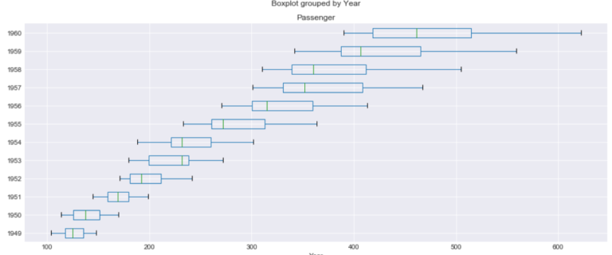

## **Seasonality and Trends**

Now we will check the Seasonality and Trend in data. In a time series , variations which occurs due to some factors (maybe natural) and operate in a regular and periodic manner over a span of less than or equal to one year is called as Seasonality

Whereas Trend in a time series shows an increasing, decreasing trend in the data over a long period of time

For Time Series modelling the trend and Seasonality should be eliminated from the data before hand. There are models like SARIMA which can handle Seasonality in the data but most of the models doesn’t

### **Per Year Month on Month Count**

In this plot we will have Month on the X-axis and Passenger count on the Y-axis and plot a line graph for each of the year . Every year the passenger surge can be seen for July and August and drop in demand in December and again surge during Christmas and New Year

This graphs shows us more about the Seasonality in the data

|     |     |
| --- | --- |
| 1 2 3 4 5 6 | fig,  ax  =  plt.subplots(figsize=(15,6)) for  name,  group in  df&#91;:60].groupby('Year'):     group.plot(x='Month_name',y='Passenger',  ax=ax,  label=name) plt.show() |

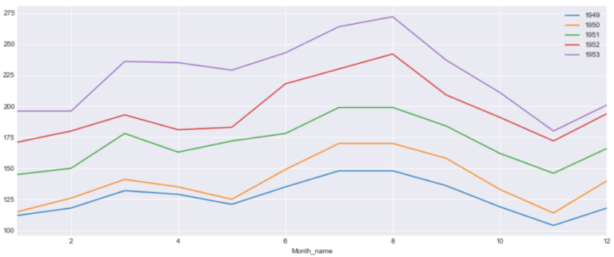

### **Per Month of Years on Years Plot**

In this plot we will have Years on X-axis and Passenger count for each Month on Y-axis. We can see very year there is an increasing trend of passengers. The line for two months i.e. July and August shows more faster growth rate than the other months

|     |     |
| --- | --- |
| 1 2 3 4 5 6 | fig,  ax  =  plt.subplots(figsize=(15,6)) for  name,  group in  df&#91;:120].groupby('Month_name'):     group.plot(x='Year',y='Passenger',  ax=ax,  label=name,title='Plot by Month') plt.show() |

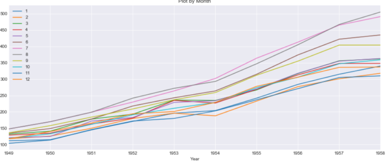

There are lot of useful information about the Seasonality and Trend of the data that can be learnt from this stack time series data than normal linear plotting of the data

## **Autocorrelation(ACF) and PACF**

We can learn some important properties of our time series data with the help of Auto Correlation(ACF) and Partial Auto Correlation (PACF) graphs. This provide useful descriptive properties for understanding which model can be used for time series forecasting

ACF measures the linear relationships between observations at different time lags. In other words ACF is used to understand if there exists a correlation between a time series data point with another point as a function of their time difference

ACF is also called as Correlogram and a Correlogram for a Stationary process is used to Interpret Random Series, Short term correlation and Alternation Series

We will be using [statsmodel Graphics API’s](https://www.statsmodels.org/stable/generated/statsmodels.graphics.tsaplots.plot_acf.html) to plot the correlation graphs. It basically uses the matplotlib cross-correlation (xcorr) and auto correlation(acorr) under the hood. Check this matplotlib [documenation](https://matplotlib.org/3.1.1/api/_as_gen/matplotlib.pyplot.xcorr.html)

We have total 20 lags on X-axis and auto Correlation on the Y-axis and the line at Y=0 is the mean. All the correlation values are above the mean and a positive value

|     |     |
| --- | --- |
| 1 2 | import statsmodels.api as  sm sm.graphics.tsa.plot_acf(df.Passenger) |

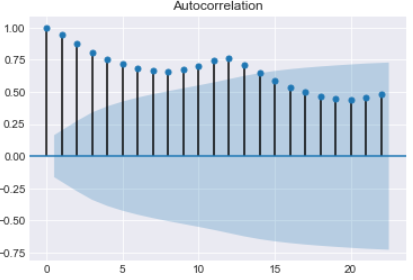

The Partial Auto Correlation factor(PACF) is the partial correlation between the two points at a specific lag of time. plotting the partial autocorrelative functions one could determine the appropriate lags **p** in an AR (**p**) model or[(L)](https://en.wikipedia.org/wiki/Autoregressive_model)in an extended ARIMA (**p**,**d**,**q**) model

For an Autoregressive AR (p) process, the partial autocorrelation(pacf) function is defined as the value of the last coefficient(alpha-p)

We will use the [statsmodel graphical](https://www.statsmodels.org/stable/generated/statsmodels.tsa.stattools.pacf.html)tools for plotting the pacf plot here

This gives an indication of Stationary time series with most of the auto correlation is above or below the mean

|     |     |
| --- | --- |
| 1 2 | import statsmodels.api as  sm sm.graphics.tsa.plot_pacf(df.Passenger) |

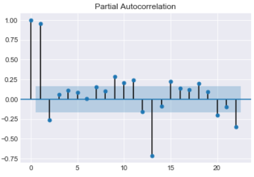

PACF shows which data points are informative for specific lags and provides a contrast to the ACF

## **Conclusion**

So we have reached at the end of this long article and just to summarize the points that we discussed in this post

- Data Visualization is an important step for any forecasting and modelling of time series data
- Line Plot shows how the data on graph with time on X-axis. it’s helpful to see how data is distributed and the underline trend
- Scatter Plot between multivariate data shows how the two variables are correlated and relationship with adjacent time points difference
- To check the randomness of data why a Lag plot is important
- Heatmap and Hexbin to check the density of the Passenger countfor each year
- Three dimensional visualization of the time series features with two dimensions for Year and Month and third dimension for Passenger Count
- Data smoothing to eliminate the noise from the data using Rolling Winsodows and Exponential Weighted Moving Average(EWMA)
- Unlike Moving Average, EWMA gives higher weight to the most recent data point than the less recent ones
- Box and Whisker plot to determine the five point summary of passenger count for each year
- To Visualize the seasonality and trend in data a Month on Month and Year on Year graph is plotted
- AutoCorrelation (ACF) tells how data points at different point of times are related to one another
- Partial Auto Correlation(PACF) provides a contrast over ACF and shows data point that are more informative in a shorter time period

## **What’s Next**

Read about Time Series Modelling and Forecasting with ARIMA in the next part of this blog [here](https://kanoki.org/2020/04/30/time-series-analysis-and-forecasting-with-arima-python/)

* * *

[Facebook0](https://www.facebook.com/sharer/sharer.php?u=https://kanoki.org/2020/04/27/time-series-analysis-data-visualization/&display=popup&ref=plugin&src=share_button)[Tweet0](https://twitter.com/share?url=https://kanoki.org/2020/04/27/time-series-analysis-data-visualization/&text=Time%20Series%20Data%20Visualization)[![](data:image/svg+xml,%3csvg version='1.1' xmlns='http://www.w3.org/2000/svg' width='22.84375' height='32' viewBox='0 0 731 1024' data-evernote-id='1100' class='js-evernote-checked'%3e%3cpath d='M0 341.143q0-61.714 21.429-116.286t59.143-95.143 86.857-70.286 105.714-44.571 115.429-14.857q90.286 0 168 38t126.286 110.571 48.571 164q0 54.857-10.857 107.429t-34.286 101.143-57.143 85.429-82.857 58.857-108 22q-38.857 0-77.143-18.286t-54.857-50.286q-5.714 22.286-16 64.286t-13.429 54.286-11.714 40.571-14.857 40.571-18.286 35.714-26.286 44.286-35.429 49.429l-8 2.857-5.143-5.714q-8.571-89.714-8.571-107.429 0-52.571 12.286-118t38-164.286 29.714-116q-18.286-37.143-18.286-96.571 0-47.429 29.714-89.143t75.429-41.714q34.857 0 54.286 23.143t19.429 58.571q0 37.714-25.143 109.143t-25.143 106.857q0 36 25.714 59.714t62.286 23.714q31.429 0 58.286-14.286t44.857-38.857 32-54.286 21.714-63.143 11.429-63.429 3.714-56.857q0-98.857-62.571-154t-163.143-55.143q-114.286 0-190.857 74t-76.571 187.714q0 25.143 7.143 48.571t15.429 37.143 15.429 26 7.143 17.429q0 16-8.571 41.714t-21.143 25.714q-1.143 0-9.714-1.714-29.143-8.571-51.714-32t-34.857-54-18.571-61.714-6.286-60.857z' data-evernote-id='1642' class='js-evernote-checked'%3e%3c/path%3e%3c/svg%3e)Pin0](https://pinterest.com/pin/create/button/?url=https://kanoki.org/2020/04/27/time-series-analysis-data-visualization/&media=&description=Time%20Series%20Data%20Visualization)[LinkedIn0](https://www.linkedin.com/shareArticle?mini=true&url=https://kanoki.org/2020/04/27/time-series-analysis-data-visualization/)

### Related Posts:

- [Resample and Interpolate time series data](https://kanoki.org/2020/04/14/resample-and-interpolate-time-series-data/)
- [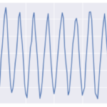Time Series Analysis and Forecasting with ARIMA](https://kanoki.org/2020/04/30/time-series-analysis-and-forecasting-with-arima-python/)
- [Text Data Visualization in Python](https://kanoki.org/2019/03/17/text-data-visualization-in-python/)
- [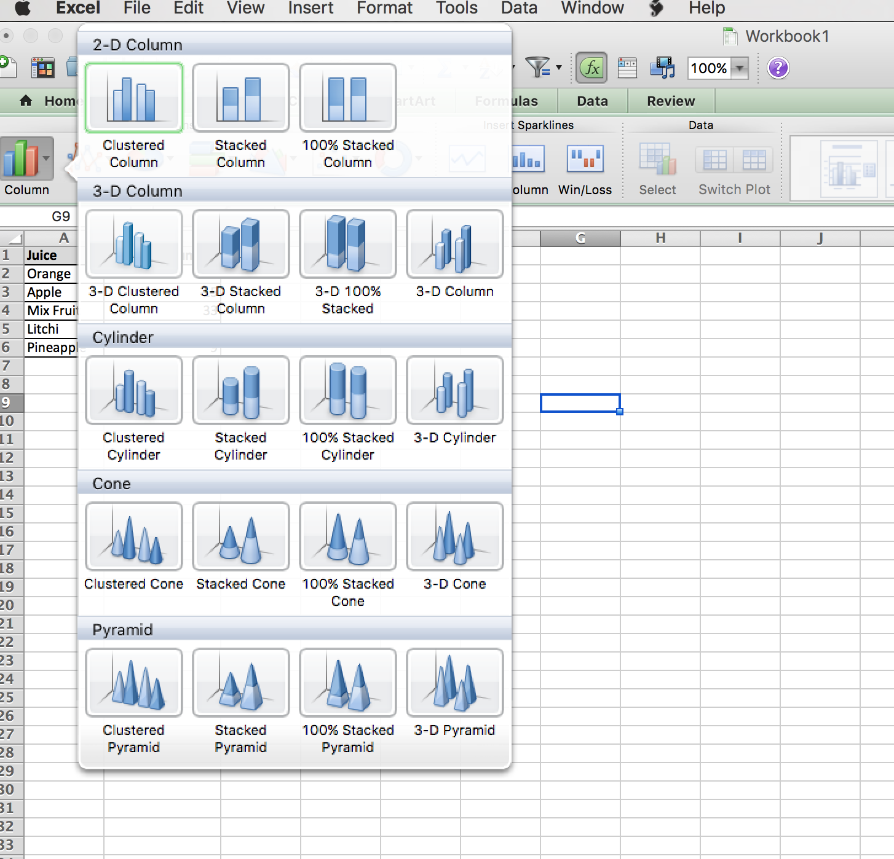Data Visualization with Excel - Part 1](https://kanoki.org/2017/05/15/data-visualization-with-excel-part-1/)
- [How to create interactive data visualization using plotly](https://kanoki.org/2019/12/31/how-to-create-interactive-data-visualization-using-plotly/)
- [Get Started with Matplotlib - Data Visualization for Python](https://kanoki.org/2017/07/09/get-started-with-matplotlib-data-visualization-for-python/)