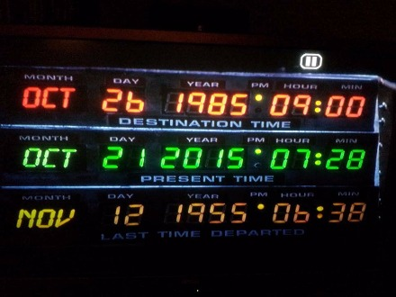

Time Travel with Google's Spanner and TrueTime - Blue Treble

# Time Travel with Google’s Spanner and TrueTime

October 21, 2015 By [Jim Nasby](http://www.bluetreble.com/author/jim/)  —[Leave a Comment](http://www.bluetreble.com/2015/10/time-travel/#respond)

Thanks to the [“PostgreSQL in PaxosLand: Distributed storage and strict consistency” session](http://postgresopen.org/events/sessions/pgopen2015/session/110-postgresql-in-paxosland-distributed-storage-and-strict-consistency/) last month at the PostgresOpen 2015, I was made aware of a paper published as part of the Proceedings of [OSDI ’12](https://www.usenix.org/conference/osdi12) describing [Spanner](http://static.googleusercontent.com/external_content/untrusted_dlcp/research.google.com/en/us/archive/spanner-osdi2012.pdf), a globally distributed database created by Google.

At its heart, Spanner operates by using clock time to determine transaction semantics, e.g. what exact data should be visible to a transaction. You could never do this with normal wall clock time. Even with the best possible NTP synchronization you’d get incorrect results at any kind of a real transaction rate — certainly at 1000 TPS, but realistically much lower rates could cause problems as well.

Google works around this issue with TrueTime, which measures both clock time and an error margin for that timestamp. This means that a “timestamp” is actually two values — the earliest time that timestamp could possibly be, and the latest time. To determine ordering, you need to correctly compare earliest and latest time; i.e., T1 < T2 only if T1.latest < T2.earliest.

You can use the TrueTime API along with two-phase commit and some careful scheduling of operations to provide all the consistency correctness that you’d expect out of an ACID database. The only problem is that it’s still guesswork, as indicated by this excerpt from the paper:

> “

> The most serious problem would be if a local clock’s drift were greater than 200us/sec: that would break assumptions made by TrueTime. Our machine statistics show that bad CPUs are 6 times more likely than bad clocks. That is, clock issues are extremely infrequent, relative to much more serious hardware problems. As a result, we believe that TrueTime’s implementation is as trustworthy as any other piece of software upon which Spanner depends.

There’s a lot of assumptions baked into that: a clock failure is detectable (what if it’s only an intermittent failure?), there’s no failure modes beyond drift > 200us/sec, and the clock synchronization itself works correctly.

That said, let’s put things in perspective — the odds of Spanner’s semantics failing are quite low. Perhaps it’s not good enough for tracking finances and other sensitive data, but it’s probably good enough for most uses. At the time of publication in 2012 Google was using Spanner to track advertising data, which is a very critical service for Google.

However, I think it does reinforce the idea that [using time to identify causality](http://bluetreble.wpengine.com/2015/06/time/) is a bad idea. Google has spent several years developing Spanner, which includes items such as atomic clocks and multiple GPS time sources per datacenter. Do you think you’ll be able to put that kind of effort forth?

Spanner also doesn’t provide very good write latency. 14ms was common for data centers 1ms away. Of more concern is two phase commit latency, which was 25ms for just 2 participants and got worse from there. As you’d expect, reads scaled almost linearly.

Spanner is still an impressive piece of work. It’s a serious advancement of distributed database technology. Perhaps most interesting is that it demonstrates a shift away from NoSQL:

> “

> Many applications at Google have chosen to use Megastore because of its semi-relational data model and support for synchronous replication, despite its relatively poor write throughput.

What interests me the most is built-in support for data versioning (aka “time travel”):

> “

> Data is stored in schematized semi-relational tables; data is versioned, and each version is automatically timestamped with its commit time; old versions of data are subject to configurable garbage-collection policies; and applications can read data at old timestamps.

PostgreSQL originally had time travel support, but it proved impractical to retain all the old data. Even with modern hardware it can be difficult to manage bloat without time travel. Perhaps it’s simply not practical without the scalability a distributed database provides.

For an informative presentation on the paper on Spanner referenced above, check out Google co-author and researcher [Wilson Hsieh](http://research.google.com/pubs/author1760.html)‘s presentation at OSDI ’12 below:

Video Player

00:00

33:43

Filed Under: [Posts](http://www.bluetreble.com/category/posts/)  Tagged With: [Google](http://www.bluetreble.com/tag/google/), [PlanetPostgres](http://www.bluetreble.com/tag/planetpostgres/), [PostgreSQL](http://www.bluetreble.com/tag/postgresql/), [spanner](http://www.bluetreble.com/tag/spanner/), [time](http://www.bluetreble.com/tag/time/), [TrueTime](http://www.bluetreble.com/tag/truetime/)