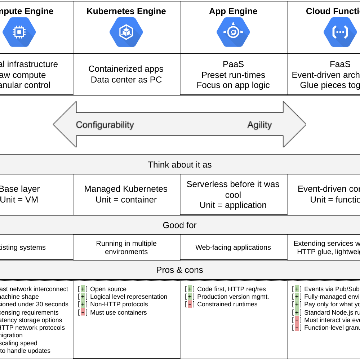

Time to “Hello, World”: VMs vs. containers vs. PaaS vs. FaaS

Time to “Hello, World”: VMs vs. containers vs. PaaS vs. FaaS

https://cloudplatform.googleblog.com/2018/06/Time-to-Hello-World-VMs-vs-containers-vs-PaaS-vs-FaaS.html

By Dmytro Melnyk, Product Marketing Manager Do you want to build applications on Google Cloud Platform (GCP) but have no idea where to st...