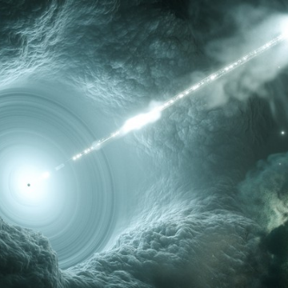

Tiny Cosmic Particle Delivers Major Breakthrough in Astronomy

Tiny Cosmic Particle Delivers Major Breakthrough in Astronomy

https://www.theatlantic.com/science/archive/2018/07/neutrino-discovery-blazar-icecube/564998/?utm_source=nextdraft&utm_medium=email

For the first time, astronomers have traced a neutrino back to its birthplace, billions of light-years across the universe.