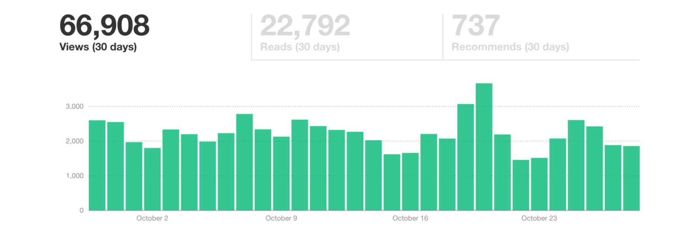
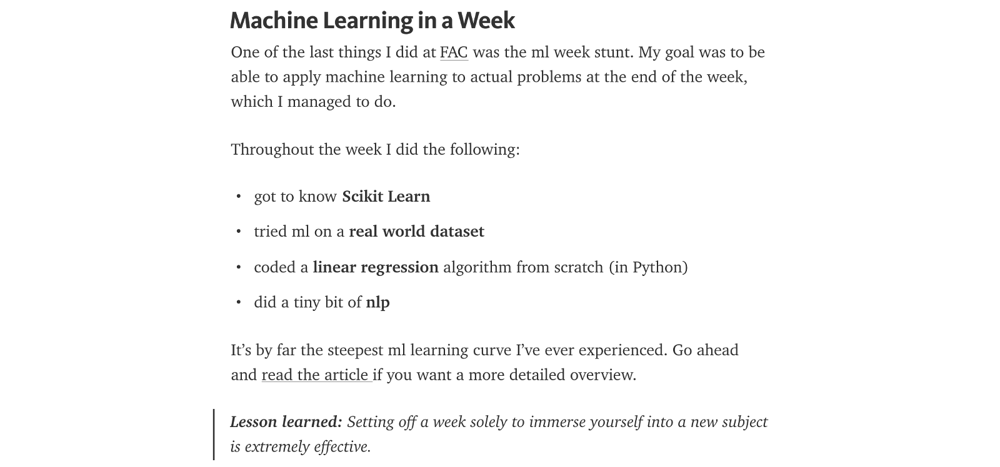
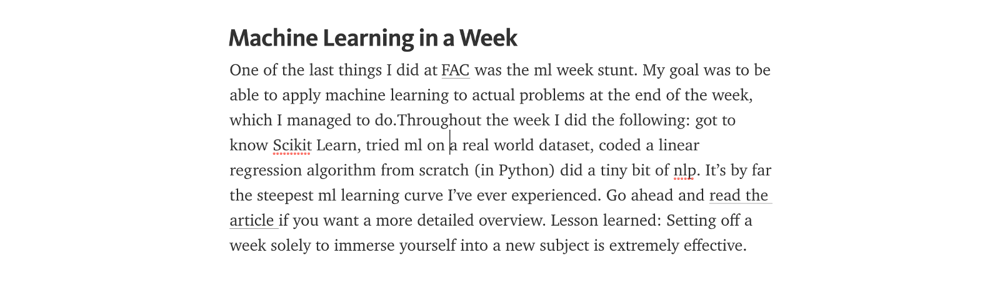

Tips for writing Medium articles – Learning New Stuff – Medium

# Tips for writing Medium articles

This article is a summary of what I have learned through writing over 20 Medium articles, gaining over 600 000 views and 300 000 reads.

Though there has been written a ton of articles like this, I still think this one can provide value to some aspiring Medium writers.

### 1. Use the Medium formatting options

People like to read articles that looks like this:

Not like this:

### 2. Use a wide header image

You want your article to look like *this* in the feed:

And not like *this*:

### 3. Break up the article

Images are also important to break up the text. Even if it’s just a screenshot of a webpage:

Alternatively, you can embed a YouTube video:

[Practical Machine Learning Tutorial with Python Intro p.1](https://www.youtube.com/watch?list=PLQVvvaa0QuDfKTOs3Keq_kaG2P55YRn5v&v=OGxgnH8y2NM)

Or use a link to another Medium article as a replacement. It’ll look like this:

[**Machine Learning in a Year** *From being a total ml noob to start using it at work*medium.com](https://medium.com/learning-new-stuff/machine-learning-in-a-year-cdb0b0ebd29c)[(L)](https://medium.com/learning-new-stuff/machine-learning-in-a-year-cdb0b0ebd29c)

All of the options above will help break up the article and make it easier to read.

### 4. Submit your article everywhere

Research online communities (reddit, Facebook groups, forums, newsletters) which might be interested in your article and share it with them.

> This effort is often what separates if an article gets 1K readers or 10K readers.

So spend at least an hour doing this. Since you never know which community will receive your article well, it’s better to submit it to one too many than one too few.

Just check out how [this CSS article](https://medium.com/learning-new-stuff/learn-css-flexbox-in-3-minutes-c616c7070672) performed on the seemingly identical [/**coding**](https://www.reddit.com/r/coding) and [**/programming**](https://www.reddit.com/r/programming/)**  **subreddits:

### 5. Write a lot of articles

You never know which post will take off.

I thought [Side Effects of 100 Days Without Alcohol](https://medium.com/@perborgen/6-side-effects-of-100-days-without-alcohol-155e56ec6da7) would be a success.

I also remember thinking *damn, I guess this article wasn’t that interesting after all *a few hours after publishing [Machine Learning in a Year.](https://medium.com/learning-new-stuff/machine-learning-in-a-year-cdb0b0ebd29c#.aurwcp8j4)

Here’s how they ended up performing compared to each other:

### 6. Cut mercilessly

It’s important to kill your darlings. Small digressions — no matter how well written — tend to make make articles unfocused and tiring to read.

A trick for cutting away stuff is to create a LEFTOVERS section at the bottom of the article. When I consider cutting something away, I move it down to the LEFTOVERS section temporarily, to see how the article works without the paragraph.

This lowers the threshold for cutting away unnecessary fat. And no, I never move the paragraphs back up again.

### 7. Publish when you’re 95 percent ready

The last 5 percent should be done after you’ve published. They will take forever when being in draft modus, but once published, it becomes clearer what you need to do.

No matter how many times I read through drafts of my text, there’s almost always someone who’ll find an error somewhere. And that’s ok. I’d rather spend an hour doing more productive stuff than reading through my article the 20th time.

### 8. Create value for the reader

Before you write an article, you should ask yourself:
> Will someone actually gain something by reading this?

As I write about learning stuff, I try to only give actionable advice. Specific stuff I’ve tested myself and experienced positive results from.

### 9. Ignore the haters

When you stick your head out there, you’ll get your fair share of haters. Take it as a compliment that someone actually reacts to what you read, or alternatively just ignore it all together.

### 10. Get their email (or something else)

Getting a new Medium follower isn’t worth much. Even with more than 5K followers, I can get as little as 150 views on a Medium post.

If you’re willing to put hours into writing an article, you should spend five extra minutes to setup a newsletter (e.g. TinyLetter), and link to it below your post. Alternatively you can link to other social channels where they can follow you.

Speaking of which, please [enter your email](https://tinyletter.com/perborgen) here if you’d like to be notified when I write a new article.