To Build a Better Ballot

No, this is not about the 2016 U.S. election. Not *just* that, anyway.

First, I need to explain a weird glitch in our voting system. Let's say there's two candidates, Steven Square  and Tracy Triangle , on a couple political axes. (for example, “left vs. right” and “globalist vs. nationalist”) Let's also say there's a voter  who simply votes for whoever's political position is closest. What would that look like?

**click & drag
the candidates and the voter:**

VOTES FOR **TRIANGLE**

It's a tough choice. Triangle's got some sharp points, but Square understands more sides! Alas, in the end, you can only vote for one.

Of course, there's more than just one voter in an election. Let's simulate what an election would look like with 100+ voters.

**drag the candidates & voters around.
(to move voters, drag the *middle* of the crowd)
watch how that changes the election:**

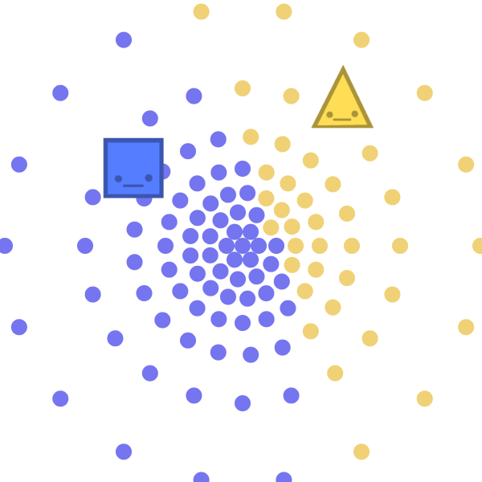
square: 83 votes, triangle: 49 votes
**SQUARE** WINS

Now let's consider a different election. Say Tracy Triangle is *already* beating Steven Square in the polls, and a third candidate, Henry Hexagon , sees this. (Hexagon's supporters like how he tackles problems from more angles) Inspired by her success, Hexagon swoops in and takes a political position close to Triangle's.

Now, you'd think giving the voters more of what they want should result in a *better* choice, or at least, not result in a *worse* choice, right? Well...

**at first,  beats .

drag  to *just under*  ,

and see what happens:**

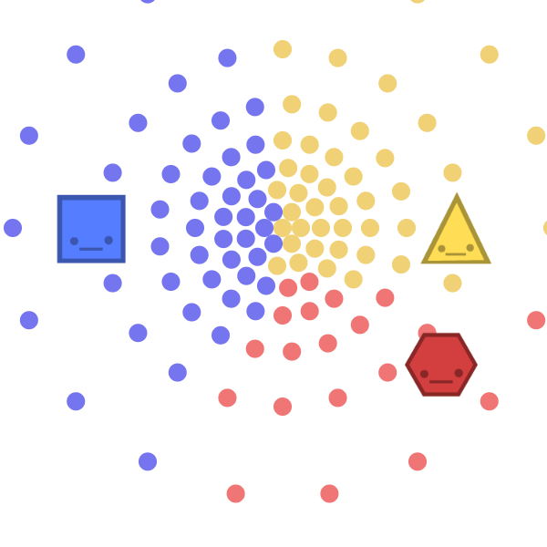
square: 57, triangle: 50, hexagon: 25
**SQUARE** WINS
reset

That's right. Steven Square, our *least* popular candidate, now wins! This is because when you have two good candidates, they "steal" votes from each other, letting a bad third candidate win.

This is called **the spoiler effect.** The most famous real-world example of this was in 2000, when Ralph Nader "stole" votes from Al Gore, letting George Bush win. And though the spoiler effect didn't play a big role in 2016, its impact could still be felt.

In the Republican primary, one anti-establishment nominee, Trump, ran against *sixteen* GOP establishment nominees, who all "stole" votes from each other, letting Trump grab the nomination, *easily*. As for the Democratic primary, fear of splitting the vote prevented Sanders from running as independent. And to cap it all off, there was always the worry that other candidates like Johnson, Stein, and McMullin could spoil the election.

But again, this is *not* about the 2016 U.S. election.
**This is about designing a democracy that people can *trust*.**

Despite so much hoopla around the 2016 election, a full *half* of Americans did not vote. Even of those who voted for Clinton/Trump, [20% of them said their candidates were untrustworthy](http://www.nytimes.com/interactive/2016/11/08/us/politics/election-exit-polls.html), *and voted for them anyway.*  [And around the world, people's trust in their governments](https://www.theatlantic.com/international/archive/2016/07/trust-institutions-trump-brexit/489554/) – or the trust*worthiness* of their governments – has never been lower. It's more than America at stake. It's *every democracy in the world.*

...so yeah, no pressure.

Rebuilding trust is a complex problem with no easy solutions. But I think there *is* an easy first step. It's a step that could get rid of our “lesser of two evils” problem, and give us citizens more choices, *better* choices. And yet, it won't be as daunting as fixing campaign finance or gerrymandering or lack of proportional representation, no, it'd just require changing *a piece of paper*, and how we count those pieces of paper.

This idea is *not* the most important issue. It *won't* solve everything. But as a first step? It'd give us the biggest bang-for-buck.

**Let's talk about how to build a better ballot.**

Now, some of you may have a couple objections!

First objection. Why would the people in power change the voting system that *got* them in power? Well, the spoiler effect has cost *both* Dems & Reps a major election before. Getting rid of that glitch would be a win-win for major *and* minor parties! Also, voting reform is already picking up steam. Just last month, [Maine adopted Instant Runoff](http://www.nytimes.com/2016/12/03/us/maine-ranked-choice-voting.html), and(Justin Trudeau, [Canada's Cutie-In-Chief](http://cdn.pinknews.co.uk/images/2016/02/justin_trudeau.jpg), will be moving his nation towards a better voting system in 2017.)**(UPDATE: ha ha [nope](https://www.theguardian.com/world/2017/feb/01/justin-trudeau-abandons-voter-reform-canada))**

Second objection. Didn't some guy once prove that *all* voting systems will be unfair? Not quite. You're thinking of the infamous [Impossibility Theorem](https://en.wikipedia.org/wiki/Arrow%27s_impossibility_theorem) by Kenneth Arrow, the mathematician in the 1950's who founded the whole study of voting systems.

Two answers to that: 1) some voting systems can still be *more* fair than others, even if none are perfect. And 2) Kenneth Arrow's proof *doesn't* apply to all voting systems! That's a misconception. It only applies to voting systems *where you rank candidates*. Later, we'll see some voting systems where you *don't* rank candidates – along with other alternatives to our current, glitchy voting system.

But first, let's take a closer look at the voting system we *do* have:

## FIRST PAST THE POST (FPTP)

same as before. click & drag
the candidates and voter

**How To Count:** Simply add up the votes. Whoever gets the most votes, wins.

Sounds logical enough. But as you saw earlier, it can lead to a weird glitch, where having two *good* candidates can make the election go to a third *bad* candidate. This is why some people vote "strategically", voting not for their actual honest favorite, but voting for the lesser of two evils. And strategic voting is fine – but! – ask yourself this: **how can we expect our elected officials to be honest, when our voting system *itself* doesn't let us be honest?**

So, to fix the spoiler effect, other voting systems have been suggested. Such as...

## RANKED VOTING

again, click & drag

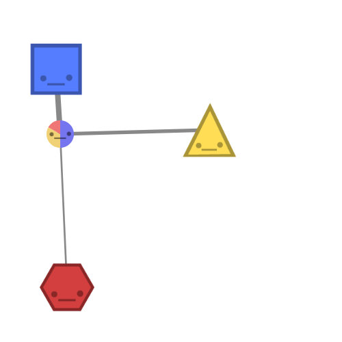

**How To Count:** There's actually *several* different ways to count these kinds of ballots. Here, I'll just show you the top three:

**Instant Runoff Voting (IRV):**This one is *the* most popular alternative to First Past The Post (FPTP). Australia and Ireland use it in national elections. San Francisco, Minneapolis, and Portland, Maine use it in local elections. And (Justin Trudeau, [Prime Man-ister of Canada](https://queerty-prodweb.s3.amazonaws.com/wp/docs/2016/02/justintrudeautorontopride.jpg), is leaning towards Instant Runoff, too.)  **(UPDATE: nevermind)**

(Note: Instant Runoff Voting is also called “Ranked Choice Voting”, even though there's other ways to count ranked ballots. IRV is also often just called “Alternative Vote”, even though there's a flippin' dozen other voting methods. Such selfish naming! Sheesh!)

IRV is a bit more complicated than FPTP, but here's how it works:
1. Count up the #1 choices.
2. If someone has more than 50%, they win! END.
3. If not, eliminate the last-place loser.
4. Run a new "round" of the election, minus that loser.
5. Repeat until someone has 50% or more.

If that seems like too much, there *is* a much simpler method of counting ranked ballots...

**Borda Count:** Simply add up the rank numbers. Like in golf, whoever has the *lowest* score, wins. Borda count is used in Slovenia and a bunch of tiny islands in Micronesia.

But if you want an even nerdier way of voting, you could try...

**Condorcet Method:** Run a simulated "election" between every pair of candidates, using the info on voters' ballots. IF there's a candidate who beats all other candidates in one-on-one "elections", that candidate wins the *real* election. However, that's a very big "IF". (as we'll see later...) The upside is, when this method *does* pick a winner, it's always the “theoretically best” candidate! Currently, this method is not being used by any governments, and is only being used by neeerrrrrds.

So, those are the voting systems *where you rank candidates* – the ones that Kenneth Arrow proved would *always* be unfair in some big way! But what of voting systems where you *don't* rank candidates? They're less well-known, but now, at least *you'll* know 'em:

## APPROVAL VOTING

yup, stiiiiill click & drag

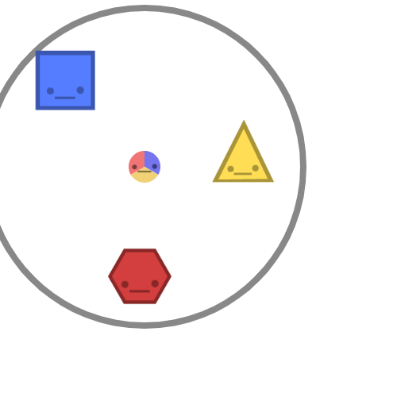

**How To Count:** Simply add up the approvals. Whoever gets the most approvals, wins.

*Wait, picking more than one candidate? Doesn't that violate the one-vote-per-person rule?* I hear you ask. Well, your vote was never a single check mark, your vote was always *the whole ballot*. And on this ballot, you get to honestly express *all* the candidates you approve of, not just your favorite or strategic second-favorite.

But if you want a *more* expressive voting system, why not try...

## SCORE VOTING

you guessed it

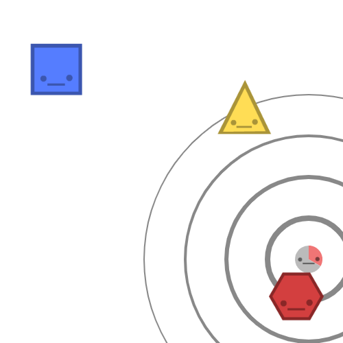

**How To Count:** Simply add up the ratings. Whoever has the highest average score, wins. Kind of like Amazon reviews, but with democracy. (Note: this is *not* a ranking system, because two candidates can have the *same* score.)

So there's our top 6 voting systems: the one we use, and five popular alternatives. But how can we tell if these alternatives are actually better? What glitches might *they* have? And which voting system – if any – can we say is "the best"?

Like before, let's simulate 'em.

Remember that simulation of the spoiler effect from earlier? Well, here it is again, but now you can switch between the six different voting systems! Here's the "spoiler effect" simulation again. See how different voting systems deal with potential spoilers:

drag  to *just under*   to create a spoiler effect.

then compare the 6 different voting systems:
(note: in the rare cases there's a tie, i just randomly pick a winner)

what voting system?
FPTP
IRV
Borda
Condorcet
Approval
Score

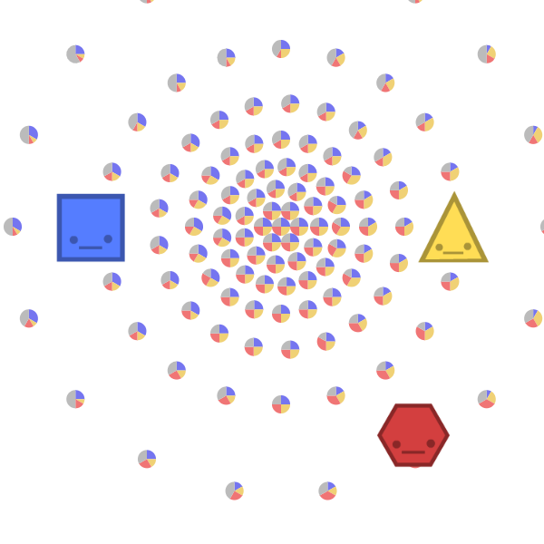
**highest average score wins**
's score: 3.63 out of 5.00
's score: 3.65 out of 5.00
's score: 3.31 out of 5.00

 has the highest score, so...

**TRIANGLE** WINS
reset

As you could see, *every* voting system except First Past The Post is immune to the spoiler effect. So, that's it, right? Ding dong, the glitch is dead? Just pick any other alternative voting system and be done with it?

But, alas. In getting rid of one glitch, some of these alternative voting systems create *other* glitches – for some, the cure is even worse than the disease.

For example, here's a sim of Instant Runoff Voting. In the beginning, Tracy Triangle  is already winning, and you're going to move the voters even *closer* to her. Obviously, if a candidate is already winning an election, and becomes even *more* popular, they should *still* win afterwards, right?

You can probably guess where this is going...

drag the voters   *slowly* up towards :

what voting system?
FPTP
IRV
Borda
Condorcet
Approval
Score

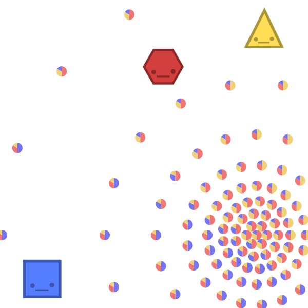
**round 1:**
who's voters' #1 choice?

:44, :41, :47

nobody's more than 50%. eliminate loser, . next round!

**round 2:**
who's voters' #1 choice?
:46, :86
has more than 50%

**HEXAGON** WINS
reset

What happened? Originally,  is eliminated in the first round, sogoes against a weaker , and wins. But when you move the voters closer to , the loser *changes!*So now,  is eliminated in the first round, which means  goes against a stronger , and *loses*.

Under Instant Runoff, it's possible for a winning candidate to lose, *by becoming more popular*. What a glitch!

How often does this actually happen in real life? [There's a couple confirmed examples](https://en.wikipedia.org/wiki/Monotonicity_criterion#Real-life_monotonicity_violations), and [mathematicians estimate this glitch would happen about 14.5% of the time](http://www.rangevoting.org/Monotone.html). But sadly, we can't know for sure, because governments usually *don't release enough info about the ballots* to reconstruct an IRV election & double-check the results.

So, not only is Instant Runoff's glitch as undemocratic as First Past The Post's glitch, it's possibly *worse* – because while FPTP's counting method is simple and transparent, Instant Runoff is anything but. And a lack of transparency is an even deadlier sin nowadays, when our trust in government is already so low.

(But wait! We'll be talking about the risk of *strategic voting* later. Can IRV make a comeback? Stay tuned...)

So much for the most popular alternative. What about the second-most popular, Borda Count? In this next simulation, you move a losing candidate closer to *another* losing candidate. Under FPTP, the spoiler effect would split their votes, making both of them lose even more. But watch what happens under Borda Count instead...

drag  to *just slightly left* of :

what voting system?
FPTP
IRV
Borda
Condorcet
Approval
Score

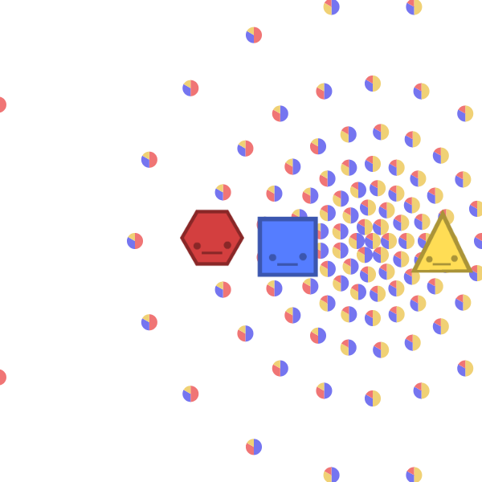
**lower score is better**
's total score: 89
's total score: 101
's total score: 206

has the *lowest* score, so...

**SQUARE** WINS
reset

Yup. Borda Count has a *reverse* spoiler effect. Instead of one good candidate hurting another good candidate by moving closer, with Borda Count, one bad candidate can *help* another bad candidate by moving closer.

Here's what happened: at first, some voters ranked>>, but when you moved  closer to , those voters then *swung* to ranking>>, hurting  enough to make her lose to .

Still, Borda's not the worst, and at least it's simpler and more transparent than Instant Runoff. But how does Condorcet Method compare? When Condorcet picks a winner, it's always the “theoretically best” winner – but that's *when* it picks a winner.

So far, I've just been simulating voters as a *single* group, with a center and some spread. But seeing how polarized politics is nowadays, one could imagine *several* groups of voters, with totally different centers. Now, Condorcet tries to pick the candidate who beats all other candidates in one-on-one races. But with *polarized* voters, you could end up with a Rock-Paper-Scissors-like loop, where a majority of voters prefer A to B, B to C, *and* C to A.

In certain situations, the other voting systems just had glitches. In Condorcet, the voting system *crashes.* Try it out for yourself:

create your own “condorcet cycle”!

move the voters  in such a way that NOBODY wins:

what voting system?
FPTP
IRV
Borda
Condorcet
Approval
Score
how many groups of voters?
one
two
three

**who wins each one-on-one?**
vs :  wins by 58 to 56
vs :  wins by 65 to 49
vs :  wins by 65 to 49

beats all other candidates in one-on-one races.

**HEXAGON** WINS
reset

Now, in actual practice – not that any government actually uses this voting system – when Condorcet fails to find a winner, the election falls back to another method like Borda Count. But if you do that, it'll get the glitches of its backup method. So it goes.

First Past The Post. Instant Runoff. Borda Count. Condorcet Method. Those were all the voting systems that use *ranking* – the ones that our math boy, Kenneth Arrow, proved would *always* be unfair or glitchy in some big way. What about the voting systems that *don't* use ranking, like Approval & Score voting? Well...

...I couldn't come up with a simulation to show their flaws. Because, *in theory*, they don't have many big flaws.

But that's a really, really, really big *“in theory!”*It may be that, in *practice*, strategic voters use Approval & Score Voting exactly like First Past The Post – only approving or giving 5 stars to their top candidate, and disapproving or giving 1 star to all others, even if they actually *like* the others.[(See FairVote's critique of Approval Voting, and defense of Instant Runoff)](http://www.fairvote.org/why-approval-voting-is-unworkable-in-contested-elections)

Then again, even if Approval & Score Voting disincentivize you from expressing an honest *second* choice, FPTP and IRV punish you for expressing an honest *first* choice. Besides, if Approval can be "gamed", then that goes double for IRV.[(See this mathematician's critique of FairVote's critique, and defense of Approval)](http://www.rangevoting.org/LNH.html)So, in the end... [confused shrugging sounds]

We're gonna need a hecka lot more simulations.

So, below is a chart[(source)](https://electology.org/tactical-voting-basics), showing the results of 2.2 *million* simulations. A *huge* variety of scenarios were tested. All-honest voters. All-strategic voters. Half-honest, half-strategic. Voters who know each others' preferences. Voters who *don't* know each others' preferences. Voters who only sorta-know each others' preferences. And so on. You can tell that a *real* mathematician made this chart, because it's makin' my eyes bleed:

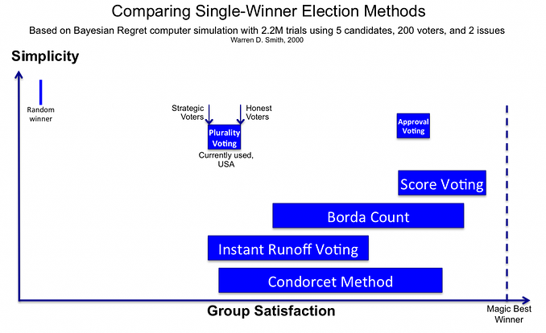

Each voting method's results is shown as an ugly-blue bar. The further to the right a voting method is, the more it "maximizes happiness" for the voters. The higher up a voting method is, the simpler it is. And a bar's width shows the range of a voting system's performance, given different ratios of honest-to-strategic voters.

The first thing to note is that strategic voting makes voters *less happy* than honest voting – in *all* voting systems! I was very surprised when I first learnt that. (But it makes sense, if you think about, say, a crowded room full of people trying to talk. Any one person can be "strategic" by shouting over others, but if *everybody* is "strategic", nobody can hear anybody, and all you're left with is sore throats and sad peeps.)

The other thing to note is which voting systems make people the happiest. If you have mostly honest voters, *Score Voting is best*. (with Borda Count a close second) And if you have mostly strategic voters, then *both Approval & Score Voting are best*. (and with strategic voters, IRV does *just as bad* as FPTP)

However, those are still computer simulations. How would these different voting systems play out *in real life?* Well, we can't just get the DeLorean up to 88, go back in time before the 2016 election, change the voting system, and see what would happen...

*...or can we?!*

No, no we can't. But last month, researchers did something close enough.[A polling study asked 1,000+ U.S. registered voters to rank & rate the six presidential candidates](http://www.vox.com/policy-and-politics/2016/11/25/13733322/instant-runoff-ranked-voting-2016), to simulate who would've won the (popular) vote under different voting systems! (But keep in mind that if we had a different voting system in the primaries, we'd have different candidates *entirely*. So take this study with a pillar of salt.) The results: under Instant Runoff, Condorcet, and Approval Voting, the winner would've been Hillary Clinton. But under Score Voting, the winner would've been Donald Trump. And under Borda Count, the winner would've been... uh... *Gary Johnson?*

*?????*
a guesstimated model of the 2016 US election?...

how Clinton  wins IRV, Trump  wins Score, and Johnson  wins Borda??

what voting system?
FPTP
IRV
Borda
Condorcet
Approval
Score
how many groups of voters?
one
two
three

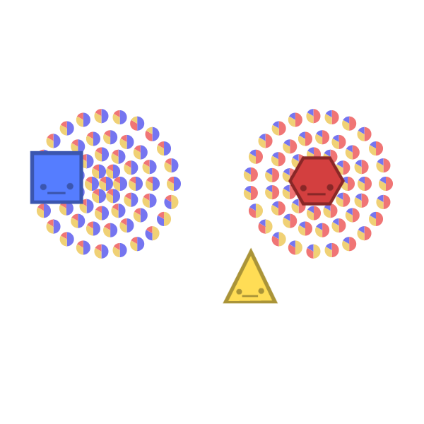
**lower score is better**
's total score: 119
's total score: 110
's total score: 119

has the *lowest* score, so...

**TRIANGLE** WINS
reset
Anyway.

Before we wrap all this up – remember Kenneth Arrow? The infamous mathematician who founded the study of voting systems in the 1950's? Well, [in an interview 60 years later](https://electology.org/podcasts/2012-10-06_kenneth_arrow), Kenneth Arrow had this to say, about which voting method he likes most now:

*“Well, I’m a little inclined to think that score systems* [like Approval & Score Voting] *where you categorize in maybe three or four classes* [so, giving a score out of 3 or 4, not 10 or 100] *probably – in spite of what I said about manipulation* [strategic voting] *– is probably the best.”*

That's as strong an endorsement as you'll ever squeeze out of a math-head.

*ahem*

**(DEAR JUSTIN [“TOTES ADORBZ”](http://www.newyorker.com/wp-content/uploads/2016/03/Borowitz-Justin-Trudeau.jpg) TRUDEAU)**

**(UPDATE: okay, dear everyone else around the world pushing for voting reform)**

Thank you for taking this small but powerful first step! We've known for way too long that our current voting system – First Past The Post – forces voters to be dishonest, creates a polarizing "lesser of two evils" scenario, and screws over both major *and* minor candidates.

However, you're probably only considering Instant Runoff Voting. Which, to be fair, *is* better than than First Past The Post, and if it's a choice between just those two, *definitely* go for Instant Runoff. But IRV still has a glitch as undemocratic as FPTP's – and worse, in our age of distrust, Instant Runoff's lack of transparency may be deadly for democracy. Yes, sure, IRV was the best voting system we could come up with...[in 1870](https://en.wikipedia.org/wiki/History_and_use_of_instant-runoff_voting). And since then, IRV has dominated the conversation, unwittingly framing the whole voting reform debate as “simple vs expressive”.

**But that is a false choice.** Thanks to computer simulations, real-life studies, and a bunch of math nerds,**we now know of voting systems that are both simple *and* expressive.**

*Personally*, I'm leaning towards Score Voting. It's simple, very expressive, and already familiar to anyone who's seen Amazon's or Yelp's “five star” review system. But that's just my humble opinion. You could also make the case that Approval Voting is more *practical*, because it's even simpler, and would *already work with existing voting machines!*All you'd need to do is change the instructions from “vote for the candidate you like” to “vote for the candidate**s** you like”.

*Or maybe I'm completely wrong about Instant Runoff Voting, and it's actually pretty okay.*Heck, you could even go for Borda Count, as a hilarious prank.

I won't claim to know which voting system is The Best™. I shall keep open this discussion, just as long as we *have* this discussion. For three reasons:

1) If I claim one voting system is the best, end of story, all the social-choice-theory nerds will be on my butt, yelling, BUT NICKY WHAT ABOUT [QUADRATIC VOTE BUYING](http://www.law.uchicago.edu/faculty/research/eric-posner-quadratic-vote-buying-efficient-corporate-governance/qanda)

2) We still need to test these alternative voting systems with *actual experience*, not just annoying internet flame wars between IRV advocates and Score Voting advocates theory. All the more reason for small towns, local states, and nations like Canada to be *pioneers*, to bravely experiment!

3) Keeping the discussion going is what democracy *is*.

[A recent study](http://www.journalofdemocracy.org/article/danger-deconsolidation-democratic-disconnect) found that in many Western countries – from Sweden to Australia to the United States – support for democracy has *plummeted* over the last several generations. In 2011, almost *a full quarter* of young Americans said democracy was a "bad" or "very bad" way to run a country. And *today*, one in six Americans say it'd be "good" or "very good" to be under *actual military rule*.

Our age of distrust goes a *lot* deeper than the technical details of a voting system. There isn't gonna be One Weird Trick to fix democracy. But as a first step, a low-hanging fruit, a way to show that, *yes*, you will make the system respond to the needs and wants and pains and hopes and dreams of your people – well, fixing our voting system's a good start as any.

Because, this isn't just about trying to build a better ballot.
This is about trying to build a better *democracy*.
**<3,**
**~ Nicky Case**

* * *

**P.S:** Since you've read & played this all the way, here, have a bonus! A “Sandbox Mode” of the election simulator, with up to *five* candidates. You can also save & share your very own custom election scenario with others. Happy simulating!

# SANDBOX MODE! [(link to *just* this)](https://ncase.me/ballot/sandbox)

what voting system?
FPTP
IRV
Borda
Condorcet
Approval
Score
how many groups of voters?
one
two
three
how many candidates?
two
three
four
five

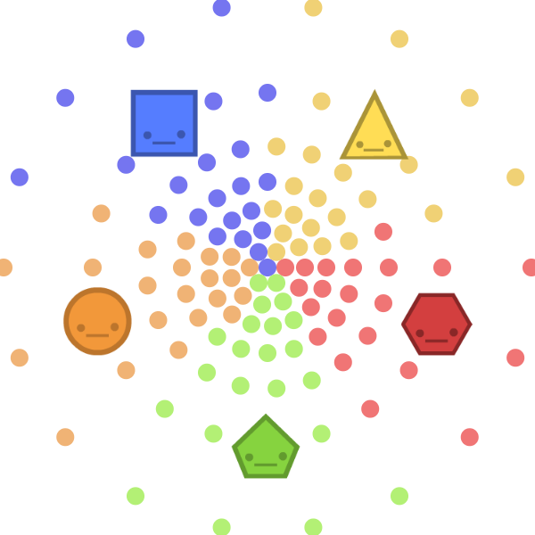
**most votes wins**
got 27 votes
got 27 votes
got 25 votes
got 27 votes
got 26 votes

has most votes, so...

**SQUARE** WINS
reset
save:

One hope for Sandbox Mode is that readers can debate with me and each other *using* this tool! Not just telling me I'm wrong, but *showing* me I'm wrong. For example –[here's a model I made in Sandbox Mode, showing an interesting argument *against* Approval & Score Voting](https://ncase.me/ballot/sandbox?m=%7B%22s%22%3A%22FPTP%22%2C%22v%22%3A%5B%5B54%2C147%5D%2C%5B54%2C72%5D%2C%5B249%2C109%5D%5D%2C%22c%22%3A%5B%5B54%2C227%5D%2C%5B249%2C106%5D%5D%2C%22d%22%3A%22This%20is%20the%20biggest%20challenge%20to%20Approval%2FScore%2C%20IMHO.%20Below%3A%202%2F3%20of%20voters%20dislike%20both%20candidates%2C%20but%20dislike%20Square%20slightly%20less.%20However%2C%201%2F3%20of%20voters%20LOVE%20Triangle%20and%20HATE%20Square.%20Under%20FPTP%2C%20IRV%20%26%20Condorcet%2C%20Square%20wins%2C%20coz%20a%20majority%20of%20voters%20barely%20prefer%20him.%20But%20under%20Approval%20%26%20Score%2C%20Triangle%20wins%2C%20coz%20she%27s%20intensely%20loved%20by%20her%20minority.%20Now%2C%20is%20this%20OKAY%3F%20Is%20this%20a%20betrayal%20of%20democracy%2C%20or%20actually%20*saving*%20democracy%20from%20a%20tyranny%20of%20the%20majority%3F%20This%20question%27s%20not%20just%20theoretical%2C%20it%27s%20*philosophical*.%22%7D). Granted, this tool is very limited – it doesn't handle strategic voting or imperfect information – but I think it's a start, and may help improve our Democratic Discourse™

**PUBLIC DOMAIN**

[Zero rights reserved.](https://creativecommons.org/publicdomain/zero/1.0/)I'm giving away all my art/code/words, so that you teachers, mathematicians, hobbyists, activists, and policy wonks can use them however you like! This is for you.[Get my source code on GitHub!](https://github.com/ncase/ballot)

“BUT WHAT CAN *I* DO?”

**For citizens:** Remember, *think global, but act local*. Change from the bottom-up lasts longer. If you're in the US,[find your representative](http://www.house.gov/representatives/find/)and badger 'em. If you're in Canada,[find your Member of Parliament](http://www.lop.parl.gc.ca/ParlInfo/compilations/houseofcommons/memberbypostalcode.aspx)and badger 'em. Also if you're Canadian,[fill out the MyDemocracy.ca survey before the end of 2016!](https://www.mydemocracy.ca/) This survey has a few questions specifically about voting reform! (sadly, the question is *still* framed as "simple vs expressive".*that* is why i've been so gung-ho about Approval & Score, and maybe a bit too mean towards IRV)

**For learners:**Watch CGP Grey's [*Politics in the Animal Kingdom*](https://www.youtube.com/playlist?list=PL7679C7ACE93A5638) series! It's charming, and covers more ground than I did here – it explains gerrymandering, proportional representation, and more. Also, read [*Gaming The Vote*](https://www.amazon.com/Gaming-Vote-Elections-Arent-About/dp/0809048922) by William Poundstone. It's a thrilling read, with dramatic human stories of crooks & conmen trying to game our glitchy voting systems – and sometimes, succeeding.

**For teachers:**This entire "explorable explanation" is public domain, copyright-free, meaning you *already* have permission to use this freely in your classes! You can even use the [Sandbox Mode](https://ncase.me/ballot/sandbox) to create your own material, or as a tool for students to make something on their own.

**For coders:**This is all open source! So you can [get my code on GitHub](https://github.com/ncase/ballot), and remix it to your heart's content. (sorry in advance for my messy code)

**Check out these organizations:**Though they may differ on what voting system they like best, they all have a common goal: to reform the one we have.[Electology](https://electology.org/) likes Approval Voting most,[FairVote](http://www.fairvote.org/) likes Instant Runoff most, and [RangeVoting.org](http://rangevoting.org/) likes Score Voting most.

ON THE SHOULDERS OF GIANTS
This "explorable explanation" was directly inspired by these two projects:
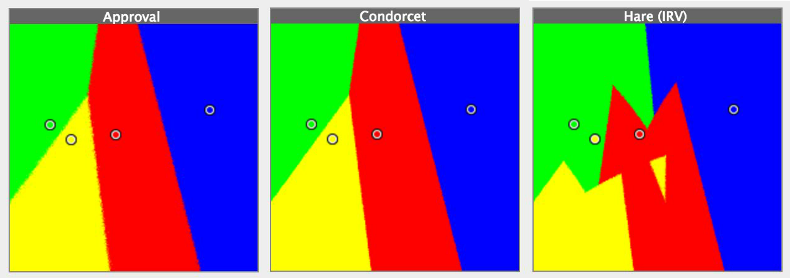

[Voting Sim Visualization](http://zesty.ca/voting/sim/) by Ka-Ping Yee (2005) was a real eye-opener. (hat tip to [Bret Victor](https://twitter.com/worrydream/status/781324328054951936) for sharing it with me!) I've heard lots of written debate over FPTP vs IRV vs Condorcet vs Approval vs blah blah blah, but I'd never seen their difference *visualized* so clearly! It gave me instant insight. And it actually changed my mind – I used to think IRV was pretty good, but after seeing IRV's *messiness* (as shown above), I realized it's actually kinda stinky cheese.

However, even *this* brilliant visualization was still too abstract. And since it wasn't interactive, I couldn't test the many questions & scenarios that came to mind. So that's why my second inspiration was...

[Up and Down the Ladder of Abstraction](http://worrydream.com/LadderOfAbstraction/)by Bret Victor (2011). It's one of the web's earliest "explorable explanations" (also a term Bret coined) and it is *gorgeous*. Obviously, I borrowed the format of mixing words & "games" to explain things, but I also followed the formula of starting concrete – one voter – then moving up to the more abstract – a whole election.

[You can learn more about Explorable Explanations here.](http://explorableexplanations.com/)

And last but not least, thank you to all the math & policy nerds who spent way too much time thinking about all this.

STAY IN TOUCH, MAYBE?

Every once in a while, I'll fall into an endless rabbithole – like this one on voting systems – and slowly crawl my way out, bloodied and bruised, with a new interactive thing for you! If you wanna find out when I finally get around to making new shtuff, you can...

- [Follow me on Twitter](https://twitter.com/ncasenmare)
- [Buy me a hot chocolate via Patreon](https://www.patreon.com/ncase)
- [I also have a mailing list???](http://us11.campaign-archive2.com/home/?u=07d288de26e77b8126d33e2d6&id=5c3178c4cb)

And if you wanna see more of my past projects,[check out my wobsite!](http://ncase.me/)

See you again soon! Have a Happy New Year 2017, or try to, anyway.
A BIG THANKS TO ALL MY
SUPPORTERS

aimee jarboe

frank leon rose

jared cosulich

louis-jean teitelbaum

matt hughes

micah cowan

michael alan huff

natalie sun

noel lehmann

phil dougherty

tom cascio

tom knowles
Adam M. Smith
Alex Dytrych
Andrew
Andy
Artemiy Solopov
Aschelon
ben fei
Benjamin Riggs
Bob Wise
Brandon
Brent Werness
Brian Wu
Bruno Guerrero
Buster Benson
Casey Ross
Charlie McIlwain
Christopher
Colin
Colin
Cort Stratton
Craig Steele
Daniel Horowitz
Daniel Shiffman
Dave Tu
David Smit
Dylan Meconis
Fahrstuhl
Feiya Wang
Forrest Oliphant
Frank Leon Rose
Henry Reich
Iñaki
J. Hu
Jacob Christian Munch-Andersen
Jacques Frechet
James Hogan
Janusz Leidgens
John_Ca
Johnny Owens
Joseph Perry
Joshua Horowitz
Julia Karmo
Karen Cooper
Kat Suricata
Kate Fractal
Kathryn Long
Kevin
Kevin Wang
Klemen Slavic
kuerqing1024
Linda Booth Sweeney
Maic Lopez Saenz
Matt "Kupo" Roszak
Matt Warren
May-Li Khoe
Mekki MacAulay
Micah Cowan
Michael Duke
Michelle Brown
Michelle Kelly
Milan Pingel
Monika Denes
Mustafa Alic
Nick Schrag
Nikita
Noah Swartz
Pablo Lopez Soriano
Pat Mächler
Peter McEvoy
Philip Tibitoski
Piotr Migdal
Rachel Nabors
Raphael D'Amico
Richard Hackathorn
Rob Napier
Roland Tanglao
Ryan Barker
Sam Anderson
Sam Maynard
Samira Nedungadi
Sarah Barbour
sarah mathys
SB Sigma
Seanny123
Serguei Filimonov
Sigpipe
Sylvain Francis
Syria Carys Sirlay
T_Caramel
TisGood
Tony Onodi
Traci Lawson
Yona
Yu-Han Kuo
Zach Smith
Zoe Bogner
AND SPECIAL THANKS TO
Alex Dytrych
Alex Jaffe
Brian Bucklew
Chris Walker
Christine Zhang
Dan Zajdband
Daniel Cook
Droqen
Jason Grinblat
Jessie Salz
Lisa Charlotte Rost
Martin Shelton
Patrick Dubroy
Pietro Passarelli
Sandhya Kambhampati
Tanya Short
sharing is caring!

- [(L)](https://www.facebook.com/sharer/sharer.php?u=http%3A%2F%2Fncase.me%2Fballot%2F&t=To%20Build%20a%20Better%20Ballot)
- [(L)](https://twitter.com/intent/tweet?source=http%3A%2F%2Fncase.me%2Fballot%2F&text=Woah%2C%20check%20out%20this%20interactive%20guide%20to%20alternative%20voting%20systems!%20To%20Build%20a%20Better%20Ballot%3A%20http%3A%2F%2Fncase.me%2Fballot%2F&via=ncasenmare)
- [(L)](https://ncase.me/ballot/mailto:?subject=To%20Build%20a%20Better%20Ballot&body=An%20interactive%20guide%20to%20alternative%20voting%20systems:%20http%3A%2F%2Fncase.me%2Fballot%2F)