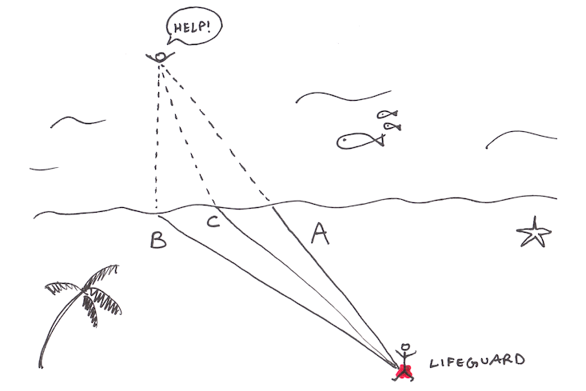
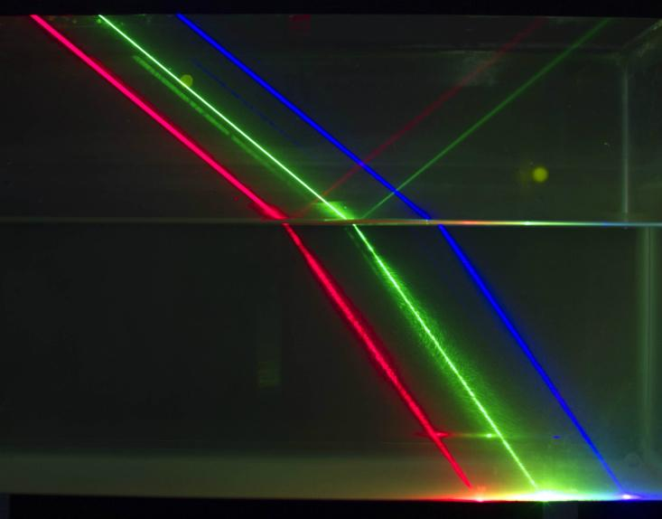
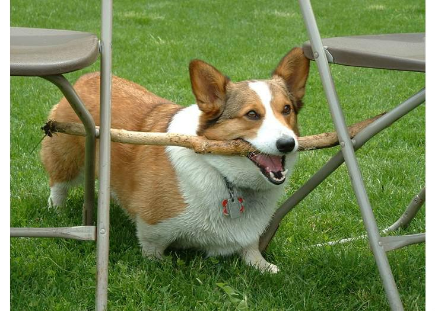

To Save Drowning People, Ask Yourself “What Would Light Do?” - Facts So Romantic - Nautilus

#  To Save Drowning People, Ask Yourself “What Would Light Do?”

Posted By Aatish Bhatia on Jan 09, 2018

Imagine you’re a lifeguard and you see someone struggling to stay afloat. Being a responsible lifeguard, you want to get to them as quickly as possible. You’re pretty fast when swimming, but even faster running on sand. So what’s the quickest route to get to the swimmer? It may not sound like it, but this puzzle, which was laid out by famed physicist Richard Feynman, is actually an analogy for the behavior of light. Although I first read it over 10 years ago, its lesson about how light travels has stuck with me.

Aatish Bhatia

At first thought you might consider whether a straight line (path A) is the fastest path. This is indeed the shortest one, but it isn’t the quickest. You can do better, because if you run further along the beach, you’ll cover more distance on land than in water. And since you’re faster on land, you get there in less time.

So maybe option B is quickest? Of all the choices, this path involves the least swimming. But that’s not right either. Although you’re moving faster now, this route is too long, and it slows you down.

As you can see, there’s a trade-off here. As Feynman puts it, “*the path of least distance has too much water in it; the path of least water has too much land in it; the path of least time is a compromise between the two.*” The quickest route is C—a very specific path that lies somewhere between A and B.

Students of calculus learn to solve these sorts of optimization problems. *But how do lifeguards do it?* Are lifeguards calculating derivatives and solving equations in their heads? I doubt it. I bet that they use some combination of training and sheer instinct, in the same way that a basketball player doesn’t need to understand the laws of projectile motion to make a free throw. Somehow we’re able to approximate solutions to fairly tricky math problems without explicitly doing any math. (It’s even harder to solve in reality, because of added variables like the ocean current.)

You might be wondering what this has to do with light. In 1657 the French lawyer and mathematician Pierre De Fermat (the same guy behind [Fermat’s Last Theorem](http://en.wikipedia.org/wiki/Fermat's_Last_Theorem)) worked out that when light travels from one place to another, it always takes the path of least time. The strange implication is that if a lifeguard needs to get somewhere as fast as possible, she should ask herself what light would do.

Here’s a way to understand this. Say you take a laser pointer and shine it into a bowl of water. The light is now in a similar situation to the lifeguard. When it’s moving through air, it can whiz by incredibly fast, but while it’s in the water, it’s slowed down, because it keeps bumping into water molecules. And do you see what the light does? It bends, just like the lifeguard’s path does when she reaches the water.

*If you shine a laser pointer into a bowl of water, you’ll see that the light bends. The angle by which it bends is provided by Snell’s law.*[Matt Kuchta / CC-BY](http://pascals-puppy.blogspot.com/2011/12/thurs-demo-one-with-frickin-laser-beams.html)

In fact, there’s a formula called Snell’s law that correctly predicts the exact angle by which the light bends, depending on the materials it’s traveling through and the angle at which it hits the surface. This formula works, but it isn’t particularly illuminating (so to speak)—it gives you the right answer, but doesn’t give you a reason *why* the light bends.

But Fermat had a different way of looking at this. He asked, when light travels, out of all the different routes that it could possibly take, what if it chooses the quickest path possible for any given endpoint? *What would that imply?* And when he worked out the consequence of this guess, he found that out pops good old Snell’s law. Fermat’s guess fit *perfectly* with the observed behavior of light.* Here was a sensible explanation to light’s peculiar behavior—a hidden method to its madness.

And it isn’t just about how light bends. Fermat’s principle of least time also explains why light bounces symmetrically off a mirror, why the lenses in our glasses have the shapes that they do, or why dish antennas are parabolic. (You can learn about these neat applications from Feynman himself, [in text](http://www.feynmanlectures.caltech.edu/I_26.html) or [in video](http://vega.org.uk/video/subseries/8).)

If Fermat’s idea sounds a little strange to you, you’re not alone. One of the leading experts on light during Fermat’s time, Claude Clerselier, wrote the following,

Fermat’s principle can not be the cause, for otherwise we would be attributing knowledge to nature: [nature] acts without foreknowledge, without choice, but by a necessary determination.

What bothered everyone about Fermat’s idea is that it seemed to require agency. How could light *choose* a path? How could it possibly *know* which path was the fastest? Does it somehow sniff out the other paths? Fermat didn’t know it at the time, but the answer is yes. Here’s how Feynman [puts it](https://books.google.com/books?id=d76DBQAAQBAJ&pg=PT664&dq=):

The principle of least time is a completely different philosophical principle about the way nature works. Instead of saying it is a causal thing, that when we do one thing, something else happens, and so on, it says this: we set up the situation, and light decides which is the shortest time, or the extreme one, and chooses that path. But what does it do, how does it find out? Does it smell the nearby paths, and check them against each other? The answer is, yes, it does, in a way.

Like light’s bizarre quantum behavior in demonstrations like the [“quantum eraser,”](http://nautil.us/blog/how-to-see-quantum-drops-of-light) this is very difficult to square with our intuitive understanding of how physics works on a human size scale. But experiments, along with the continued usefulness of glasses and parabolic dishes, dependably confirm that light does effectively sniff out and pick the shortest path available.

Recently I came across two stories of animals pulling off the same trick as lifeguards and light—getting from one place to another using the route that takes the least time. How they know to do this is a mystery.

*Elvis may be small, but wait till you see him do calculus.*Tim Pennings

The first creature is a dog, a Welsh corgi called Elvis who lived with a math professor named Tim Pennings. Tim would play with Elvis on the shore of Lake Michigan. He’d throw Elvis’s favorite tennis ball into the water, and Elvis would dart off and fetch it.

During this game of fetch, Tim noticed that Elvis was doing something interesting. When he threw the ball into the water, Elvis didn’t just leap into the surf and swim the whole way. Instead of choosing the direct path, Elvis would typically run along the shore, and then, at a certain point, he’d suddenly turn into the water and swim for the ball.

This raised a question in Tim’s mind: What if Elvis is taking the path of least time? Tim, being a math professor, sat down and used calculus to work out the optimal solution to the tennis-ball problem. Then he decided to test his idea out.

Aatish Bhatia

He spent a day with his dog at Lake Michigan, throwing tennis balls into the water, marking off and measuring the distances that Elvis ran along the shore and how far the ball traveled. After collecting 35 such data points (the x and y values in the figure above, in meters), he plotted them. Along with these data points, he also plotted the optimal trajectory, shown by the straight line below.

And indeed, Elvis did a pretty good job at finding the optimal path—he consistently chose the quickest possible route instead of the shortest one! Keep in mind that the mathematical model had to make many simplifying assumptions—that there are no currents in the water, that Elvis runs and swims at a constant speed without getting tired, that the shore is a straight line, and so on. In reality, it’s possible that Elvis was even quicker than the solution predicted by the model.

[Courtney Gibbons / CC BY-NC-SA 3.0](http://nautil.us/blog/to-save-drowning-people-ask-yourself-what-would-light-do)

Tim was impressed enough by Elvis’s trick to write a [paper](http://www.indiana.edu/~jkkteach/Q550/Pennings2003.pdf) called “Do Dogs Know Calculus?” In it he reassures the reader that “Elvis does not know calculus…In fact,” Tim adds, “he has trouble differentiating even simple polynomials. More seriously, although he does not do the calculations, Elvis’s behavior is an example of the uncanny way in which nature often finds optimal solutions.”

(By the way, Elvis wasn’t the only canine optimizer. In another [paper](http://www.maa.org/sites/default/files/pdf/mathdl/CMJ/cmj37-1-016-018.pdf), two mathematicians corroborated that Salsa, a female Labrador, also chose the path of least time when playing catch along a lake in France. Maybe mathematicians’ dogs adopt some of their owners’ abilities?)

The second creature with this uncanny ability is one of the world’s most invasive species—the [little fire ant](http://en.wikipedia.org/wiki/Electric_ant), or *Wasmannia auropunctata*. Ants help each other navigate by leaving trails of pheromones as they travel, and over time, these trails converge on to a straight line from a food source to their nest. These little guys are natural optimizers, and they can even find the shortest path in a pretty [complex maze](http://jeb.biologists.org/content/214/1/50.abstract).

But no one had really studied what happens when an ant faces the lifeguard dilemma. When it moves from a smooth surface (where it’s fast) to a really sticky one (where it’s slower), does it choose the direct path, or does it choose the path of least time?

So a group of research set out to [test](http://www.plosone.org/article/info:doi/10.1371/journal.pone.0059739) this, using a glass surface and a rough green felt surface, analogous to the sand and the water. They found that the ant trails were far closer to the quickest path than to the direct path. Like light and lifeguards, these ants seemed to minimize time and not distance.

*When these ants travel from smooth glass to rough felt, they travel faster by bending in a manner similar to light.*[Simon Tragust / CC BY 3.0](http://www.plosone.org/article/info:doi/10.1371/journal.pone.0059739)

But how do they do it? Surely they aren’t doing the math? The researchers suggested that perhaps by sheer luck some ants stray on to a faster route, and being more efficient, these routes get reinforced until they become the main route. But no one really knows how these ants solve the lifeguard’s dilemma. It’s still an open question.

Evolution is of course an optimizer, rewarding efficiency with increased representation in the gene pool. Clever and efficient strategies will reap the greatest rewards. Perhaps it shouldn’t surprise us, then, that very different creatures arrive at the same trick through very different means. So the next time you’re stuck in traffic trying to find the fastest way back home, maybe you should take a lesson from ants, dogs, or even light.

**Footnote**

*The modern statement of Fermat’s principle is that light chooses a path such that a small change in path length doesn’t affect the time of travel. In most cases, this reduces to the path of least time. [Feynman’s lecture](http://cms.nautil.us/admin/blog/add#Ch26-S5) has more on this.

For the calculus-inclined reader: The paper above by Perruchet and Gallego devises a clever rule that dogs can follow to optimize their path, without needing any foreknowledge of the entire trajectory. It’s an interesting read. And [here’s a derivation](http://hyperphysics.phy-astr.gsu.edu/hbase/phyopt/fermat.html) of how you can get to Snell’s law and the law of reflection from Fermat’s principle.

**References**

Feynman, Richard Phillips. [*QED: The strange theory of light and matter*](http://press.princeton.edu/titles/8169.html). Princeton University Press, 2006.

Pennings, Timothy J. “[Do dogs know calculus?](http://www.indiana.edu/~jkkteach/Q550/Pennings2003.pdf)” *College Mathematics Journal* 34.3 (2003): 178-182.

Perruchet, Pierre, and Jorge Gallego. “[Do Dogs Know Related Rates Rather than Optimization?](http://www.maa.org/sites/default/files/pdf/mathdl/CMJ/cmj37-1-016-018.pdf)” *The College Mathematics Journal* 37 (2006): 1.

Oettler, Jan, et al. “[Fermat’s Principle of Least Time Predicts Refraction of Ant Trails at Substrate Borders.](http://www.plosone.org/article/info:doi/10.1371/journal.pone.0059739)” *PloS One* 8.3 (2013): e59739.

The chapter on [The Principle of Least Time](http://www.feynmanlectures.caltech.edu/I_26.html) from the Feynman Lectures, which are now [freely available online](http://www.feynmanlectures.caltech.edu/).

*Aatish Bhatia is a recent physics Ph.D. [working at Princeton University](http://www.princeton.edu/cst/) to bring science and engineering to a wider audience. He writes the award-winning science blog [Empirical Zeal](http://www.wired.com/wiredscience/empiricalzeal/) and is on Twitter as @[aatishb](https://twitter.com/aatishb).*

Get the Nautilus newsletter
The newest and most popular articles delivered right to your inbox!

- **New Chapters**   Thursdays
- **Editor's Picks**   Sundays

**WATCH: The blackhole finding Stephen Hawking is famous for was discovered by Richard Feynman a year before on a blackboard.**

**Alan Lightman:** undefinedundefined

*This classic Facts So Romantic post was originally published in March 2014.*