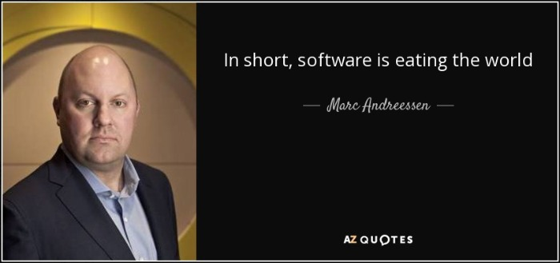
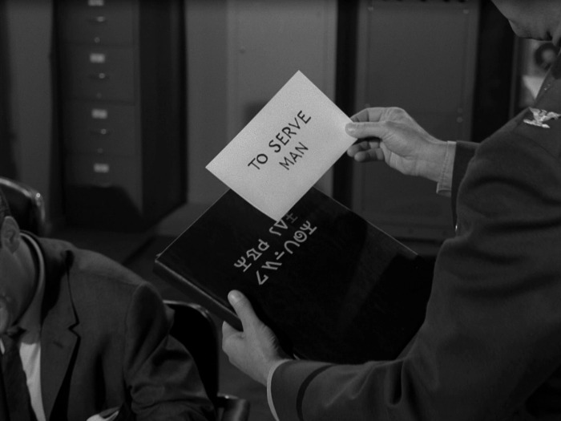
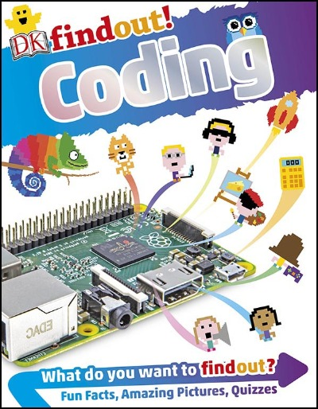
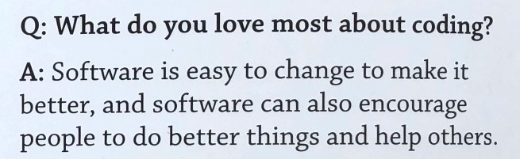

To Serve Man, with Software

31 Dec 2017

# To Serve Man, with Software

I didn't choose to be a programmer. Somehow, it seemed, [the computers chose me](https://blog.codinghorror.com/if-loving-computers-is-wrong-i-dont-want-to-be-right/). For a long time, that was fine, that was enough; that was all I needed. But along the way I never felt that being a programmer was this [unambiguously great-for-everyone](https://blog.codinghorror.com/please-dont-learn-to-code/) career field with zero downsides. There are absolutely occupational hazards of being a programmer, and [one of my favorite programming quotes](https://blog.codinghorror.com/your-favorite-programming-quote/) is an allusion to one of them:

> It should be noted that no ethically-trained software engineer would ever consent to write a `DestroyBaghdad`>  procedure. Basic professional ethics would instead require him to write a `DestroyCity`>  procedure, to which Baghdad could be given as a parameter.

Which reminds me of [another joke that people were telling in 2015](https://waxy.org/2015/12/tracking_the_trump_is_a_comment_section_running_for_president_joke/):

> Donald Trump is basically a comment section running for president

Which is troubling because technically, *technically*, I run a company that [builds comment sections](https://discourse.org/).

Here at the tail end of 2017, from where I sit neither of these jokes seem particularly funny to me any more. Perhaps I have lost the capacity to feel joy as a human being? *Haha just kidding!*  *... kinda.*

Remember [in 2011](https://www.wsj.com/articles/SB10001424053111903480904576512250915629460) when Marc Andreeseen said that "Software is eating the world?"

That used to sound all hip and cool and inspirational, like "Wow! We software developers really *are* making a difference in the world!" and now for the life of me I can't read it as anything other than an ominous warning that we just weren't smart enough to translate properly at the time. But [maybe now we are](https://en.wikipedia.org/wiki/To_Serve_Man_(The_Twilight_Zone)).

)

I've said many, many times that the key to becoming an experienced software developer is to understand that you are, at all times, [your own worst enemy](https://blog.codinghorror.com/on-the-meaning-of-coding-horror/). I don't mean this in a negative way – you have to constantly plan for and design around your inevitable human mistakes and fallibility. It's fundamental to good software engineering because, well, we're all human. The good-slash-bad news is that you're only [*accidentally* out to get yourself](https://blog.codinghorror.com/the-trap-you-set-for-yourself/). But what happens when we're infinitely connected and software is suddenly *everywhere*, in everyone's pockets every moment of the day, starting to approximate a natural extension of our bodies? All of a sudden those little collective social software accidents become [considerably more dangerous](https://www.wired.com/story/the-other-tech-bubble/):

> The issue is bigger than any single scandal, I told him. As headlines have exposed the troubling inner workings of company after company, startup culture no longer feels like fodder for gentle parodies about ping pong and hoodies. It feels ugly and rotten. Facebook, the greatest startup success story of this era, isn’t a merry band of hackers building cutesy tools that allow you to digitally Poke your friends. It’s a powerful and potentially sinister collector of personal data, a propaganda partner to government censors, and an enabler of discriminatory advertising.

I'm reminded of a particular Mitchell and Webb skit: *"Are we the baddies?"*

[Mitchell and Webb Nazis are Bad](https://www.youtube.com/watch?v=qv2XGQBcvxQ)

[  The New Fuhrer  Karl Kroenen • 1.8M views  3:18](https://www.youtube.com/watch?v=pje5ROe5Y_w)[  Mitchell and Webb - Casino Royale  Jonathan Graehl • 1.3M views  5:47](https://www.youtube.com/watch?v=5cazkHAHiPU)[  That Mitchell and Webb Look - Evil Genius  myLastTears • 1.7M views  7:14](https://www.youtube.com/watch?v=VgX6JFoV0TM)[  Mitchell and Webb - Kill The Poor  Dvdmitch • 2.6M views  2:40](https://www.youtube.com/watch?v=owI7DOeO_yg)[  That Mitchell and Webb Look - Discoverer  myLastTears • 1M views  3:45](https://www.youtube.com/watch?v=dOBhf8f7cXM)[  Mitchell And Webb - KKK  Dvdmitch • 995K views  3:08](https://www.youtube.com/watch?v=1cCiuZanl_4)[  Mitchell and Webb's Kitchen Nightmares  mrcoggy • 2.1M views  2:43](https://www.youtube.com/watch?v=i1NfWIaYed8)[  Mitchell and Webb's Rants on Smoking, Coffee and Nudists - The Graham Norton Show Preview - BBC One  BBC • 3.2M views  5:51](https://www.youtube.com/watch?v=iX0TjGEBITg)[  Daryl turns out to be a racist - Peep Show  Peep Show • 777K views  1:28](https://www.youtube.com/watch?v=PiLVAz-Jczg)[  That Mitchell and Webb Look - Grammar Nazi  Dvdmitch • 350K views  2:16](https://www.youtube.com/watch?v=qmVnr7rsWrE)[  That Mitchell & Webb Look - The small office - Sexual Harassment  fanvideos4u • 737K views  2:24](https://www.youtube.com/watch?v=2NNlUrUu2eY)

0:56 / 2:49
[(L)](https://www.youtube.com/watch?v=qv2XGQBcvxQ)

On the topic of unanticipated downsides to technology, there is no show more essential than [Black Mirror](https://www.netflix.com/title/70264888). If you haven't watched Black Mirror yet, do not pass go, do not collect $200, go immediately to Netflix and watch it. Go on! Go ahead!

[Black Mirror - Season 3 | Official Trailer [HD] | Netflix](https://www.youtube.com/watch?v=jDiYGjp5iFg)

[ 5 Most Powerful Moments In Black MirrorBrainPilot • 1.1M views5:45](https://www.youtube.com/watch?v=BUrZy0aNuy0)[ Black Mirror - Season 4 | Official Trailer [HD] | NetflixNetflix • 1.3M views2:01](https://www.youtube.com/watch?v=5ELQ6u_5YYM)[ "Black Mirror" Gave Bryce Dallas Howard A Nervous Breakdown - CONAN on TBSTeam Coco • 759K views4:37](https://www.youtube.com/watch?v=UrHSyHgDyR4)[ 10 Massively Underrated Movies From The 2000sWhatCulture • 2.9M views8:10](https://www.youtube.com/watch?v=SpCRMNvqLD0)[ Cameron Diaz Defends Pubic Hair - The Graham Norton ShowThe Graham Norton Show • 6M views9:02](https://www.youtube.com/watch?v=kXhk8zE_Ac0)[ Top 10 Black Mirror EpisodesWatchMojoUK • 146K views8:38](https://www.youtube.com/watch?v=EJuFk3Be_1Q)

2:08 / 2:08
[(L)](https://www.youtube.com/watch?v=jDiYGjp5iFg)

> ⚠ Fair warning: please DO NOT start with season 1 episode 1 of Black Mirror! Start with season 3, and go forward. If you like those, dip into season 2 and the just-released season 4, then the rest. But humor me and please at least watch the first episode of season 3.

The technology described in Black Mirror can be fanciful at times, but several episodes portray disturbingly plausible scenarios with *today's* science and tech, much less what we'll have 20 to 50 years from now. These are very real cautionary tales, and some of this stuff is well on its way toward being realized.

Programmers don't think of themselves as people with the power to change the world. Most programmers I know, including myself, grew up as nerds, geeks, social outcasts. Did I ever tell you about the time I wrote a self-destructing Apple // boot disk program to let a girl in middle school know that I liked her? I was (and still am) a terrible programmer, but oh man did I ever test the heck out of *that* code before copying on to her school floppy disc. But I digress. What do you do when you wake up one day and software *has* kind of eaten the world, and **it is no longer clear if software is in fact an unambiguously good thing, like we thought, like everyone told us … like we *wanted it to be?***

Months ago I submitted a brief interview for a [children's book about coding](https://www.amazon.com/dp/1465462333/?tag=codihorr-20).

I recently recieved a complimentary copy of the book in the mail. I paged to [my short interview](https://blog.codinghorror.com/content/images/2017/12/dk-findout-coding-page-50.jpg), alongside the very cool [Kiki Prottsman](http://www.prottsman.com/). I had no real recollection of the interview questions after the months of lead time it takes to print a physical book, but reading the printed page, I suddenly hit myself over the head with the very answer I had been searching my soul for these past 6 months:

In attempting to simplify my answers for an audience of kids, I had concisely articulated the one thing that keeps me coming back to software: **to serve man**. Not on a platter, for bullshit monetization – but software that [helps people](https://blog.codinghorror.com/the-just-in-time-theory/) be the best version of themselves.

[Lady Bird | Official Trailer HD | A24](https://www.youtube.com/watch?v=cNi_HC839Wo)

[  I, TONYA Red Band Trailer (2017)  KinoCheck International • 306K views  2:36](https://www.youtube.com/watch?v=IeSRarmo2dc)[  Cameron Diaz Defends Pubic Hair - The Graham Norton Show  The Graham Norton Show • 6M views  9:02](https://www.youtube.com/watch?v=kXhk8zE_Ac0)[  Saoirse Ronan Tries To Teach Stephen An Irish Accent  The Late Show with Stephen Colbert • 5.5M views  3:45](https://www.youtube.com/watch?v=Hwstj9FJHGg)[  Friends: The Movie (2018 Trailer)  VJ4rawr2 • 37M views  2:33](https://www.youtube.com/watch?v=V5hOm8_3mJA)[  The Graham Norton Show - Saoirse Ronan, Richard Gere, John Malkovich,Taylor Swift [FULL]  iheartsaoirseorg • 1.4M views  44:25](https://www.youtube.com/watch?v=Q24wwFVeD-0)[  The Only Living Boy in New York Trailer #1 (2017) | Movieclips Trailers  Movieclips Trailers • 5.7M views  2:26](https://www.youtube.com/watch?v=qwLphqOs4vA)[  Saoirse Ronan and Greta Gerwig chat 'emotional truth' of 'Lady Bird' and Oscar buzz  GoldDerby • 240K views  7:18](https://www.youtube.com/watch?v=Phpd1gDQhUQ)[  Dismissed (2017) | Official Trailer HD  The Orchard Movies • 2.2M views  1:46](https://www.youtube.com/watch?v=8za6hJfAulk)[  A Pronunciation Guide for Saoirse Ronan & Melissa Benoist  The Late Late Show with James Corden • 3.8M views  1:59](https://www.youtube.com/watch?v=oifRCyBnPHU)[  Saoirse Ronan Had to Drink Before Watching Lady Bird for the First Time  Late Night with Seth Meyers • 664K views  6:08](https://www.youtube.com/watch?v=BIPpvsf98wI)[  The Delightful Saoirse Ronan  TheEllenShow • 2.1M views  3:29](https://www.youtube.com/watch?v=2lMBx3LbcOQ)[  The Unreasonable Efficiency of Black Holes  minutephysics • 306K views  6:22](https://www.youtube.com/watch?v=t-O-Qdh7VvQ)

1:59 / 2:33
[(L)](https://www.youtube.com/watch?v=cNi_HC839Wo)

And you know why I do it? I need that help, too. I get tired, angry, upset, emotional, cranky, irritable, frustrated and I need to be reminded from time to time to choose to be the better version of myself. I don't always succeed. But *I want to*. And I believe everyone else – for some reasonable statistical value of everyone else – fundamentally does, too.

That was the not-so-secret design philosophy behind Stack Overflow, that **by helping others become better programmers, you too would become a better programmer**. It's unavoidable. And, even better, if we leave enough helpful breadcrumbs behind for those that follow us, *we collectively advance the whole of programming for everyone*.

I apologize for not blogging much in 2017. I've certainly been busy with Discourse which is actually going great; we grew to 21 people and [gave $55,000 back](https://blog.discourse.org/2017/12/discourse-gives-back-2017/) this year to the open source ecosystem we build on. But that's no excuse. The truth is that it's been hard to write because this has been a deeply troubling year in so many dimensions — for men, for tech, for American democracy. I'm ashamed of much that happened, and I think one of the first and most important steps we can take is to [embrace explicit codes of conduct](https://blog.codinghorror.com/the-hugging-will-continue-until-morale-improves/) throughout our industry. I also continue to believe, if we start to think more holistically about what our software can do to **serve all people**, not just ourselves personally (or, even worse, the company we work for) — that software can and should be part of the solution.

I tried to amplify on these thoughts in recent podcasts:

|     |     |
| --- | --- |
|  |  [Community Engineering Report](http://www.kimcrayton.com/commengreport-jeff-atwood/) with Kim Crayton |
|  |  [Developer on Fire](http://developeronfire.com/podcast/episode-258-jeff-atwood-sharing-the-house) with Dave Rael |
|  |  [Dorm Room Tycoon](https://drt.fm/jeff-atwood) with William Channer |

Software is easy to change, but people ... aren't. So in the new year, as software developers, let's make a resolution to focus on the part we *can* change, and keep asking ourselves one very important question: **how can our software help people become the best version of themselves?**

Previous

### [The Existential Terror of Battle Royale](https://blog.codinghorror.com/the-existential-terror-of-battle-royale/)

#### Written by Jeff Atwood

Indoor enthusiast. Co-founder of Stack Overflow and Discourse. Disclaimer: I have no idea what I'm talking about. Find me here: http://twitter.com/codinghorror