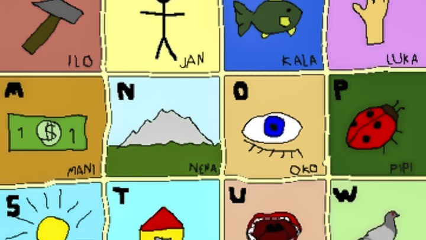
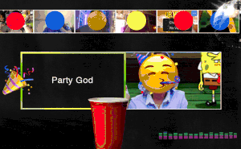

Toki Pona: A Language With a Hundred Words - The Atlantic

 [Technology](https://www.theatlantic.com/technology/)

# How to Say (Almost) Everything in a Hundred-Word Language

Those who speak Toki Pona say linguistic simplicity can enable a more profound form of communication.

[Roc Morin](https://www.theatlantic.com/author/roc-morin/)
  July 15, 2015

Jan Nikita / Wikimedia

In Chinese, the word *computer* translates directly as *electric brain*.

In Icelandic, a *compass* is a *direction-shower*, and a *microscope* a *small-watcher*.

In Lakota, *horse* is literally *dog of wonder*.

These neologisms demonstrate the cumulative quality of language, in which we use the known to describe the unknown.

“It is by metaphor that language grows,” writes the psychologist Julian Jaynes. “The common reply to the question ‘What is it?’ is, when the reply is difficult or the experience unique, ‘Well, it is like —.’”

Sign up for The Atlantic’s daily newsletter.

Each weekday evening, get an overview of the day’s biggest news, along with fascinating ideas, images, and voices.

 Email Address (required)

 

Thanks for signing up!

That metaphorical process is at the heart of[Toki Pona](http://tokipona.org/), the world’s smallest language. While the Oxford English Dictionary contains a quarter of a million entries, and even Koko the gorilla communicates with over 1,000 gestures in American Sign Language, the total vocabulary of Toki Pona is a mere 123 words. Yet, as the creator Sonja Lang and many other Toki Pona speakers insist, it is enough to express almost any idea. This economy of form is accomplished by reducing symbolic thought to its most basic elements, merging related concepts, and having single words perform multiple functions of speech.

In contrast to the hundreds or thousands of study hours required to attain fluency in other languages, a general consensus among Toki Pona speakers is that it takes about 30 hours to master. That ease of acquisition, many of them believe, makes it an ideal international auxiliary language—the realization of an ancient dream to return humanity to a pre-Babel unity. Toki Pona serves that function already for hundreds of enthusiasts connected via online communities in countries as diverse as Japan, Belgium, New Zealand, and Argentina.

## More Stories

-

 

###   [What Would a World Without Language Barriers Look Like?](https://www.theatlantic.com/business/archive/2015/04/what-would-a-world-without-language-barriers-look-like/390081/)

-

 [(L)](https://www.theatlantic.com/international/archive/2014/07/learning-forgetting-and-remembering-your-first-language/374906/)

###   [Forgetting and Remembering Your First Language](https://www.theatlantic.com/international/archive/2014/07/learning-forgetting-and-remembering-your-first-language/374906/)

-

 

###   [There’s No Zoom Party Like a College Zoom Party](https://www.theatlantic.com/family/archive/2020/03/zoom-college-party-memes-page-dating-ok-zoomer/608617/)

 [Kaitlyn Tiffany](https://www.theatlantic.com/author/kaitlyn-tiffany/)

In addition to making Toki Pona simple to learn, the language’s minimalist approach is also designed to change how its speakers think. The paucity of terms provokes a kind of creative circumlocution that requires careful attention to detail. An avoidance of set phrases keeps the process fluid. The result, according to Lang, is to immerse the speaker in the moment, in a state reminiscent of what Zen Buddhists call mindfulness.

“What is a car?” Lang mused recently via phone from her home in Toronto.

“You might say that a car is a space that's used for movement,” she proposed. “That would be *tomo tawa*. If you’re struck by a car though, it might be a hard object that’s hitting me. That’s *kiwen utala*.”

The real question is: What is a car to you?
As with most things in Toki Pona, the answer is relative.

“We wear many hats in life,” Lang continued, “One moment I might be a sister, the next moment a worker, or a writer. Things change and we have to adapt.”

The language’s dependence on subjectivity and context is also an exercise in perspective-taking. “You have to consider your interlocutor’s way of understanding the world, or situation,” the Polish citizen Marta Krzeminska stated. “For that reason, I think it has great potential for bringing people together.”

To create her new language, Lang worked backwards—against the trend of a natural lexicon. She began by reducing and consolidating the specific into the general.

“I think colors are a good example,” she offered. “You have millions of shades that are slightly different from one another, and at some point someone says, ‘Well, from here to here is blue, and from here to here is green.’ There are these arbitrary lines that people agree on.”

Toki Pona has a five-color palette: *loje* (red), *laso* (blue), *jelo* (yellow), *pimeja* (black), and *walo* (white). Like a painter, the speaker can combine them to achieve any hue on the spectrum. *Loje walo* for pink. *Laso jelo* for green.

Numbers are also minimal. Lang initially only had words for one (*wan*), two (*tu*), and several (*mute*). Many Toki Pona speakers have expanded the word *luka* (*hand* or *arm*) to mean *five*, and *mute* to mean *10*. The terms are repeated additively until the desired number is reached.

“There are some mathematician-like people who insist that they want to be able to say 7,422.7,” Lang laughed. “I say, ‘That's not exactly the point.’”

The point is simplicity. And in Toki Pona, *simple* is literally *good*. Both concepts are combined in a single word: *pona*.

“If you can express yourself in a simple way,” Lang explained, “then you really understand what you're talking about, and that's good. If something is too complicated, that's bad. You’re putting too much noise into the equation. That belief is kind of hardwired into the language.”

The polyglot Christopher Huff agreed, noting that Toki Pona had made him more honest. “I’m more comfortable now with the things I don’t know.”

“I didn’t realize how complex other languages are until I started speaking Toki Pona,” Krzeminska added. “There are so many different things you have to say before you actually get to say what you want, and there are so many things you're not allowed to say even though you mean them. Take politeness markers for instance: *If it’s not too much of an inconvenience, would you please consider possibly bringing me a cup of coffee?* In Toki Pona you would just say: *Give me coffee.* Either do it or don’t do it. There’s no word for *please* or *thank you*. I mean, maybe if you really wanted, you could say *pona*, but then why would you overuse a word that’s so big and powerful?”

Ultimately though, as many Toki Pona users discover, powerful cultural conventions are not so easily discarded. Speakers are often quick to find clever substitutes, especially in the realm of the non-verbal. "I definitely find myself relying more on body language," Krzeminska admitted. "We're so used to saying please and thank you that we tend to do a little Japanese-style nod now instead. It's so weird not to say anything at all."

Despite compromises in etiquette, Toki Pona still manages to convey a culture of its own. Through omission and inclusion, the vocabulary itself is rooted in the basic material of life. “I was inspired by hunter-gatherers,” Lang noted. “I thought, what would it have been like to just be a person in nature, interacting with things in a primitive way?”

Accordingly, there are several words denoting different living organisms, and none for specific modern technologies. All technology is essentially subsumed by the general term for tool (*ilo*) and augmented, if desired, by other words describing distinct functions. Addressing this choice, Huff spoke of a divide in the Toki Pona community. “There is one spirit that says Toki Pona is able to talk about these things, so we should talk about these things. There is another spirit that says maybe there are things we just don’t need to talk about.”

Along with the previously noted biases, the lexicon also exhibits an acknowledged propensity for positivity. Krzeminska, who speaks the language with her best friend, noted that they tend to slip into Toki Pona for pleasant conversations. “That's one of Sonja's principles. It's a language for cute and nice things. It’s also great for talking about feelings. There are limited concepts, so one word can mean everything. The word pona is everything that's good in the world: pineapples, bananas, cute kittens. If I call my friend a *jan pona*, I’m calling him a good person. Often, if we’re both tired and everything is too much, we just say, everything will be *pona*. You’re a beautiful person, and everything is beautiful, and everything will be beautiful. And then, everything is better.”

For a different perspective, I spoke with John Quijada, the creator of[Ithkuil](http://www.ithkuil.net/). The former DMV employee spent three decades perfecting what he calls, “an idealized language whose aim is the highest possible degree of logic, efficiency, detail, and accuracy in cognitive expression.” By combining 58 phonemes within an exacting grammatical framework, Ithkuil is designed to precisely express all possible human thoughts. It is so complex that even its creator often requires 10 minutes or more to assemble a single word.

*Aistlaţervièllîmļ*, for example, is the term for “a situation where one lets a normally unavailable opportunity pass by because it is not seen as being the optimal instance or form of that opportunity, despite the likelihood that such an optimal instance/form of the opportunity will likely never come (e.g., letting a bottle of expensive wine go past its prime because one can never decide when would be the optimal time to drink it; or letting slip by an opportunity for true love because one hopes someone even ‘better’ may come along.)”

One student of the language claimed that it allowed her to “see things that exist but don’t have names, in the same way that Mendeleyev’s periodic table showed gaps where we knew elements should be that had yet to be discovered.” Tweak a single phoneme and arrive at a strange new variation of a thought. Tweak by tweak, a speaker could wander forever through an endless landscape of unique thoughts in a kind of linguistic dérive.

I was curious about what a man who had dedicated his life to accuracy thought about a language in which a word for floor (*anpa*) also means *defeat*, and the noun for head (*lawa*) is also the verb for *control*.

“I've always been so fascinated by ambiguity,” Quijada admitted. “I have a great deal of respect for it. That’s one of the reasons why I tried to defeat it—to see if it could be defeated.”

As for the disparity between Toki Pona and Ithkuil, the music-lover was predictably succinct. “It’s the difference between John Cage’s *4’33”* and a Beethoven symphony.”

**We want to hear what you think about this article. [Submit a letter](https://www.theatlantic.com/contact/letters/) to the editor or write to letters@theatlantic.com.**

 [Roc Morin](https://www.theatlantic.com/author/roc-morin/) is a journalist based in San Francisco and the curator of the [World Dream Atlas](https://www.facebook.com/worlddreamatlas).