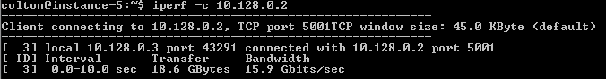
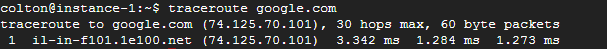

Tools to profile networking performance – Colt McAnlis – Medium

# Tools to profile networking performance

After doing #perfmatters for the past 6 years, I’ve noticed that performance-based-worries tend to come and go in batches. For example, having 5 seperate companies all reach out in reference to startup performance is pretty common; Once we’ve got some good docs, articles, videos, and samples out on the topic, people don’t need to reach out any longer, they can just consume that content.

So, once the “startup performance” discussion started to subside, I ended up getting a handful of pings from developers who were really caring about *network performance* on [Google Cloud Platform](https://cloud.google.com/).

To recap, there’s a high probability that Google has some of the the best networking technology on the planet. The internally-developed [Jupiter](http://conferences.sigcomm.org/sigcomm/2015/pdf/papers/p183.pdf)Stack is exposed to public cloud customers through the cloud API. And the [Andromeda network virtualization stack](http://googlecloudplatform.blogspot.com/2014/04/enter-andromeda-zone-google-cloud-platforms-latest-networking-stack.html) that rides atop Google’s network fabric and exposes network functionality to customers using its Google Compute Platform public cloud. All riding on top of the hordes of [datacenters and intercontinental cables](https://cloud.google.com/about/locations/) that connect it all. And let’s not forget that Google [peers its egress traffic](https://peering.google.com/#/) directly with a number of companies (including [Cloudflare](https://www.cloudflare.com/)) which creates performance benefits and has significantly decreased the cost of our traffic egress.

Combined together, you get an amazingly fast, global network that can do some impressive things. Now, before I start digging into the specific problems each of these companies was running into, we should do the due diligence here.

Too busy to read? Check out the TL;DR video above!

### Tools of the trade

If Google has one of the fastest networks, we should be able to prove it using hard science and tooling systems. Thankful, networking performance is something that people have been worried about for a long time, so there’s a handful of useful tools we can leverage to get the data we need. Below are a few of the better / easier to use ones that I tend to rely on for this work.

### 1. IPerf

[Iperf](https://en.wikipedia.org/wiki/Iperf)is a commonly used network testing tool that can create TCP/UDP data streams and measure the throughput of a network that is carrying them. It allows the user to set various parameters that can be used for testing a network, or alternatively for optimizing or tuning a network. Iperf has a [client](https://en.wikipedia.org/wiki/Client_%28computing%29) and [server](https://en.wikipedia.org/wiki/Server_%28computing%29) functionality, and can measure the throughput between the two ends, either unidirectionally or bidirectionally. What we get as an output from IPerf is a time-stamped report of the amount of data transferred and the throughput measured.

Most of these network testing tools tend to work on specific ports, as to not interfere with your production-running code. As such, to run these tests in Google Cloud, we need to first create a custom firewall rule that allows these ports to be exposed.

Below, you can see a screen-grab of that process. Most of it is pretty normal, except two things which i’ll point out:

Firstly, is that we’re specifying port 5001 to be opened up, which is what IPerf uses by default.

Secondly, we’re creating a “Target Tag” for this firewall rule (I set it to “iperftest”), and only allowing it to apply to machines which are created, using that specific tag.

This means the firewall rule won’t be applied to an instance, unless it’s created with this explicit tag bound to it. This is very useful, as we might want to not expose ports on our production systems that we only use for testing.

Getting IPerf working is [somewhat straightforward](https://www.linode.com/docs/networking/diagnostics/diagnosing-network-speed-with-iperf):

- •Create two VMs (with the above tag)
- •Run `iperf -s` on one
- •Run `iperf -c <target ip>` on the other.

And you’ll get something that looks like this:

It’s also worth noting that iPerf is used by the [PerfKitBenchmark](https://github.com/GoogleCloudPlatform/PerfKitBenchmarker)suite to test performance and benchmark the various cloud providers to each other.

### 2. Using netperf

[Netperf](http://www.netperf.org/netperf/)is also another good network testing tool, which is also used by the [PerfKitBenchmark](https://github.com/GoogleCloudPlatform/PerfKitBenchmarker)suite to test performance and benchmark the various cloud providers to each other.

To run this on GCP, you have to follow the same firewall rules as we did for IPerf (but with port 12865 this time), but also note that there is some discrepancy of availability of netperf, depending on what linux distro you are using. I found that you could use Ubuntu TLS 14, and run *`sudo apt-get update`* and `*sudo apt-get install netperf` *on each instance. Once installed, *netserver* will be run automagically, so you simply need to pick one machine, and invoke `*netperf -H <other box IP>`* To be able to get something like this:

### 3. Using traceroute

[traceroute](https://en.wikipedia.org/wiki/Traceroute)is a computer network diagnostic tool for measuring and displaying the route of packets across a network. The history of the route is recorded as the round-trip times of the packets received from each successive host in the route; the sum of the mean times in each [hop](https://en.wikipedia.org/wiki/Hop_%28networking%29) is a measure of the total time spent to establish the connection. Traceroute proceeds unless all (three) sent packets are lost more than twice, then the connection is lost and the route cannot be evaluated. [Ping](https://en.wikipedia.org/wiki/Ping_%28networking_utility%29), on the other hand, only computes the final round-trip times from the destination point.

If you’d like to see this for yourself, run *traceroute* to test your own ISP. My results (below) show that the first hop to our ISP is significantly slow given our distance from service:

Meanwhile, check out the distance between a VM running on GCE, and Google.com; Much less hops ;)

### 4. Perf Kit Benchmark

Now, it is worth noting that Google does has some official documentation on [measuring network throughput](https://cloud.google.com/compute/docs/networking#measurenetworkthroughput). Which relies on the testing suite and harnesses of [PerfKitBenchMarker](https://github.com/GoogleCloudPlatform/PerfKitBenchmarker) to measure the egress throughput performance of your instances.

What’s really important about PKB, is that it’s done the due-diligence to set up the testing harness correctly, and make sure there hasn’t been any inserted error into the tests that might cloud the results. Otherwise, it’s mostly using Iperf and Netperf for its testing.

### Let’s help some developers!

Now that we’ve covered some tools, we can dig into the problems that our new batch of developers are having. I encourage you to test these tools on your own networks, and see what you come up with!