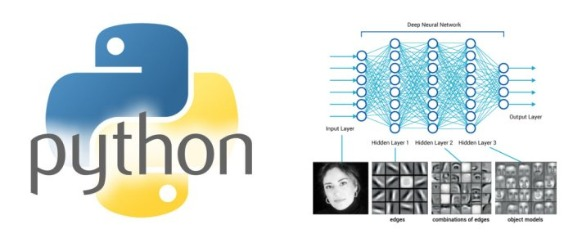

Top 10 Videos on Deep Learning in Python

# Top 10 Videos on Deep Learning in Python

[  **Previous post**](https://www.kdnuggets.com/2017/11/stop-doing-fragile-research.html)

[**Next post**  ](https://www.kdnuggets.com/2017/11/generative-adversarial-networks-part2.html)

[

[**504**inShare](https://s7.addthis.com/static/linkedin.html#)]()[

[(L)](https://plus.google.com/share?app=110&url=https%3A%2F%2Fwww.kdnuggets.com%2F2017%2F11%2Ftop-10-videos-deep-learning-python.html)]()[[Share]()[226](https://www.kdnuggets.com/2017/11/top-10-videos-deep-learning-python.html?utm_content=buffere2cea&utm_medium=social&utm_source=twitter.com&utm_campaign=buffer#)](https://www.kdnuggets.com/2017/11/top-10-videos-deep-learning-python.html?utm_content=buffere2cea&utm_medium=social&utm_source=twitter.com&utm_campaign=buffer#)

Tags: [Deep Learning](https://www.kdnuggets.com/tag/deep-learning), [Keras](https://www.kdnuggets.com/tag/keras), [Python](https://www.kdnuggets.com/tag/python), [PyTorch](https://www.kdnuggets.com/tag/pytorch), [TensorFlow](https://www.kdnuggets.com/tag/tensorflow), [Theano](https://www.kdnuggets.com/tag/theano), [Top 10](https://www.kdnuggets.com/tag/top-10), [Tutorials](https://www.kdnuggets.com/tag/tutorials), [Videolectures](https://www.kdnuggets.com/tag/videolectures), [Youtube](https://www.kdnuggets.com/tag/youtube)

Playlists, individual tutorials (not part of a playlist) and online courses on Deep Learning (DL) in Python using the Keras, Theano, TensorFlow and PyTorch libraries. Assumes no prior knowledge. These videos cover all skill levels and time constraints!

[ **Earn Master in Data Analytics Online from Penn State**](https://www.worldcampus.psu.edu/data-analytics?utm_source=kdnuggets&utm_medium=banner&utm_campaign=DATA+17-18&utm_content=kdnuggets.300X250.spr.18&cid=BNNR30279)

* * *

**By [Reena Shaw](https://www.kdnuggets.com/author/reena-shaw), KDnuggets.**

This ‘Top 10’ list has been created on the basis of best content, and not exactly the number of views. To help you choose an appropriate framework, we first start with a video that compares few of the popular Python DL libraries. I have included the highlights and my views on the pros and cons of each of these 10 items, so you can choose one that best suits your needs. I have saved the best for last- the most comprehensive yet free YouTube course on DL ☺. Let’s begin!

**1. Overview: [Deep Learning Frameworks compared](https://www.youtube.com/watch?v=MDP9FfsNx60) (96K views)** - 5 minutes

Before I actually list the best DL in Python videos, it is important that one understands the differences between the 5 most popular deep learning frameworks -SciKit Learn, TensorFlow, Theano, Keras, and Caffe. This 5 minute video by Siraj Raval gives you the best possible comparison between the pros and cons of each framework and even presents the structure of code samples to help you better decide. Start with this.

**2. Playlist: [TensorFlow tutorial by Sentdex](https://www.youtube.com/watch?v=oYbVFhK_olY&list=PLSPWNkAMSvv5DKeSVDbEbUKSsK4Z-GgiP)(114 K views)** - 4.5 hours

This playlist of 14 videos by Sentdex is the most well-organized, thoroughly explained ,concise yet easy to follow tutorial on Deep Learning in Python. It includes TensorFlow implementation of a Recurrent Neural Network and Convolutional Neural Network with the MNIST dataset.

**3. Individual tutorial: [TensorFlow tutorial 02: Convolutional Neural Network](https://www.youtube.com/watch?v=HMcx-zY8JSg) (69.7 K views)** - 36 minutes

This tutorial by Magnus Pedersen on the YouTube channel Hvass Laboratories, is worth its weight in gold- excellent comments in the code; plus, the instructor speaks without interruption. Watch this video to understand scripts in TensorFlow. Thank me later☺

**4. Overview : [How to predict stock prices easily](https://www.youtube.com/watch?v=ftMq5ps503w)(210 K views)** - 9 minutes

In this video, Siraj Raval uses a special type of recurrent neural network called an LSTM network. He uses the Keras library with a TensorFlow backend. He explains the reason behind using recurrent nets for time series data and later, uses it to predict the daily closing price of the S&P 500 based on training data for 16 years. The link to the Github code is given in its description box.

*(Editor: may work great for past data, but not guaranteed for future data) *

**5. Tutorial: [Introduction to Deep Learning with Python and the Theano library](https://www.youtube.com/watch?v=S75EdAcXHKk) (201 K views)** - 52 minutes

If you want a talk on Python with the Theano library in under an hour, targeted towards beginners, then you can refer to this talk by Alec Radford. Unlike most other talks on this topic, this one compares the features of an ‘old’ net versus a ‘modern’ net, ie nets prior to 2000 versus nets post-2012.

**6. Playlist:[PyTorch Zero to All](https://www.youtube.com/playlist?list=PLlMkM4tgfjnJ3I-dbhO9JTw7gNty6o_2m)(3 K views)** - 2 hours 15 minutes

In this series of 11 videos, Sung Kim teaches you PyTorch from the ground up. A highlight of this series is Lecture 10, where he teaches you to build a basic CNN with detailed emphasis of understanding the concept of CNN’s using his detailed diagrams.

**7. Individual tutorial:[TensorFlow tutorial](https://www.youtube.com/watch?v=yX8KuPZCAMo) (43.9 K views)** - 49 minutes

This single tutorial by Edureka implements DL using TensorFlow. It is a very good tutorial for beginners in TensorFlow. It teaches TensorFlow basics and data structures. It also includes a usecase for using DL as a Naval Mine identifier- to identify whether an underwater obstacle is a rock or a mine.

**8. Playlist: [Deep Learning with Python](https://www.youtube.com/playlist?list=PLIG2x2RJ_4LSRIZiVAHH4qWQSLLfrYLnh) (1.8K views)** - 83 minutes

The YouTube channel ‘Machine Learning TV‘ has published a series of 15 videos totaling 83 minutes using Theano and Keras to use DL for automatic image captioning. It shows you how to train your first deep neural net for classifying digits from the MNIST dataset. It also has a good explanation on loading and reusing pre-trained models in Theano.

**9. Playlist: [Deep Learning with Keras- Python](https://www.youtube.com/playlist?list=PLVBorYCcu-xX3Ppjb_sqBd_Xf6GqagQyl) (30.3 K views)** - 85 minutes

The YouTube channel ‘The SemiColon‘ has published a series of 11 videos on tutorials using Theano and Keras to implement a chatbot using DL. It includes explanations on Convolutional Neural Network, Recurrent Neural Network in Theano with Keras, Neural Networks and Backpropagation in scikit-learn library on the handwriting recognition (MNIST) dataset.

The speaking is punctuated by ‘umms’ and ‘ahhs’, but there is a good explanation on Word2Vec used to build chatbots.

**10. Free online course: [Deep Learning by Andrew Ng (Full course)](https://www.youtube.com/playlist?list=PLBAGcD3siRDguyYYzhVwZ3tLvOyyG5k6K) (28 K views)** - 4 week course

As in my previous [Top 10 videos post on ML in Finance](https://www.kdnuggets.com/2017/09/top-10-videos-machine-learning-finance.html?preview=true), I have saved the best for last☺ .If you want to learn Deep Learning as an online course from arguably the most famous ML instructor- Andrew Ng, then this playlist is for you. Intended as a 4-week course covering 98 videos, this course teaches you DL, Neural Networks, binary classification, derivatives, gradient descent, activation function, backpropagation, regularization, RMSprop, tuning, dropout, training and testing on different distributions, among others, using Python code in a Jupyter notebook.

**Related:**

- [An overview of Python Deep Learning frameworks](https://www.kdnuggets.com/2017/02/python-deep-learning-frameworks-overview.html)
- [Where to learn Deep Learing- Courses,Tutorials, Software](https://www.kdnuggets.com/2014/05/learn-deep-learning-courses-tutorials-overviews.html)
- [TensorFlow is Terrific- A sober take on Deep Learning acceleration](https://www.kdnuggets.com/2015/12/tensor-flow-terrific-deep-learning-library.html)

* * *

[**Previous post**](https://www.kdnuggets.com/2017/11/stop-doing-fragile-research.html)

[**Next post**](https://www.kdnuggets.com/2017/11/generative-adversarial-networks-part2.html)

* * *

## Top Stories Past 30 Days

| **Most Popular** |
| --- |
| 1.   [**Top 10 Machine Learning Algorithms for Beginners**](https://www.kdnuggets.com/2017/10/top-10-machine-learning-algorithms-beginners.html) 2.   [**The 10 Statistical Techniques Data Scientists Need to Master**](https://www.kdnuggets.com/2017/11/10-statistical-techniques-data-scientists-need-master.html) 3.   [**Computer Vision by Andrew Ng - 11 Lessons Learned**](https://www.kdnuggets.com/2017/12/ng-computer-vision-11-lessons-learnied.html) 4.   [**How Much Mathematics Does an IT Engineer Need to Learn to Get Into Data Science?**](https://www.kdnuggets.com/2017/12/mathematics-needed-learn-data-science-machine-learning.html) 5.   [**Top Data Science and Machine Learning Methods Used in 2017**](https://www.kdnuggets.com/2017/12/top-data-science-machine-learning-methods.html) 6.   [**Can I Become a Data Scientist: Research into 1,001 Data Scientist Profiles**](https://www.kdnuggets.com/2017/12/research-1001-data-scientist-profiles.html) 7.   [**Machine Learning & Artificial Intelligence: Main Developments in 2017 and Key Trends in 2018**](https://www.kdnuggets.com/2017/12/machine-learning-ai-main-developments-2017-key-trends-2018.html) |

| **Most Shared** |
| --- |
| 1.   [**Top Data Science and Machine Learning Methods Used in 2017**](https://www.kdnuggets.com/2017/12/top-data-science-machine-learning-methods.html) 2.   [**Data Science, Machine Learning: Main Developments in 2017 and Key Trends in 2018**](https://www.kdnuggets.com/2017/12/data-science-machine-learning-main-developments-trends.html) 3.   [**Machine Learning & Artificial Intelligence: Main Developments in 2017 and Key Trends in 2018**](https://www.kdnuggets.com/2017/12/machine-learning-ai-main-developments-2017-key-trends-2018.html) 4.   [**How Much Mathematics Does an IT Engineer Need to Learn to Get Into Data Science?**](https://www.kdnuggets.com/2017/12/mathematics-needed-learn-data-science-machine-learning.html) 5.   [**Xavier Amatriain’s Machine Learning and Artificial Intelligence Year-end Roundup**](https://www.kdnuggets.com/2017/12/xavier-amatriain-machine-leanring-ai-year-end-roundup.html) 6.   [**Computer Vision by Andrew Ng - 11 Lessons Learned**](https://www.kdnuggets.com/2017/12/ng-computer-vision-11-lessons-learnied.html) 7.   [**70 Amazing Free Data Sources You Should Know**](https://www.kdnuggets.com/2017/12/big-data-free-sources.html) |