Top 5 tDCS Devices Recommended in 2019 - Total tDCS

# 5 Best tDCS Devices of 2019

## Looking for the best tDCS device to buy?

With so many available options, how do you choose the right one?  How can you make sure you’re getting a good quality tDCS device? What should you look for and what should you stay away from?

Below is our list of the most recommended tDCS devices in 2019. In total we’ve collected, inspected, and strapped on close to two dozen tDCS devices. Only a select few made it to this cherry picked list. Our recommendations are not based strictly on functionality and feature set, but also on inner-workings and manufacturing quality. Every device manufacturer has been thoroughly researched and vetted for their legitimacy, professionalism, and customer service.

###

1. [The Brain Stimulator v3.0](https://thebrainstimulator.net/)

[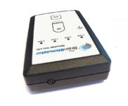](https://totaltdcs.com/wp-content/uploads/2019/03/The-Brain-Stimulator-V3.0-tDCS-Device-1-1.jpg)

[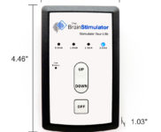](https://totaltdcs.com/wp-content/uploads/2019/03/TBSv3.0-tDCS-Device-Dimensions_smlr.jpg)

[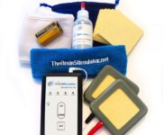](https://totaltdcs.com/wp-content/uploads/2019/03/the-brain-stimulator-v3.0-tdcs-kit-deluxe.jpg)

[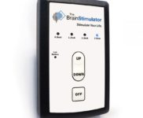](https://totaltdcs.com/wp-content/uploads/2019/03/The-Brain-Stimulator-V3.0-tDCS-Device-3.jpg)

[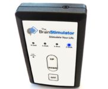](https://totaltdcs.com/wp-content/uploads/2019/03/The-Brain-Stimulator-V3.0-tDCS-Device-2.jpg)

First and foremost, we love The Brain Stimulator and have been using their products for many years. They’re arguably the oldest company in the industry and have been very active in the tDCS community. The company was started by a college student who won a number of awards for his work in tDCS. The Brain Stimulator has been featured in numerous news publications including a prime-time news segment on [ABC Nightline](https://thebrainstimulator.net/abcnightline/) in 2014. The company has always been a big advocate for consumer safety and manufacturing standards, and are one of the few companies which regularly release new product upgrades.

Their current tDCS device, *[The Brain Stimulator v3.0](https://thebrainstimulator.net/product/brain-stimulator-v3-deluxe-tdcs-kit/),* is a perfect combination of simplicity and functionality. It’s incredibly user friendly and portable, fitting nicely in the palm of your hand. It includes all of the essential tDCS features such as current ramping, session timer, and low battery warning, and the integrated safety technology goes above and beyond our minimum standards. The internal circuit design is some of the best we’ve seen, paralleled only by some of the top-shelf medical-grade devices. This is a company we continue to recommend to both new and experienced tDCS users.

### What We Like:

- ** Been around since the beginning – one of the first commercially available tDCS Devices.
- ** Transparent company – started by a college student in California – was very active on reddit
- ** Have been featured by several large news organizations (ABC, PBS, NY Times, etc.)
- ** Regularly launching new & improved products, all of which have been incredibly portable.
- ** They make all their products in the USA
- ** Impressive circuitry design including a low battery indicator & session timer ([learn more about our device standards](https://totaltdcs.com/picking-a-tdcs-device/))
- ** Outspoken advocate for product/user safety – circuitry includes several redundant safety functions.
- ** “Introduced” the concept of boost voltage (constant power availability despite battery health)

### What We Dislike:

- ** High demand – Devices seem to sell out quickly
- ** Older products don’t include optimal ramping.
- ** Their “Travel Model” (no longer sold) only included two current levels.
- ** Some community concern with 1st Gen Travel Model overcoming high resistance.

###

2. [TransCranial Technologies Stimulator](http://www.trans-cranial.com/)

[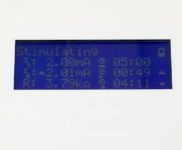](https://totaltdcs.com/wp-content/uploads/2019/03/TCT-tdcs-device-lightbox.jpg)

[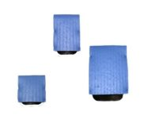](https://totaltdcs.com/wp-content/uploads/2019/03/transc-cranial_electrodes_1.jpg)

[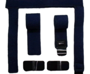](https://totaltdcs.com/wp-content/uploads/2019/03/transc-cranial_straps_300_300.png)

[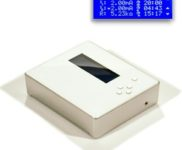](https://totaltdcs.com/wp-content/uploads/2019/03/transc-cranial_composite_product_white.jpg)

[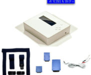](https://totaltdcs.com/wp-content/uploads/2019/03/transc-cranial_composite_product_white_all.jpg)

While it may appear plain Jane from the outside, there’s an awesome array of features hidden under the hood. In realty, the TransCranial Technologies Stimulator is considered more of a scientific/research-grade tDCS device. However, we’re including it here because it happens to be one of the only devices in the “research-grade” category which are available for sale directly to consumers. This is a device we definitely recommend. While it is pretty pricey, with a current price tag of $349.00 USD, it’s well worth the money.

### What We Like:

- ** User defined session length timer
- ** Sessions can be set at current increments of 0.1mA
- ** Automatic pause if external resistance is too high (i.e. electrodes become disconnected)
- **  *Notifications to reposition sponges if external resistance is too variable*
- ** Same device has been sold since it’s introduction (no known improvements over time).

### What We Dislike:

- ** Pretty bulky device – You’re basically stuck at your desk while using it.
- ** Not consumer friendly
- ** LED screen is too small – only three lines of text, it can be a little difficult to navigate (but not as bad as the Foc.us v2, coming up…)
- ** Not possible to change output current during a session – must  first end the session and setup a new session.

###

3. [Super Specific Devices 12-24v Device](https://www.superspecificdevices.com/)

[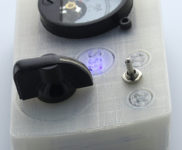](https://totaltdcs.com/wp-content/uploads/2019/03/SSD12-24v-4.jpg)

[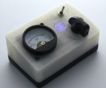](https://totaltdcs.com/wp-content/uploads/2019/03/SSD12-24v-5.jpg)

[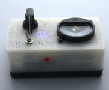](https://totaltdcs.com/wp-content/uploads/2019/03/SSD12-24v-6.jpg)

[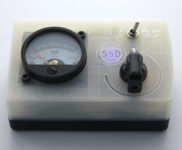](https://totaltdcs.com/wp-content/uploads/2019/03/Super_Specific_Devices_12v_v5_0_tDCs_Device.jpg)

[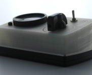](https://totaltdcs.com/wp-content/uploads/2019/03/SSD12-24v-1.jpg)

Super Specific Devices is yet another company that has been around for quite a long time. It was started by two individuals in a studio near Portland, Oregon, and seems to have a real “homey” feel. While the current product we recommend is officially titled: *SSD 5.0 12/24 Volt Selectable Voltage tDCS Device.* they also once had a *digital metered* tDCS device. They no longer sell it, but if you can find it, grab it. As far as metered devices go, it was our favorite.

### What We Like:

- ** Constantly improving their devices and releasing new models.
- ** One of only a few tDCS devices to feature selectable voltage (hardware based).
- ** A nice “retro” analog metered tDCS device which is significantly smaller than the Apex device.
- ** Cool, retro styled device which is quite small for a device with an analog meter.
- ** Analog meter has a max reading of 3mA – Much better than Apex’s 5mA meter

### What We Dislike:

- ** Still selling self adhesive electrodes – Poorly designed electrodes *
- ** Device enclosure appears to be 3D printed, and actually uses the same back cover from The Brain Stimulator v3.0 device. Weird.
- ** Analog meters are very delicate and depending on the build quality, can break very easily. An even bigger concern is the ability for the needle to be knocked off alignment resulting in incorrect current readings.

** SSD’s makeshift sponge electrodes are really just self-adhesive electrodes with sponges laid on top (just like Focus’s). This is not an ideal setup as self-adhesive electrodes are not only notorious for providing uneven distribution of current (safety concern), but they also add unnecessary resistance, greatly reducing the effectiveness of the device.*

###

4. [Focus v2/v3 Stimulator](http://foc.us/)

[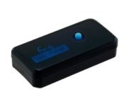](https://totaltdcs.com/wp-content/uploads/2019/03/Focus_v2stimulator_tDCS_Device_Angled.jpg)

[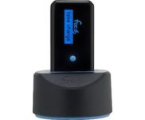](https://totaltdcs.com/wp-content/uploads/2019/03/Focus_v2stimulator_tDCS_Device_Charging.jpg)

[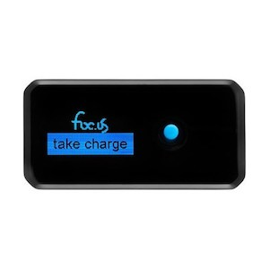](https://totaltdcs.com/wp-content/uploads/2018/06/Focus_v2stimulator_tDCS_Device_Straight.jpg)

[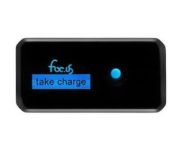](https://totaltdcs.com/wp-content/uploads/2019/03/Focus_v2stimulator_tDCS_Device_Straight.jpg)

While Focus’ first product had some notable safety issues, their second and third generation product seems really rock solid. The visual interface and incremental session & ramping timers are totally awesome. With this device, you pretty much get it all. It can even produce stimulation sessions utilizing tACS, tRNS, and a few others. However, that is precisely the reason why Focus didn’t rank higher on our list. Well, that and price (currently 400 bucks!)…

Many of the included “alternative” stimulation methods are backed by  very little scientific research, and while it’s neat that Focus allows the user the ability to explore these brain stimulation alternatives, there exists a level of safety concern due to lack of research. We’re tDCS guys and we firmly believe in tDCS’s strong scientific backing, and it’s superior performance above other alternative stimulation methods. But all in all, this is not a device we would dissuade people from looking into.

### What We Like:

- ** Also been around since the beginning – actually may have been the first commercially available tDCS Device.
- ** Very feature packed device – practically as robust as the TCT device, but packed into a product the size of a Bic lighter.
- ** While hard to find, their website contains a wealth of technical information about their products.
- ** Great safety features (triple redundant), see here (doc upload).
- ** SUPER compact device, you can take this thing anywhere.

### What We Dislike:

- ** Products are way overpriced – The Focus v2 & v3 Stimulator are currently $400 while their significantly lesser and NOT recommended Go Flow v4 is $244.
- ** Users claim terrible customer support – some never receiving responses.
- ** To be brutally honest, the founder (co-founder?) Mike is a real d**k – just checkout some of his reddit posts.
- ** Focus’ “Go Flow” products are unnecessarily small, about the size of a quarter, very confusing and hard to use.
- **  Their latest product (Go Flow v4) can produce current levels reaching up to 4mA, which is incredibly unsafe and totally unacceptable (2mA is the widely accepted max safe current level).
- ** In 2016 a scientific study entitled [“Unfocus” on foc.us: commercial tDCS headset impairs working memory.](https://www.ncbi.nlm.nih.gov/pubmed/26280313) found the Focus stimulator actually produced opposite effects from that which it was marketed to produce.

### 5. Omni Stimulator

*On a budget? We struggle with this recommendation, however if we had to pick a sub $150 device, go with the Omni Stimulator. It’s a direct rip-off copy cat of the original The Brain Stimulator, which was a solid device. We’ve met many people who are still using their original Brain Stimulator’s 2, even 3 years later. (See [ABC Nightline Video](http://thebrainstimulator.net/abcnightline/))*

**What we do not recommend:**

- Apex Type A – *In addition to other concerns, the product is so simple you could make it from parts bought at Radio Shack.*
- The Brain Driver – *Community safety concerns*
- Focus’s Go Flow v4 – *Significant safety concerns*
- Unbranded tDCS devices found on websites like eBay.