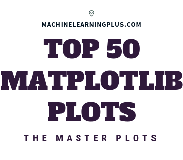

Top 50 matplotlib Visualizations - The Master Plots (w/ Full Python Code) | ML+

Top 50 matplotlib Visualizations - The Master Plots (w/ Full Python Code) | ML+

https://www.machinelearningplus.com/plots/top-50-matplotlib-visualizations-the-master-plots-python/?mkt_tok=eyJpIjoiWkRJek16bGxaRFkwWmpReSIsInQiOiI5ZTE1ZDhraU04XC9jaGI1SFBnOEpQV04xbFhHa0F4MU1cL2tNYVV0OWh5ZGRaMzhLdWo3SWkrb29ZMGFoMXA4WURVVHpxSWVzZ0pVNWtvZlZONWZIWFlkZkc3NFVPWGFRanBjd1ZlYTlCcGVhZDh2WjJPWEp1RFRwT2taNDhQV2lHIn0%3D#31.-Waffle-Chart

A compilation of the Top 50 matplotlib plots most useful in data analysis and visualization. This list helps you to choose what visualization to show for what type of problem using python's matplotlib and seaborn library.