Top 7 Advantages of Choosing Google Cloud Hosting

- [a1.1k](https://www.facebook.com/sharer/sharer.php?u=https://kinsta.com/blog/google-cloud-hosting/&t=Top%207%20Advantages%20of%20Choosing%20Google%20Cloud%20Hosting&redirect_uri=https://kinsta.com?sharing-thankyou=yes)
- [d449](https://kinsta.com/blog/google-cloud-hosting/#)
- [f17](https://plus.google.com/share?url=https://kinsta.com/blog/google-cloud-hosting/)
- [k1.5k](https://www.linkedin.com/shareArticle?mini=true&ro=true&trk=EasySocialShareButtons&title=Top%207%20Advantages%20of%20Choosing%20Google%20Cloud%20Hosting&url=https://kinsta.com/blog/google-cloud-hosting/)
- [v10](https://kinsta.com/blog/google-cloud-hosting/mailto:?subject=Visit%20this%20site%20https://kinsta.com&body=Hi,%20this%20may%20be%20intersting%20you:%20%22Top%207%20Advantages%20of%20Choosing%20Google%20Cloud%20Hosting%22!%20This%20is%20the%20link:%20https://kinsta.com/blog/google-cloud-hosting/)
- [z16](https://bufferapp.com/add?url=https://kinsta.com/blog/google-cloud-hosting/&text=Top%207%20Advantages%20of%20Choosing%20Google%20Cloud%20Hosting&via=kinsta&picture=&count=horizontal&source=button)
- [I](http://managewp.org/share/form?url=https%3A%2F%2Fkinsta.com%2Fblog%2Fgoogle-cloud-hosting%2F)
- Total: 3.2k

# Top 7 Advantages of Choosing Google Cloud Hosting

By [Brian Jackson](https://kinsta.com/blog/author/brianjackson/),  Updated: September 25, 2017

 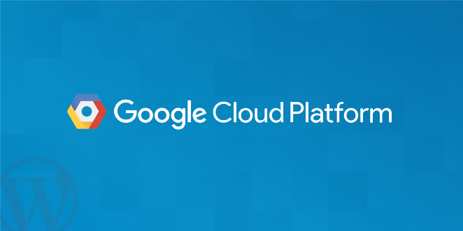

We made the decision here at Kinsta to [move our entire infrastructure](https://kinsta.com/blog/managed-wordpress-hosting-in-the-google-cloud/) to Google Cloud Platform early 2016, making us the first managed WordPress host to exclusively utilize the platform. By doing this we could ensure a high-level of redundancy and have granular control over our servers while also having the ability to tweak our hosting environment; making customers’ sites faster, more stable, secure and completely isolated. Google Cloud Platform not only allowed us access to one of the largest networks in the world, but also ensures customers have less downtime as we can now utilize live migrations of virtual machines. Today we want to dive deeper into some of the advantages of using Google Cloud Hosting for your business.

## Google Cloud

SADA Systems recently [surveyed 200+ IT managers](https://sadasystems.com/2016-public-cloud-survey-Infographic.pdf) about their use of public cloud services, and found that **84% of IT managers surveyed are using public cloud infrastructure today**, as opposed to corporate data centers. “All signs point to public cloud adoption growing and enterprise IT becoming more comfortable with the prospect of running their most sensitive data on public cloud infrastructure,” says Tony Safoian, president and CEO at SADA Systems.

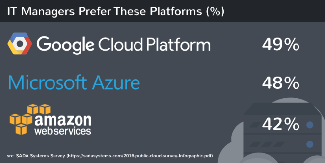

Even Cisco is now forecasting that by 2020, [cloud traffic will represent 92 percent](http://www.cisco.com/c/dam/en/us/solutions/collateral/service-provider/global-cloud-index-gci/white-paper-c11-738085.pdf) of all data center network traffic. [According to Google Trends](https://www.google.com/trends/explore?date=2011-11-01%202016-09-19&q=Google%20Cloud%20Platform) (seen below), interest surrounding Google Cloud Platform itself has been on a very rapid rise over the past couple years. More and more companies are migrating because in most cases it offers the most secure, flexible, and cost-effective solution. It saves money on IT staffing and allows for almost instant scaling of any online platform or solution.

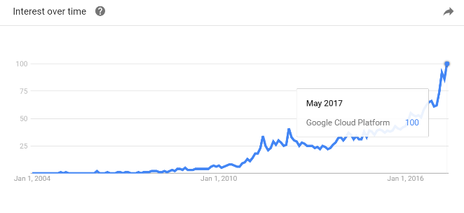
Google Cloud Platform popularity

Google Cloud Hosting, and or Compute Engine, is just one of many services provided by Google Cloud Platform. They also offer their App Engine, storage, DNS, CDN, and a multitude of other [services and products](https://cloud.google.com/products/). Google Cloud Platform consists of a set of physical servers, as well as virtual resources like virtual machines (VMs) that are contained in [Google’s data centers](https://kinsta.com/knowledgebase/google-cloud-data-center-locations/) around the globe. Each data center location is in a global region such as Central US, Western Europe, and East Asia. We use [Google Cloud Platform’s multi-regional](https://cloud.google.com/about/locations/#locations) deployment mode. This means that you can choose a different data center for each of your WordPress websites.

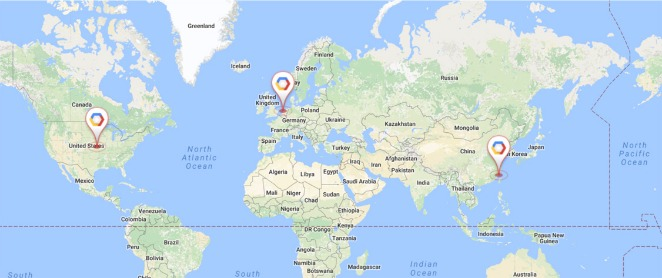

Some notable companies that are using Google Cloud Platform (Compute Engine or App Engine) include Spotify, HSBC, Home Depot, Snapchat, HTC, Best Buy, Philips, Coca Cola, Domino’s, Feedly, ShareThis, Sony Music, and Ubisoft. Even Apple has been seen [moving some of its services away from AWS](http://www.crn.com/news/cloud/300080062/cloud-makes-for-strange-bedfellows-apple-signs-on-with-google-cuts-spending-with-aws.htm), spending between $400 million and $600 million on Google Cloud Platform; although this couldn’t be independently confirmed.

And most recently Evernote made the decision to migrate its 200 million users. Ben McCormack, VP Operations at Evernote [stated on their blog](https://blog.evernote.com/blog/2016/09/13/evernotes-future-cloud/): “Evernote will gain significant improvements in performance, security, efficiency, and scalability. Moving to the cloud also allows us to focus time and resources on the things that matter most.”

eBay is also now exporting 1B+ items in their live catalog to Google Cloud Platform. See a [full list](https://cloud.google.com/customers/) of case studies and companies utilizing different services on Google Cloud Platform.

> We’ve not been able to offer that kind of experience, and that kind of performance in the 22 years that we’ve been around. – > [> eBay](https://twitter.com/googlecloud/status/839550566472638464)> , Google Next 2017

## Google Cloud Hosting Advantages

Now let’s take a look at some of the top advantages to using Google Cloud Hosting and why we think it is currently the best solution on the market as it pertains to pricing, performance, stability, scalability, backups, and security.

- [Better Pricing Than Competitors](https://kinsta.com/blog/google-cloud-hosting/#pricing)
- [Private Global Fiber Network](https://kinsta.com/blog/google-cloud-hosting/#network)
- [Live Migration of Virtual Machines](https://kinsta.com/blog/google-cloud-hosting/#vms)
- [Improved Performance](https://kinsta.com/blog/google-cloud-hosting/#performance)
- [State of the Art Security](https://kinsta.com/blog/google-cloud-hosting/#security)
- [Dedication to Continued Expansion](https://kinsta.com/blog/google-cloud-hosting/#expansion)
- [Redundant Backups](https://kinsta.com/blog/google-cloud-hosting/#backups)

### 1. Better Pricing Than Competitors

Google bills in minute-level increments (with a 10-minute minimum charge), so you only pay for the compute time you use. And a big bonus is that they give you discounted prices for long-running workloads with no up-front commitment required. Use the VMs for a month and you get a discount, as simple as that. This makes it perfect for startups and for enterprise IT to cut costs. AWS for example requires prepays in the form of “[reserved instances](https://aws.amazon.com/ec2/purchasing-options/)” to be eligible for the discounts. And Azure only offers a [5% discount](https://azure.microsoft.com/en-in/offers/ms-azr-0026p/) on a 12-month prepay.

Sandeep Dinesh did a good comparison recently of just how cheap Google Cloud’s SSDs are when it comes to performance vs price and a [comparison against AWS and Azure](https://medium.com/google-cloud/new-google-cloud-ssds-have-amazing-price-to-performance-2a58e7d9b433#.or76n1ror). To start off, instances are simply lower in cost on Google Cloud Platform, Compute Engine alone is typically between 40% – 50% cheaper than AWS and Azure.

**AWS vs Google Cloud**

When it comes to Google Cloud Platform you basically get more IOPS for less than 1/3 of the cost. As you can see with this configuration below with AWS you are looking at $1,102.50/month with 3 year contract as opposed to Google Cloud’s $470.64/month. IOPS is a measurement for input/output operations per second and how often a device can perform IO tasks. In most cases, the great number of IOPS, the better the performance.

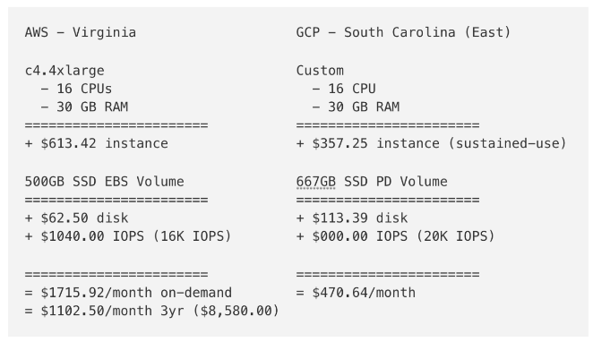
**Azure vs Google Cloud**

When it comes to Azure it is slightly different. As Sandeep points out, you have to attach premium SSD storage to get the same persistent network attached storage. But again, once you do a comparison between the two it is again about 1/3 of the cost to use Google Cloud Platform. As you can see with this configuration below with Azure you are looking at $1,602.68/month as opposed to Google Cloud’s $532.82/month.

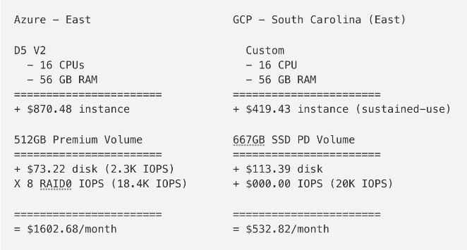

In November 2016, [AWS reduced their prices](https://aws.amazon.com/blogs/aws/ec2-price-reduction-c4-m4-and-t2-instances/). The HFT Guy, a developer from London, then wrote about how he [stacked up Google Cloud vs AWS](https://thehftguy.wordpress.com/2016/11/18/google-cloud-is-50-cheaper-than-aws/) and discovered that Google Cloud was still 50% cheaper (after the price reduction)! He stated, that all Google instances have significantly faster network than the equivalent [and even bigger] AWS instances, to the point where they’re not even playing in the same league. AWS might have kickstarted the cloud generation, but Google Cloud is the one taking it over.

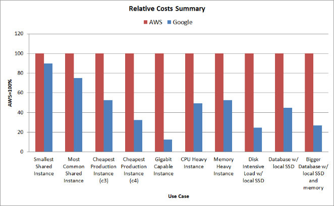

Cloud Spectator, a cloud performance benchmark company, also did an in-depth price-performance analysis in 2017 of North American providers. This report included Google Cloud Platform, Amazon, Azure, and SoftLayer. They discovered that across the board, from small VMs to extra large VMs, Google Cloud was the least expensive. Make sure to [check out their study](https://cloudplatformonline.com/g-suite-cloud-spectator.html) for more details on configurations and tests.

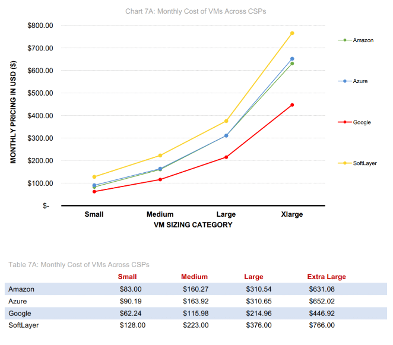
Cloud computing providers pricing comparison

Here is another great [in-depth price comparison](https://quizlet.com/blog/whats-the-best-cloud-probably-gcp) over a longer period of time from Quizlet, who chose to migrate to Google Cloud Platform in 2015. And as of August 2017, Google Cloud Platform [announced a price cut](https://cloudplatform.googleblog.com/2017/08/announcing-price-cuts-on-Local-SSDs-for-on-demand-and-preemptible-instances.html) on their storage costs. Local solid-state disks (SSDs) attached to on-demand Google Compute Engine virtual machines are now up to 63% cheaper. In the US, that is around $0.080 per GB per month. The same goes for SSDs with Preemptible VM instances, which are now up to 71% cheaper.

### 2. Private Global Fiber + Tiered Network

Alex said it best in an article about [Google Cloud Platform on Techcrunch](https://techcrunch.com/2013/05/19/what-sets-the-google-cloud-platform-apart-from-the-rest/), “The Power is in the Network.” One thing that sets Google Cloud Hosting apart from some of the other players is that their network is one of the biggest in the world. Will Shulman, co-founder of [MongoLab](https://mongolab.com/welcome/), talked about the network in a panel at Google I/O saying: “It is blazing fast. The other thing – it has a private distributed backbone between all the data centers. **You are talking over Google’s backbone, not over the Internet.**”

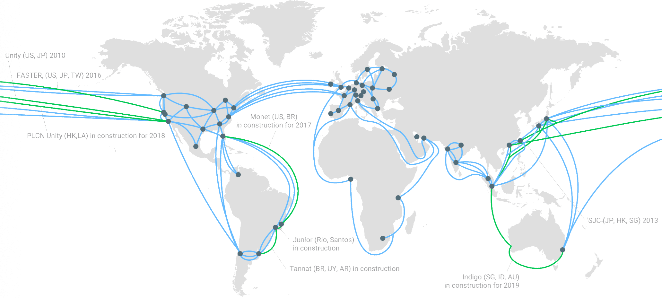
Google Cloud Platform network

On June 29, 2016, Google announced their investment in the [FASTER Cable System](http://www.nec.com/en/press/201606/global_20160629_02.html) which gives Google access to up to 10Tbps (Terabits per second) of the cable’s total 60Tbps bandwidth between the US and Japan. They are using this for Google Cloud and Google App customers. The 9,000km trans-Pacific cable is the highest-capacity undersea cable ever built and lands in Oregon in the United States and two landing points in Japan. Google is also one of six members which has sole access to a pair of 100Gb/s x 100 wavelengths optical transmission strands between Oregon and Japan.

> “Google’s ability to build, organize, and operate a huge network of servers and fiber-optic cables with an efficiency and speed that rocks physics on its heels…This is what makes Google Google: its physical network, its thousands of fiber miles, and those many thousands of servers that, in aggregate, add up to the mother of all clouds.” — > [> Wired Magazine](https://www.wired.com/2012/10/ff-inside-google-data-center/)

You probably get the picture here. How many other providers do you know that are laying their own fiber optic cables under the Pacific Ocean? And the great thing is that the network speed also helps make a difference in total cost. With the speed, comes the ability to process more data in less time. By having such a large infrastructure and network, this allows them to give us those cheaper computing prices as shown earlier.

And not only that but as of August 2017, Google Cloud Platform launched their separate [premium tier and standard tier networks](https://cloudplatform.googleblog.com/2017/08/introducing-Network-Service-Tiers-your-cloud-network-your-way.html). This makes them the first major public cloud to offer a tiered cloud network. The premium tier delivers traffic over Google’s well-provisioned, low latency, highly reliable global network. Redundancy is key, and that’s why there are at least three independent paths (N+2 redundancy) between any two locations on the Google network, helping ensure that traffic continues to flow between the locations even in the event of a disruption.

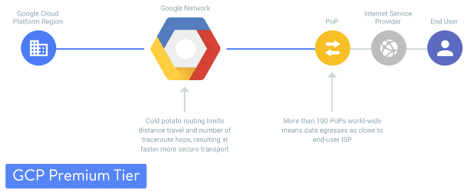
Google Cloud Platform Premium Tier

The standard tier delivers network quality comparable to that of other major public clouds. It delivers outbound traffic from GCP to the internet over transit (ISP) networks instead of Google’s network.

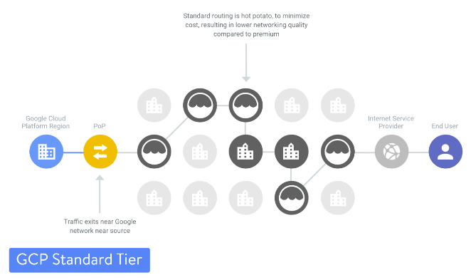
Google Cloud Platform Standard Tier

Here is a [measurement from Cedexis](https://portal.cedexis.com/ui/reports/share/1t703mtt36xs) of the difference in latency on Google Cloud Platform’s premium tier vs the standard tier in the United States.

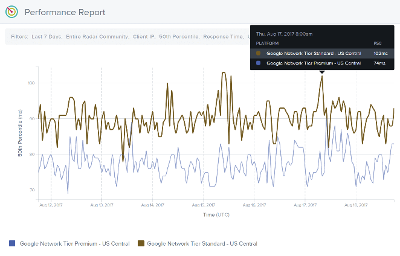

Google Cloud premium tier latency vs standard tier

Here is a [measurement from Cedexis](https://portal.cedexis.com/ui/reports/share/1t703mtt6f6o) of the difference in throughput on Google Cloud Platform’s premium tier vs the standard tier in the United States.

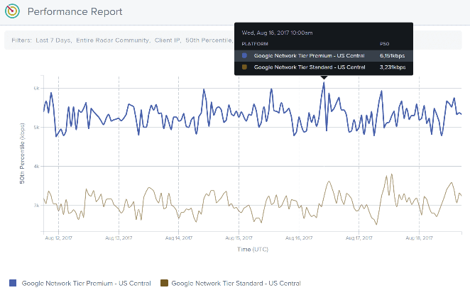

Google Cloud premium tier throughput vs standard tier

**Kinsta utilizes Google Cloud Platform’s premium tier** for all of our clients to ensure lightning-fast load times by minimizing traceroute hops and decreasing the distance the data has to travel.

### 3. Live Migration of Virtual Machines

Another huge advantage for Google Cloud Hosting, especially for how we use it here at Kinsta is **live migrations of Virtual Machines**. Neither AWS, [Azure](https://feedback.azure.com/forums/216843-virtual-machines/suggestions/5763409-live-migrate-the-vms-during-maintenance-hardware-f), or smaller providers like Digital Ocean offer this functionality. So this is a very important differentiator for Google Cloud compared to other cloud providers. As a WordPress hosting provider this means we are basically always up with our VMs, with no noticeable degradation in performance when they are live migrating VMs between host machines.

Benefits of live migrations allows for the engineers at Google to better address issues such as patching, repairing, and updating the software and hardware, without the need for you to worry about machine reboots. Miche Baker-Harvey, Tech Lead/Manager at Google put together a great illustration of the [high-level steps involved in a live VM migration](https://cloudplatform.googleblog.com/2015/03/Google-Compute-Engine-uses-Live-Migration-technology-to-service-infrastructure-without-application-downtime.html).

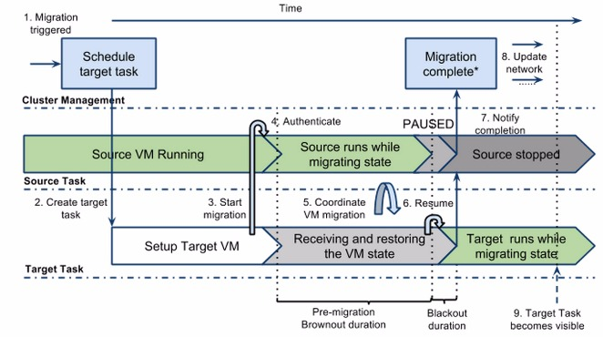

And besides live migration of virtual machines, Google also offers [resizing of persistent disks](https://cloudplatform.googleblog.com/2016/03/introducing-Google-Cloud-Persistent-Disks-with-non-disruptive-online-resizing.html) without any downtime. You can use the portal or CLI to actually resize the live disk.

### 4. Improved Performance

Kinsta was just recently named top tier once again in Review Signal’s annual 2016 [WordPress hosting performance benchmarks](http://reviewsignal.com/blog/2016/09/14/wordpress-hosting-performance-benchmarks-2016/). And a lot of this is thanks to Google Cloud Platform. We were the first [managed WordPress host](https://kinsta.com/blog/managed-wordpress-hosting/) to exclusively utilize Google Cloud and are the only enterprise level host using them. And we would like to think that the results speak for themselves.  Kevin at Review Signal threw a whopping 10,000 concurrent users against our servers and as he noted for the Load Storm test, Kinsta had basically flawless performance with flat average response times, minimal errors and no spikes.

> Kinsta had essentially perfect LoadStorm and Blitz tests. They also had no flaws in any other tests.**>  I’m at a loss for words to praise their performance.**> ” – Kevin, Review Signal

And some of our clients get a lot of traffic. We have seen the Google Cloud machines easily handle 60k+ concurrent visitors without any hiccups.

Here is an example below of load times significantly decreasing on a client’s site after we moved them to Google Cloud Platform. Before the move they were getting spikes well over the 1 second range, and after they stayed consistently under 500 ms. So just by migrating them to Google Cloud Platform they saw a **50% decrease in load times!** Their VMs definitely do a good job of handling whatever you throw at them.

[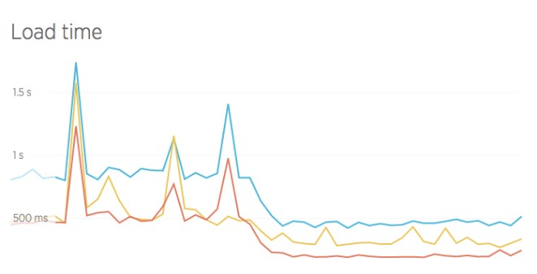](https://kinsta.com/wp-content/uploads/2016/04/new-relic.jpg)

Also, because we use Google Compute Engine servers, this ensures automatic scalability. Instead of being constrained to 2-6 CPUs per VPS as with other WordPress hosting providers we actually let the site’s container **scale to as many CPUs as needed** when there’s a surge, and for load balanced clients an infinite number of CPUs as our system dynamically spins up more machines and scales back when the traffic wave subsides.

Here is another example of what happened when Neuralab moved to Kinsta’s platform powered by Google Cloud. Their wait time, also known as [TTFB](https://kinsta.com/blog/ttfb/), dramatically decreased.

And here is an example of a site that migrated away from Kinsta and Google Cloud Platform. They were instantly met with higher load times. In fact, we have had some clients leave and come back because of this.

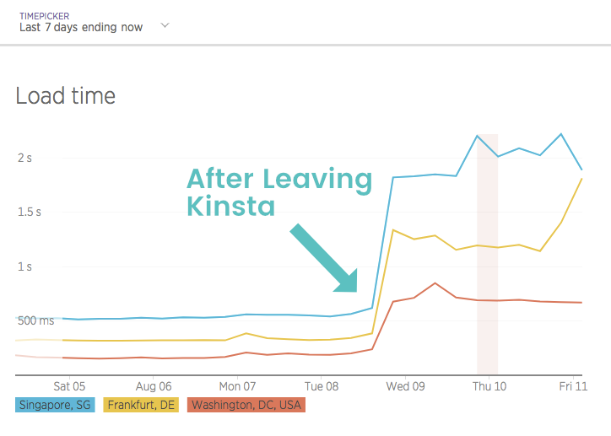
Higher load times leaving GCP

Google Cloud Platform is making leaps and bounds when it comes to making a bigger dent in the cloud computing space. As of January 2017 you can now [leverage GPUs](https://cloud.google.com/gpu/) for machine learning and scientific computing. And in March 2017 they released [VMs with 64 virtual CPUs](http://venturebeat.com/2017/03/03/google-cloud-launches-vm-instances-with-64-virtual-cpu-cores/).

### 5. State of the Art Security

Another big advantage is security. Choosing Google Cloud Platform means you get the benefit of a security model that has been built upon over the course of 15 years, and currently secures products and services like Gmail, Search, etc. Google currently employs more than 500 full-time security professionals. [Niels Provos](https://twitter.com/NielsProvos), a security Engineer at Google, gave a great in-depth look at the security of Google Cloud Platform (see video below).

[NEXT 2016 Keynote: Security by Niels Provos](https://www.youtube.com/watch?v=Ba1BvXzVbsE)

Some of Google Cloud Platform security features include:

- All data is encrypted in transit between Google, the customers, and data centers; as well as the data in all of the Cloud Platform services. The data stored on persistent disks is encrypted under 256-bit AES and each encryption key is also encrypted with a set of regularly changed master keys.
- The layers of the Google application and storage stack require that requests coming from other components are authenticated and authorized.
- Because Google has relationships with some of the biggest ISPs in the world, this helps improve the security of your data in transit as it means less hops across the public internet.
- Commitment to enterprise security certifications with regular audits for regular audits for SSAE16, ISO 27017, ISO 27018, PCI, and HIPAA compliance (note: Some of these require a dedicated IP. Also, Kinsta is not HIPAA compliant). Eran Feigenbaum, Director of Security at Google stated “Certifications such as these provide independent third-party validations of our [ongoing commitment to world-class security and privacy](http://googleforwork.blogspot.com/2016/04/new-security-and-privacy-certifications-give-more-transparency-on-how-Google-handles-your-data-in-the-cloud.html), while also helping our customers with their own compliance efforts.”

You can see more in-depth behind the scenes in Google’s [security whitepaper](https://cloud.google.com/security/whitepaper). Kinsta also uses Linux containers (LXC), and LXD to orchestrate them, on top of Google Cloud Platform which enables us to completely isolate not just each account, but each separate WordPress site. This is a much more secure method than offered by other competitors and helps ensure [secure WordPress hosting](https://kinsta.com/secure-wordpress-hosting/) 24×7. Read more about how LXD works in Stéphane Graber’s post on [LXD 2.0](https://www.stgraber.org/2016/03/11/lxd-2-0-introduction-to-lxd-112/).

### 6. Dedication to Continued Expansion

Google has continued to rapidly build out their infrastructure for Google Cloud Platform. On September 29th, 2016 they announced the locations of [new strategically placed Google Cloud Regions](https://cloudplatform.googleblog.com/2016/09/Google-Cloud-Platform-sets-a-course-for-new-horizons.html). We are very excited to see São Paulo and Sydney included in the list as this will help dramatically decrease latency for Google Cloud Hosting customers across South America and Australia. Here is an updated list of all GCP regions:

#### Coming

- Montreal (Canada)
- California (United States)
- Netherlands
- Mumbai (India)
- Hamina (Finland)

#### Now Available

All 12 of these Google Cloud Platform locations are available for Kinsta clients when choosing where to strategically place your WordPress site.

- Belgium
- London (UK)
- Council Bluffs, Iowa, USA (current)
- Changhua County (Taiwan)
- [Sydney](https://cloudplatform.googleblog.com/2017/06/Google-Cloud-Region-in-Sydney.html) (Australia) – Available as of June 2017
- Oregon (United States)
- Frankfurt (Germany)
- South Carolina (United States)
- São Paulo (Brazil) – Available as of September 2017
- [Northern Virginia](https://cloudplatform.googleblog.com/2017/05/Google-Cloud-Platform-launches-Northern-Virginia-region.html) (United States) – Available as of May 2017
- Singapore – Available as of May 2017
- [Tokyo (Japan)](https://blog.google/topics/google-cloud/google-cloud-platform-tokyo-region-now-open-for-business/) – Available as of November 2016

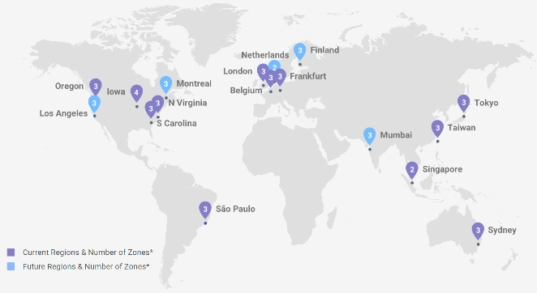
Google Cloud Platform network expansion

Google has also stated there will be additional locations announced in 2017. We at Kinsta appreciate Google’s dedication to global expansion as this helps decrease latency across the board and ensures faster load times.

> “Our goal remains the same: we want to build the most open cloud for all businesses and make it easy for them to build and run great software.” — Brian Stevens, Vice President of Google Cloud

### 7. Redundant Backups

Google Cloud Storage is designed for 99.999999999% durability and has 4 different types of storage: Coldline storage, nearline, regional storage, and [multi-regional storage](https://cloud.google.com/storage/docs/storage-classes#multi-regional). It stores data redundantly, with automatic checksums to ensure data integrity. The beauty of multi-regional storage is that it is also geo-redundant, which means cloud storage stores your data redundantly in at least two regions within the multi-regional location of the bucket. As it pertains to Google Cloud hosting, this ensures you will never lose your data, even in the case of a disaster.

## Summary

As you can see, when it comes to Google Cloud Hosting and utilizing Google Cloud Platform, there are a lot of advantages. Not only is it cheaper, but you also benefit from one of the largest networks in the world! This means less latency and more accurate compute prices as data is able to be processed in less time. Live migration of virtual machines is currently a unique and very important differentiator when it comes to comparing other cloud hosting providers. Top it off with state of the art security and performance that is able to handle hundreds of thousands of concurrent connections and you have a platform that can set your business up for long-term success.

Have any of your own experiences with Google Cloud Hosting? If so we would love to hear about them below in the comments.