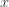
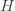
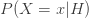
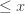
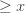
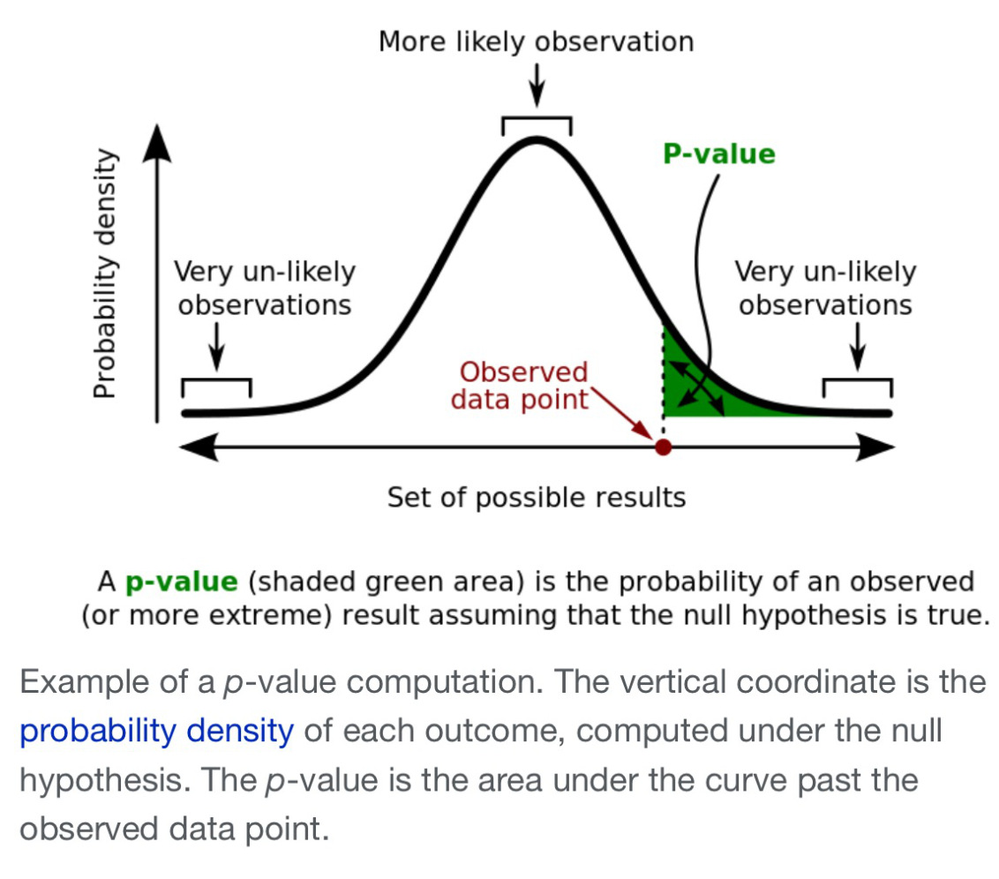
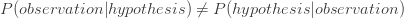

Toward sustainable insights, or why polygamy is bad for you

# Toward sustainable insights, or why polygamy is bad for you

January 25, 2017

.

[Toward sustainable insights, or why polygamy is bad for you](http://cidrdb.org/cidr2017/papers/p56-binnig-cidr17.pdf) Binning et al., *CIDR 2017*

Buckle up! Today we’re going to be talking about statistics, p-values, and the multiple comparisons problem. Some good background resources here are:

- [Statistics Done Wrong](https://www.statisticsdonewrong.com/index.html), by Alex Reinhart
- [p-values](https://en.m.wikipedia.org/wiki/P-value) on wikipedia
- [Misunderstandings of p-values](https://en.m.wikipedia.org/wiki/Misunderstandings_of_p-values), also on wikipedia

For my own benefit, I’ll try and explain what follows as simply as possible – I find it incredibly easy to make mistakes otherwise! Let’s start with a very quick recap of p-values.

### p-values

If we observe some variable  and see value , we might wonder “what are the odds of that!” If we knew the underlying probability distribution for  we’d be able to give an answer. For example, you roll a fair dice and get a 1. We know that the odds of that are 1 in 6 (1/6). If we don’t know the underlying probability distribution we can’t the answer the question at all. But we *can* answer a related question: ‘*suppose* we’re seeing the results of a fair dice roll, what would be the odds of getting a 1?’ And the answer is of course 1/6 again. Let’s call ‘suppose we’re seeing the results of a fair dice roll’ our *hypothesis*   about the underlying distribution. Then what we’re really asking is the probability that an observation of  will be  given that hypothesis, or : . We call the probability of a given observation given an underlying hypothesis a *p-value*.

Time to move on from dice rolls. Suppose the variable  we observe is now a measure of correlation between two measured phenomena. That’s a continuous variable, so instead of asking is  exactly equal to some value  we need to ask ‘what are the odds of seeing a value  (or )?’ We know that we can’t answer that question unless it’s in relation to some underlying probability distribution. We need a hypothesis . For correlation questions we often use the *null hypothesis*, which is the hypothesis that the two measured phenomena are in fact completely independent.

Suppose we see a suspiciously large value. What are the odds of that?
p-value =

(source: wikipedia)

Here’s the first thinking trap. The p-value tells us the likelihood of seeing a given value (greater than or equal to in this example) of X given some hypothesis. We cannot swap the order and treat it as the probability that the hypothesis is true given our observation!

An arbitrary but universally accepted p-value of 0.05 (there’s a 5% chance of this observation given the hypothesis) is deemed as the threshold for ‘statistical significance.’ Really, things don’t divide neatly into ‘statistically significant’ and ‘statistically insignificant’, there’s just a continuous underlying probability. p=0.051 is not dramatically different from p=0.049 even though one is ‘significant’ and the other isn’t.

### Multiple comparisons

Take a look at this [xkcd cartoon](https://xkcd.com/882/). When we look at the correlation between green jelly beans and acne, we find a statistically significant result (i.e., p < 0.05). Publish!!

But hold on, there’s some kind of weird ‘Schrödinger statistics’ that we have to take into account! The true significance of our green jelly bean finding depends on how many other jelly bean colours we also examined for correlation with acne before we looked at the green beans. Prior observations change the world. Sounds like nonsense doesn’t it! How can the fact that I previously looked into blue beans in any way change the significance of the green bean correlation with acne – the numbers are there in black and white and don’t change whatever I might have looked at before?!

We’ve been tricked into thinking we’ve answered one question ‘what’s the significance of the correlation between green jelly beans and acne?’, when what we’re really doing is answering the following question: ‘what’s the chance of finding at least one jelly bean colour that shows a statistically significant correlation with acne, even though the two phenomena are actually independent?’ It matters a lot whether ‘green’ is something we discovered (we’re answering the latter question), or something we fixed a priori (the former question).

It helps me a lot to think of it this way: imagine a population of 1000 points, in a normal distribution. If you sample a point at random, there’s a slim chance that you picked an outlier point. Not knowing the underlying distribution, you’d say that there was a low chance (i.e., statistically significant) that this really came from the true underlying distribution (even though it did of course). But what if you keep on exploring the space, repeatedly sampling points until you’ve taken e.g., 10,000 samples. What are the chances you’ll catch some of those outlier points in your sample? Incredibly high! Now you could make the true statement “I took a sample at random and found a point which is unlikely to have come from such an underlying distribution with statistical significance.” Such a statement can be very misleading though unless you also qualify it with how many points you looked at before you found it.

Let’s take a concrete example. Suppose under the null hypotheses there’s a 99% chance you’ll observe a value of . You observe X and lo and behold see a value , this is a statistically significant result with p-value 0.01 (1% chance). After  trials, the odds of *not* seeing such an outlier are simply . After 6 trials, that’s 0.94, or a 94% chance of not seeing an outlier. That means of course, that after 6 trials there’s a 6% chance you *will* see an outlier. That’s a p-value of 0.06, so with just 6 trials (or any higher number of trials), it is *statistically insignificant* that you saw an outlier point!

### Multiple comparisons and data visualisation

That was a long introduction! Finally we get to the paper. We want to help scientists find interesting correlations in their data – a number of tools have grown up to help do this. The core idea is to have the tool investigate lots of potential correlations, and when one is found that seems to be ‘interesting,’ to show it to the user. Very helpful you say – it would take me ages to discover these things myself! But as we now know, we have to very careful we don’t fall into the multiple comparisons trap. How many combinations were tried before hitting on this one? If we don’t know, then we actually don’t know what the statistical significance of the visualisation we’re looking at is, even though it may appear in isolation to be highly significant.

>  … without knowing how exactly the system tried to find ‘interesting’ correlations and how many correlations it tested, it is later on impossible for the user to determine what the expected false discovery rate will be across the whole data exploration session.

When using an interactive visualisation tool, not only is the statistical significance of the visualised results unclear, but the more you explore the greater the odds of finding *false discoveries*.

>  With every additional hypothesis test the chance of finding a false discovery increases. This problem is known as the ‘multiple comparisons problem’ and has been studied extensively in the statistics literature.

There are some great examples of such spurious correlations found by existing tools in the opening sections of the paper.

The authors set out to build a data exploration and visualization tool called QUDE (Quantifying the Uncertainty in Data Exploration) – pronounced ‘cute’, which only makes sense to American readers!! QUDE integrates a ‘risk detection engine’ alongside the explorer to always show the user the risk that something is a false discovery.

>  Two fundamental challenges arise when attempting to automatically quantify the risk: (1) the traditional techniques either do not scale well with the number of hypothesis or can not be used in an interactive environment and (2) in many cases it is not clear which hypothesis is currently being tested through a visualization by the user (i.e., the ‘user intent’).

QUDE uses a measure called the *False Discovery Rate* (FDR). If  is the number of ‘Type 1’ (false positive) errors in individual tests, and  is the total number of null hypotheses rejected by a multiple test, then FDR is defined as the expected ratio of erroneous rejections among all rejections . See §3.1 in the paper for details.

Beyond controlling the multiple hypothesis error, the QUDE team also plan to include support for detecting other common statistical mistakes in time, including [Simpson’s paradox](https://en.m.wikipedia.org/wiki/Simpson's_paradox), the [Base rate fallacy](https://en.m.wikipedia.org/wiki/Base_rate_fallacy), [imbalance of labels](http://machinelearningmastery.com/tactics-to-combat-imbalanced-classes-in-your-machine-learning-dataset/) and [pseudoreplication](https://www.statisticsdonewrong.com/pseudoreplication.html).

Given the long introduction I had space only for the briefest description of QUDE itself, so please do go on to check out the full paper if this catches your interest.

I’ll leave you with this opening quote from the paper:

>  A new study shows that drinking a glass of wine is just as good as spending an hour at the gym” [Fox News, 02/15]. “A new study shows how sugar might fuel the growth of cancer” [Today, 01/16]. “A new study shows late night snacking could damage the part of your brain that creates and stores memories” [Fox News, 05/16].

We’ve all seen endless such stories, often contradicting each other. If we don’t know how many other ‘studies’ researchers did before hitting on these particular results, we really don’t know their significance at all. (I have no knowledge of the situation for the particular cases in the quote above).

### Share this:

- [Twitter](https://blog.acolyer.org/2017/01/25/toward-sustainable-insights-or-why-polygamy-is-bad-for-you/?share=twitter&nb=1)
- [LinkedIn79](https://blog.acolyer.org/2017/01/25/toward-sustainable-insights-or-why-polygamy-is-bad-for-you/?share=linkedin&nb=1)
- [Email](https://blog.acolyer.org/2017/01/25/toward-sustainable-insights-or-why-polygamy-is-bad-for-you/?share=email&nb=1)
- [Print](https://blog.acolyer.org/2017/01/25/toward-sustainable-insights-or-why-polygamy-is-bad-for-you/#print)

-
[Like](https://widgets.wp.com/likes/#)

- 
- 
- 
- 
- 

[5 bloggers](https://widgets.wp.com/likes/#) like this.

### *Related*

[Dynamics on emerging spaces: modeling the emergence of novelties](https://blog.acolyer.org/2017/02/03/dynamics-on-emerging-spaces-modeling-the-emergence-of-novelties/)With 2 comments

[Matching networks for one shot learning](https://blog.acolyer.org/2017/01/03/matching-networks-for-one-shot-learning/)In "Machine Learning"

[Unsupervised learning and GANs](https://blog.acolyer.org/2017/03/02/unsupervised-learning-and-gans/)In "Machine Learning"

.
from → [Uncategorized](https://blog.acolyer.org/category/uncategorized/)