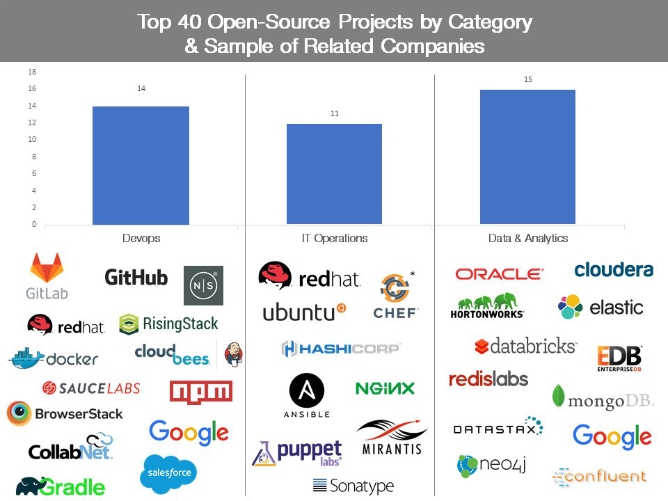

Tracking the explosive growth of open-source software

[Enterprise](https://techcrunch.com/enterprise/)
[open source software](https://techcrunch.com/tag/open-source-software/)
[open source](https://techcrunch.com/tag/open-source/)
Crunch Network

# Tracking the explosive growth of open-source software

Posted yesterday by [Dharmesh Thakker](https://techcrunch.com/contributor/dharmesh-thakker/)  ([@Dthakker02](https://twitter.com/Dthakker02)), [Max Schireson](https://techcrunch.com/contributor/max-schireson/)  ([@mschireson](https://twitter.com/mschireson)), [Dan Nguyen-Huu](https://techcrunch.com/contributor/dan-nguyen-huu/)  ([@dannguyenhuu](https://twitter.com/dannguyenhuu))

- [](https://techcrunch.com/2017/04/07/tracking-the-explosive-growth-of-open-source-software/?utm_source=pocket&utm_medium=email&utm_campaign=pockethits#comments)
- [](https://techcrunch.com/2017/04/07/tracking-the-explosive-growth-of-open-source-software/?utm_source=pocket&utm_medium=email&utm_campaign=pockethits#)
- 
- 
- [](https://plus.google.com/share?url=https://techcrunch.com/2017/04/07/tracking-the-explosive-growth-of-open-source-software/)
- [](http://www.reddit.com/submit?url=https://techcrunch.com/2017/04/07/tracking-the-explosive-growth-of-open-source-software/&title=Tracking%20the%20explosive%20growth%20of%20open-source%C2%A0software)
- [](http://www.stumbleupon.com/badge/?url=https://techcrunch.com/2017/04/07/tracking-the-explosive-growth-of-open-source-software/)
- [](https://techcrunch.com/2017/04/07/tracking-the-explosive-growth-of-open-source-software/?utm_source=pocket&utm_medium=email&utm_campaign=pockethitsmailto:?subject=Tracking%20the%20explosive%20growth%20of%20open-source%C2%A0software&body=Article:%20https://techcrunch.com/2017/04/07/tracking-the-explosive-growth-of-open-source-software/)
- [](https://share.flipboard.com/bookmarklet/popout?v=2&title=Tracking%20the%20explosive%20growth%20of%20open-source%C2%A0software&url=https://techcrunch.com/2017/04/07/tracking-the-explosive-growth-of-open-source-software/)

[Next Story](https://techcrunch.com/2017/04/07/elon-musk-teases-one-easter-egg-to-rule-them-all-for-tesla-owners/)

[Dharmesh Thakker](https://www.crunchbase.com/person/dharmesh-thakker#/entity)Contributor

Dharmesh Thakker is a general partner at [Battery Ventures](http://www.battery.com/) and a former managing director at Intel Capital.

More posts by this contributor:

- -[How viral open-source startups can build themselves into enterprise-IT powerhouses](https://techcrunch.com/2016/12/29/how-viral-open-source-startups-can-build-themselves-into-enterprise-it-powerhouses/)
- -[The Money In Open-Source Software](https://techcrunch.com/2016/02/09/the-money-in-open-source-software/)

[Max Schireson](https://www.crunchbase.com/person/max-schireson#/entity)Contributor

Max Schireson is the former CEO of open-source database company MongoDB and is currently an executive-in-residence at [Battery Ventures](http://www.battery.com/).

More posts by this contributor:

- -[The Money In Open-Source Software](https://techcrunch.com/2016/02/09/the-money-in-open-source-software/)

Dan Nguyen-HuuContributor

Dan Nguyen-Huu is an associate at [Battery Ventures](http://www.battery.com/).
More posts by this contributor:

- -[How viral open-source startups can build themselves into enterprise-IT powerhouses](https://techcrunch.com/2016/12/29/how-viral-open-source-startups-can-build-themselves-into-enterprise-it-powerhouses/)

Many of today’s hottest new enterprise technologies are centered around free, “open-source” technology. As a result, many big companies — from financial giants to retailers to services firms — are building their businesses around new, community-based technology that represents a sea change from the IT practices of the past.

But how can corporate customers — and investors — evaluate all these new open-source offerings? How can they tell which projects (often strangely named: Ansible, Vagrant, Gradle) are generating the most customer traction? Which ones have the biggest followings among software developers, and the most potential to capture market share?

These questions are especially tough to answer because most open-source companies are still private, and don’t have to disclose key user and financial metrics. (Though that’s changing — open-source giant [Cloudera](https://techcrunch.com/2017/03/31/cloudera-posts-long-awaited-ipo-filing/) recently announced plans to go public, increasing the market’s focus on open-source technology.)

That’s why we decided to create a new, detailed index to track popular open-source software projects, and gain some insights into the new companies powered by these technologies. It is the Battery Open-Source Software Index (BOSS Index), which we’ve spent months putting together with publicly available information and are introducing here. We hope to update it quarterly — and the index should gain more relevance as more open-source companies using some of these projects grow and go public.

The index contains 40 open-source projects, gleaned from an initial scouring of projects listed on the GitHub source-code repository site, as well as Datamation, an enterprise-IT publication that also [tracks open-source projects](http://www.datamation.com/open-source/open-source-software-list-ultimate-list-1.html). The top 25 are listed below, and the full list can be found on our website.

We focused on projects in enterprise IT-related areas like IT operations, including technology powering operating and provisioning systems; data and analytics, including tools for artificial intelligence and machine learning as well as databases; and DevOps, which includes projects focused on the hot new trend of “containers,” which help people develop software quickly in a sort of self-contained environment.

|     |
| --- |
| **THE BATTERY OPEN-SOURCE SOFTWARE INDEX** |
| **Rank** | **Project Name** | **Overall Project Rating** | **Category** | **Sample of Related Companies** |
| 1   | Linux | 100.00 | IT Operations | Red Hat, Ubuntu |
| 2   | Git | 31.10 | DevOps | GitHub, GitLab |
| 3   | MySQL | 25.23 | Data & Analytics | Oracle |
| 4   | Node.js | 22.75 | DevOps | NodeSource, Rising Stack |
| 5   | Docker | 22.61 | DevOps | Docker |
| 6   | Hadoop | 16.19 | Data & Analytics | Cloudera, Hortonworks |
| 7   | Elasticsearch | 15.72 | Data & Analytics | Elastic |
| 8   | Spark | 14.99 | Data & Analytics | Databricks |
| 9   | MongoDB | 14.68 | Data & Analytics | MongoDB |
| 10  | Selenium | 12.81 | DevOps | Sauce Labs, BrowserStack |
| 11  | NPM | 12.31 | DevOps | NPM |
| 12  | Redis | 11.61 | Data & Analytics | Redis Labs |
| 13  | Tomcat | 11.04 | IT Operations | NA  |
| 14  | Jenkins | 10.47 | DevOps | CloudBees |
| 15  | Vagrant | 8.15 | IT Operations | HashiCorp |
| 16  | Postgres | 8.02 | Data & Analytics | EnterpriseDB |
| 17  | Gradle | 7.68 | DevOps | Gradle |
| 18  | Nginx | 7.57 | IT Operations | Nginx |
| 19  | Ansible | 7.42 | IT Operations | Ansible |
| 20  | Kafka | 7.22 | Data & Analytics | Confluent |
| 21  | GitLab | 6.42 | DevOps | GitLab |
| 22  | Hbase | 6.41 | Data & Analytics | Cloudera, Hortonworks |
| 23  | Chef | 6.37 | IT Operations | Chef* |
| 24  | TensorFlow | 5.97 | Data & Analytics | Google |
| 25  | Cassandra | 5.74 | Data & Analytics | DataStax |

*Companies ranked according to four factors. Overall project rating represents the geometric mean of two of the four individual scores, which reflect online discussion activity; search activity; jobs impact; and GitHub activity. All data is as of February 9, 2017.*

**There are some very well-known names on the list, including projects that have spawned big companies. They include Linux, which underlies Red Hat; MySQL, which powers the company of the same name and was bought by Sun Microsystems (now part of Oracle) for $1 billion in 2008; and Hadoop, which brought us Cloudera and Hortonworks.

But some more-obscure names, like Selenium, also rank highly, indicating there is plenty of grassroots innovation happening in the open-source sector — and many new projects out there that are spawning valuable companies. Still, our research also found that having lots of users for your open-source project does not automatically translate into creating a commercially viable company.

We ranked the projects according to four factors, which included:

- ■Public interest in the project, as measured by Google search activity;
- ■User activity, gauged by mentions of the projects on the popular tech-discussion board [Stack Overflow](http://stackoverflow.com/);
- ■Jobs impact, measured by the number of job postings citing each open-source project listed on the job boards [Indeed](https://www.indeed.com/) and [Simply Hired](http://www.simplyhired.com/); and
- ■Impact in the open-source community, tracked by measuring a project’s influence on GitHub. Specifically we tracked the number of “forks,” or extensions, built on each project; the number of GitHub “stars” a company received, indicating its popularity; and the number of “watches,” another popularity indicator, all as of February 9, 2017.

Because some projects may have done extremely well, or poorly, on certain criteria — perhaps one had an off-the-charts Google search number, but a sub-par job-postings score — we threw out the top and bottom individual-criteria scores for each project. This is a methodology called “trimmed mean,” and it’s similar to what happens in Olympic gymnastics, where officials throw out an athlete’s highest and lowest scores from each judge and average the remaining ones. (We had no [East German judges](https://en.wiktionary.org/wiki/from_the_East_German_judge) in our competition, but we are being careful.)

Even so, there’s always room for improvement. Some adoption and popularity criteria, such as download metrics, are obviously somewhat difficult to measure, and surely we haven’t captured all the hottest, new emerging tools. Though with our planned quarterly updates, we should be able to track new leaders as they emerge. So we’d love feedback from the community to improve our numbers, and the index, over time. Please let us know at [opensource@battery.com](https://techcrunch.com/2017/04/07/tracking-the-explosive-growth-of-open-source-software/?utm_source=pocket&utm_medium=email&utm_campaign=pockethitsmailto:opensource@battery.com) if you have further insights into any of these metrics.

Here are some other key takeaways from our research.

## Linux, Git, MySQL lead the pack

Perhaps not surprisingly, the open-source project leading our index is Linux, technology that was first released in 1991 and is one of the most widely adopted open-source projects in the world. It is commercialized by companies, including Red Hat, one of the few open-source companies to trade publicly, as well as Ubuntu and SUSE.

> Having lots of users for your open-source project does not automatically translate into creating a commercially viable company.

Git, which came in at No. 2 on the list, inspired GitHub and GitLab. The wildly popular open-source project serves as a “version-control system” for tracking changes and coordinating work between software developers.

Also high on the list, at No. 3, was MySQL, the database technology first developed in 1995. MySQL currently helps run huge, Web-scale companies like Google, Facebook and Twitter. But it’s also worth noting that several “NoSQL” database technologies — which are non-relational databases, unlike MySQL, and are often better suited for parsing the unstructured data being thrown off by many companies today — also ranked highly.

These NoSQL technologies include MongoDB, which came in at No. 9 in our index; Redis, which is being commercialized by company Redis Labs, at No. 12; Cassandra, which came in at No. 25 and is behind the database company DataStax; and Elasticsearch at No. 7, which is being commercialized by Elastic.

MongoDB raised a new round of financing in late 2015 — the company is estimated to be valued at around $1.5 billion — and now competes against established database players like Oracle, IBM and Microsoft. Overall, several of these NoSQL vendors are growing independently of one another — quite quickly in some cases — rather than converging into one giant system. This points to further fragmentation in the broader data-infrastructure sector, and could lead to the creation of several strong NoSQL players that could be public companies in the future.

## Big data fuels open source

As many organizations struggle to manage huge volumes of structured and unstructured data today — generated by everything from security software to tweets to Web-enabled sensors in manufacturing plants — they are increasingly looking for new data-management and storage solutions. That trend is reflected in our index, as more than a dozen (15) of the 40 projects included are open-source technologies powering databases and data processing.

Hadoop, mentioned previously, is one such technology. But Spark, which is commercialized by companies like Databricks, is another, and ranked eighth on our list.

## Other names to know

Docker, the container-technology darling that has helped make software development quicker and more efficient, came in at No. 5 in our index. Many view Docker as a possible replacement for technology from public giant VMware, and the fact that Docker can be easily and cheaply accessed through the open-source community has fueled its adoption.

Docker is also competing with open-source platform technologies like Google’s Kubernetes (No. 33) and Mesos to control the “orchestration” layer in software development, or the ability to manage containers across different software environments.

> These open-source projects are not your father’s Sun or Oracle.

Another hot area for open source is “continuous integration and continuous delivery,” or the ability to write software with code that continuously and seamlessly integrates with other platforms. Some tools in this area include Jenkins (No. 14), which is commercially supported by CloudBees, and TravisCI. In the related DevOps area are technologies such as Maven (No. 30), as well as the fast-growing Artifactory binary repository, a software tool designed to optimize the download and storage of binary files, a platform commercialized by JFrog.*

## Making it rain

But as we noted earlier, having lots of users — while essential to eventually gaining commercial traction — does not guarantee that an open-source project will make a good business. That takes a lot of hard work and creativity, particularly in structuring new types of business models; leveraging complicated open-source licenses; and tweaking traditional enterprise-sales practices to fit an open-source product, as we [discussed in TechCrunch last year.](https://techcrunch.com/2016/02/09/the-money-in-open-source-software/)

What’s more, we’ve found that the chances for commercial success for IT companies leveraging open source can sometimes increase if they offer several open-source technologies that can be used together in a sort of “stack.” Elastic has the “ELK” stack, for example, consisting of the open-source Elasticsearch (No. 7 in our index), Kibana (No. 36) and Logstash (No. 29) projects.

Time-series database company InfluxData,* similarly, sells versions of the “TICK” stack — that stands for Telegraf, InfluxDB, Chronograf and Kapacitor. DevOps company HashiCorp, in one final example, has commercialized many open-source projects, including two that made our list, Vagrant (No. 15) and Vault (No. 40). Software developers like to be able to pick their favorite components from these stacks, in keeping with the “best of breed” product mentality that dominates software development today.

These open-source projects are not your father’s Sun or Oracle. But clearly, CIOs at major global companies now rely on open-source technologies — including many of the ones highlighted in our index — to run key segments of their infrastructure, and many of these projects are going to be around for the long haul. Indeed, at an open-source summit that we hosted last year, IT executives from large companies ranging from Goldman Sachs to Capital One discussed their “open-source first” attitude when it comes to deploying new software and infrastructure. And as more open-source-based companies go public in the coming years, we’ll get even more information about how these top projects are performing, and will continue to track their progress and influence on the industry.

******Denotes a Battery portfolio company. *

*Nothing here is, or should be considered, investment advice or any recommendation or solicitation to buy or sell any security. Certain information in this article has been obtained from third-party sources and, although believed to be reliable, has not been independently verified as to its accuracy, and its completeness cannot be guaranteed.*

Featured Image: Bloomberg / Contributor/Getty Images

- [](https://techcrunch.com/2017/04/07/tracking-the-explosive-growth-of-open-source-software/?utm_source=pocket&utm_medium=email&utm_campaign=pockethits#)
- 
- 
- [](https://plus.google.com/share?url=https://techcrunch.com/2017/04/07/tracking-the-explosive-growth-of-open-source-software/)
- [](http://www.stumbleupon.com/badge/?url=https://techcrunch.com/2017/04/07/tracking-the-explosive-growth-of-open-source-software/)
- [](http://www.reddit.com/submit?url=https://techcrunch.com/2017/04/07/tracking-the-explosive-growth-of-open-source-software/&title=Tracking%20the%20explosive%20growth%20of%20open-source%C2%A0software)
- [](https://share.flipboard.com/bookmarklet/popout?v=2&title=Tracking%20the%20explosive%20growth%20of%20open-source%C2%A0software&url=https://techcrunch.com/2017/04/07/tracking-the-explosive-growth-of-open-source-software/)
- [](https://techcrunch.com/2017/04/07/tracking-the-explosive-growth-of-open-source-software/?utm_source=pocket&utm_medium=email&utm_campaign=pockethitsmailto:?subject=Tracking%20the%20explosive%20growth%20of%20open-source%C2%A0software&body=Article:%20https://techcrunch.com/2017/04/07/tracking-the-explosive-growth-of-open-source-software/)

###  Recommended For You

- [Alleged NSA hack group Shadow Brokers releases...](https://techcrunch.com/2017/04/08/shadow-brokers-be-back/)

- [A short list of executives who made less money...](https://techcrunch.com/2017/04/08/anthony-noto-makes-a-lot-of-money/)

- [Gig economy stalwart TaskRabbit is...](https://techcrunch.com/2017/04/08/taskrabbit-acquisition-maybe/)

- [Postepic is an app for elegantly sharing book...](https://techcrunch.com/2017/04/08/postepic-is-an-app-for-elegantly-sharing-book-quotes/)

- [The hoverbikes are coming](https://techcrunch.com/2017/04/08/the-hoverbikes-are-coming/)

- [Avegent debuts its light field enabled mixed...](https://techcrunch.com/video/avegent-debuts-its-light-field-enabled-mixed-reality-headset/58e814a892fdde5052ea51b8/)

 [by Gravity](http://www.gravity.com/consumers)

[  ](https://popup.taboola.com/en/?template=colorbox&utm_source=aol-techcrunch&utm_medium=referral&utm_content=thumbnails-a:Below%20Article%20Thumbnails:)

[by Taboola ](https://popup.taboola.com/en/?template=colorbox&utm_source=aol-techcrunch&utm_medium=referral&utm_content=thumbnails-a:Below%20Article%20Thumbnails:)

[Sponsored Links ](https://popup.taboola.com/en/?template=colorbox&utm_source=aol-techcrunch&utm_medium=referral&utm_content=thumbnails-a:Below%20Article%20Thumbnails:)

From the Web

[(L)](http://digitalscallop.co.uk/?c=3694&a=929&s1=TB_PPI_ISMART_DESKTOP&s2=aol-techcrunch&s3=You+Don%E2%80%99t+Need+To+Speak+to+Anyone+to+Check+if+You+Had+PPI&s4=https%3A%2F%2Fconsole.brax-cdn.com%2Fcreatives%2Fba8a210e-6f13-4ff8-b459-cc60cd7ae469%2FOB_Irma_IS_68dc1505f3d341ac3d6e397613db0da6.1200x800.png)[You Don’t Need To Speak to Anyone to Check if You Had PPIiSmart Consumer Solutions](http://digitalscallop.co.uk/?c=3694&a=929&s1=TB_PPI_ISMART_DESKTOP&s2=aol-techcrunch&s3=You+Don%E2%80%99t+Need+To+Speak+to+Anyone+to+Check+if+You+Had+PPI&s4=https%3A%2F%2Fconsole.brax-cdn.com%2Fcreatives%2Fba8a210e-6f13-4ff8-b459-cc60cd7ae469%2FOB_Irma_IS_68dc1505f3d341ac3d6e397613db0da6.1200x800.png)

Undo

[(L)](https://www.getapp.com/blog/four-alternatives-to-skype-for-business/?utm_source=taboola&utm_medium=cpc&utm_campaign=aol-techcrunch&utm_title=Why+these+8+alternatives+are+better+than+Skype&utm_thumbnail=http%3A%2F%2Fcdn.taboolasyndication.com%2Flibtrc%2Fstatic%2Fthumbnails%2F2d7749b21e18e28fda820f90e0584a8f.png)[Why these 8 alternatives are better than SkypeGetApp](https://www.getapp.com/blog/four-alternatives-to-skype-for-business/?utm_source=taboola&utm_medium=cpc&utm_campaign=aol-techcrunch&utm_title=Why+these+8+alternatives+are+better+than+Skype&utm_thumbnail=http%3A%2F%2Fcdn.taboolasyndication.com%2Flibtrc%2Fstatic%2Fthumbnails%2F2d7749b21e18e28fda820f90e0584a8f.png)

Undo

[(L)](https://www.hl.co.uk/funds/neil-woodford-new-fund?utm_source=taboola&utm_medium=content+dist&utm_campaign=CX11W_funds_neil+woodford+could+launch+high+income+fund_cf+woodford+new+higher-income+fund+alert&theSource=CX11W&Override=1)[CF Woodford: New higher-income fundHargreaves Lansdown](https://www.hl.co.uk/funds/neil-woodford-new-fund?utm_source=taboola&utm_medium=content+dist&utm_campaign=CX11W_funds_neil+woodford+could+launch+high+income+fund_cf+woodford+new+higher-income+fund+alert&theSource=CX11W&Override=1)

Undo

## Newsletter Subscriptions

**The Daily Crunch**Get the top tech stories of the day delivered to your inbox
**TC Weekly Roundup**Get a weekly recap of the biggest tech stories
**Crunchbase Daily**The latest startup funding announcements

Enter Address

Recaptcha requires verification
protected by **reCAPTCHA**

[Privacy](https://www.google.com/intl/en/policies/privacy/) - [Terms](https://www.google.com/intl/en/policies/terms/)

[Privacy](https://www.google.com/intl/en/policies/privacy/) - [Terms](https://www.google.com/intl/en/policies/terms/)

[SEE ALL NEWSLETTERS](http://link.techcrunch.com/join/134/signup-all-newsletters&hash=e2426df9e6d563a11dc2f37bff61e253) »

## Latest Crunch Report

- [  ### YouTube now blocking ads on low-view channels | Crunch Report](https://techcrunch.com/video/youtube-now-blocking-ads-on-low-view-channels-crunch-report/58e81bc9e0fa1735cceaf7f2/?ncid=rightrail_cr)

[Watch More Episodes**](https://techcrunch.com/video/crunchreport/?ncid=rightrail_crmore)

