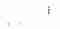
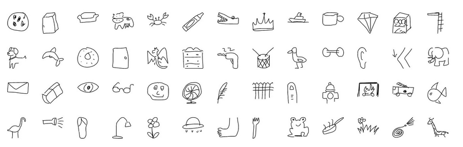
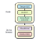
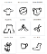
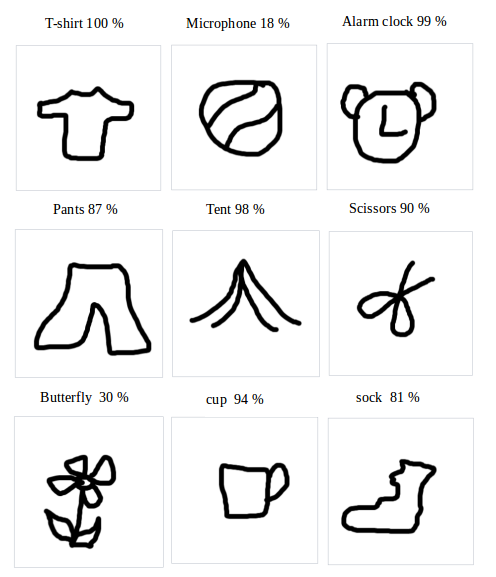

Train a model in tf.keras with Colab, and run it in the browser with TensorFlow.js

# Train a model in tf.keras with Colab, and run it in the browser with TensorFlow.js

[Zaid Alyafeai](https://medium.com/@alyafey22?source=post_page-----8a45f9b1474e----------------------)

[Jul 2, 2018](https://medium.com/tensorflow/train-on-google-colab-and-run-on-the-browser-a-case-study-8a45f9b1474e?source=post_page-----8a45f9b1474e----------------------) · 4 min read

We will create a simple tool that recognizes drawings and outputs the names of the current drawing. This app will run directly on the browser without any installations. We will use Google Colab for training the model, and we will deploy it on the browser using TensorFlow.js.

# Code and Demo

Find the live [demo](https://zaidalyafeai.github.io/sketcher/) and the [code](https://github.com/zaidalyafeai/zaidalyafeai.github.io/tree/master/sketcher) on GitHub. Also make sure to test the notebook on Google Colab [here](https://colab.research.google.com/github/zaidalyafeai/zaidalyafeai.github.io/blob/master/sketcher/Sketcher.ipynb).

# Dataset

We will use a CNN to recognize drawings of different types. The CNN will be trained on the Quick Draw [dataset](https://github.com/googlecreativelab/quickdraw-dataset). The dataset contains around 50 million drawings of 345 classes.

A subset of the classes

# Pipeline

We will train the model on GPU for free on Google Colab using Keras then run it on the browser directly using [TensorFlow.js](http://js.tensorflow.org/)(tfjs) . I created a [tutorial](https://medium.com/tensorflow/a-gentle-introduction-to-tensorflow-js-dba2e5257702) on TensorFlow.js. Make sure to read it before continuing. Here is the pipeline of the project

The pipeline

# Train on Colab

Google provides free processing power on a GPU. You can see this [tutorial](https://medium.com/deep-learning-turkey/google-colab-free-gpu-tutorial-e113627b9f5d) on how to create a notebook and activate GPU programming.

## Imports

we will use keras with tensorflow backend

|     |     |
| --- | --- |
| 1   | import os |
| 2   | import glob |
| 3   | import numpy as np |
| 4   | from tensorflow.keras import layers |
| 5   | from tensorflow import keras |
| 6   | import tensorflow as tf |

 [view raw](https://gist.github.com/zaidalyafeai/d736293f602a3657c44493f537602d3a/raw/9002c118f6e9faaf15e14edc0afd9ccc874d0495/cl-import.py)  [cl-import.py](https://gist.github.com/zaidalyafeai/d736293f602a3657c44493f537602d3a#file-cl-import-py) hosted with ❤ by [GitHub](https://github.com/)

## Load the Data

Since we have a limited memory we will not train on all the classes. We will only use [100](https://raw.githubusercontent.com/zaidalyafeai/zaidalyafeai.github.io/master/sketcher/mini_classes.txt) classes of the dataset. The data for each class is available on [Google Cloud](https://console.cloud.google.com/storage/browser/quickdraw_dataset/full/numpy_bitmap?pli=1) as numpy arrays of the shape `[N,784]` where `N` is the number of of the images for that particular class. We first download the dataset

|     |     |
| --- | --- |
| 1   | import urllib.request |
| 2   | def  download(): |
| 3   |     |
| 4   | base =  'https://storage.googleapis.com/quickdraw_dataset/full/numpy_bitmap/' |
| 5   |  for c in classes: |
| 6   | cls_url = c.replace('_', '%20') |
| 7   | path = base+cls_url+'.npy' |
| 8   |  print(path) |
| 9   | urllib.request.urlretrieve(path, 'data/'+c+'.npy') |

 [view raw](https://gist.github.com/zaidalyafeai/db3b9e65d2f1437f621bdf916cf2af0a/raw/762d81dfbedea1a2314155620e09ab2371f29c02/cl-download.py)  [cl-download.py](https://gist.github.com/zaidalyafeai/db3b9e65d2f1437f621bdf916cf2af0a#file-cl-download-py) hosted with ❤ by [GitHub](https://github.com/)

Since our memory is limited we will only load to memory 5000 images per classes. We also reserve 20% of the data unseen for testing

|     |     |
| --- | --- |
| 1   | def  load_data(root, vfold_ratio=0.2, max_items_per_class=  5000 ): |
| 2   | all_files = glob.glob(os.path.join(root, '*.npy')) |
| 3   |     |
| 4   |  #initialize variables |
| 5   | x = np.empty([0, 784]) |
| 6   | y = np.empty([0]) |
| 7   | class_names = [] |
| 8   |     |
| 9   |  #load a subset of the data to memory |
| 10  |  for idx, file  in  enumerate(all_files): |
| 11  | data = np.load(file) |
| 12  | data = data[0: max_items_per_class, :] |
| 13  | labels = np.full(data.shape[0], idx) |
| 14  |     |
| 15  | x = np.concatenate((x, data), axis=0) |
| 16  | y = np.append(y, labels) |
| 17  |     |
| 18  | class_name, ext = os.path.splitext(os.path.basename(file)) |
| 19  | class_names.append(class_name) |
| 20  |     |
| 21  | data =  None |
| 22  | labels =  None |
| 23  |     |
| 24  |  #separate into training and testing |
| 25  | permutation = np.random.permutation(y.shape[0]) |
| 26  | x = x[permutation, :] |
| 27  | y = y[permutation] |
| 28  |     |
| 29  | vfold_size =  int(x.shape[0]/100*(vfold_ratio*100)) |
| 30  |     |
| 31  | x_test = x[0:vfold_size, :] |
| 32  | y_test = y[0:vfold_size] |
| 33  |     |
| 34  | x_train = x[vfold_size:x.shape[0], :] |
| 35  | y_train = y[vfold_size:y.shape[0]] |
| 36  |  return x_train, y_train, x_test, y_test, class_names |

 [view raw](https://gist.github.com/zaidalyafeai/975d28de5fc4656cd192b4f45782b318/raw/5fc3d192179e74b1a4d76187a1ddaa2f4d71c0d3/cl-load.py)  [cl-load.py](https://gist.github.com/zaidalyafeai/975d28de5fc4656cd192b4f45782b318#file-cl-load-py) hosted with ❤ by [GitHub](https://github.com/)

## Preprocess the Data

We preprocess the data to prepare it for training. The model will take batches of the shape `[N, 28, 28, 1]` and outputs probabilities of the shape `[N, 100]`

|     |     |
| --- | --- |
| 1   | # Reshape and normalize |
| 2   | x_train = x_train.reshape(x_train.shape[0], image_size, image_size, 1).astype('float32') |
| 3   | x_test = x_test.reshape(x_test.shape[0], image_size, image_size, 1).astype('float32') |
| 4   |     |
| 5   | x_train /=  255.0 |
| 6   | x_test /=  255.0 |
| 7   |     |
| 8   | # Convert class vectors to class matrices |
| 9   | y_train = keras.utils.to_categorical(y_train, num_classes) |
| 10  | y_test = keras.utils.to_categorical(y_test, num_classes) |

 [view raw](https://gist.github.com/zaidalyafeai/da01af81496815c563da14631d61ff8d/raw/c9616f2b4d68217fce72ceb9c4ce97352de4c377/cl-prep.py)  [cl-prep.py](https://gist.github.com/zaidalyafeai/da01af81496815c563da14631d61ff8d#file-cl-prep-py) hosted with ❤ by [GitHub](https://github.com/)

## Create the Model

We will create a simple CNN. Notice that the simpler the model with lesser number of parameters the better. Indeed, we will run the model after conversion on the browser and we want the model to run fast for prediction. The following model contains 3 conv layers and 2 dense layers.

|     |     |
| --- | --- |
| 1   | # Define model |
| 2   | model = keras.Sequential() |
| 3   | model.add(layers.Convolution2D(16, (3, 3), |
| 4   |  padding='same', |
| 5   |  input_shape=x_train.shape[1:], activation='relu')) |
| 6   | model.add(layers.MaxPooling2D(pool_size=(2, 2))) |
| 7   | model.add(layers.Convolution2D(32, (3, 3), padding='same', activation=  'relu')) |
| 8   | model.add(layers.MaxPooling2D(pool_size=(2, 2))) |
| 9   | model.add(layers.Convolution2D(64, (3, 3), padding='same', activation=  'relu')) |
| 10  | model.add(layers.MaxPooling2D(pool_size  =(2,2))) |
| 11  | model.add(layers.Flatten()) |
| 12  | model.add(layers.Dense(128, activation='relu')) |
| 13  | model.add(layers.Dense(100, activation='softmax')) |
| 14  | # Train model |
| 15  | adam = tf.train.AdamOptimizer() |
| 16  | model.compile(loss='categorical_crossentropy', |
| 17  |  optimizer=adam, |
| 18  |  metrics=['top_k_categorical_accuracy']) |
| 19  | print(model.summary()) |

 [view raw](https://gist.github.com/zaidalyafeai/1b610843bd4e4eb842803ac52eca090d/raw/a9d77e19a548d94ebe2998365c294d2361c10061/cl-seq.py)  [cl-seq.py](https://gist.github.com/zaidalyafeai/1b610843bd4e4eb842803ac52eca090d#file-cl-seq-py) hosted with ❤ by [GitHub](https://github.com/)

## Fit, Validate and Test

After that we train the model for `5` epochs and `256`batches with `10%` validation split

|     |     |
| --- | --- |
| 1   | #fit the model |
| 2   | model.fit(x  = x_train, y  = y_train, validation_split=0.1, batch_size  =  256, verbose=2, epochs=5) |
| 3   |     |
| 4   | #evaluate on unseen data |
| 5   | score = model.evaluate(x_test, y_test, verbose=0) |
| 6   | print('Test accuarcy: {:0.2f}%'.format(score[1] *  100)) |

 [view raw](https://gist.github.com/zaidalyafeai/08637ed6f485f01d5dfa6be2f551a83e/raw/02ffa6bb8de2ebca4ae595f5bb0c20cc762be124/cl-fit.py)  [cl-fit.py](https://gist.github.com/zaidalyafeai/08637ed6f485f01d5dfa6be2f551a83e#file-cl-fit-py) hosted with ❤ by [GitHub](https://github.com/)

Here is the results of the training

And the testing accuracy is `92.20%` top `5` accuracy.

## Prepare the model for Web Format

After we are satisfied about the accuracy of the model we save it in order to convert it

|     |     |
| --- | --- |
| 1   | model.save('keras.h5') |

 [view raw](https://gist.github.com/zaidalyafeai/14f8495fa0471e4365b6703e56be6bc6/raw/2c01450ebe23f39b2eebf2f0afdfc50f6aede2ef/cl-save.py)  [cl-save.py](https://gist.github.com/zaidalyafeai/14f8495fa0471e4365b6703e56be6bc6#file-cl-save-py) hosted with ❤ by [GitHub](https://github.com/)

we install the tfjs package for conversion

|     |     |
| --- | --- |
| 1   | !pip install tensorflowjs |

 [view raw](https://gist.github.com/zaidalyafeai/96b8e301519b0c1c25e4050d783e86da/raw/67df300c54ba9eb5bf3438a25fd3e276e967cfb5/cl-tfjs-install)  [cl-tfjs-install](https://gist.github.com/zaidalyafeai/96b8e301519b0c1c25e4050d783e86da#file-cl-tfjs-install) hosted with ❤ by [GitHub](https://github.com/)

then we convert the model

|     |     |
| --- | --- |
| 1   | !mkdir model |
| 2   | !tensorflowjs_converter --input_format keras keras.h5 model/ |

 [view raw](https://gist.github.com/zaidalyafeai/81ea9e1c311ba06dc3983a330baa4fa0/raw/1b7af39f68294607aae9eb7e12be51f05765bd4e/cl-conv-tfjs)  [cl-conv-tfjs](https://gist.github.com/zaidalyafeai/81ea9e1c311ba06dc3983a330baa4fa0#file-cl-conv-tfjs) hosted with ❤ by [GitHub](https://github.com/)

This will create some weight files and the json file which contains the architecture of the model.

zip the model to prepare for downloading it to our local machine

|     |     |
| --- | --- |
| 1   | !zip -r model.zip model |

 [view raw](https://gist.github.com/zaidalyafeai/7e3e89b651601f9f149e97c5d3715552/raw/83c6cd6d01d93367eb5fadfc75ca37d60a02da88/tf-zip)  [tf-zip](https://gist.github.com/zaidalyafeai/7e3e89b651601f9f149e97c5d3715552#file-tf-zip) hosted with ❤ by [GitHub](https://github.com/)

finally download the model

|     |     |
| --- | --- |
| 1   | from google.colab import files |
| 2   | files.download('model.zip') |

 [view raw](https://gist.github.com/zaidalyafeai/42f4013ef97292ba863353c3153f3d4b/raw/c34ea8501cda09e246e02154e8e918d803fe9f3b/cl-files-download.py)  [cl-files-download.py](https://gist.github.com/zaidalyafeai/42f4013ef97292ba863353c3153f3d4b#file-cl-files-download-py) hosted with ❤ by [GitHub](https://github.com/)

# Inference on the Browser

In this section we show how to load the model and make inference. I will assume that we have a canvas of size `300 x 300` . I will not go over the details of the interface and focus on TensorFlow.js part.

## Loading the Model

In order to use TensorFlow.js first use the following script

You will need a running server on your local machine to host the weight files. You can create an apache server or host the page on [GitHub](https://pages.github.com/) as I did on my [project](https://github.com/zaidalyafeai/zaidalyafeai.github.io/tree/master/sketcher).

After that, load the model to the browser using

|     |     |
| --- | --- |
| 1   | model =  await  tf.loadLayersModel('model/model.json') |

 [view raw](https://gist.github.com/zaidalyafeai/4a1828af8321c749aee7b2c75d0df110/raw/ca506dfd96831e77ca456da019b4ea584916b347/sk-load.js)  [sk-load.js](https://gist.github.com/zaidalyafeai/4a1828af8321c749aee7b2c75d0df110#file-sk-load-js) hosted with ❤ by [GitHub](https://github.com/)

The `await` keyword waits for the model to be loaded by the browser.

## Preprocessing

We need to preprocess the data before making a prediction. First get the image data from the canvas

|     |     |
| --- | --- |
| 1   | //the minimum boudning box around the current drawing |
| 2   | const  mbb  =  getMinBox() |
| 3   | //cacluate the dpi of the current window |
| 4   | const  dpi  =  window.devicePixelRatio |
| 5   | //extract the image data |
| 6   | const  imgData  =  canvas.contextContainer.getImageData(mbb.min.x  * dpi, mbb.min.y  * dpi, |
| 7   | (mbb.max.x  -  mbb.min.x) * dpi, (mbb.max.y  -  mbb.min.y) * dpi); |

 [view raw](https://gist.github.com/zaidalyafeai/9d9fa8e91c78dc36f0ad067fc810e0c7/raw/eaf3c6a89737297b3d1b87c199b1671dec1b6cc5/sk-imgdata.js)  [sk-imgdata.js](https://gist.github.com/zaidalyafeai/9d9fa8e91c78dc36f0ad067fc810e0c7#file-sk-imgdata-js) hosted with ❤ by [GitHub](https://github.com/)

The `getMinBox()` will be explained later. The variable `dpi` is used to stretch the crop of the canvas according to the density of the pixels of the screen.

We take the current image data of the canvas convert it to a tensor, resize and normalize

|     |     |
| --- | --- |
| 1   | function  preprocess(imgData) |
| 2   | {   |
| 3   | return  tf.tidy(()=>{ |
| 4   |  //convert the image data to a tensor |
| 5   |  let tensor =  tf.browser.fromPixels(imgData, numChannels=  1) |
| 6   |  //resize to 28 x 28 |
| 7   |  const  resized  =  tf.image.resizeBilinear(tensor, [28, 28]).toFloat() |
| 8   |  // Normalize the image |
| 9   |  const  offset  =  tf.scalar(255.0); |
| 10  |  const  normalized  =  tf.scalar(1.0).sub(resized.div(offset)); |
| 11  |  //We add a dimension to get a batch shape |
| 12  |  const  batched  =  normalized.expandDims(0) |
| 13  |  return batched |
| 14  | })  |
| 15  | }   |

 [view raw](https://gist.github.com/zaidalyafeai/4c5262eeb54e30acfb39d7aa759ad56b/raw/00646e15d31b5256dff88353a59c93f8cc3d8af9/sk-prep.js)  [sk-prep.js](https://gist.github.com/zaidalyafeai/4c5262eeb54e30acfb39d7aa759ad56b#file-sk-prep-js) hosted with ❤ by [GitHub](https://github.com/)

For prediction we use `model.predict` this will return probabilities of the shape `[N, 100]`

|     |     |
| --- | --- |
| 1   | const  pred  =  model.predict(preprocess(imgData)).dataSync() |

 [view raw](https://gist.github.com/zaidalyafeai/9cf170a99b54b8eff590c26940559c2d/raw/4178b3112622cf594fea3fb7104a5c4e4710c63f/sk-predict.js)  [sk-predict.js](https://gist.github.com/zaidalyafeai/9cf170a99b54b8eff590c26940559c2d#file-sk-predict-js) hosted with ❤ by [GitHub](https://github.com/)

We can then use simple functions to find the top 5 probabilities.

## Improve Accuracy

Remember that that our model accepts tensors of the shape `[N, 28, 28,1]` . The drawing canvas we have is of size `300 x 300` which might be two large for drawings or the user might draw a small figure. It will be better to crop only the box that contains the current drawing. To do that we extract the minimum bounding box around the drawing by finding the top left and the bottom right points

|     |     |
| --- | --- |
| 1   | //record the current drawing coordinates |
| 2   | function  recordCoor(event) |
| 3   | {   |
| 4   |  //get current mouse coordinate |
| 5   |  var pointer =  canvas.getPointer(event.e); |
| 6   |  var posX =  pointer.x; |
| 7   |  var posY =  pointer.y; |
| 8   |     |
| 9   |  //record the point if withing the canvas and the mouse is pressed |
| 10  |  if(posX >=0  && posY >=  0  && mousePressed) |
| 11  | {   |
| 12  |  coords.push(pointer) |
| 13  | }   |
| 14  | }   |
| 15  |     |
| 16  | //get the best bounding box by finding the top left and bottom right cornders |
| 17  | function  getMinBox(){ |
| 18  |     |
| 19  |  var coorX =  coords.map(function(p) {return  p.x}); |
| 20  |  var coorY =  coords.map(function(p) {return  p.y}); |
| 21  |  //find top left corner |
| 22  |  var min_coords = { |
| 23  | x :  Math.min.apply(null, coorX), |
| 24  | y :  Math.min.apply(null, coorY) |
| 25  | }   |
| 26  |  //find right bottom corner |
| 27  |  var max_coords = { |
| 28  | x :  Math.max.apply(null, coorX), |
| 29  | y :  Math.max.apply(null, coorY) |
| 30  | }   |
| 31  |  return { |
| 32  | min : min_coords, |
| 33  | max : max_coords |
| 34  | }   |
| 35  | }   |

 [view raw](https://gist.github.com/zaidalyafeai/7d500cf468c974a04d521dbc85824bd4/raw/45a239041ba6be2ea5c85e63d7c1438d8cac7c0c/sk-mbb.js)  [sk-mbb.js](https://gist.github.com/zaidalyafeai/7d500cf468c974a04d521dbc85824bd4#file-sk-mbb-js) hosted with ❤ by [GitHub](https://github.com/)

# Testing Drawings

Here are some first time drawings and the highest percentage class. I made all the drawings with my mouse. You should get better accuracy using a pen …

