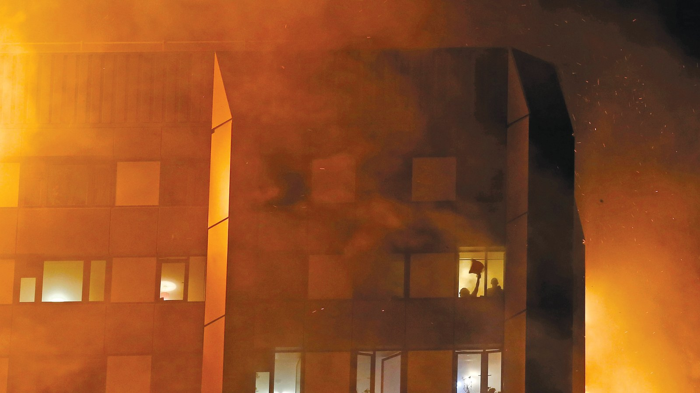
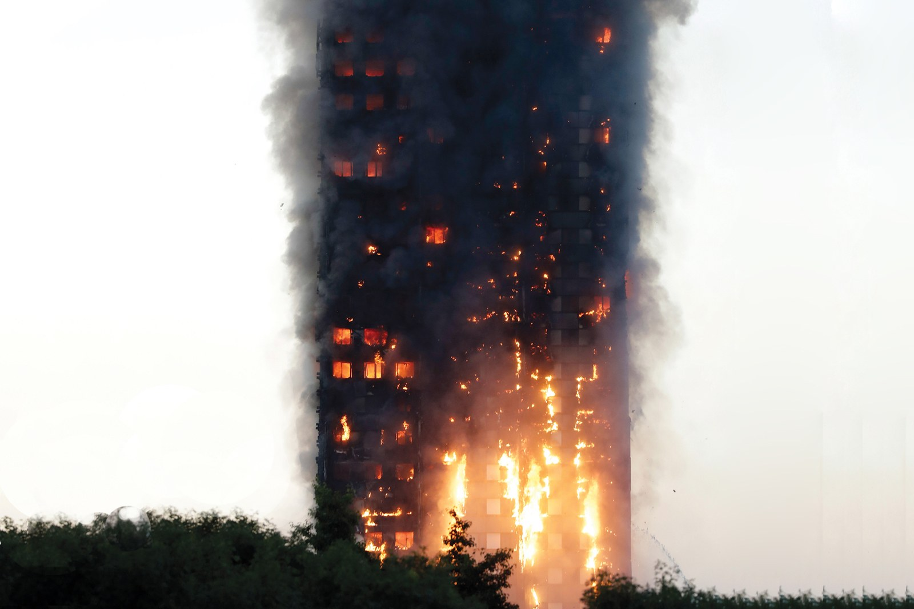

Trapped: The Story of the Grenfell Tower Fire

Evening Standard/eyevine/Redux
News

# Trapped: The Grenfell Tower Story

[(L)](https://www.facebook.com/sharer/sharer.php?u=https%3A%2F%2Fwww.gq.com%2Fstory%2Fgrenfell-tower-fire-inside-story&t=Trapped%3A%20The%20Grenfell%20Tower%20Story%20%7C%20GQ)

[(L)](https://twitter.com/share?text=Trapped%3A%20The%20Grenfell%20Tower%20Story%20%7C%20GQ&url=https%3A%2F%2Fwww.gq.com%2Fstory%2Fgrenfell-tower-fire-inside-story)

[(L)](https://www.gq.com/contributor/tom-lamont)
By
[Tom Lamont](https://www.gq.com/contributor/tom-lamont)
4 days ago

Buildings aren’t supposed to burn the way London’s Grenfell Tower did. But to the residents stuck inside, and to the firefighters who rushed to save them, this was a different kind of fire, a blaze that burned at 1,800 degrees, a devastating inferno that killed dozens and shocked an entire nation. This is the untold story of what it felt like to fight that fire and to flee it—a story of a thousand impossible decisions and the people who dared that night to make them..........................................

#### 1. Incipient Stage

**Oluwaseun Talabi** didn't want to live in the tower anymore. The 30-year-old, a watchful, muscular man who worked in construction, said as much to his family on the night of June 13, 2017. Talabi lived with his partner, Rosemary, and their 4-year-old daughter in a two-bedroom apartment on the 14th floor of a London high-rise called Grenfell Tower. Their home was on the southwest corner of the tower, which meant its windows provided two very different city panoramas. From the living room, you looked west to some of the poorer fringes of the British capital. The bedrooms faced ritzier territory to the south—roads lined with mansion homes that seemed continuously under renovation, their cellars scooped deeper and deeper into the city to make room for new amenities.

Like a lot of Grenfell’s occupants, Talabi and his family were public-housing tenants, their homes provided by the neighborhood municipal authority, Kensington and Chelsea Council. Around 350 people lived in the tower, 129 one- and two-bedroom apartments stacked 24 stories high. The building had lately been refurbished, its bolted-on satellite dishes stripped from the outside walls and replaced by neat squares of insulating paneling, so that the building’s 1970s concrete core—for 50 years plainly and brownly exposed—was concealed behind the bluish silver of new cladding. Theirs wasn’t an objectionable home, but Talabi couldn’t be comfortable here. He had told his family more than once: "I didn’t like this place from the first day I got in here. And I won’t like it till the last day."

It was the evening of the last day. The couple ate, watched TV, got ready for bed. Talabi stepped out for a final cigarette. Passing the elevators on the 14th floor, he ducked into the escape stairwell—a narrow concrete space that bore right down the middle of the building. The stairwell was also the only tenable route out of Grenfell Tower should trouble ever come, something Talabi thought about often. He did not regard himself a worrier, more an evaluator; and evaluating from the 14th floor, it had always seemed to Talabi that plenty could go wrong if his family lived this far from the ground. *If a fire took hold, somewhere below, would we get out?*

In the stairwell Talabi finished his smoke, then went back inside and went to sleep.

* * *

.........................................

**"Fire, fire."** At a London station such as the one in North Kensington, firefighters start muttering the word to each other as soon as it appears on their watch-room teleprinter, a way of telling themselves: Get in the trucks. Get your equipment in order. Get your *head* in order. A first phone call to the emergency services came through from Grenfell Tower at 12:54 A.M. A faulty fridge had set fire to a resident's kitchen on the fourth floor. By 12:56 A.M. two fire trucks from North Ken station were wailing in the direction.

Grenfell was less than a mile away, and quickly visible above the housetops. When the trucks pulled up by the tower there was no indication, yet, that a fire burned inside. The men unloaded coils of hosing from the trucks and tapped hydrants for water and prepared to enter the building. Accidental fires sparked in concrete high-rises as often as they sparked anywhere else; concrete high-rises built or maintained with a proper respect for and dread of fire are able to contain them. A recently retired firefighter named Ian Frost, who’d served a decade in North Ken, told me he’d responded to calls at other high-rises in the district. "You knew that if you could get in quickly, isolate that fire, isolate that floor, it was all quite easy to control," he said.

Firefighters got inside Grenfell Tower and went up to the fourth floor, passing residents on the stairs who'd been woken from their beds by the commotion and the smoke. Two firefighters wearing breathing apparatuses broke down the door of the afflicted apartment and trained their hoses on the flames. They doused whatever burned. Downstairs, in the lobby, a veteran firefighter called David Badillo carried in extra equipment from the trucks.

The 44-year-old—shaven-headed, short, a marathon runner who took care to be fit—had served in the district for 17 years, and before he became a firefighter he had been a lifeguard at a nearby swimming pool. "He still knew people who lived inside the tower," Tim Hoy, a retired officer from North Ken and Badillo’s former boss, told me. (When I asked Badillo himself for an interview, he referred me to the London Fire Brigade, which declined my request. Badillo wasn’t averse to his story being told, he indicated, as long as it would help draw attention to those who’d suffered at Grenfell on June 14 and who still needed support; however, he did not feel he could contribute to my reporting without risking his job.) Colleagues described Badillo to me as loyal, soft-spoken, a "good hand." In firefighter terms he was "busy," which, as Tim Hoy explained, meant that he combined a degree of cheek with an eagerness to be in first on anything dangerous. It made sense to people that Badillo transitioned from lifeguarding to firefighting because he was a doer, a helper—a hurl-himself-in-er.

I talked to several of Badillo’s colleagues and friends about what happened to him that night. He was coming through Grenfell's lobby, on his way to fetch more equipment from the trucks, when he was stopped by a young woman near the tower's entrance. She was a resident, she explained, and her 12-year-old sister was up on the 20th floor. The young woman was in some distress at the thought of her sister being alone. Their mother was working a night shift. Their father was out of the apartment visiting a friend. The woman asked Badillo if she could rush up with him, quickly, to fetch her sister. Badillo thought about it and said no. But stay here, he told her, and I'll go and get your sister. He found out a name—Jessica—and borrowed the keys to the apartment. Then he climbed into the elevator, pressing for the 20th floor.

"You've got to think on your feet," a serving colleague of Badillo's said. "Dave went into that lift without BA [breathing apparatus]. I've said to him I love him for it. For trying to help."

Badillo traveled up the tower. Residents leaving the building had spoken of seeing fire on the fifth floor, even on the sixth floor. To an experienced city firefighter, this would not have made sense. However violent, a fire in a high-rise like this ought to have been overmatched by the concrete walls of the apartment in which it burned. A fourth-floor fire should remain a fourth-floor fire. Badillo later told people that his elevator had gotten to the 14th or 15th floor when it stopped and the doors juddered open. Immediately a black, blinding, silent smoke rushed in around him.

* * *

.........................................

#### 2. Growth Stage

**Fire from the fourth floor** had reached an outside wall of the tower and then caught—unthinkably—the sheer sides of the exterior. Fat amber flames licked up Grenfell's northeastern elevation so quickly, so determinedly, that for a time firefighters stationed indoors and outdoors would have been responding to wildly different degrees of crisis. What would have seemed inside to be a manageable appliance fire was catastrophizing, outside, into the gravest threat to residential Londoners in 75 years: since the city's bombing at war. One of the first police officers to arrive at the scene would later say that "the building was melting." At least 320 people were inside. Most, like Oluwaseun Talabi, were asleep.

He awoke at 1:30 A.M., disturbed by shouts from below. Disoriented, Talabi supposed that what he was hearing was the sound of a party. The night before, he'd been woken at a similar hour by a gathering on a floor below: Spanish-language, it'd sounded like, but in Grenfell Tower it could as easily have been Arabic, English, Italian, Portuguese, Persian, Pashto. It was summer and gatherings ran late. Mid-June was Ramadan, and observing residents would have hosted family and friends to break fasts. Talabi looked for the disturbance from his bedroom window and saw nothing. His 4-year-old daughter had climbed into her parents' bed while they slept, and Talabi lay back beside her and tried to fall back asleep.

There was no audible communal fire alarm in Grenfell Tower. It also had no sprinklers. (The law in England requiring sprinklers in buildings taller than 100 feet applies only to new buildings.) A bright and teacherly newsletter, distributed around the tower in 2014, described emergency policy in the event of a fire. "Our longstanding 'stay put' policy stays in force," the newsletter advised. "This is because Grenfell was designed according to rigorous fire safety standards." As advice, "stay put" does make some logical sense, at least in a concrete high-rise. The thinking (fire brigade–endorsed) is that by remaining where they are for as long as a fire is out of sight, residents won't flee from an area of relative safety into one of threat. Of course, this thinking means nothing if fire is able to spread up the side of a building, away from its concrete core.

Talabi was roused a second time, and now he could make out what was being shouted from the base of the tower: "Fire, fire!" He shook Rosemary awake and snatched on clothes while she put on a robe. He would not be staying put. Instead, he picked up his daughter, clasped hands with Rosemary, and ran them all to the front door. They opened it and were met by a wall of dense, rank smoke. Talabi pulled everyone back inside. Once they'd gummed wet towels around the edges of the front door, Talabi gathered all the bedsheets he could. The smoke he'd inhaled tasted of chemicals, like nothing he'd ever had in his lungs before. He didn't think they'd last more than a few gasps of it. He looked again out his bedroom window. The apartment was 14 stories up. He'd collected together 14 bedsheets.

Talabi ran to the kitchen to try to get eyes on the fire. Bands of flame were torquing around Grenfell Tower like a wrung cloth. Talabi could see inexplicable and contradictory things. Smoke from below. Fire from above. Fire *falling* from above, making a *tsk-tsk-tsk* sound as great glowing slices of something peeled away from Grenfell's stricken upper floors and dropped past his kitchen window. The couple went back inside their bedroom, where they paced, and called the emergency services, and tried to think. By now some neighbors had joined them in the apartment, driven out of their own homes by the smoke. Two were brothers, men in their 20s from Syria. One of them noticed that Talabi had been tying together bedsheets and he asked Talabi why. Talabi replied: "Bro..."

The fire neared their corner of the building. Talabi fastened the end of his knotted bedsheets inside the bedroom, fed the remainder out the open window, and then climbed out after it. As he hung on the outside of Grenfell Tower, his fingers curled around the frame of his bedroom window, he wasn't willing, yet, to test the strength of the sheets. Instead Talabi told Rosemary to pass out their daughter. But their daughter, crying and struggling, would not let herself be passed. She pushed herself away from the window frame, and Talabi in this moment saw that his plan as it was—to descend holding the bedsheets in one hand, his daughter in the other—was not going to work. As his belief in the plan failed, so did his strength. He realized he could not pull himself back inside. He kicked for a foothold beneath him, but the building's paneling was too slippery and his feet wouldn't stick. He stopped kicking. He clung to the window frame.

* * *

.........................................

**Talabi prayed that night.** On the 22nd floor, a mother of three offered up prayers of her own in Arabic. A woman who lived on the 20th sent a message to a friend: "Pray for me and my mum." On the 17th, a family recited *du'as* from the Koran. There were people of all religions in the tower, people who did every sort of job, large numbers of children and the elderly. There were teachers in there, and pupils, some due in classrooms the next morning at a school just north of the tower. Grenfell had a hairdresser, a caterer, a cleaner, a security guard. A woman on the 16th floor made art in her retirement, and a man on the 21st made websites. Pets: a dog named for a reggae musician on the 23rd, another for a racing driver on the 19th. There was an architecture-school graduate who rented right at the top; a young lecturer in criminology who was bunking with his aunt. The brothers who lived on Talabi's floor were recent refugees from the Syrian war. A man on the 23rd had moved to London, decades ago, to escape conflict in Afghanistan. A Sudanese man was visiting his mother that night. His body was later found on the ground near the tower. He'd jumped. The man from Afghanistan also jumped, and was found on the ground. The artist on the 16th floor was identified by her dental records, the caterer by his DNA. People died in the stairwells; people died near the elevators; people died in their homes. They spoke on cell phones to the emergency services and to family and friends, in any number of languages, until lines disconnected or they just fell silent. Relatives of the mother of three on the 22nd floor would later say her final words to them were about forgiveness. "You seemed to know that heaven was waiting for you," they said.

> Firefighters that night led, carried, and dragged residents away from the fire. And they left residents behind to it. They made hundreds of no-win decisions.

The girl on the 20th floor—the 12-year-old sister of the anxious woman in the lobby—was never found by David Badillo. When the elevator that Badillo was riding opened its doors halfway up the tower, he had to inch his way, blind, to the escape stairwell. He later told colleagues and friends how he ran down the stairs to the ground floor, where he retrieved a breathing apparatus and found another firefighter who was willing to accompany him back inside—back up. They climbed 20 flights, 40 punishing stairway turns, to where the girl's apartment was. By now, on these upper stories, the smoke was so concentrated that responders had to put their masks right up against the doors to read the apartment numbers. When Badillo and his partner found the correct door, it was ajar, as if the young girl—Jessica—had already fled. Nevertheless, the two firefighters searched inside, feeling their way along the walls, shouting, shouting, until they were convinced that nobody was inside, and until the air tank on Badillo's partner's back began to let out a high-pitched whistle. "At a certain point, your oxygen tank gives you that audible warning—to get out," Ian Frost explained. The colleague of Badillo's told me: "There comes a point where the firefighter's got to think: 'I have to. Or I'm going to die as well.' I can't imagine having to make that call. Dave's having to leave a place where he's been told there might be a 12-year-old girl—to save himself. He told me: 'I was gone. I had nothing left to offer.' I told him: 'You couldn't have done any more. Apart from die.' "

Badillo and his partner abandoned the 20th-floor apartment and, before their air ran out, they regained the stairwell. They were heat-stressed to the verge of collapse when they made it down to the ground.

Firefighters that night led, carried, and dragged residents away from the fire. And they left residents behind to it. They made hundreds of no-win decisions on June 14, about whether to help those in peril in the stairwell or whether to push on past and try to make it to those farther up. The handing over of a firefighter's breathing equipment to civilians (always a dangerous temptation) is forbidden by the London Fire Brigade—but it happened, I was told, and it was later forgiven, part of a brigade-wide amnesty on those everyday procedures ignored by firefighters in this frenzied, dirty, impossible evacuation.

Outside, firefighters had to aim water hoses at one of their own trucks, which had been ignited by all the falling cladding. For many of the evacuating residents, the most terrifying parts of their escape took place once they were outside, running through the area directly in front of the building, which had become a no-man's-land of tumbling metal. Firefighters began making shuttle runs back and forth, ferrying out evacuees under riot shields.

At 2 A.M., 3 A.M., 4 A.M., hours after the first firefighters had arrived, residents were still trapped. Still waving, still shouting: "Fucking *help* me." By 5 A.M., hardly any people were visible in Grenfell's windows. Firefighters on the ground held their heads, and panted, and were dismally honest with one another: "We're not going to get everybody out." When, earlier in the night, they saw a man on the 14th floor, hanging from a windowsill, knotted bedsheets trailing beneath him, they screamed at him to get back inside.

* * *

.........................................

#### 3. Flashover

**Oluwaseun Talabi would** have said to anyone who wasn't there, who wasn't *in* there, just close your eyes. Try to imagine it. No escape.

When a veteran firefighter in London read on his station's teleprinter that more than 20 of the city's 142 fire engines had just been sent to Grenfell Tower, his experience told him this must be terrorism: a bomb. When a little later he learned that 20 more engines had been dispatched, his experience came up blank. Plane crash? "I couldn't work it out," the veteran said. "This was a concrete tower. Not flammable." Responders at Grenfell spoke of a disorienting feeling—"like a dream"—as they watched the fire gust up and around the tower until it was engulfed.

Two inquiries (one political, one criminal) have been launched to determine causes and contributing factors; they will continue into next year. A BBC investigation conducted shortly after the fire suggested that the aluminum-composite cladding used at Grenfell was of an inferior—and cheaper—variety and was not officially classified as fire-retardant. A 75-page preliminary report compiled by a group called Architects for Social Housing, or ASH, focused on the fact that Grenfell had been *doubly* clad during its refurbishment. First with squares of dense foam insulation, to keep the building warm. Second with squares of aluminum-composite rain-screen paneling, to keep it dry. The ASH report, which drew on the informed speculation of dozens of experts, proposed the likelihood of cavities between the double layer of cladding. If oxygen lurked in these cavities, it would have been there that the fire at Grenfell spread most aggressively. The outer aluminum rain screen, slower to burn than insulation, might even have kept water from adequately dousing the worst of the fire. The head of the London Fire Brigade was asked, afterward, what additional tools might have aided her crews on the night, and she answered: "A miracle."

> One resident from the 15th floor couldn’t shake a feeling he’d left something important behind. “My soul is there in that building,” he later told people.

Seen from the ground, Britain can appear to be a country under great strain, its people divided since a close vote last year to abandon membership in the European Union, its public services teetering after a decade of drastic spending cuts under Conservative leadership. When we look *up,* though, look *out* from a tower such as Grenfell, all the cranes, all the tarp-shrouded scaffolding, the half-built shopping-mall expansions and condos being poured into place—they suggest that despite a general national lassitude there is at least one industry enjoying a gaudy and conspicuous boom.

In London, now, 150-year-old pubs might close overnight because developers have cleverer notions about the use of their real estate. The roads with all the mansions in places like Kensington and Chelsea are some of the least peaceful, so often are builders brought in for improvement works. The city has been seized by a glib, unabashed, and apparently unstoppable will to *build.* Government-spending cuts might actually have stimulated this construction boom, in that municipal planning offices, ever poorer, ever more marginalized, are less able to scrutinize or say no to the next gratuitous project, and the next, and the next.

"Brexit" came about in part because its propagators kept insisting to domestic voters that European membership imposed on Britain a lot of fussy regulation that it might be better, richer, nobler in sloughing off. This was true and it was false. Construction in Britain is among those industries subject to much fiddly and costly regulation—but many of these are safety laws, in place to protect society at large and in particular society’s voiceless and vulnerable. Much building regulation memorializes some avoidable tragedy from the past, some other complacency that led to some other Grenfell.

It would emerge later that well over 100 tower blocks and buildings around Britain had been clad in materials that, like those used at Grenfell, failed basic fire-safety tests. There is now an effort to peel the flammable skin from these buildings, but it has not been quick work. Wherever such de-cladding gets under way, there usually remains a population of residents still living inside—closing their eyes, just imagining it.

* * *

.........................................

#### 4. Fully Developed Stage

**Oluwaseun Talabi,** back inside his apartment: "So this is how…" He looked at his partner and he looked at his daughter and he thought: "Wow." He no longer believed they would get out.

* * *

.........................................

**A student on** the eighth floor got out—along with an aunt he lived with, and all of the neighbors from his floor—because he was awake and able to rouse them when the fire started. ("PlayStation saved your life," he would later say.) A man on the 16th was telephoned by a neighbor and told: "Get out." He wrapped a towel around his face and ran. More than 600 emergency calls were recorded from inside Grenfell Tower on June 14, and in those calls made before 2:47 A.M., many residents were told to remain in their apartments. After that time, according to a subsequent BBC investigation, "stay put" was abandoned and the advice to residents became to flee, however possible. A father of two told his wife and daughters before they began their descent: "There is no turning back." After leading his own wife and daughter to safety, a resident from the 15th floor couldn't shake a feeling he'd left something important behind. "My soul is there in that building," he later told people. "I don't think my soul is with me here—it's there."

* * *

.........................................
**David Badillo's sister,** Jane, in the morning: "Are you okay?"

She sent the message to her brother by text, having just learned about the fire on the news. It was 7 A.M. Badillo was still at Grenfell, which would continue to burn, fitfully, into the afternoon and evening of June 14. The first-responding firefighters had been there for six hours. They were about to be sent home. Badillo replied: "Bit numb."

"Love you."
"Love you."

A few minutes later, Badillo messaged his sister again, to ask what they were saying on the news. How many people? Jane said five was the confirmed number so far. Badillo wrote: "It's much more than that."

Jane Badillo shared the above messages with me, and agreed to a limited interview, on the condition that I made it clear it was her decision to contribute to my reporting, and not her brother's. Since June 14 it has been difficult for the wider public to grasp, exactly, what individual firefighters went through that night at Grenfell Tower; most rank-and-file first responders have been banned from talking to the media, until the investigations into the fire have been completed. But Jane had been concerned about the psychological impact of the disaster on her brother and his colleagues. She suspected they were bottling up quite a lot. Badillo was, and one night, while the siblings were talking, it all came pouring out—what had happened to him immediately after the fire. When Badillo and the other firefighters had been relieved, they were sent for a cup of tea, sent to be debriefed, sent home. Badillo had ridden his bike in before his shift, he told Jane, and now he rode it home, the smoldering tower still in view for some of the route. When he got back to his wife and his baby daughter, Badillo tried to sleep, but he couldn't. He told his sister he ended up reading about Grenfell on his phone, and while scrolling through his Facebook feed he saw messages from a pair of old friends, brothers named Carlos and Manfred Ruiz, whom he'd been close to ever since the trio worked together as lifeguards at the swimming pool by the tower. The Ruiz brothers were searching for their 12-year-old niece, who hadn't been seen since the start of the fire. Badillo talked to them on the telephone, and they said the girl had lived on the 20th floor. Her name was Jessica.

Something went tight inside Badillo's stomach then and stayed that way for weeks.

He had up till then been reckoning with a dull, free-floating guilt about his promise to the woman in the lobby—guilt that he'd let down strangers. This phone call was the start of a different feeling, that he'd let down something closer to family. By the time Badillo told his sister about it, "he was in bits," Jane recalled. "Couldn't let go, you know. I said, 'There's nothing more you could have done.' " The girl's remains were later identified on the 23rd floor. Many victims of the fire, especially those on the uppermost stories, had climbed to try to escape it. Jane recalled how Badillo went over and over decisions he'd made in the tower. "Should he have gone up [on his first trip in the elevator] and not come down? Because Jessica could have been in the stairwell, one or two floors above, and he could have got to her."

* * *

.........................................

[(L)](https://www.facebook.com/sharer/sharer.php?u=https%3A%2F%2Fwww.gq.com%2Fstory%2Fgrenfell-tower-fire-inside-story&t=Grenfell-Tower-Trapped-1217-GQ-3x2.jpg)

[(L)](https://www.pinterest.com/pin/create/button/?url=https%3A%2F%2Fwww.gq.com%2Fstory%2Fgrenfell-tower-fire-inside-story&media=https%3A%2F%2Fmedia.gq.com%2Fphotos%2F5a0b1a625ca5f13ad4f2f981%2F1%3A1%2Fw_680%2Cc_limit%2FGrenfell-Tower-Trapped-1217-GQ-3x2.jpg&description=Grenfell-Tower-Trapped-1217-GQ-3x2.jpg)

**Later, a child from the area** would draw an unsettling but perceptive picture of Grenfell Tower, showing the building in its three phases of existence. "Ugly" (this part of the picture showed the tower brown, not very attractive, its 1970s concrete core on display). "Shiny" (Grenfell looked blue, slickly reclad). "Dead" (now it was black—shrunken). The tower did look shrunken after June 14, as if fire had not only gutted and flayed it, blown out its windows and left it pocked and charcoaled—but as if fire had shamed it. "They should cover it up, put it under a sheet," a neighbor said to me.

As close as a police cordon permitted, a perimeter ring of tributes grew up around the tower. Pinned to garden fences, piled against church walls, stuck to steel barricades, there were photos and messages. Posters of the missing were mounted with whatever was at hand, including packing tape, so that many pictures of presumed victims were bordered with the same word printed over and over again: FRAGILE. The girl who lived on the 20th floor—her full name was Jessica Urbano Ramirez—was among those victims whose identification would take many weeks. Right after the fire, and in the absence of knowing for sure, posters of her were distributed so urgently around the neighborhood that Jessica's face became a precise and wrenching symbol of exactly what the night had cost.

When her remains were finally identified, Jessica's family put out a statement in which they recalled the young girl's kindness and her infectious laugh. "Nothing will ever bring our little girl back," the family wrote. "We will not rest until we get justice for her and for the many other lives lost."

* * *

.........................................

**It took until November** before investigators could provide a final toll of the dead: 71. The last visible human remains had been removed from the tower in early July, the work after that continuing with fingertips, with sieves, with archaeologists, with a hired American official who'd done comparably dire work in the aftermath of 9/11. The Grenfell fire, at its peak, burned at 1,800 degrees Fahrenheit. What was left to recovery workers was tons and tons of ash.

There was some skepticism about this recovery work in the community, a twitch-response distrust that had some wondering if more people hadn’t died in the fire than the official count made room for. I asked a local about this particular paranoia, which was widespread, and he shrugged: "These people, they’ve been fucked over too many times in the past." There were rational enough reasons for the slowness and haziness of the count. In terms of knowing who to look for in this—whose DNA—the search in the ruins of Grenfell was complicated by a possibility that not all those living in the tower on June 14 were documented tenants. If there were guests who’d been visiting the tower on June 14, especially if they were visiting the upper stories from which so few escaped, they might have died along with everybody who knew of their whereabouts.

I spoke to someone who'd worked on the recovery in the tower this summer. I asked what it was like. He took a breath. "[The apartments had] no front doors, no windows, there was nothing in them, all the plaster was down, even the stud walls had gone. You might make out a mattress, only because of the springs. Some of the porcelain, like a toilet seat, survived. There was nothing else, only the concrete walls." This person paused before continuing. "You could tell that some of the deceased were still in those homes because of the patterns under the rubble. Flat, flat, flat and then..." He had been gesturing with his hand, drawing a level line. Now he described a curve. "Like a hump. Under the dust."

* * *

.........................................

**On June 16,** after dark, there was a vigil beside the tower. It was peaceful. People held candles and stood in close, tactile circles around the bereaved. David Badillo made his way there, invited by his old friends the Ruiz brothers. He would be meeting Jessica's wider family for the first time. Badillo later told those he was closest to that he made this journey back to Grenfell on trembling legs. He had no idea how the girl's family would react to him. As a firefighter explained it to me: "In your heart of hearts, you know you tried your best. You know all the firefighters tried their best. But you still had to leave people in that building. You're a firefighter who *left.* You got out. And you don't know how you're gonna be thought of." At the vigil, Jessica's family held Badillo tight and barely let go. He wept, and told them he was sorry.

It was the start of an intimate relationship between the shell-shocked firefighter and the grieving family. A relationship that found its expression on social media ("Nothing but love," Badillo wrote on Facebook on the day of the vigil). A relationship that revealed itself, briefly, on national TV, when broadcasters filmed Badillo and the family consoling each other. A relationship that in the main proceeded just as grief does, by hard-won degrees, and out of public view.

* * *

.........................................

#### 5. Burnout

**A moment of silence** (broadcast live); a charity single by pop stars; incautious pronouncements in the op-eds; incautious scapegoat-hunting in the tabloids: The country went through its clumsy protocols after a shock. Closer to the tower, people tried to pick themselves up, put their worlds back together. Survivors discharged from the hospital went to live in hotels. Social-housing tenants had been promised new homes by Kensington and Chelsea Council, though there were fears about what and where these new homes would be. They'd been through shock, grief, anger. Now this community was, more than anything, exhausted.

On July 19, five weeks after the fire, survivors from Grenfell attended a public meeting at Kensington and Chelsea Council's headquarters. Some were invited up to microphones in the council's main chamber to speak, but the majority were put in a gallery above. A small group of survivors, exasperated by this, tried to get down to the chamber. "*We* fear being burned to death in our homes," councilors were told that afternoon, by a North Kensington resident. "*You* fear being shouted at." One of the councilors present in the chamber, Matthew Palmer, acknowledged to me that there was some fear that afternoon. He said that police had advised there was a risk of violent disturbance; and it was for this reason, Palmer insisted, he was filmed by news cameras mouthing "Don't let them in" as the descending group tried for the chamber. The council's security team locked the fire doors to keep the survivors out, an act that must have taken a special kind of zombie resolve. But eventually a kind of compromise was reached, and more speakers than planned were admitted to the chamber to speak about their experiences. Palmer was frank with me about how "absolutely harrowing" the next hours were. He was perhaps more frank than I would have expected. "Look," Palmer said, "there's a possibility I may be up on a charge of corporate manslaughter here—the entire council leadership could be up on charges of corporate manslaughter. So hearing the stories told about Grenfell at that meeting, that was harrowing, of course it was. But I felt—and the council felt—we *had* to sit through it, even if it lasted all night. Because however harrowing it was to hear, it was preferable to being inside that tower as it burned."

* * *

.........................................

**David Badillo was up** in the public gallery at the meeting. A member of Jessica’s family had invited him to the council building as a guest, and outside the main chamber Badillo circulated, talking to survivors. He must have noticed someone whose face he recognized, whose story he was familiar with—someone whose unlikely escape from the tower had been much talked about by local firefighters since June 14. Badillo went over and introduced himself to Oluwaseun Talabi. He shook his hand fiercely.

I did, too, when I first met Talabi—shook his hand fiercely and for perhaps a few seconds longer than was conventional. You feel in awe of them, these improbable survivors, and seized by a strange instinct to confess: *I don't know if I could have done the same.* When I said something like this to Talabi, he replied: "Listen. When you're about to die, you don't know *what* you're doing." We met in a hotel, where he'd been with his family since they left the hospital, having been treated for the effects of smoke inhalation. Talabi had been able to chart his internal recovery from the changes in the color of his spit, black to caramel to normal. We met several times, always in the restaurant of the hotel. The room had a number of flat-screen TVs, and as most of them were tuned to all-hour news, I got used to the fact that while Talabi and I spoke, stories about Grenfell would sometimes roll by in the background. The aftermath had become daily news. The chief of the London Fire Brigade was interviewed one day, acknowledging that she'd sought counseling after June 14. The oldest victim of the fire had been identified, an 82-year-old man, and the youngest, a pregnant evacuee's stillborn son.

Talabi talked me through how he escaped. He was last seen by neighbors and firefighters clinging to his bedroom window frame, feet scrabbling, spent. After that, Talabi said, the two Syrian brothers inside his apartment had reached out and dragged him back through the window. One of those brothers was now dead. He had not made it out. There were three other neighbors who'd taken shelter in the apartment that night, and they were dead, too.

Talabi said: "You've seen Africans, in Nigeria, the way they tie kids to their back?" This was how, with Rosemary's help, Talabi had tied their daughter to his body. The plan was to go back out the window, this time with Talabi's daughter hitched to him. "We're just about to go out the window when the fire brigade opened the door and they said—" Here Talabi paused. He'd stood up, for no clear reason except that maybe such memories were not relivable sitting down. Now he sat and rubbed his head. "I can't remember the exact word they told us. 'Run'? Or 'Go'? Or 'Escape'?"

It was their tone that convinced him, "like either you run or you get burnt." Without hesitation he and his partner held hands, and with their child on Talabi's back, they went out through the front door again. The smoke density seemed to have doubled, tripled from earlier. And Talabi had been convinced, earlier, it would kill them. They missed the door to the stairwell and had to retrace their steps. As they felt their way, blind, Talabi would have cause to be thankful for his nighttime cigarettes, because once inside the stairwell he could find the handrail without being able to see. "We're running [down].... We're tiring.... Every breath, you know you're taking in something dangerous.... And my child behind me—" Talabi said that this was the very worst of it: the sound that his 4-year-old made as she tried to breathe. They stumbled down past the tenth, past the seventh. They were stumbling over bodies, he later realized. "I can feel myself fading.... I'm thinking, 'I'm *not* losing my family, for nobody or nothing'.... The third floor was where the firemen were. And from the fifth, I could see a bit of light down there.... How I describe it, it's almost like a battery on a phone, and you've got two percent left.... That's what I felt like. And when I saw that light, it gave me like an extra one percent of life."

These last seconds, these last floors down, were only hazily available to Talabi now. He knew the firefighters ran his family out the entrance under riot shields. That they sat by a tree outside and stared up at what they'd escaped. Talabi was already thinking about the neighbors he'd last seen in the apartment, weighing as he would for some time what more he could or couldn't have done, that miserable accounting that so many who survived Grenfell would go through. Talabi recalled an elderly neighbor approaching him with water. He said, "You're lucky. You should be thanking your God." The man was interrupted, then, by a wail of animal grief from close by. Another family, Talabi later worked out, learning the worst. "And the man goes to me: 'This is why I say you're lucky.' "

* * *

.........................................

**Outside his hotel,** having recounted some of this, Talabi stood alone for a silent, intent cigarette. It was early evening—two months exactly since the night of the fire. I left him and walked north, to Grenfell, where about a hundred people from the community had gathered to commemorate the dead and to mark a slight but not insignificant waypoint in their own recovery: two months weathered. Among the crowd, I saw David Badillo, carrying his young daughter. He sought out his old friend Carlos Ruiz—Jessica's uncle—and the two men squeezed each other's necks in greeting. At seven o'clock, the group set off together on a planned march.

They were silent as they walked through what is by any measure a loud and traffic-choked part of London. The city, in answer to them, fell quiet. Conversations stopped. Strides were checked and buses halted mid-road. Behind chain-link fences, kids picked up soccer balls and stood panting. Around the country, shaken councils and landlords directed a clammy new scrutiny at the fire-safety measures in their own buildings. Cladding, square miles of the stuff, kept being peeled from other high-rises. In North Kensington, plans were underway to cover the ruined Grenfell with a tarp, until such a time this unmeant mausoleum could be demolished entirely.

The march followed a route away from the tower, and then circled around. When they arrived back at Grenfell, David Badillo and his daughter got separated from the larger group, and I watched as the firefighter hesitated, standing aside to let marchers flow by, as though wondering where his place was among them. In the end he walked on, past the tower and toward his fire station, holding his daughter close to his chest as he went.

Tom Lamont *is a writer based in London.*

*This story originally appeared in the December 2017 issue with the title "Trapped."*