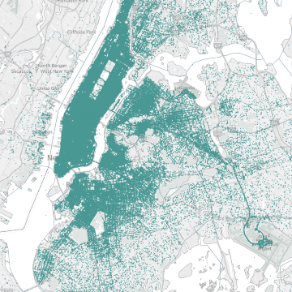

Travel Time Optimization With Machine Learning And Genetic Algorithm

Travel Time Optimization With Machine Learning And Genetic Algorithm

https://towardsdatascience.com/travel-time-optimization-with-machine-learning-and-genetic-algorithm-71b40a3a4c2

What is the relationship between machine learning and optimization? — On the one hand, mathematical optimization is used in machine…