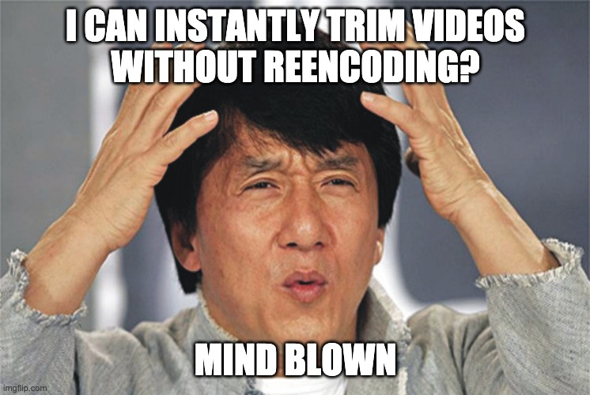

Trim Videos Instantly - Bernd Verst

Is your video too long for upload to Twitter or Instagram? Do you want to export just a specific clip? Using video editors to trim videos requires reencoding the entire video. Instead I will show you how to **instantly** trim your videos and even maintain embedded subtitle tracks.

### Background

A few days ago I created a post on easily [adding subtitles to your videos](https://bernd.dev/2020/04/adding-subtitles/). Today I wanted to verify that Twitter correctly shows these subtitles, but I discovered that my video was too long. Having played with **FFmpeg** I suspected that there may be a more efficient way for trimming videos than using a video editor. Be prepared to have your mind blown!

## Requirements

### FFmpeg

You will need the open-source [FFmpeg](https://www.ffmpeg.org/) tool.

> FFmpeg is the leading multimedia framework, able to decode, encode, transcode, mux, demux, stream, filter and play pretty much anything that humans and machines have created.

Please follow the [installation instructions here](http://ffmpeg.org/download.html). On Mac, simply use *Homebrew* with `brew install ffmpeg`

## Instantly trim videos

The following command reads the source video and copies all streams contained within (video, audio, subtitles) to the output. The various time parameters ensure only a specific part of the original video is written to the output. **The video and audio streams are not reencoded.** The time required for reencoding would directly depend on the duration of the video, however we are simply copying parts of the video. For this reason **the following operation is near instant**. A huge time saving over workflows involving video editors.

	INFILE="video.mp4"
	OUTFILE="shortenedclip.mp4"

	START="00:00:12.35"     # Start Time in hh:mm:ss.msec format
	DURATION="00:01:05.4"   # Duration in hh:mm:ss.msec format

	################## Alternative format ##################
	# START="12.35"      # Start time in s.msec format     #
	# DURATION="65.4"    # Duration time in s.msec format  #
	########################################################

	ffmpeg -ss $START -i $INFILE -c copy -map 0 -t $DURATION $OUTFILE

	# If you prefer you can also specify an end time similar to the start time

	END="00:01:12.75"
	ffmpeg -ss $START -i $INFILE -c copy -map 0 -to $END $OUTFILE

