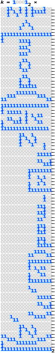

Tupper's self-referential formula - Wikipedia

# Tupper's self-referential formula

From Wikipedia, the free encyclopedia

**Tupper's self-referential formula** is a [formula](https://en.wikipedia.org/wiki/Formula) that visually represents itself when graphed at a specific location in the (*x*, *y*) plane.

## History[]

The formula was defined by Jeff Tupper and appears as an example in Tupper's 2001 [SIGGRAPH](https://en.wikipedia.org/wiki/SIGGRAPH) paper on reliable two-dimensional computer graphing algorithms. [[1]](https://en.wikipedia.org/wiki/Tupper%27s_self-referential_formula#cite_note-1) This paper discusses methods related to the GrafEq formula-graphing program developed by Tupper.[[2]](https://en.wikipedia.org/wiki/Tupper%27s_self-referential_formula#cite_note-2)

Although the formula is called "[self-referential](https://en.wikipedia.org/wiki/Self-reference)", Tupper did not name it as such.[[3]](https://en.wikipedia.org/wiki/Tupper%27s_self-referential_formula#cite_note-3)

## Formula[]

The formula is an [inequality](https://en.wikipedia.org/wiki/Inequality_(mathematics)) defined as:

           1  2      <    ⌊      m  o  d      (      ⌊      y  17      ⌋      2    −  17  ⌊  x  ⌋  −    m  o  d    (  ⌊  y  ⌋  ,  17  )      ,  2    )      ⌋        {\displaystyle {1 \over 2}<\left\lfloor \mathrm {mod} \left(\left\lfloor {y \over 17}ightfloor 2^{-17\lfloor xfloor -\mathrm {mod} (\lfloor yfloor ,17)},2ight)ightfloor }  [{\displaystyle {1 \over 2}<\left\lfloor \mathrm {mod} \left(\left\lfloor {y \over 17}ightfloor 2^{-17\lfloor xfloor -\mathrm {mod} (\lfloor yfloor ,17)},2ight)ightfloor }](../_resources/205e0226b1ac14b4e54865b18c4a0c51.bin)

or, as plaintext,
> 1/2 < floor(mod(floor(y/17)*2^(-17*floor(x)-mod(floor(y), 17)),2))

where ⌊ ⌋ denotes the [floor function](https://en.wikipedia.org/wiki/Floor_and_ceiling_functions), and mod is the [modulo operation](https://en.wikipedia.org/wiki/Modulo_operation).

Let *k* equal the following 543-digit integer:

> 960 939 379 918 958 884 971 672 962 127 852 754 715 004 339 660 129 306 651 505 519 271 702 802 395 266 424 689 642 842 174 350 718 121 267 153 782 770 623 355 993 237 280 874 144 307 891 325 963 941 337 723 487 857 735 749 823 926 629 715 517 173 716 995 165 232 890 538 221 612 403 238 855 866 184 013 235 585 136 048 828 693 337 902 491 454 229 288 667 081 096 184 496 091 705 183 454 067 827 731 551 705 405 381 627 380 967 602 565 625 016 981 482 083 418 783 163 849 115 590 225 610 003 652 351 370 343 874 461 848 378 737 238 198 224 849 863 465 033 159 410 054 974 700 593 138 339 226 497 249 461 751 545 728 366 702 369 745 461 014 655 997 933 798 537 483 143 786 841 806 593 422 227 898 388 722 980 000 748 404 719

If one [graphs](https://en.wikipedia.org/wiki/Graph_of_a_function) the set of points (*x*, *y*) in 0 ≤ *x* < 106 and *k* ≤ *y* < *k* + 17 satisfying the inequality given above, the resulting graph looks like this (the axes in this plot have been reversed, otherwise the picture would be upside-down and mirrored):

[(L)](https://en.wikipedia.org/wiki/File:Tupper%27s_self_referential_formula_plot.svg)

Derivation of *k*

The formula is a general-purpose method of decoding a bitmap stored in the constant *k*, and it could actually be used to draw any other image. When applied to the unbounded positive range 0 ≤ *y*, the formula tiles a vertical swath of the plane with a pattern that contains all possible 17-pixel-tall bitmaps. One horizontal slice of that infinite bitmap depicts the drawing formula itself, but this is not remarkable, since other slices depict all other possible formulae that might fit in a 17-pixel-tall bitmap. Tupper has created extended versions of his original formula that rule out all but one slice.[[4]](https://en.wikipedia.org/wiki/Tupper%27s_self-referential_formula#cite_note-4)[[5]](https://en.wikipedia.org/wiki/Tupper%27s_self-referential_formula#cite_note-5)[[6]](https://en.wikipedia.org/wiki/Tupper%27s_self-referential_formula#cite_note-6)

The constant *k* is a simple [monochrome](https://en.wikipedia.org/wiki/1-bit_color)  [bitmap image](https://en.wikipedia.org/wiki/Bitmap) of the formula treated as a binary number and multiplied by 17. If *k* is divided by 17, the [least significant bit](https://en.wikipedia.org/wiki/Least_significant_bit) encodes the upper-right corner (*k*, 0); the 17 least significant bits encode the rightmost column of pixels; the next 17 least significant bits encode the 2nd-rightmost column, and so on.

## See also[]

## References[]

### Notes[]

### Sources[]

## External links[]