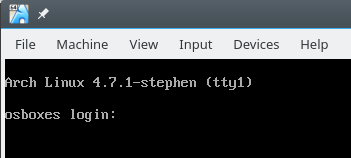

Tutorial - Write a System Call - Stephen Brennan

# Tutorial - Write a System Call

*Stephen Brennan • 14 November 2016*

A while back, I wrote about writing a [shell in C](https://brennan.io/2015/01/16/write-a-shell-in-c/), a task which lets you peek under the covers of a tool you use daily. Underneath even a simple shell are many operating system calls, like [read](https://linux.die.net/man/3/read), [fork](https://linux.die.net/man/3/fork), [exec](https://linux.die.net/man/3/exec), [wait](https://linux.die.net/man/3/wait), [write](https://linux.die.net/man/3/write), and [chdir](https://linux.die.net/man/3/chdir) (to name a few). Now, it’s time to continue this journey down another level, and learn just how these system calls are implemented in Linux.

## What is a system call?

Before we start implementing system calls, we’d better make sure we understand exactly what they are. A naive programmer—like me not that long ago—might define a system call as any function provided by the C library. But this isn’t quite true. Although many functions in the C library align nicely with system calls (like [chdir](https://linux.die.net/man/3/chdir)), other ones do quite a bit more than simply ask the operating system to do something (such as [fork](https://linux.die.net/man/3/fork) or [fprintf](https://linux.die.net/man/3/fprintf)). Still others simply provide programming functionality without using the operating system, such as [qsort](https://linux.die.net/man/3/qsort) and [strtok](https://linux.die.net/man/3/strtok).

In fact, a system call has a very specific definition. It is a way of requesting that the operating system kernel do something on your behalf. Operations like tokenizing a string don’t require interacting with the kernel, but anything involving devices, files, or processes definitely does.

System calls also behave differently under the hood than a normal function. Rather than simply jumping to some code from your program or a library, your program has to ask the CPU to switch into kernel mode, and then go to a predefined location within the kernel to handle your system call. This can be done in a few different ways, such as a processor interrupt, or special instructions such as `syscall` or `sysenter`. In fact, the modern way of making a system call in Linux is to let the kernel provide some code (called the VDSO) which does the right thing to make a system call. Here’s an [interesting SO question](http://stackoverflow.com/questions/12806584/what-is-better-int-0x80-or-syscall) on the topic.

Thankfully, all that complexity is handled for us. No matter how a system call is made, it all comes down to looking up the particular *system call number* in a table to find the correct kernel function to call. Since all you need is a table entry and a function, it’s actually very easy to implement your own system call. So let’s give it a shot!

## Set up your VM

Unlike my [previous](https://brennan.io/2016/10/13/kernel-dev-ep1/)  [articles](https://brennan.io/2016/11/03/kernel-dev-ep2/) on kernel development, implementing a system call is not something you can do in a kernel module. Instead, you must actually get a copy of the Linux source, modify it, compile it, and boot it. This is something you could do directly on your main computer (if you run Linux), but it’s probably best to try this out on a virtual machine! For this example, we’ll be using VirtualBox, so install it if you don’t already have it.

Although you can mess around with setting up a virtual machine manually, it’s more worth your time to simply download a pre-installed virtual machine. You can download a premade Arch Linux machine [here](http://www.osboxes.org/arch-linux/). In this article, I’ll be using the 201608 CLI version for VirtualBox. Download and unzip it. Create a new virtual machine in VirtualBox, and when it asks about a hard disk file, choose the `vdi` file you downloaded. Create and run your virtual machine, and you should be greeted with a CLI login screen. The root password should have been noted on the download page (mine was `osboxes.org`).

*Note: if you have a multicore machine, it would be a good idea to edit your VM settings to allow it to use more than one core. This will dramatically improve your compile times, so long as you substitute*  `make -jN`  *for* `make`  *in all following commands, where N is the number of cores you give your VM access to.*

The first preparation step you should take is to install `bc`, a build-time dependency of Linux that isn’t included in the virtual machine. Unfortunately, this will require that you update the virtual machine first. Note that every command I give in this article should be run as root, which shouldn’t be hard, because the only user on your VM is, in fact, root.

	$ pacman -Syu
	$ pacman -S bc
	$ reboot

You have to reboot because the kernel will almost certainly be updated, and we want to make sure we’re running the kernel we have installed before continuing with the rest of this process.

## Acquire Source Code

After you have your development virtual machine, the next step is to download the kernel source code. Although most developers reflexively reach for Git when they need to get code, this is probably not the time for that! The Linux Git repository is *very* large, and so cloning it will almost certainly not be worthwhile. Instead, you should download the source tarball associated with your kernel version. You can check your version with `uname -r`, and then **pick a download at [kernel.org](https://cdn.kernel.org/pub/linux/kernel/v4.x/) that is as close to your kernel version as possible**. Within your virtual machine, download the source using `curl`, e.g.:

	# -O -J will set the output filename based on the URL
	$ curl -O -J https://www.kernel.org/pub/linux/kernel/v4.x/linux-VERSION.tar.xz

And then you can decompress your tarball, e.g.:

	$ tar xvf linux-VERSION.tar.xz
	$ cd linux-VERSION

## Configure Your Kernel

The Linux Kernel is extraordinarily configurable; you can enable and disable many of its features, as well as set build parameters. If you were to make every configuration choice manually, you’d be doing it all day. Instead, you can skip this step by simply copying your kernel’s existing configuration, which is conveniently stored (in most Linux computers) in the compressed file`/proc/config.gz`. To use this configuration for your new kernel, use the command:

	$ zcat /proc/config.gz > .config

To ensure that you have values for all configuration variables, run `make oldconfig`. More than likely, this will not ask you any configuration questions.

The only configuration item that you ought to modify is the kernel name, to ensure that it doesn’t conflict with your currently installed one. On Arch Linux, the kernel is built with the suffix `-ARCH`. You should change this suffix to something unique to you: I used `-stephen`. To do this, the simplest way is to open `.config` with a text editor, and modify this line directly. You’ll find it just under the “General setup” heading, not too far down the file:

	CONFIG_LOCALVERSION="-ARCH"

## Add Your System Call

Now that the kernel is configured, you *could* start compiling it right away. However, creating a system call requires editing a table that is included by a truly huge amount of code. Since compiling takes a rather long time, you’ll end up wasting a lot of time if you compile right now. So let’s get on to the good stuff: writing your system call!

Some of Linux’s code is architecture-specific, such as the code that initially handles interrupts and system calls. Thus, the tables of system calls are actually located in directories specific to your processor. We’ll just do this for x86_64.

### System call table

The file containing the system call table for x86_64 is located in`arch/x86/entry/syscalls/syscall_64.tbl`. This table is read by scripts and used to generate some of the boilerplate code, which makes our lives a lot easier! Go to the bottom of the first group (it ends at syscall 328 in version 4.7.1), and add the following line:

	329	common	stephen	sys_stephen

Notice that there is a tab between each column (not a space). The first column is the system call number. I chose the next available number in the table, which in this case was 329. You should also choose the next available number, which may not be 329! The second column says that this system call is common to both 32-bit and 64-bit CPUs. The third column is the name of the system call, and the fourth is the name of the function implementing it. By convention this is simply the syscall name, prefixed by `sys_`. I used `stephen` for my system call name, but you can use whatever you’d like.

### System call function

The last step is to write the function for the system call! We haven’t really gone into what the system call should do, but really all we would like is to do something simple that we can observe. An easy thing to do is write to the kernel log using `printk()`. So, our system call will take one argument, a string, and it will write it to the kernel log.

You can implement system calls anywhere, but miscellaneous syscalls tend to go in the `kernel/sys.c` file. Put this somewhere in the file:

	SYSCALL_DEFINE1(stephen, char *, msg)
	{
	  char buf[256];
	  long copied = strncpy_from_user(buf, msg, sizeof(buf));
	  if (copied < 0 || copied == sizeof(buf))
	    return -EFAULT;
	  printk(KERN_INFO "stephen syscall called with \"%s\"\n", buf);
	  return 0;
	}

`SYSCALL_DEFINEN` is a family of macros that make it easy to define a system call with N arguments. The first argument to the macro is the name of the system call (without `sys_` prepended to it). The remaining arguments are pairs of type and name for the parameters. Since our system call has one argument, we use`SYSCALL_DEFINE1`, and our only parameter is a `char *` which we name `msg`.

An interesting issue that we encounter immediately is that we cannot directly use the `msg` pointer provided to us. There are several reasons why this is the case, but none are very obvious!

- The process could try to trick us into printing out data from kernel memory by giving us a pointer that maps to kernel space. This should not be allowed.

- The process could try to read another process’s memory by giving a pointer that maps into another process’s address space.

- We also need to respect the read/write/execute permissions of memory.

To handle these issues, we use a handy `strncpy_from_user()`  [function](https://www.fsl.cs.sunysb.edu/kernel-api/re252.html)which behaves like normal `strncpy`, but checks the user-space memory address first. If the string was too long or if there was a problem copying, we return`EFAULT` (although returning `EINVAL` for a too-long string might be better).

Finally, we use `printk` with the `KERN_INFO` log level. This is actually a macro that resolves to a string literal. The compiler concatenates that with the format string and `printk()` uses it to determine the log level. Finally,`printk` does formatting similar to `printf()`, which is where the `%s` comes in.

## Compile and boot the kernel

**Note:** the steps here get a bit complicated. Read this section but you don’t need to run the commands yet. At the end I’ll give a nice bash script that you can run to do all of this.

Our first step is to compile the kernel and its modules. The main kernel image is compiled by running `make`. You can find the result in the file`arch/x86_64/boot/bzImage`. The kernel modules that go along with this version are compiled and copied into `/lib/modules/KERNEL_VERSION` when you run `make modules_install`. For instance, with the configuration I have created thus far in this article, the modules would be compiled and placed in`/lib/modules/linux-4.7.1-stephen/`.

After you have compiled the kernel and its modules, you’ll need to do a few more things in order to get it to boot. First, you’ll have to copy the compiled kernel image into your `/boot` directory:

	$ cp arch/x86_64/boot/bzImage /boot/vmlinuz-linux-stephen

Next, for reasons that aren’t really important to us, you need to create an “initramfs”. We can do this with two steps. First, by creating a preset based on your old one:

	$ sed s/linux/linux-stephen/g </etc/mknitcpio.d/linux.preset >/etc/mkinitcpio.d/linux-stephen.preset

Then generate the actual image:

	$ mkinitcpio -p linux-stephen

Finally, you’ll need to instruct your bootloader (in the case of our virtual machine, GRUB) to boot our new kernel. Since GRUB can automatically find kernel images in the `/boot` directory, all we need to do is regenerate the GRUB config:

	$ grub-mkconfig -o /boot/grub/grub.cfg

**So, the steps in this section can be summarized by this script:**

	#!/usr/bin/bash
	# Compile and "deploy" a new custom kernel from source on Arch Linux

	# Change this if you'd like. It has no relation
	# to the suffix set in the kernel config.
	SUFFIX="-stephen"

	# This causes the script to exit if an error occurs
	set -e

	# Compile the kernel
	make
	# Compile and install modules
	make modules_install

	# Install kernel image
	cp arch/x86_64/boot/bzImage /boot/vmlinuz-linux$SUFFIX

	# Create preset and build initramfs
	sed s/linux/linux$SUFFIX/g \
	    </etc/mkinitcpio.d/linux.preset \
	    >/etc/mkinitcpio.d/linux$SUFFIX.preset
	mkinitcpio -p linux$SUFFIX

	# Update bootloader entries with new kernels.
	grub-mkconfig -o /boot/grub/grub.cfg

Save this as `deploy.sh` in the main directory of your kernel source, set its execute permission with `chmod u+x deploy.sh`, and from now on you can build and deploy your kernel by running that single script and rebooting. The compile may take a while.

Once the script completes, run `reboot`. When GRUB pops up, select “Advanced Options for Arch Linux”. This should bring you a menu listing the available kernels. Select your custom one to boot it. You can always go back to the original if something horrible happens.

If all goes well, you should be greeted with login screen roughly like this:

The text `4.7.1-stephen` is the kernel version, so it is plain to see that we are running my modified kernel version. If for some reason you can’t see a kernel version on boot, you can always check `uname -r`.

## Testing Your Syscall

So far, you have compiled and booted a kernel which has your own custom modifications made to it. Take a moment to congratulate yourself! This is something that not very many people have done. However, the most exciting part of the whole affair is getting to run your system call. So how exactly do we do that?

The C library wraps most system calls for us, so we never have to think of actually triggering an interrupt. For the system calls we don’t have available, the GNU C library provides the `syscall()` function for us, which can call any system call by number. Here is a tiny little program that uses this to call our system call:

	/*
	 * Test the stephen syscall (#329)
	 */
	#define _GNU_SOURCE
	#include <unistd.h>
	#include <sys/syscall.h>
	#include <stdio.h>

	/*
	 * Put your syscall number here.
	 */
	#define SYS_stephen 329

	int main(int argc, char **argv)
	{
	  if (argc <= 1) {
	    printf("Must provide a string to give to system call.\n");
	    return -1;
	  }
	  char *arg = argv[1];
	  printf("Making system call with \"%s\".\n", arg);
	  long res = syscall(SYS_stephen, arg);
	  printf("System call returned %ld.\n", res);
	  return res;
	}

Put this in a file named `test.c`, and compile it with `gcc -o test test.c`. From there, you can run something like this for your first “hello world” system call!

	$ ./test 'Hello World!'
	# use single quotes if you have an exclamation point :)

To see the log entries generated here, just use the `dmesg` command. Since`dmesg` dumps a ton of information onto your terminal, you may want to use`dmesg | tail` to get the last few lines of the log. You should see your system call’s text in the log! Here’s how it looks on my machine:

## Wrap Up

Congratulations! You’ve implemented and tested your own system call! From here, the whole world of kernel development is open to you. You can change what your system call does and then rebuild everything with that handy deploy script. Or you could find another system call and edit what it does, leading to some (potentially) horrific results! You can always reboot with your old kernel to save your butt.

I really hope that some people follow this tutorial all the way through and get their own custom kernels and system calls up and running. Please drop me a line in the comments if you do!

Please keep in mind that I’m not a kernel expert, and nothing I say here is guaranteed to be the best way to do something. For instance, you can save a lot of time if you’re doing serious development by using qemu instead of VirtualBox.

Finally, if you liked this article, you may want to check out my previous two kernel development episodes: [Episode 1](https://brennan.io/2016/10/13/kernel-dev-ep1/), [Episode 2](https://brennan.io/2016/11/03/kernel-dev-ep2/). They’re all about how to make the kernel fail in interesting ways.

-

|     |     |
| --- | --- |
|     | [(L)](https://www.facebook.com/sharer/sharer.php?u=https%3A%2F%2Fbrennan.io%2F2016%2F11%2F14%2Fkernel-dev-ep3%2F&display=popup&ref=plugin&src=like&kid_directed_site=0) |

- [**Tweet](https://twitter.com/intent/tweet?original_referer=https%3A%2F%2Fbrennan.io%2F2016%2F11%2F14%2Fkernel-dev-ep3%2F&ref_src=twsrc%5Etfw&text=Tutorial%20-%20Write%20a%20System%20Call%20%E2%80%A2%20Stephen%20Brennan&tw_p=tweetbutton&url=https%3A%2F%2Fbrennan.io%2F2016%2F11%2F14%2Fkernel-dev-ep3%2F&via=brenns10)

- 198

 [Vote](https://news.ycombinator.com/item?id=12998897)

- [reddit](https://www.reddit.com/r/kernel/comments/5dzext/tutorial_write_a_system_call/)

[Upvote](https://www.reddit.com/r/kernel/comments/5dzext/tutorial_write_a_system_call/)[Downvote](https://www.reddit.com/r/kernel/comments/5dzext/tutorial_write_a_system_call/)[25 points](https://www.reddit.com/r/kernel/comments/5dzext/tutorial_write_a_system_call/)

* * *

- [16 comments]()
- [**Stephen's Blog**](https://disqus.com/home/forums/stephenbrennan/)
- [Login](https://disqus.com/embed/comments/?base=default&f=stephenbrennan&t_u=https%3A%2F%2Fbrennan.io%2F2016%2F11%2F14%2Fkernel-dev-ep3%2F&t_d=Tutorial%20-%20Write%20a%20System%20Call&t_t=Tutorial%20-%20Write%20a%20System%20Call&s_o=default#)
- [1](https://disqus.com/home/inbox/)
- [ Recommend2](https://disqus.com/embed/comments/?base=default&f=stephenbrennan&t_u=https%3A%2F%2Fbrennan.io%2F2016%2F11%2F14%2Fkernel-dev-ep3%2F&t_d=Tutorial%20-%20Write%20a%20System%20Call&t_t=Tutorial%20-%20Write%20a%20System%20Call&s_o=default#)
- [⤤Share](https://disqus.com/embed/comments/?base=default&f=stephenbrennan&t_u=https%3A%2F%2Fbrennan.io%2F2016%2F11%2F14%2Fkernel-dev-ep3%2F&t_d=Tutorial%20-%20Write%20a%20System%20Call&t_t=Tutorial%20-%20Write%20a%20System%20Call&s_o=default#)
- [Sort by Best](https://disqus.com/embed/comments/?base=default&f=stephenbrennan&t_u=https%3A%2F%2Fbrennan.io%2F2016%2F11%2F14%2Fkernel-dev-ep3%2F&t_d=Tutorial%20-%20Write%20a%20System%20Call&t_t=Tutorial%20-%20Write%20a%20System%20Call&s_o=default#)

Join the discussion…

- [Attach](https://disqus.com/embed/comments/?base=default&f=stephenbrennan&t_u=https%3A%2F%2Fbrennan.io%2F2016%2F11%2F14%2Fkernel-dev-ep3%2F&t_d=Tutorial%20-%20Write%20a%20System%20Call&t_t=Tutorial%20-%20Write%20a%20System%20Call&s_o=default#)

-

    - [−](https://disqus.com/embed/comments/?base=default&f=stephenbrennan&t_u=https%3A%2F%2Fbrennan.io%2F2016%2F11%2F14%2Fkernel-dev-ep3%2F&t_d=Tutorial%20-%20Write%20a%20System%20Call&t_t=Tutorial%20-%20Write%20a%20System%20Call&s_o=default#)
    - [*⚑*](https://disqus.com/embed/comments/?base=default&f=stephenbrennan&t_u=https%3A%2F%2Fbrennan.io%2F2016%2F11%2F14%2Fkernel-dev-ep3%2F&t_d=Tutorial%20-%20Write%20a%20System%20Call&t_t=Tutorial%20-%20Write%20a%20System%20Call&s_o=default#)

[Rudolf Polzer](https://disqus.com/by/rudolf_polzer/)•[5 months ago](https://brennan.io/2016/11/14/kernel-dev-ep3/#comment-3010824451)

This use of copy_from_user fails if the string starts within the last 255 bytes of a memory page not followed by another readable memory page, even if the incoming string is shorter and ends within the page. Should be quite easy to produce an EFAULT by doing this (one can create such memory layout using mmap and/or mprotect easily, and it might even be triggerable with the sample program by putting differently long strings in argv[0]).

Suggestions to fix this:

- Use strncpy_from_user to stop copying at the first NUL. You'd still have to limit the total length though (now you know why PATH_MAX exists). Also, if this function returns <0 or 256, you should assume error instead of trying to carry on with a cutoff string (which your last-byte assignment does). See fs/namei.c for examples of this (the syscalls in here were the first ones I could think of that accept NUL terminated strings).
- Instead of accepting a NUL terminated string, make the syscall accept a string start pointer and a size (like write() does).

I'd prefer the latter one, but given both are used in different existing syscalls... Doesn't matter that much then.

    -

        - [−](https://disqus.com/embed/comments/?base=default&f=stephenbrennan&t_u=https%3A%2F%2Fbrennan.io%2F2016%2F11%2F14%2Fkernel-dev-ep3%2F&t_d=Tutorial%20-%20Write%20a%20System%20Call&t_t=Tutorial%20-%20Write%20a%20System%20Call&s_o=default#)
        - [*⚑*](https://disqus.com/embed/comments/?base=default&f=stephenbrennan&t_u=https%3A%2F%2Fbrennan.io%2F2016%2F11%2F14%2Fkernel-dev-ep3%2F&t_d=Tutorial%20-%20Write%20a%20System%20Call&t_t=Tutorial%20-%20Write%20a%20System%20Call&s_o=default#)

[Stephen Brennan](https://disqus.com/by/brenns10/)Author[*>* Rudolf Polzer](https://brennan.io/2016/11/14/kernel-dev-ep3/#comment-3010824451)•[5 months ago](https://brennan.io/2016/11/14/kernel-dev-ep3/#comment-3011873839)

Thanks for the observation! I took your suggestion of strncpy_from_user because it's a drop-in replacement for the rest of the article. I really appreciate feedback like this.

        -

            - [−](https://disqus.com/embed/comments/?base=default&f=stephenbrennan&t_u=https%3A%2F%2Fbrennan.io%2F2016%2F11%2F14%2Fkernel-dev-ep3%2F&t_d=Tutorial%20-%20Write%20a%20System%20Call&t_t=Tutorial%20-%20Write%20a%20System%20Call&s_o=default#)
            - [*⚑*](https://disqus.com/embed/comments/?base=default&f=stephenbrennan&t_u=https%3A%2F%2Fbrennan.io%2F2016%2F11%2F14%2Fkernel-dev-ep3%2F&t_d=Tutorial%20-%20Write%20a%20System%20Call&t_t=Tutorial%20-%20Write%20a%20System%20Call&s_o=default#)

[Rudolf Polzer](https://disqus.com/by/rudolf_polzer/)[*>* Stephen Brennan](https://brennan.io/2016/11/14/kernel-dev-ep3/#comment-3011873839)•[5 months ago](https://brennan.io/2016/11/14/kernel-dev-ep3/#comment-3012252396)

Thanks for the quick correction - and indeed, kernel coding is full of pitfalls like this one (essentially you need to be slightly more careful than in user space C due to user space address space issues, and locking issues - no need to be afraid of this though, as one gets nice useful backtrace when stuff breaks and can even attach to it with gdb).

And of course, thanks for this nice tutorial! It might be worth noting that adding syscalls isn't the usual way to extend the kernel nowadays, but it is indeed probably the simplest way to get results, which makes this a good first tutorial. Maybe a later tutorial could explain character devices and/or ioctl, based on the basics learned here?

            -

                - [−](https://disqus.com/embed/comments/?base=default&f=stephenbrennan&t_u=https%3A%2F%2Fbrennan.io%2F2016%2F11%2F14%2Fkernel-dev-ep3%2F&t_d=Tutorial%20-%20Write%20a%20System%20Call&t_t=Tutorial%20-%20Write%20a%20System%20Call&s_o=default#)
                - [*⚑*](https://disqus.com/embed/comments/?base=default&f=stephenbrennan&t_u=https%3A%2F%2Fbrennan.io%2F2016%2F11%2F14%2Fkernel-dev-ep3%2F&t_d=Tutorial%20-%20Write%20a%20System%20Call&t_t=Tutorial%20-%20Write%20a%20System%20Call&s_o=default#)

[Stephen Brennan](https://disqus.com/by/brenns10/)Author[*>* Rudolf Polzer](https://brennan.io/2016/11/14/kernel-dev-ep3/#comment-3012252396)•[5 months ago](https://brennan.io/2016/11/14/kernel-dev-ep3/#comment-3012556119)

Definitely adding system calls is a huge decision for the real kernel development process, but it's super easy and so it's a nice tutorial. I actually will be doing a character device article in the not-so-distant future, hopefully based on my horrifying (but really fun) "chat server" kernel module: [https://github.com/brenns10...](https://disq.us/url?url=https%3A%2F%2Fgithub.com%2Fbrenns10%2Fkchat%3ADWSWMd7F42uhTwGnGbyGrv9FCDI&cuid=3143334)

So, look forward to that :)

-

    - [−](https://disqus.com/embed/comments/?base=default&f=stephenbrennan&t_u=https%3A%2F%2Fbrennan.io%2F2016%2F11%2F14%2Fkernel-dev-ep3%2F&t_d=Tutorial%20-%20Write%20a%20System%20Call&t_t=Tutorial%20-%20Write%20a%20System%20Call&s_o=default#)
    - [*⚑*](https://disqus.com/embed/comments/?base=default&f=stephenbrennan&t_u=https%3A%2F%2Fbrennan.io%2F2016%2F11%2F14%2Fkernel-dev-ep3%2F&t_d=Tutorial%20-%20Write%20a%20System%20Call&t_t=Tutorial%20-%20Write%20a%20System%20Call&s_o=default#)

[Shrey Agarwal](https://disqus.com/by/disqus_ge2xfar2YL/)•[5 months ago](https://brennan.io/2016/11/14/kernel-dev-ep3/#comment-3004554817)

Hi, not able to make . Error : not able to find libreadline.so.7 .

Also can you add "pacman -Syy" in the blog to update the package list before pacman can be used on a fresh VM. Great post btw!.

    -

        - [−](https://disqus.com/embed/comments/?base=default&f=stephenbrennan&t_u=https%3A%2F%2Fbrennan.io%2F2016%2F11%2F14%2Fkernel-dev-ep3%2F&t_d=Tutorial%20-%20Write%20a%20System%20Call&t_t=Tutorial%20-%20Write%20a%20System%20Call&s_o=default#)
        - [*⚑*](https://disqus.com/embed/comments/?base=default&f=stephenbrennan&t_u=https%3A%2F%2Fbrennan.io%2F2016%2F11%2F14%2Fkernel-dev-ep3%2F&t_d=Tutorial%20-%20Write%20a%20System%20Call&t_t=Tutorial%20-%20Write%20a%20System%20Call&s_o=default#)

[genericanimefan](https://disqus.com/by/genericanimefan/)[*>* Shrey Agarwal](https://brennan.io/2016/11/14/kernel-dev-ep3/#comment-3004554817)•[5 months ago](https://brennan.io/2016/11/14/kernel-dev-ep3/#comment-3010476626)

That's why you update the whole system not just certain packages, you've updated some packages but are still on readline 6

        -

            - [−](https://disqus.com/embed/comments/?base=default&f=stephenbrennan&t_u=https%3A%2F%2Fbrennan.io%2F2016%2F11%2F14%2Fkernel-dev-ep3%2F&t_d=Tutorial%20-%20Write%20a%20System%20Call&t_t=Tutorial%20-%20Write%20a%20System%20Call&s_o=default#)
            - [*⚑*](https://disqus.com/embed/comments/?base=default&f=stephenbrennan&t_u=https%3A%2F%2Fbrennan.io%2F2016%2F11%2F14%2Fkernel-dev-ep3%2F&t_d=Tutorial%20-%20Write%20a%20System%20Call&t_t=Tutorial%20-%20Write%20a%20System%20Call&s_o=default#)

[Stephen Brennan](https://disqus.com/by/brenns10/)Author[*>* genericanimefan](https://brennan.io/2016/11/14/kernel-dev-ep3/#comment-3010476626)•[5 months ago](https://brennan.io/2016/11/14/kernel-dev-ep3/#comment-3011772502)

Yeah, this is my bad for hoping that I could get away with installing a single package without updating the entire system. I'll put this on the list of updates for this article.

-

    - [−](https://disqus.com/embed/comments/?base=default&f=stephenbrennan&t_u=https%3A%2F%2Fbrennan.io%2F2016%2F11%2F14%2Fkernel-dev-ep3%2F&t_d=Tutorial%20-%20Write%20a%20System%20Call&t_t=Tutorial%20-%20Write%20a%20System%20Call&s_o=default#)
    - [*⚑*](https://disqus.com/embed/comments/?base=default&f=stephenbrennan&t_u=https%3A%2F%2Fbrennan.io%2F2016%2F11%2F14%2Fkernel-dev-ep3%2F&t_d=Tutorial%20-%20Write%20a%20System%20Call&t_t=Tutorial%20-%20Write%20a%20System%20Call&s_o=default#)

[Weichen Zhao](https://disqus.com/by/weichenzhao/)•[3 months ago](https://brennan.io/2016/11/14/kernel-dev-ep3/#comment-3099777930)

Thanks for the article.
One typo though, "mknitcpio.d" in the cmd for making initramfs.

-

    - [−](https://disqus.com/embed/comments/?base=default&f=stephenbrennan&t_u=https%3A%2F%2Fbrennan.io%2F2016%2F11%2F14%2Fkernel-dev-ep3%2F&t_d=Tutorial%20-%20Write%20a%20System%20Call&t_t=Tutorial%20-%20Write%20a%20System%20Call&s_o=default#)
    - [*⚑*](https://disqus.com/embed/comments/?base=default&f=stephenbrennan&t_u=https%3A%2F%2Fbrennan.io%2F2016%2F11%2F14%2Fkernel-dev-ep3%2F&t_d=Tutorial%20-%20Write%20a%20System%20Call&t_t=Tutorial%20-%20Write%20a%20System%20Call&s_o=default#)

[hashcr](https://disqus.com/by/hashcr/)•[5 months ago](https://brennan.io/2016/11/14/kernel-dev-ep3/#comment-3042612759)

thanks for this interesting article !

-

    - [−](https://disqus.com/embed/comments/?base=default&f=stephenbrennan&t_u=https%3A%2F%2Fbrennan.io%2F2016%2F11%2F14%2Fkernel-dev-ep3%2F&t_d=Tutorial%20-%20Write%20a%20System%20Call&t_t=Tutorial%20-%20Write%20a%20System%20Call&s_o=default#)
    - [*⚑*](https://disqus.com/embed/comments/?base=default&f=stephenbrennan&t_u=https%3A%2F%2Fbrennan.io%2F2016%2F11%2F14%2Fkernel-dev-ep3%2F&t_d=Tutorial%20-%20Write%20a%20System%20Call&t_t=Tutorial%20-%20Write%20a%20System%20Call&s_o=default#)

[hashcr](https://disqus.com/by/hashcr/)•[5 months ago](https://brennan.io/2016/11/14/kernel-dev-ep3/#comment-3042609655)

pura vida!

-

    - [−](https://disqus.com/embed/comments/?base=default&f=stephenbrennan&t_u=https%3A%2F%2Fbrennan.io%2F2016%2F11%2F14%2Fkernel-dev-ep3%2F&t_d=Tutorial%20-%20Write%20a%20System%20Call&t_t=Tutorial%20-%20Write%20a%20System%20Call&s_o=default#)
    - [*⚑*](https://disqus.com/embed/comments/?base=default&f=stephenbrennan&t_u=https%3A%2F%2Fbrennan.io%2F2016%2F11%2F14%2Fkernel-dev-ep3%2F&t_d=Tutorial%20-%20Write%20a%20System%20Call&t_t=Tutorial%20-%20Write%20a%20System%20Call&s_o=default#)

[John Alucard](https://disqus.com/by/john_alucard/)•[5 months ago](https://brennan.io/2016/11/14/kernel-dev-ep3/#comment-3030014529)

nice, contrats! this is my first time messing with this stuff you made it so simple that it seems easy to play with kernel

-

    - [−](https://disqus.com/embed/comments/?base=default&f=stephenbrennan&t_u=https%3A%2F%2Fbrennan.io%2F2016%2F11%2F14%2Fkernel-dev-ep3%2F&t_d=Tutorial%20-%20Write%20a%20System%20Call&t_t=Tutorial%20-%20Write%20a%20System%20Call&s_o=default#)
    - [*⚑*](https://disqus.com/embed/comments/?base=default&f=stephenbrennan&t_u=https%3A%2F%2Fbrennan.io%2F2016%2F11%2F14%2Fkernel-dev-ep3%2F&t_d=Tutorial%20-%20Write%20a%20System%20Call&t_t=Tutorial%20-%20Write%20a%20System%20Call&s_o=default#)

[Philip Herron](https://disqus.com/by/philipherron/)•[5 months ago](https://brennan.io/2016/11/14/kernel-dev-ep3/#comment-3014520162)

Good article!

-

    - [−](https://disqus.com/embed/comments/?base=default&f=stephenbrennan&t_u=https%3A%2F%2Fbrennan.io%2F2016%2F11%2F14%2Fkernel-dev-ep3%2F&t_d=Tutorial%20-%20Write%20a%20System%20Call&t_t=Tutorial%20-%20Write%20a%20System%20Call&s_o=default#)
    - [*⚑*](https://disqus.com/embed/comments/?base=default&f=stephenbrennan&t_u=https%3A%2F%2Fbrennan.io%2F2016%2F11%2F14%2Fkernel-dev-ep3%2F&t_d=Tutorial%20-%20Write%20a%20System%20Call&t_t=Tutorial%20-%20Write%20a%20System%20Call&s_o=default#)

[John Ramsden](https://disqus.com/by/ramsdenj/)•[5 months ago](https://brennan.io/2016/11/14/kernel-dev-ep3/#comment-3011862726)

Interesting article. I never knew a system call had such a specific definition based on interrupts.

    -

        - [−](https://disqus.com/embed/comments/?base=default&f=stephenbrennan&t_u=https%3A%2F%2Fbrennan.io%2F2016%2F11%2F14%2Fkernel-dev-ep3%2F&t_d=Tutorial%20-%20Write%20a%20System%20Call&t_t=Tutorial%20-%20Write%20a%20System%20Call&s_o=default#)
        - [*⚑*](https://disqus.com/embed/comments/?base=default&f=stephenbrennan&t_u=https%3A%2F%2Fbrennan.io%2F2016%2F11%2F14%2Fkernel-dev-ep3%2F&t_d=Tutorial%20-%20Write%20a%20System%20Call&t_t=Tutorial%20-%20Write%20a%20System%20Call&s_o=default#)

[Stephen Brennan](https://disqus.com/by/brenns10/)Author[*>* John Ramsden](https://brennan.io/2016/11/14/kernel-dev-ep3/#comment-3011862726)•[5 months ago](https://brennan.io/2016/11/14/kernel-dev-ep3/#comment-3011864959)

The definition has more to do with the fact that you're asking the kernel to do something. Interrupts are one way of getting the kernel to do something for you. In fact, they're a legacy way to make system calls anymore, since the syscall and sysenter instructions are part of x86_64 and x86 respectively. I'm updating my article to make that clear.

-

    - [−](https://disqus.com/embed/comments/?base=default&f=stephenbrennan&t_u=https%3A%2F%2Fbrennan.io%2F2016%2F11%2F14%2Fkernel-dev-ep3%2F&t_d=Tutorial%20-%20Write%20a%20System%20Call&t_t=Tutorial%20-%20Write%20a%20System%20Call&s_o=default#)
    - [*⚑*](https://disqus.com/embed/comments/?base=default&f=stephenbrennan&t_u=https%3A%2F%2Fbrennan.io%2F2016%2F11%2F14%2Fkernel-dev-ep3%2F&t_d=Tutorial%20-%20Write%20a%20System%20Call&t_t=Tutorial%20-%20Write%20a%20System%20Call&s_o=default#)

[Vincent Bernat](https://disqus.com/by/vbernat/)•[5 months ago](https://brennan.io/2016/11/14/kernel-dev-ep3/#comment-3011458334)

For kernel development, you can leverage a lightweight VM to make your life easier. Here is my own try at this: [https://github.com/vincentb...](https://disq.us/url?url=https%3A%2F%2Fgithub.com%2Fvincentbernat%2Feudyptula-boot%3AQarsiQlLwikG67mTVmKWNqCsFuw&cuid=3143334). The README contains other similar tools.

    -

        - [−](https://disqus.com/embed/comments/?base=default&f=stephenbrennan&t_u=https%3A%2F%2Fbrennan.io%2F2016%2F11%2F14%2Fkernel-dev-ep3%2F&t_d=Tutorial%20-%20Write%20a%20System%20Call&t_t=Tutorial%20-%20Write%20a%20System%20Call&s_o=default#)
        - [*⚑*](https://disqus.com/embed/comments/?base=default&f=stephenbrennan&t_u=https%3A%2F%2Fbrennan.io%2F2016%2F11%2F14%2Fkernel-dev-ep3%2F&t_d=Tutorial%20-%20Write%20a%20System%20Call&t_t=Tutorial%20-%20Write%20a%20System%20Call&s_o=default#)

[Stephen Brennan](https://disqus.com/by/brenns10/)Author[*>* Vincent Bernat](https://brennan.io/2016/11/14/kernel-dev-ep3/#comment-3011458334)•[5 months ago](https://brennan.io/2016/11/14/kernel-dev-ep3/#comment-3014249756)

I've heard lots of things about using qemu for its debuggability and smaller disk images (or none at all, as this approach seems to take) to speed things up. Your script looks like just the sort of thing to help with that. Thanks for the note!

## Also on **Stephen's Blog**

- [ ### Computer Science Fundamentals: Algorithms       - 1 comment•      - a year ago•](http://disq.us/url?url=https%3A%2F%2Fbrennan.io%2F2015%2F12%2F15%2Fcsf-algorithms%2F%3AOWvaZOjlsOTPtGHDridBFHV0pVM&imp=2t60ero2jv4gtq&prev_imp=2t4g7do1ba1bn7&forum_id=3143334&forum=stephenbrennan&thread_id=5303350051&thread=4407135906&zone=thread&area=bottom&object_type=thread&object_id=4407135906)[uk.bestessays review— Awesome explanation you have there. Thank you for taking the time explaining it in simpler terms that can be …](http://disq.us/url?url=https%3A%2F%2Fbrennan.io%2F2015%2F12%2F15%2Fcsf-algorithms%2F%3AOWvaZOjlsOTPtGHDridBFHV0pVM&imp=2t60ero2jv4gtq&prev_imp=2t4g7do1ba1bn7&forum_id=3143334&forum=stephenbrennan&thread_id=5303350051&thread=4407135906&zone=thread&area=bottom&object_type=thread&object_id=4407135906)
- [ ### Tutorial - Write a Shell in C       - 77 comments•      - a year ago•](http://disq.us/url?url=https%3A%2F%2Fbrennan.io%2F2015%2F01%2F16%2Fwrite-a-shell-in-c%2F%3AHP70KcTmiVDeSne2MeI0Bc9y0Rk&imp=2t60ero2jv4gtq&prev_imp=2t4g7do1ba1bn7&forum_id=3143334&forum=stephenbrennan&thread_id=5303350051&thread=4261986101&zone=thread&area=bottom&object_type=thread&object_id=4261986101)[Adam Suhling— Not only is your instruction clear and easy to understand, your encouragement in the first part is some of …](http://disq.us/url?url=https%3A%2F%2Fbrennan.io%2F2015%2F01%2F16%2Fwrite-a-shell-in-c%2F%3AHP70KcTmiVDeSne2MeI0Bc9y0Rk&imp=2t60ero2jv4gtq&prev_imp=2t4g7do1ba1bn7&forum_id=3143334&forum=stephenbrennan&thread_id=5303350051&thread=4261986101&zone=thread&area=bottom&object_type=thread&object_id=4261986101)
- [ ### Public Mistakes are Cool • Stephen Brennan       - 1 comment•      - a day ago•](http://disq.us/url?url=https%3A%2F%2Fbrennan.io%2F2017%2F04%2F24%2Fpublic-mistakes-are-cool%2F%3A9KacjMtIMpYc_bBWODfDcdOn5jo&imp=2t60ero2jv4gtq&prev_imp=2t4g7do1ba1bn7&forum_id=3143334&forum=stephenbrennan&thread_id=5303350051&thread=5755692920&zone=thread&area=bottom&object_type=thread&object_id=5755692920)[Stephen Brennan— I feel like I should mention that the Disqus comments are the best - typically full of positive thoughts and …](http://disq.us/url?url=https%3A%2F%2Fbrennan.io%2F2017%2F04%2F24%2Fpublic-mistakes-are-cool%2F%3A9KacjMtIMpYc_bBWODfDcdOn5jo&imp=2t60ero2jv4gtq&prev_imp=2t4g7do1ba1bn7&forum_id=3143334&forum=stephenbrennan&thread_id=5303350051&thread=5755692920&zone=thread&area=bottom&object_type=thread&object_id=5755692920)
- [ ### The Two Sides of Computer Science Education       - 1 comment•      - a year ago•](http://disq.us/url?url=https%3A%2F%2Fbrennan.io%2F2016%2F01%2F20%2Ftwo-sides-computer-science-education%2F%3AsGdOgiAviEaduPcaW2U9jJHfJ7M&imp=2t60ero2jv4gtq&prev_imp=2t4g7do1ba1bn7&forum_id=3143334&forum=stephenbrennan&thread_id=5303350051&thread=4509637822&zone=thread&area=bottom&object_type=thread&object_id=4509637822)[random_individual— As a CS student about as far along as you, I agree with your dichotomy. I think earlier on in my studies, I assumed …](http://disq.us/url?url=https%3A%2F%2Fbrennan.io%2F2016%2F01%2F20%2Ftwo-sides-computer-science-education%2F%3AsGdOgiAviEaduPcaW2U9jJHfJ7M&imp=2t60ero2jv4gtq&prev_imp=2t4g7do1ba1bn7&forum_id=3143334&forum=stephenbrennan&thread_id=5303350051&thread=4509637822&zone=thread&area=bottom&object_type=thread&object_id=4509637822)
- [Powered by Disqus](https://disqus.com/)
- [*✉*Subscribe*✔*](https://disqus.com/embed/comments/?base=default&f=stephenbrennan&t_u=https%3A%2F%2Fbrennan.io%2F2016%2F11%2F14%2Fkernel-dev-ep3%2F&t_d=Tutorial%20-%20Write%20a%20System%20Call&t_t=Tutorial%20-%20Write%20a%20System%20Call&s_o=default#)
- [*d*Add Disqus to your site](https://publishers.disqus.com/engage?utm_source=stephenbrennan&utm_medium=Disqus-Footer)
- [*🔒*Privacy](https://help.disqus.com/customer/portal/articles/1657951?utm_source=disqus&utm_medium=embed-footer&utm_content=privacy-btn)