Typing with pleasure

## Typing with pleasure

In this article I examine human- and machine aspects of typing latency (“typing lag”) and present experimental data on latency of popular text / code editors. The article is inspired by my work on implementing [“zero-latency typing”](https://blog.jetbrains.com/idea/2015/08/experimental-zero-latency-typing-in-intellij-idea-15-eap/) in IntelliJ IDEA.

[Latency](https://en.wikipedia.org/wiki/Latency_(engineering)) recently became a hot topic in computer world — now we have low-latency keyboards, 144 Hz monitors, special technologies to reduce latency (like [FreeSync](https://en.wikipedia.org/wiki/FreeSync) or [G-Sync](https://en.wikipedia.org/wiki/G-Sync)), dedicated [communities](http://forums.blurbusters.com/) and whatnot… Sure, a part of the buzz is marketing, however the truth is that low latency became both feasible and desirable.

Apparently, gamers are the first who gain form those advancements. In some areas, like [virtual reality](https://en.wikipedia.org/wiki/Virtual_reality) latency turned out to be a crucial factor, where even a single millisecond [matters](http://oculusrift-blog.com/john-carmacks-message-of-latency/682/). But what about programmers? Do we need “typing with pleasure” to “develop with pleasure”? Let’s find out.

*The article is also (independently) translated into [Russian](https://habrahabr.ru/post/305158/).*

*See also: [Scrolling with pleasure](https://pavelfatin.com/scrolling-with-pleasure/).*

**Contents:**
1. [Human side](https://pavelfatin.com/typing-with-pleasure/#human-side)
1.1. [Feedback](https://pavelfatin.com/typing-with-pleasure/#feedback)
1.2. [Motor skill](https://pavelfatin.com/typing-with-pleasure/#motor-skill)

1.3. [Internal model](https://pavelfatin.com/typing-with-pleasure/#internal-model)

1.4. [Multisensory integration](https://pavelfatin.com/typing-with-pleasure/#multisensory-integration)

1.5. [Effects](https://pavelfatin.com/typing-with-pleasure/#effects)
2. [Machine side](https://pavelfatin.com/typing-with-pleasure/#machine-side)

2.1. [Input latency](https://pavelfatin.com/typing-with-pleasure/#input-latency)

2.2. [Processing latency](https://pavelfatin.com/typing-with-pleasure/#processing-latency)

2.3. [Output latency](https://pavelfatin.com/typing-with-pleasure/#output-latency)

2.4. [Total latency](https://pavelfatin.com/typing-with-pleasure/#total-latency)

3. [Editor benchmarks](https://pavelfatin.com/typing-with-pleasure/#editor-benchmarks)

3.1. [Configuration](https://pavelfatin.com/typing-with-pleasure/#configuration)

3.2. [Methodology](https://pavelfatin.com/typing-with-pleasure/#methodology)
3.3. [Windows](https://pavelfatin.com/typing-with-pleasure/#windows)
3.4. [Linux](https://pavelfatin.com/typing-with-pleasure/#linux)
3.5. [VirtualBox](https://pavelfatin.com/typing-with-pleasure/#virtualbox)
4. [Summary](https://pavelfatin.com/typing-with-pleasure/#summary)
5. [Links](https://pavelfatin.com/typing-with-pleasure/#links)

### 1. Human side

Typing latency is a delay between the keystroke and corresponding screen update. Sounds simple, but make no mistake, its impact on typing process is rather complex, because typing is an amazing feat of our body and nervous system (at least, from engineering standpoint).

Let’s start with the basics — why bother with latency at all? We are not in such a hurry, so we can just type what we need and examine the result later. A few seconds doesn’t make a difference, right? Not actually…

#### 1.1 Feedback

One does not “simply type” what he or she desires, we need [feedback](https://en.wikipedia.org/wiki/Feedback) to perform that task, so that our senses form a so called [closed control loop](http://www.controleng.com/single-article/open-vs-closed-loop-control/f8d8023a15738d0fcfe78d6a2d71dd60.html) with our motions. Visual image is not only a result of typing, it’s an *inherent part* of the process.

The more feedback we receive during typing, the better. In principle, we can type with our eyes closed. We can continue typing even if we plug up our ears, relying only on tactile sensations from our fingers. However, if we block this last channel of feedback, typing becomes impossible. Because visual modality is [dominant](https://en.wikipedia.org/wiki/Multisensory_integration#Visual_dominance) (vision tends to bias information from other senses), and it’s the only way to gain reliable data on typing errors, visual feedback is very important.

Less latency results in “shorter” feedback loop, so we can type more easily, with greater speed and accuracy. So far so good, but what is the reasonable bound? After all, human [reaction time](https://en.wikipedia.org/wiki/Mental_chronometry) is ridiculously slow — “round trip” from senses to consciousness to muscles takes about 200 ms! Sure, it’s trainable and varies between individuals, but some comparatively small latency, like 100 ms looks like a safe bet, isn’t it? Not at all…

#### 1.2 Motor skill

Remember your first attempts to use computer keyboard? Most probably, it took you minutes to press a proper key and then verify the result on screen, this process demanded all your conscious attention. However, as months and years went by, things improved up to the point where your typing became super-fast and semi-automatic — you don’t need to think about specific keys anymore, you probably don’t even need to look at the keyboard at all ([touch typing](https://en.wikipedia.org/wiki/Touch_typing)). So, practice makes the difference. Such a process is called [motor skill](https://en.wikipedia.org/wiki/Motor_skill) acquisition (or [motor learning](https://en.wikipedia.org/wiki/Motor_learning)). When learning reaches [autonomous phase](https://en.wikipedia.org/wiki/Motor_skill#Stages_of_motor_learning) the task can be completed “automatically” without us having to pay any attention to performing it.

Formally speaking, typing is a process of [motor control](https://en.wikipedia.org/wiki/Motor_control) exercised by human [motor system](https://en.wikipedia.org/wiki/Motor_system). Because typing is a [fine motor skill](https://en.wikipedia.org/wiki/Fine_motor_skill) (it coordinates small muscle movements), it’s highly [feedback-dependent](https://en.wikipedia.org/wiki/Motor_control#Open_loop_control). However, the feedback is handled below the threshold of our conscious perception, so we don’t necessarily need to be aware of latency to be severely affected by it. Human response time is only relevant for error correction.

But even semi-automatic processes are limited by [vision delay](http://users.df.uba.ar/acha/Lab1/time_delay.pdf) (pdf), and any feedback is only good if we can use it. Human [visual system](https://en.wikipedia.org/wiki/Visual_system) needs about 40 ms to process its input. Again, this number depends on many factors, varies between individuals and can be improved by training. Yet, latency as small as 20 ms should be surely enough, right? Not entirely…

#### 1.3 Internal model

First, let’s make it clear that any “external” delay is added *on top* of the vision delay, not “masked” by it, so any delay matters. But then we can argue that something like 20 ms is *comparatively* small anyway. Well… human motor system have some clever tricks to react faster.

To counteract input delays in sensory organs and nervous system, motor control relies on a special neural process, known as [internal model](https://en.wikipedia.org/wiki/Internal_model_%28motor_control%29). This process can *simulate* response of controlled system before receiving feedback data — by relying on a [forward model](https://en.wikipedia.org/wiki/Internal_model_(motor_control)#Forward_models) of the process. A supplementary [inverse model](https://en.wikipedia.org/wiki/Internal_model_(motor_control)#Inverse_models) is used to predict response of controlled system basing on actual feedback.

The latency doesn’t influence feedback loop directly, but rather affects the internal model of typing process. Forward- and inverse models are [used in combination](https://en.wikipedia.org/wiki/Internal_model_(motor_control)#Combined_forward_and_inverse_models), with some internal feedback loops, producing [nonlinear system](https://en.wikipedia.org/wiki/Nonlinear_system). Thus, even small delays in feedback data might result in much bigger disturbances in typing.

Apart from the internal model, there exists another process that is adversely affected by the visual latency, namely [multisensory integration](https://en.wikipedia.org/wiki/Multisensory_integration).

#### 1.4 Multisensory integration

Visual image is not the only kind of feedback during keyboard typing: we can also hear key clicks, feel pressure on our fingers, know location of our hands and fingers (so called [proprioception](https://en.wikipedia.org/wiki/Proprioception)).

Each of these sensations is processed separately and nervous system is responsible for whether to integrate or segregate certain groups of signals. This task is known as [binding problem](https://en.wikipedia.org/wiki/Binding_problem), and it’s already a challenge by itself (check those [multisensory illusions](https://en.wikipedia.org/wiki/Multisensory_integration#Multisensory_illusions), for example). When brain receives stimuli from most sensory modalities immediately, but visual image is provided with some additional delay, it complicates things even further.

Nervous system can to some extent [adapt](http://prism.bham.ac.uk/pdf_files/Miall_Jackson_EBR_2006.pdf) (pdf) to constant visual feedback delays (though never perfectly), but any irregularities in delay durations (so called [jitter](https://en.wikipedia.org/wiki/Jitter)) pose additional problem because of their inherent unpredictability.

There are a few illustrative examples from other areas where delayed feedback might be worse than no feedback at all, up to the point where primary activity becomes impossible: when you play on MIDI keyboard through computer, 20-30 ms of [audio latency](https://en.wikipedia.org/wiki/Latency_%28audio%29) is enough to disrupt your performance (one [paper](http://lsbaudio.com/publications/AES_Latency.pdf) (pdf) claims that even ~1 ms audio latency can matter); another good example is so-called [SpeechJammer](http://arxiv.org/vc/arxiv/papers/1202/1202.6106v1.pdf) (pdf) which uses ~200 ms feedback delay to temporarily disrupt people’s ability to speak.

#### 1.5 Effects

Let’s summarize the key points so far:

- Typing is a complex, semi-automatic process that takes years to master.
- In principle, typing can be affected by milliseconds delays in visual feedback.
- One does not necessarily need to perceive latency consciously to be affected by it.
- Perceptiveness and tolerance of latency vary greatly between individuals.

How exactly can latency affect typing? Here are a few possible effects:

- Typing becomes slower.
- More errors occur, more corrections needed.
- Eye strain increases (as visual system is overloaded).
- Muscle strain increases (as movement control is fuzzy).
- Process demands more conscious attention.

The exact effect of latency depends on various factors, like particular delay distribution, your hardware (keyboard, monitor), editor content (text / code), primary activity (insertion / editing), typing method (ordinary / touch typing), specifics of your visual- and motor systems, personal preferences, etc.

To get a feel of how latency, in general, manifests itself, I recommend you to check a [great video](https://www.youtube.com/watch?v=vOvQCPLkPt4) from Microsoft Research that demonstrates that (though in a slightly different context) and shows that even 1 ms matters. As for the personal side — please keep in mind, that human perception *really* differs — we should remember [The dress](https://en.wikipedia.org/wiki/The_dress) and assume that other people might perceive / be affected by the typing latency in a completely different way than we do.

Needless to say, the possible impact of latency is hardly pleasant. The good news is that it works both ways, so by reducing the visual latency we can potentially improve a lot of things (it’s not only about typing speed per se).

The findings are generally agree with available research data. If you want to go deeper into the subject, you may check some books and scholarly articles that contain data on the effects of latency and the role of visual feedback in typing, for example:

- [Cognitive aspects of skilled typewriting](https://books.google.com/books/about/Cognitive_Aspects_of_Skilled_Typewriting.html?id=ifxTAAAAMAAJ&redir_esc=y)
- [The role of visual feedback from the screen and hands in skilled typewriting](http://www.psy.vanderbilt.edu/faculty/logan/SnyderLoganYamaguchi2015.pdf) (pdf)

One thing especially worth quoting ([source](https://books.google.com/books/about/Handbook_of_Human_Computer_Interaction.html?id=WuQbERgXR10C&redir_esc=y)):

>  Delay of visual feedback on a computer display have important effects on typist behavior and satisfaction.

Let’s now focus on the machine side of latency, to find out how we can make the improvement possible.

### 2. Machine side

What happens between the moment you press a key and a character appears on the screen? It turns out, many, many things, and all of them take some time. Can we simply buy a top-of-the-line computer to ensure smooth typing? This helps, but only to some degree, because many parts of the process are not CPU / GPU bound. Take the both [pills](https://en.wikipedia.org/wiki/Red_pill_and_blue_pill), and I will show you how deep the rabbit hole goes (because even what follows is only a part of the whole truth).

The typing latency can be subdivided into the following components:

- Input latency (keyboard).
- Processing latency (software).
- Output latency (monitor).

Let’s take a closer look at each part.

#### 2.1 Input latency

First, let’s examine how typical, non-gaming, USB keyboards handle our typing. Those kind of keyboards are most widely used nowadays both for desktop computers and in laptops.

**Keyboard scan**

Typical keyboard contains more than 100 keys, which is quite a lot. To minimize the number of wires and [control processor](https://en.wikipedia.org/wiki/Computer_keyboard#Control_processor) inputs, key switches are usually connected in a [matrix circuit](https://en.wikipedia.org/wiki/Keyboard_matrix_circuit), so that rows and columns of wires cross. That’s how it’s possible to reduce the number of wires and inputs from `x * y` to `x + y` (for example, to 22 instead of 121). The drawback of such an approach is that control processor cannot read state of all the keys simultaneously — it has to [scan](https://en.wikipedia.org/wiki/File:FunctionalCircuitDiagramOfKeyboardNumPadScanningProcedure-small.gif) switches repeatedly, with some constant frequency, which results in some latency. Typical matrix scan rate is 1000 Hz, so maximum scan-related latency is 1 ms (average delay is 0.5 ms).

**Contact bounce**

Regardless of [keyboard type](https://en.wikipedia.org/wiki/Keyboard_technology#Types), key switches are mechanically imperfect and are subject to [contact bounce](https://en.wikipedia.org/wiki/Switch#Contact_bounce) — instead of a clean transition, the switch rapidly bounces between on and off states several times before settling. Bounce time depends on switch technology, for example, for [Cherry MX](http://cherrycorp.com/product/mx-series/) switches bounce time is claimed to be less that 5 ms. Though exact probability distribution is unknown, basing on related [empirical data](http://www.ganssle.com/debouncing.htm), we can assume that average bounce time is about 1.5 ms.

**Debouncing**

Because [sampling](https://en.wikipedia.org/wiki/Sampling_%28signal_processing%29) rate is fast enough to misinterpret contact bounce as keystrokes, keyboard control processor perform so-called [debouncing](https://en.wikipedia.org/wiki/Keyboard_technology#Debouncing) of the signals by aggregating them across time to produce reliable output. Such a filtering introduces additional delay, which varies depending on microcontroller firmware. As manufacturers generally don’t disclose their firmware internals, let’s consider typical [debouncing algorithms](https://google.com/#q=debouncing+algorithms) and assume that filtering adds ~7 ms delay, so that maximum total “debounce time” is about 12 ms, and average total debounce time is ~8.5 ms.

**USB poll**

As [USB](https://en.wikipedia.org/wiki/USB) is a host-driven bus, keyboard has to wait for a host request before sending the data about registered keystroke (keyboard control processor places accumulated events in an output buffer). Though USB devices request desired polling rate on initialization (up to 1000 Hz), operating systems usually force 125 Hz polling frequency for low-speed / full-speed (USB1.x) devices, so maximum polling-related delay is 8 ms (average is 4 ms). Keep in mind, that it’s often possible to [override](https://blog.codinghorror.com/mouse-dpi-and-usb-polling-rate/) the polling rate manually.

**USB transmission**

It also takes some time to actually perform data transmission. For low-speed / full-speed devices the shortest transaction time is 1 ms. For high speed devices (USB2) this time is much shorter – about 0.001 ms (by the way, there exists a great article on [adequacy of USB for real-time systems](https://pavelfatin.com/typing-with-pleasure/doc.utwente.nl/56344/1/Korver03adequacy.pdf) (pdf)). To minimize data transfer times, it’s recommended to avoid connecting high-bandwidth USB devices (like storage devices, audio cards, webcams) to the same USB controller / hub where your keyboard is connected.

Let’s summarize the latency numbers for the *typical* keyboard:

| Source | Min, ms | Max, ms | Average, ms |
| --- | --- | --- | --- |
| Matrix scan | 0   | 1   | 0.5 |
| Debouncing | 7   | 12  | 8.5 |
| USB poll | 0   | 8   | 4   |
| USB transmission | 1   | 1   | 1   |
| **Total** | **8** | **22** | **14** |

The findings are generally agree with some [experimental attempts](http://forums.blurbusters.com/viewtopic.php?f=10&p=13479#p13473) to measure keyboard lag.

Can we do better? Sure, a piece of cake! Professional keyboards employ:

- switches with low bounce time (some are even [optical](https://www.reddit.com/r/MechanicalKeyboards/comments/2n9c07/actual_inside_look_of_the_optical_switches_on_the/)),
- high frequency matrix scan,
- adaptive debouncing algorithms,
- customizable firmwares,
- USB2 for fast polling and low transaction delays.

All that can substantially reduce both maximum and average keyboard latencies. For example, when I bought [Kinesis Advantage](https://www.kinesis-ergo.com/shop/advantage-for-pc-mac/) keyboard, I immediately noticed the difference with my previous “ordinary” keyboard.

Gaming keyboards advanced even further — if you want an uncompromising solution, you may consider something like Cherry’s [RealKey technology](http://www.cherry.de/cid/RealKey_Technology.htm) that reads key switches via [analog](https://en.wikipedia.org/wiki/Analog_signal) inputs (instead of digital ones) and offers close to zero latency (by the way, [I put this keyboard to a test](https://twitter.com/pavelfatin/status/888003619869609984) and it feels amazing!).

#### 2.2 Processing latency

Processing latency is a delay between receiving the keyboard input and generating an image of the typed character in a video frame. Put simply, it’s a delay inside computer itself.

Keep in mind that processing latency differs from performance as such — it’s theoretically possible to have a system that generates 300 FPS, yet exhibits 5 second “lag” behind the input. Particularly, batching and buffering is often an attempt to attain higher performance at the expense of latency.

While conceptually there are many distinct sources of processing latency, in practice, they are so tightly coupled with editor application that all the parts are usually measured together (see the next chapter for experimental data).

**Operating system**

After USB [host](https://en.wikipedia.org/wiki/Host_adapter) (computer’s USB “port”) receives the data from keyboard, it generates a hardware [interrupt](https://en.wikipedia.org/wiki/Interrupt) so that software driver in operating system can read the received data via [host controller interface](https://en.wikipedia.org/wiki/Host_controller_interface_(USB,_Firewire)) (usually over [PCI](https://en.wikipedia.org/wiki/Conventional_PCI) or [PCIe](https://en.wikipedia.org/wiki/PCI_Express)). After that, the data is processed by [Human Interface Device](https://en.wikipedia.org/wiki/Human_interface_device) (HID) subsystem in the OS which eventually results in placing a “key pressed” event (like [WM_KEYDOWN](https://msdn.microsoft.com/en-us/library/windows/desktop/ms646280%28v=vs.85%29.aspx)) in operating system’s [message queue](https://en.wikipedia.org/wiki/Message_queue). Then the event is dispatched by [event loop](https://en.wikipedia.org/wiki/Event_loop) to active application window.

All these actions require some time, yet this time is negligible for our purpose (keyboard typing). What’s important is that major operating systems (namely, Windows, Mac OS, and Linux-based OSes) are not [real-time](https://en.wikipedia.org/wiki/Real-time_operating_system) ones, so there’s no guarantee of latency. Both hardware processes (network I/O, storage I/O, etc.) and software [multitasking](https://en.wikipedia.org/wiki/Computer_multitasking) can increase processing times unpredictably (and unrestrictedly).

By the way, because GUI applications can impose tight restrictions on system latency, there were many successful attempts to [optimize Linux kernel scheduling](http://www.makeuseof.com/tag/increase-linux-systems-responsiveness-ulatencyd/) specifically for “desktop” use-case (particularly, via [ulatencyd](https://packages.debian.org/jessie/ulatencyd)).

Another OS-related source of possible processing delays are programs that add system-wide keyboard [hooks](https://en.wikipedia.org/wiki/Hooking) and process the events synchronously. For example, [Workrave](http://www.workrave.org/) can noticeable increase the typing latency.

For simplicity, let’s assume that our computer is not under significant load during typing, so those kind of delays are below 1 ms.

**Virtual machine**

If text editor / IDE works on top of [process virtual machine](https://en.wikipedia.org/wiki/Virtual_machine#Process_virtual_machines) (like [JVM](https://en.wikipedia.org/wiki/Java_virtual_machine) for Java or [CLR](https://en.wikipedia.org/wiki/Common_Language_Runtime) for .NET Framework), additional delays might occur because those runtime environments are also not [real-time](https://en.wikipedia.org/wiki/Real-time_computing) systems (with the exception of specialized implementations, like [Real time Java](https://en.wikipedia.org/wiki/Real_time_Java)).

Performance is usually not a problem per se, but when [just-in time-compiler](https://en.wikipedia.org/wiki/Just-in-time_compilation) or [garbage collector](https://en.wikipedia.org/wiki/Garbage_collection_%28computer_science%29) kicks in, some “lags” can be expected. [JavaScript engines](https://en.wikipedia.org/wiki/JavaScript_engine) and [Emacs Lisp](https://en.wikipedia.org/wiki/Emacs_Lisp) interpreter also exhibit those kind of delays.

Mainstream VMs have greatly matured over the years, nevertheless some prior [warm-up](http://www.azulsystems.com/press-2014/azul-systems-launches-readynow-solving-javas-warm-up-problem) might still be required to guarantee stable latency.

**Editor**

This part is the most noticeable one, and rightly so. Editor application can give rise to the major part of typing latency. Unlike hardware-induced latencies, maximum delay time within editor is practically unlimited (we might easily stumble on 1-2 s lags).

Because editor is mostly [CPU bound](https://en.wikipedia.org/wiki/CPU-bound), we can usually improve editor latency by using a more powerful machine (good [GPU](https://en.wikipedia.org/wiki/Graphics_processing_unit) also helps). But the reliance on raw power is fragile — it’s often not there when you need it the most (for instance, when you’re running a development server or processing some data in the background). Also keep in mind, that even top-of-the-line laptop can be much more sluggish in [power saving](https://en.wikipedia.org/wiki/Power_management) mode (on battery), so this approach is effective only to a certain extent. Besides, it’s quite expensive, you know…

There’s a better way — in principle, we don’t need a supercomputer for smooth typing — all we need to do is to implement editor application with that goal in mind. Typing in editor is a relatively simple process, so even [286](https://en.wikipedia.org/wiki/Intel_80286) PCs were able to provide a rather fluid typing experience. It’s perfectly possible to achieve close to zero typing latency even in a complex contemporary IDE, which is exactly what [zero-latency typing](https://blog.jetbrains.com/idea/2015/08/experimental-zero-latency-typing-in-intellij-idea-15-eap/) mode in IntelliJ IDEA is aiming for. See my article on [low-latency painting in AWT and Swing](https://pavelfatin.com/low-latency-painting-in-awt-and-swing) for technical details (despite the focus on Java platform, the key ideas can be extended to most modern operation systems and GUI frameworks).

Different editors / IDEs vary greatly in their typing latencies. Next chapter contains a great wealth of empirical information on that topic.

**Rendering pipeline**

CPU and GPU run in parallel and communicate through a [command buffer](https://www.chromium.org/developers/design-documents/gpu-command-buffer), supplemented by an additional buffer in video driver. Most rendering commands are assumed to be asynchronous, so it’s perfectly legitimate for rendering to not even have started when drawing method returns. Drawing commands are placed in video driver’s buffer, then batched and pushed to GPU’s command buffer later (in an attempt to achieve higher frame rate at the expense of latency). Depending on hardware / OS / API / video driver combo, the resulting delay might vary from non-existent to rather substantial.

Typical desktop applications works on top of GUI frameworks, so they are isolated from underlaying [rendering pipeline](https://en.wikipedia.org/wiki/Graphics_pipeline) and thus, from rendering synchronization. That’s usually OK, because many desktop applications are latency-insensitive. However, some activities are highly sensitive to delays (like typing in IDE), so editors can explicitly “flush” rendering pipeline to force actual drawing and improve visual latency. For example, see how [synchronization in OpenGL](https://www.opengl.org/wiki/Synchronization) works. You may also check the [pipeline flush](https://pavelfatin.com/low-latency-painting-in-awt-and-swing/#pipeline-flush) demo.

**Double buffering**

To conceal intermediate drawing and present rendered image at once many applications resort to so called [double buffering](https://en.wikipedia.org/wiki/Multiple_buffering#Double_buffering_in_computer_graphics) — the drawing is initially performed in an off-screen “back buffer” and when all drawing operations are complete, the updated image region is transferred to the [framebuffer](https://en.wikipedia.org/wiki/Framebuffer) via [bit blit](https://en.wikipedia.org/wiki/Bit_blit) or [page flip](https://en.wikipedia.org/wiki/Multiple_buffering#Page_flipping). Many GUI frameworks (for example, [Swing](https://en.wikipedia.org/wiki/Swing_%28Java%29)) force double buffering by default.

Needless to say, this additional step leads to additional delay. As Java’s [documentation](https://docs.oracle.com/javase/tutorial/extra/fullscreen/doublebuf.html) says “If your performance metric is simply the speed at which double-buffering or page-flipping occurs versus direct rendering, you may be disappointed. You may find that your numbers for direct rendering far exceed those for double-buffering and that those numbers far exceed those for page-flipping”.

Sometimes double buffering is absolute necessity, at other times it’s not actually required, so editors should use double buffering wisely to avoid redundant visual latency. Check the [buffering overhead](https://pavelfatin.com/low-latency-painting-in-awt-and-swing/#buffering-overhead) demo for more info.

**Window manager**

Today applications rarely run in full-screen mode, most [desktop environments](https://en.wikipedia.org/wiki/Desktop_environment) display each program in a separate window. This task is performed by so called [window managers](https://en.wikipedia.org/wiki/Window_manager), which can be divided into several classes, depending on how windows are drawn and updated.

[Stacking window managers](https://en.wikipedia.org/wiki/Stacking_window_manager) orchestrate drawing of overlapped windows in such a way, that background windows are painted first. While this approach has some drawbacks (window content has to be restored explicitly), it introduces no additional delays because applications draw directly in the framebuffer. Examples of stacking window managers: Classic theme in Windows, [Openbox](https://en.wikipedia.org/wiki/Openbox) in Linux.

[Compositing window managers](https://en.wikipedia.org/wiki/Compositing_window_manager) substitute the framebuffer with a dedicated off-screen buffer for each window, and then display all the windows together when (and how) they see fit. This separation inevitable leads to some latency increase. Examples of compositing managers: [Aero](https://en.wikipedia.org/wiki/Windows_Aero) in Windows, [Compiz](https://en.wikipedia.org/wiki/Compiz) in Linux.

Corresponding empirical data is available in the next chapter.
**V-Sync**

[Vertical synchronization](https://en.wikipedia.org/wiki/Screen_tearing#V-sync) or (V-Sync) is a method of avoiding [screen tearing](https://en.wikipedia.org/wiki/Screen_tearing) — a condition when a display shows information from multiple frames in a single screen draw. The resulting artifacts are mostly noticeable in horizontally-moving visuals with sharp vertical edges (i. e. not during typing).

V-Sync boils down to waiting for a new frame in generated video signal before transferring back buffer to framebuffer (so, V-Sync implies double buffering). Thus, we might expect additional delay before *framebuffer* update when vertical synchronization is turned on. Maximum delay is ~17 ms, average delay is ~8 ms (for 60 Hz refresh rate). Interestingly, this delay interplays with screen refresh, so average *total* delay is increased only by ~4 ms, because a part of the delay is unavoidable (depends on character vertical position). The maximum increase of total latency is still ~17 ms.

Desktop environments usually don’t allow to explicitly choose whether V-Sync is enabled. In Windows, V-Sync is enabled in Aero, but disabled in Classic theme. In Linux V-Sync seems to be disabled both with stacking- and compositing window managers.

In a sense, V-Sync forces GPU to adapt to monitor refresh rate, which is a legacy from CRT era. Today we have much better solutions (see below).

Let’s summarize the latency numbers for a *typical* computer (we assume that it’s not under significant I/O or computational load and uses stacking window manager without V-Sync):

| Source | Min, ms | Max, ms | Average, ms |
| --- | --- | --- | --- |
| Operating system | 0   | ∞   | ?   |
| Virtual machine | 0   | ∞   | ?   |
| Editor | 0   | ∞   | ?   |
| Rendering pipeline | 0   | ?   | ?   |
| Double buffering | 0   | ?   | ?   |
| Window manager | 0   | ?   | ?   |
| V-Sync | 0   | 0   | 0   |
| **Total** | **0** | **∞** | **?** |

Those delays are much less predictable than hardware-induced delays and they are highly-sensitive to computer configuration. In principle, the total processing latency can be as low as 0-1 ms, and as high as 10 s. That’s why theoretical musings are not enough and we need some hard numbers — see the next chapter for comprehensive empirical data.

How can we improve the processing latency? Here are a few ways:

- Low-latency editor / IDE.
- Powerful computer hardware (CPU, GPU).
- Stacking window manager (Classic Windows theme, Openbox, etc).
- No V-Sync.

Apparently, editor application is a single thing that matters the most.

#### 2.3 Output latency

Let’s take a look at how typical, non-gaming [LCD monitor](https://en.wikipedia.org/wiki/Computer_monitor#Liquid_crystal_display) displays generated picture.

**Screen refresh**

Computer screen picture is stored in the [frame buffer](https://en.wikipedia.org/wiki/Framebuffer#RAM_on_the_video_card) inside graphics card memory (or inside [shared graphics memory](https://en.wikipedia.org/wiki/Shared_graphics_memory)). Monitor cannot access the frame buffer directly, instead of this, [video display controller](https://en.wikipedia.org/wiki/Video_display_controller#Modern_solutions) generates video signal that is transmitted over a video interface (like VGA, DVI, HDMI, DisplayPort, etc.) so that monitor can continuously update its internal image buffer. This transmission is performed at a fixed frequency, known as [refresh rate](https://en.wikipedia.org/wiki/Refresh_rate), which is equal to 60 Hz for ordinary LCD monitors. Thus, we can expect maximum refresh-related latency about 17 ms, and average latency ~8 ms (because we need to display only the newly typed character, we can ignore the time it takes to transmit the full frame).

**Display lag**

Unlike [CRT monitors](https://en.wikipedia.org/wiki/Computer_monitor#Cathode_ray_tube), which have to render incoming image immediately (because their only “memory” is [phosphor persistence](https://en.wikipedia.org/wiki/Cathode_ray_tube#Phosphor_persistence)), LCD monitor contains its own buffer to hold the picture. In principle, this makes possible to delay showing of incoming image in order to resize, deinterlace or somehow “enhance” it (or just to receive a full frame before updating the pixels). The resulting delay is known as [display lag](https://en.wikipedia.org/wiki/Display_lag) (or “monitor input lag”). The phenomenon received much publicity recently, yet it’s still a rather controversial topic. Measurements of display lag are often incorrect, because it’s hard to separate true display lag from pixel response time (check an amazing Prad’s [report on input lag](http://www.prad.de/en/monitore/specials/inputlag/inputlag.html) to see how to do it *properly*). While worst-case latency can be as high as 2-3 frames (up to 50 ms for 60 Hz refresh rate), display lag is mostly present in HDTVs, not computer monitors, so we can assume that this latency is close to zero for typical monitors. Nonetheless, it’s a good idea to turn off all “image enhancers” in your monitor (surprisingly, [including overdrive](http://www.bit-tech.net/hardware/monitors/2009/02/06/the-dark-side-of-overdrive/)).

**Pixel response**

[LCD](https://en.wikipedia.org/wiki/Liquid-crystal_display) pixels cannot react to controlling voltage changes immediately.The amount of time a pixel in a display takes to change is called [pixel response time](https://en.wikipedia.org/wiki/Response_time_%28technology%29#Display_technologies). This time depends mostly on LCD matrix technology (TN, IPS, VA, etc.). LCD monitors have come a long way in reducing pixel response time, so modern [TN](https://en.wikipedia.org/wiki/Thin-film-transistor_liquid-crystal_display#Twisted_nematic_.28TN.29) monitors (most widely used nowadays) exhibit average response times only about 4 ms.

Let’s summarize the latency numbers for the *typical* computer monitor:

| Source | Min, ms | Max, ms | Average, ms |
| --- | --- | --- | --- |
| Screen refresh | 0   | 17  | 8   |
| Display lag | 0   | ?   | 0   |
| Pixel response | ?   | ?   | 4   |
| **Total** | **?** | **?** | **12** |

Can we improve the output latency? Here are a few sure methods:

- Gaming monitor that guarantees low display lag and provides faster pixel response.
- Monitor with 144 Hz refresh rate (3.5 ms refresh-related latency).
- Graphics card & monitor combo that supports [Adaptive-Sync](http://www.vesa.org/news/vesa-adds-adaptive-sync-to-popular-displayport-video-standard/), [FreeSync](https://en.wikipedia.org/wiki/FreeSync) or [G-Sync](https://en.wikipedia.org/wiki/G-Sync) with dynamic refresh rates (up to 240 Hz) and synchronous updates.

Those measures can reduce total output latency to about 1-2 ms.

#### 2.4 Total latency

Let’s summarize *average* delays in all the components of typing latency:

| Source | Typical, ms | Ideal, ms |
| --- | --- | --- |
| Input | 14  | 1   |
| Processing | ?   | 0   |
| Output | 12  | 2   |
| **Total** | **?** | **3** |

Typical setup consists of a usual, non-gaming keyboard and an ordinary LCD monitor. Ideal configuration presumes a low-latency keyboard and a low-latency (gaming) monitor.

Both input and output components of the latency are precisely determined by periodical hardware processes that can be estimated with high accuracy. Those delays are independent of CPU / GPU performance, and have predictable upper bounds. Typical average latency of keyboard and monitor combined is about 26 ms, which is not much by itself, but when it adds up to processing delay it can make editor latency more noticeable. Even the I/O latency itself is already above the human perception threshold.

Unlike I/O latencies, processing latency is primarily caused by CPU / GPU computations, thus it depends on hardware and the maximum delay is practically unlimited. It’s impossible to predict processing latency, so we need to perform appropriate benchmarks to acquire the data. Theoretically, ideal processing latency can be close to 0-1 ms.

While every part of the chain matters, editor is the weakest link that can give rise to the major part of typing latency.

### 3. Editor benchmarks

To measure processing delays experimentally I created [Typometer](https://pavelfatin.com/typometer) — a tool to determine and analyze visual latency of text editors ([sources](https://github.com/pavelfatin/typometer)).

Typometer works by generating OS input events and using screen capture to measure the delay between a keystroke and a corresponding screen update. Hence, the measurement encompasses all the constituents of processing latency (i. e. OS queue, VM, editor, GPU pipeline, buffering, window manager and possible V-Sync). That is the right thing to do, because all those components are inherently intertwined with the editor, and in principle, editor application has influence on all the parts.

#### 3.1 Configuration

Here are the details on hardware / software configuration I used for testing:
**Hardware:**

- CPU: Intel Core i5 [3427U](http://ark.intel.com/products/64903), 1.8 / 2.8GHz, 3M cache
- Graphics: Intel [HD 4000](https://en.wikipedia.org/wiki/Intel_HD_and_Iris_Graphics#Ivy_Bridge) (driver v10.18.10.3958)
- Memory: 4GB DDR3
- Screen: 1920 x 1080, 32 bit, 59.94Hz

**Software:**

- [Microsoft Windows 7](https://en.wikipedia.org/wiki/Windows_7) HP x64 SP1 6.1.7601
- [Lubuntu Linux](http://lubuntu.net/) 15.10 Desktop amd64
- [VirtualBox](https://www.virtualbox.org/) 5.0.10 on Windows (default settings, full-screen)

**Editors:**

- [Atom](https://atom.io/) 1.1
- [Eclipse](https://eclipse.org/) 4.5.1
- [Emacs](https://www.gnu.org/software/emacs/) 24.5.1
- [Gedit](https://wiki.gnome.org/Apps/Gedit) 3.10.4
- [GVim](http://www.vim.org/) 7.4.712
- [IntelliJ Idea](https://www.jetbrains.com/idea/) CE 15.0
- [Netbeans](https://netbeans.org/) 8.1
- [Notepad++](https://notepad-plus-plus.org/) 6.8.4
- [Sublime Text](https://www.sublimetext.com/) 3083

Note that as I run benchmarks on the same hardware and all editor versions match, the results are directly comparable. Because results might vary depending on exact configuration, I used a rather typical setup for the benchmarking (the machine is neither too slow, nor too powerful) to make results more representative.

Only those editors that provide at least syntax highlighting were selected. Undoubtedly, Notepad is *the most* responsive editor, but it’s just not fare to compare it with any practically useful editor.

Additionally, I excluded cases where editor runs in a [terminal emulator](https://en.wikipedia.org/wiki/Terminal_emulator), because terminal emulator itself can significantly influence the typing latency. By the way, modern OSes don’t support real [text mode](https://en.wikipedia.org/wiki/Text_mode) anymore — both [Windows console](https://en.wikipedia.org/wiki/Win32_console) and [Linux virtual console](https://en.wikipedia.org/wiki/Virtual_console) (via Alt+Fn) are simulated on top of the graphical framebuffer.

The analysis was performed in [R](https://www.r-project.org/). The charts were rendered via [ggplot2](http://ggplot2.org/).

#### 3.2 Methodology

All the editors / IDEs were run with default settings, application windows were maximized.

Editor content was either an empty text file, or an XML file (namely, [Maven schema](https://maven.apache.org/xsd/maven-4.0.0.xsd)). XML is chosen because it can be highlighted by all the editors and it doesn’t depend on other project files.

I used the following parameters in Typometer:

- Character count: 200
- Delay: 150 ms
- Access: native
- Mode: synchronous

The 150 ms delay is selected because that is an average time interval between key presses during my own relatively fast typing (minimum interval is about 40 ms). The exact number doesn’t matter much, since in synchronous mode Typometer waits for typed character to appear before making a pause and typing the next one.

I used Classic theme in Windows because, as I pointed out earlier, Aero’s compositing increases drawing latency and enforces V-Sync (and tests confirmed that Aero theme indeed makes all the editors less responsive). Here’s a comparison of GVim (one of the fastest editor overall) benchmarks in Classic theme and in Aero (time series with auxiliary lines at 16.68 and 33.37):

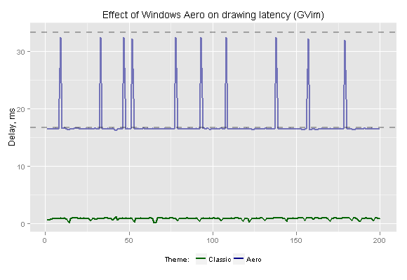

As we can see, Aero introduces at least one frame delay (~16.7 ms for 60 Hz refresh rate) and leads to time discretization. That conceals intrinsic editor performance and disrupts the benchmarking process. As I pointed out earlier, V-Sync-induced delays in video signal is slightly less than delays in framebuffer, but the average difference is only about 4 ms and the maximum added delay is still ~17 ms (for 60 Hz). As the effect is rather material, people [often uncover](https://google.com/#q=reaction+test+windows+aero) the added delay “with naked eye” in human reaction time tests.

The graph also demonstrates that Typometer attains a very good accuracy in measuring the latency — the lower values lay so close to theoretical 16.68335, that it looks almost as mathematical precision.

As for Linux, Lubuntu was preferred to Ubuntu for the same reason — Compiz adds additional delay to application drawing. Here’s the graph (with median lines):

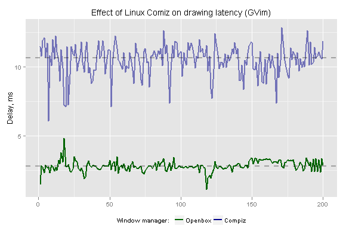

The average introduced delay is about 8 ms, which is better than the Aero’s number, and there’s no synchronization-induced discretization (however there’s an increased jitter). As V-Sync is not used, delays in video signal are on a par with the delays in framebuffer. It’s preferable to use a stacking window manager (like Openbox) to achieve a better measuring accuracy.

Given that measured delays of fastest applications (like Notepad) is below 1 ms *and* stable, it seems safe to assume that the measuring tool provides enough precision and accuracy. Because the relationship between framebuffer and output video signal is deterministic, the results can be considered representative.

Despite the abundance of different observed behaviors, it’s possible to distinguish the following typical time series:

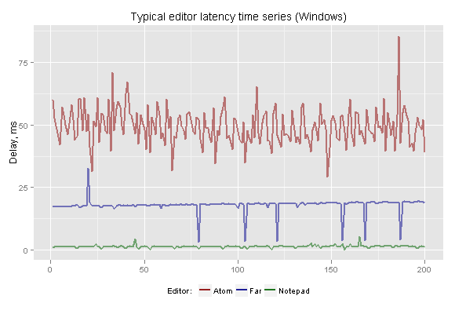

Simple editors usually exhibit very stable delay times, though the average delay might be relatively high.

Complex editors (and editors that run on top of virtual machine / interpreter) in addition to higher average latency often tend to show higher variability of the delay (jitter).

In-between behavior is also common, when periods of stable delay are periodically interrupted by occasional spikes. Sometimes values show a trend that reveals linear dependency of editor algorithms on character horizontal position.

#### 3.3 Windows

As an introduction to analyzing latency, I recommend you to check a great talk on [how not to measure latency](https://news.ycombinator.com/item?id=10485804), which explains why average values are better measure of latency than median values and why maximum values are very important.

**Text file**

Let’s start with a summary table (sorted by average latency). SD stands for [standard deviation](https://en.wikipedia.org/wiki/Standard_deviation) which is used as a measure of [jitter](https://en.wikipedia.org/wiki/Jitter). Keep in mind that it’s an “ideal” setup — a single empty file with no highlighting. Any other configuration possible would exhibit higher delays, by definition.

Editor latency in Windows (text file):

| Editor | Min, ms | Max, ms | Average, ms | SD, ms |
| --- | --- | --- | --- | --- |
| GVim | 0.2 | 1.2 | 0.9 | 0.2 |
| IDEA (zero-latency) | 0.1 | 21.2 | 2.9 | 2.7 |
| Notepad++ | 0.1 | 5.9 | 4.3 | 0.8 |
| Emacs | 4.2 | 19.2 | 5.3 | 1.1 |
| Sublime Text | 6.2 | 35.2 | 8.2 | 2.0 |
| Eclipse | 0.1 | 20.8 | 10.1 | 1.6 |
| Netbeans | 7.3 | 31.6 | 11.8 | 3.9 |
| IDEA | 0.1 | 83.7 | 24.7 | 12.0 |
| Atom | 29.2 | 85.5 | 49.4 | 7.2 |

The summary table gives us only an approximate estimate of delay [distribution](https://en.wikipedia.org/wiki/Frequency_distribution) so it’s good to complement the table by a corresponding fine-grained chart. Traditional [histograms](https://en.wikipedia.org/wiki/Histogram) are not very suitable for comparing multiple sets of data. [Box plots](https://en.wikipedia.org/wiki/Box_plot) are too rough. [Violin plots](https://en.wikipedia.org/wiki/Violin_plot) are better, but they looks quite strange for non-statisticians.

There’s a better way, which is also more good-looking — we can plot values on horizontal axis with some added random vertical shift to reveal distribution ([more info](http://zevross.com/blog/2014/05/05/unhide-hidden-data-using-jitter-in-the-r-package-ggplot2/) on the approach). The resulting chart is both simple and descriptive, and it’s easy to compare the subsets:

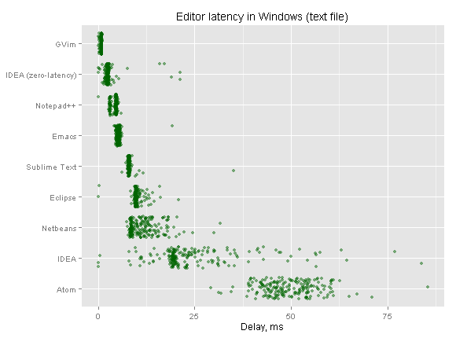

Apparently, editors are not created equal (at least, from the standpoint of latency).

First, the average latency varies greatly — simpler editors tend to exhibit lower average latencies. GVim is a winner, yet IDEA with zero-latency mode enabled is at GVim’s heels. All JVM-based editors (including IDEA in default mode) are at the bottom, which is fairly predictable, surrendering the last place only to Atom, because Chrome runtime turned out to be even more sluggish.

Another noticeable difference is in jitter — “lightweight” editors demonstrate very stable delays, while complex editors, on the contrary, have a much wider delay spacing. IDEA in default mode shows the biggest spread of delays with high maximum value.

Here’s a histogram that demonstrates detailed effect of zero-latency mode in IntelliJ IDEA:

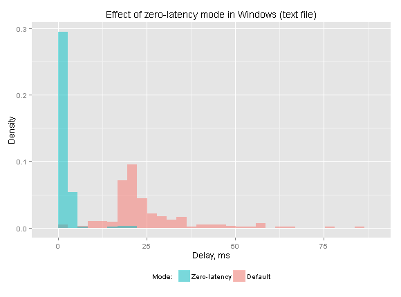

Zero-latency mode does a good job in both reducing the average delay and in eliminating the jitter (though not completely).

**XML file**

OK, the previous setup is too “synthetic”, after all, to edit empty files without any highlighting we have Notepad. Other editor are used for something more tangible. Let’s type in the relatively large XML file to see how the numbers will change:

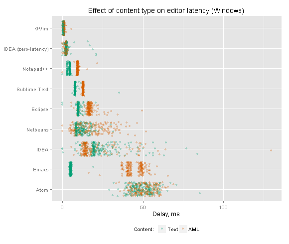

Wow! The difference is quite sensible, and also curious. Some editors are like [Honey Badger](https://www.youtube.com/watch?v=4r7wHMg5Yjg) — they “just don’t care”, namely GVim and IDEA in zero-latency mode. In most editors the delay is uniformly increased. Average delay in IDEA is slightly *decreased* (which is somewhat strange), yet the maximum delay is increased. The most impact is made on Emacs whose latency is skyrocketed.

**Power-saving**

Now we’re going to unplug our power cord and work on battery, in power saving mode.

Editor latency in Windows (XML file, power-saving):

| Editor | Min, ms | Max, ms | Average, ms | SD, ms |
| --- | --- | --- | --- | --- |
| GVim | 0.6 | 2.9 | 1.4 | 0.2 |
| IDEA (zero-latency) | 1.5 | 58.7 | 4.3 | 7.4 |
| Notepad++ | 4.8 | 26.1 | 9.8 | 1.3 |
| Sublime Text | 10.4 | 19.3 | 12.6 | 0.7 |
| Eclipse | 13.9 | 60.4 | 19.0 | 5.0 |
| IDEA | 13.6 | 239.3 | 45.5 | 39.6 |
| Emacs | 46.1 | 77.4 | 50.5 | 4.3 |
| Netbeans | 11.9 | 138.1 | 59.0 | 21.2 |
| Atom | 48.9 | 104.0 | 60.4 | 7.0 |

Let’s examine how this affected the latencies in more detail:
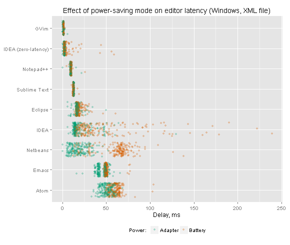

Most editors are not affected that much, but there are a few notable exceptions: IDEA and Netbeans. IDEA’s maximum delay is soared to ~240 ms, which is obviously above the threshold of “noticeable”.

Here’s how zero-latency mode does its job in those conditions:
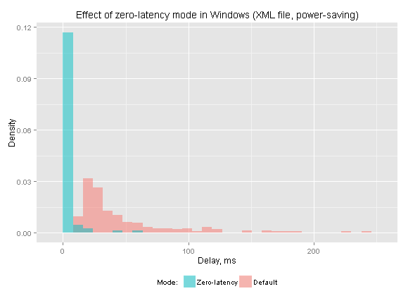

Again, while it cannot eliminate the jitter completely, the effect is significant.

#### 3.4 Linux

Let’s continue our observations in Linux, skipping the “synthetic” text part for simplicity.

Editor latency in Linux (XML file):

| Editor | Min, ms | Max, ms | Average, ms | SD, ms |
| --- | --- | --- | --- | --- |
| IDEA (zero-latency) | 0.8 | 3.9 | 1.7 | 0.5 |
| GVim | 1.7 | 8.4 | 4.5 | 1.4 |
| Gedit | 5.0 | 24.2 | 12.4 | 3.0 |
| Emacs | 7.5 | 46.3 | 20.3 | 4.1 |
| Sublime Text | 9.4 | 35.4 | 23.1 | 5.2 |
| Netbeans | 8.4 | 92.7 | 24.5 | 12.9 |
| Atom | 16.0 | 59.6 | 32.5 | 8.4 |
| Eclipse | 23.6 | 87.1 | 46.5 | 14.0 |
| IDEA | 10.1 | 198.0 | 69.2 | 27.1 |

Complement chart with detailed delay distributions:
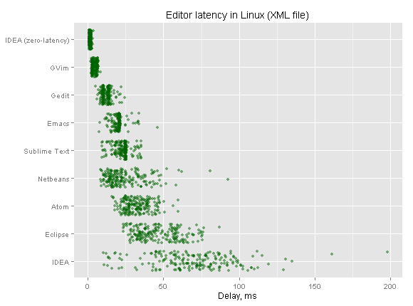
Comparison with the previous results in Windows:
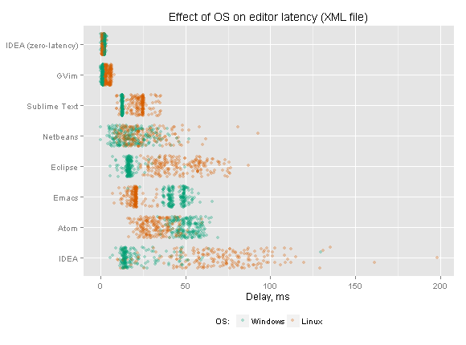

The common trait is that jitter in Linux is noticeable higher for most editors (with the exception of zero-latency mode in IDEA, where jitter is actually reduced).

Emacs and Atom gains from Linux — their average latency is significantly lower.

GVim, Sublime Text, Eclipse and IDEA (in default mode), on the contrary, exhibit much more latency in Linux. IDEA is most affected — its maximum delay reaches ~200 ms even in usual power mode. Eclipse responsiveness is also severely impacted.

IDEA’s zero-latency typing is sure winner in Linux (it outperforms even GVim).
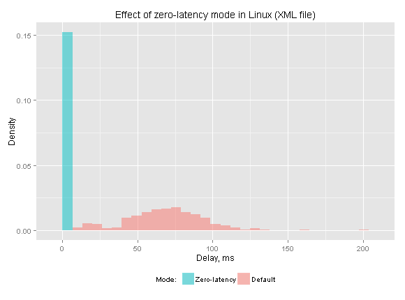
Zero-latency mode in Linux demonstrates low- and exceptionally stable latency.

#### 3.5 VirtualBox

Now let’s suppose, for example, that we use Windows primarily for gaming and do our work in Linux virtual machine (sure, why not?). How editor latencies will change in such a use case? Let’s see.

Editor latency in Linux (VirtualBox, XML file):

| Editor | Min, ms | Max, ms | Average, ms | SD, ms |
| --- | --- | --- | --- | --- |
| IDEA (zero-latency) | 4.2 | 29.7 | 12.4 | 4.9 |
| GVim | 6.0 | 26.0 | 18.3 | 4.1 |
| Gedit | 19.5 | 47.6 | 30.1 | 4.8 |
| Emacs | 27.6 | 68.3 | 33.8 | 7.4 |
| Sublime Text | 31.5 | 58.2 | 46.1 | 5.2 |
| Netbeans | 12.6 | 159.9 | 46.7 | 19.5 |
| Atom | 29.1 | 89.4 | 62.6 | 10.2 |
| Eclipse | 45.3 | 131.4 | 79.4 | 13.7 |
| IDEA | 29.2 | 347.8 | 87.5 | 42.0 |

Here’s a comparison with the previous “native” results:
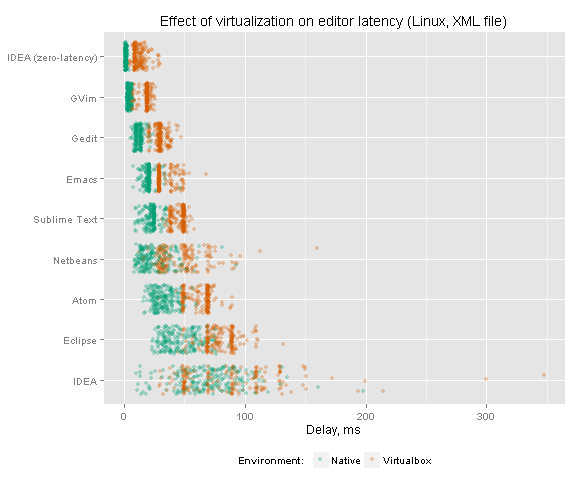

Apart from delay discretization (caused either by V-Sync or by other kind of discrete buffer synchronization), we can observe steady latency increase for all the editors. Distributions are not altered much, which is easily explicable (underlying algorithms are not altered by visualization). IDEA’s maximum delay accrued to ~350 ms.

**Power-saving**

To make the picture complete let’s switch to battery. Power saving mode together with VirtualBox is probably the toughest combination when it comes to editor latency.

Editor latency in Linux (VirtualBox, XML file, power-saving):

| Editor | Min, ms | Max, ms | Average, ms | SD, ms |
| --- | --- | --- | --- | --- |
| IDEA (zero-latency) | 4.3 | 69.6 | 11.9 | 8.9 |
| GVim | 5.0 | 35.8 | 19.0 | 3.8 |
| Gedit | 13.4 | 49.3 | 23.9 | 6.0 |
| Emacs | 19.6 | 79.5 | 44.7 | 6.9 |
| Sublime Text | 38.1 | 65.0 | 52.1 | 7.3 |
| Atom | 70.2 | 152.2 | 90.0 | 13.7 |
| Netbeans | 35.7 | 344.7 | 119.1 | 43.3 |
| Eclipse | 99.3 | 269.6 | 133.6 | 36.2 |
| IDEA | 119.4 | 544.6 | 198.8 | 63.1 |

Yeah, those delays are just ridiculous! The maximum delay is now more than half a second!

For illustrative purposes, let’s compare the data with the results from ideal conditions:

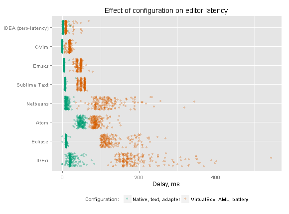

Apparently, configuration plays an important role in resulting editor latency. However, editors are affected differently — performance of some editors can be severely degraded, while other editors are not affected that much.

The best resilience is demonstrated by IntelliJ IDEA with zero-latency mode enabled. Let’s see how it performs in the toughest setup:

Interestingly, in zero-latency mode IntelliJ IDEA outperforms all the other editors (and also terminal-based editors, by the way).

### 4. Summary

Obviously, *what* you type is much more important than *how* you type it. Nevertheless, low-latency visual feedback can often make the process more efficient and more enjoyable.

- Use a responsive editor (makes the most difference).
- Use a low-latency keyboard, if possible.
- Choose programs that add global keyboard hooks wisely.
- Turn off unnecessary “image enhancers” in you monitor.
- Enable stacking window manager in your OS (e.g. in Windows [7](https://web.archive.org/web/20161021060058/http://www.softwareaudioconsole.com/Tweaking_Windows_7.htm), [8](http://www.rlauncher.com/wiki/index.php?title=Input_Lag_Checklist#Disable_Desktop_Composition_in_Windows_8_and_8.1)).

Type with pleasure!

### 5. Links

See also:

- [Typometer](https://pavelfatin.com/typometer/) — Tool to measure and analyze visual latency of text / code editors.
- [Low-latency painting in AWT and Swing](https://pavelfatin.com/low-latency-painting-in-awt-and-swing/) — In-depth analysis of delay sources in AWT / Swing architectures, methods to significantly reduce the drawing latency.
- [Scrolling with pleasure](https://pavelfatin.com/scrolling-with-pleasure/) — Technology of smooth / high-precision scrolling on modern computers.

Interesting feedback:

- [Comments on Hacker News](https://news.ycombinator.com/item?id=10787812)
- Comments on Reddit:

[in /r/emacs](https://www.reddit.com/r/emacs/comments/4gdmia/typing_latency_in_various_editors_emacs_gvim_atom/)

[in /r/hardware](https://www.reddit.com/r/hardware/comments/3yymvm/typing_with_pleasure_human_and_machine_aspects_of/)

[in /r/mechanicalkeyboards](https://www.reddit.com/r/MechanicalKeyboards/comments/4g88ei/the_fastest_editor_for_the_fastest_keyboard/)

[in /r/vim](https://www.reddit.com/r/vim/comments/4g7l0x/typing_with_pleasure_examining_typing_latency_of/)

- [Comments on Lobsters](https://lobste.rs/s/75t9eg)
- [Xah Emacs blog post](http://ergoemacs.org/emacs/blog_past_2015-12_2015-12.html)
- [4coder blog post](http://www.4coder.net/4coder//low-latency-problem)
- [Related issue in haskell-mode for Emacs](https://github.com//haskell/haskell-mode/issues/1177)
- [Discussion in Eclipse’s ide-dev mailing list](https://dev.eclipse.org/mhonarc/lists/ide-dev/msg01148.html)
- [Post in Microsoft Visual Studio blog](https://blogs.msdn.microsoft.com/visualstudio/2016/11/10/extensibility-in-visual-studio-15-increasing-reliability-and-performance/)
- [Comments on IntelliJ IDEA’s zero-latency mode](https://blog.jetbrains.com/idea/2015/08/experimental-zero-latency-typing-in-intellij-idea-15-eap/#comments)
- [Atom-related discussion on Hacker News](https://news.ycombinator.com/item?id=11308064)
- [Another Atom-related discussion on Reddit](https://www.reddit.com/r/programming/comments/5lmr1k/sublime_text_vs_visual_studio_code_vs_atom/)
- [A lot of feedback on Twitter](https://twitter.com/search?f=tweets&q=pavelfatin.com%2Ftyping)

Special thanks go to [John Carmack](https://twitter.com/ID_AA_Carmack) and [Miguel de Icaza](https://twitter.com/migueldeicaza) for tweeting the article.

Tags: [benchmark](https://pavelfatin.com/tag/benchmark/), [delay](https://pavelfatin.com/tag/delay/), [editor](https://pavelfatin.com/tag/editor/), [effect](https://pavelfatin.com/tag/effect/), [feedback](https://pavelfatin.com/tag/feedback/), [ide](https://pavelfatin.com/tag/ide/), [keyboard](https://pavelfatin.com/tag/keyboard/), [lag](https://pavelfatin.com/tag/lag/), [latency](https://pavelfatin.com/tag/latency/), [monitor](https://pavelfatin.com/tag/monitor/), [typing](https://pavelfatin.com/tag/typing/), [visual](https://pavelfatin.com/tag/visual/), [zero-latency](https://pavelfatin.com/tag/zero-latency/)

This entry was posted on Sunday, December 20th, 2015 at 3:33 pm	and is filed under [Programming](https://pavelfatin.com/category/programming/). You can follow any responses to this entry through the [RSS 2.0](https://pavelfatin.com/typing-with-pleasure/feed/) feed.

You can [leave a response](https://pavelfatin.com/typing-with-pleasure/#respond), or [trackback](https://pavelfatin.com/typing-with-pleasure/trackback/) from your own site.