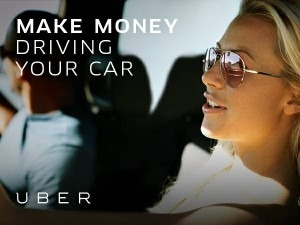
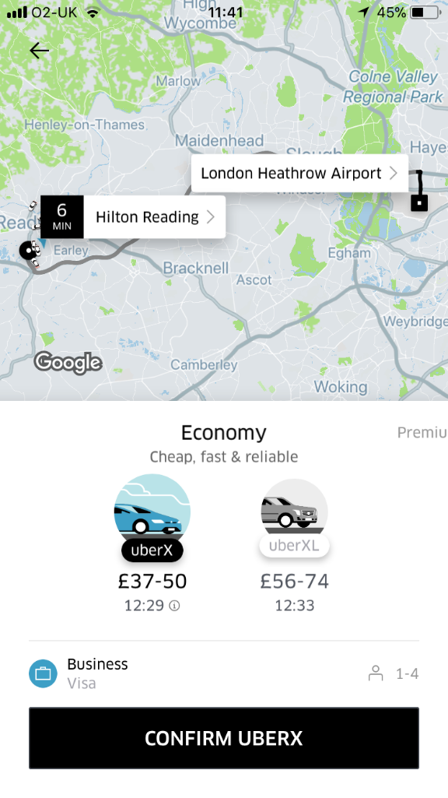
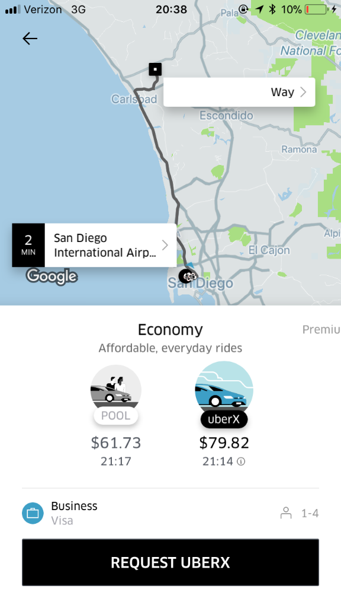
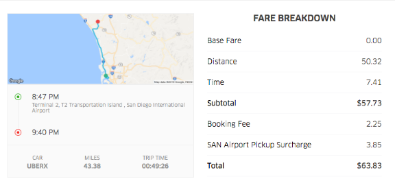
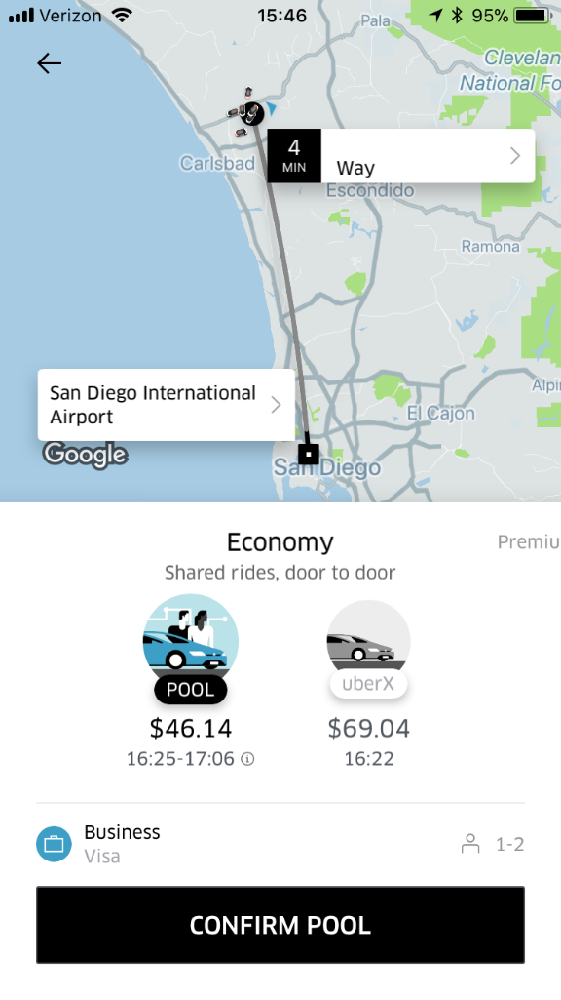
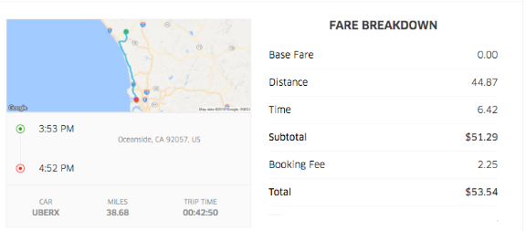
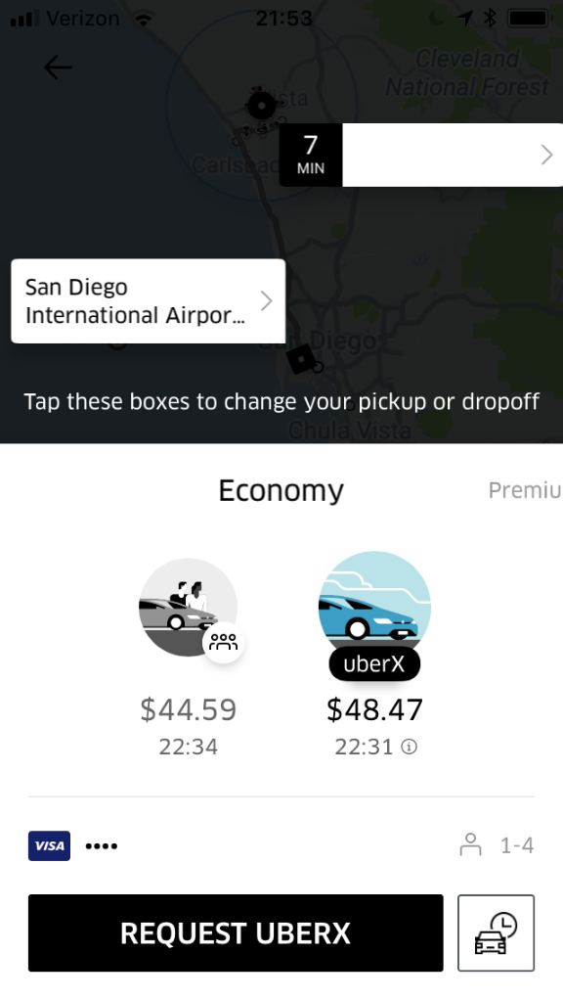

Uber is Ripping Off Frequent Riders and Here's How to Avoid It

# Uber is Ripping Off Frequent Riders and Here’s How to Avoid It

*Drivers already know upfront pricing typically doesn’t work in our favor. But what is upfront pricing, or variations of it, looking like for passengers? We had frequent traveler and senior RSG contributor **Will Preston **analyze how Uber charges different passengers and whether more frequent Uber-users are charged more than their less-frequent counterparts. Here’s what we found – let us know if you’ve seen something similar in the comments!*

Uber appears to have the opposite of a rewards program. That is, it appears the more you use Uber as a passenger, the more they’re going to charge you per mile. We [know Uber said they were going to experiment](http://www.businessinsider.com/uber-controversial-pricing-charging-more-based-on-neighborhood-2017-5) on charging different customers different rate, based on a variety of unpublished factors. My current belief is the more you use the service in a way that suggests you can afford more, the more they will charge you.

How would Uber know? The best example of that is if you’re following a regular usage pattern, like a business traveler would. While this affects passengers and not drivers, it’s another way Uber is looking to make a little extra money – perhaps for their potential IPO in 2019?

Related: [Why would Uber do this? Maybe they need money…](https://therideshareguy.com/why-mits-uber-study-was-still-important/)

I’m not talking about surge pricing, part of which would get passed on to a driver. I’m talking about raising a passenger’s “upfront” fare 10-30% higher than they would pay if they were paying their market’s time and distance rates for the same ride.

I got a reminder of the good old days while traveling in the UK last week. No “upfront” pricing there. You still get a range of prices like we used to get before we got “upfront” pricing.  The fare is then calculated based on the actual time and distance of the ride. It’s all very upfront, one might say.

## Upfront Pricing from the Passenger’s Perspective

If you only use Uber as a driver, stop that. You need to occasionally use Uber as a passenger to fully understand how to be a good driver. Having said that, this article is written to help teach passengers how to avoid being ripped off by the “upfront” pricing model. I say “upfront” with quotes around it because it is anything but.

Related: [My number one piece of advice for new drivers](https://www.youtube.com/watch?v=D16zQsdQWo0)

The only thing upfront about “upfront” pricing is that it happens upfront – at the beginning of the ride. The “real” price of the ride (i.e. driver pay / .75 or .80) is hidden from the passenger and has very little to do with what they pay.

In addition, the rider has no idea if they are paying surge pricing or not, because they are no longer told they are on a surge rate. They are simply told the ride will be $25.00.  If they don’t know the ride should be $20 – or even $10 without surge – they have no idea if they should accept a given ride price.

Regular readers may remember an article I did where I [compared what 255 riders paid to what I got paid for those same rides](https://therideshareguy.com/how-much-is-uber-really-taking-from-your-ride/). Many drivers felt that Uber’s upfront pricing was designed to rob drivers of a higher percentage of the take. I didn’t find evidence of that in my research, but I definitely saw some passengers paying a lot more than other passengers.

Now that a new job has me using Uber much more, I’ve noticed that my prices appear to be 10-30% more than the real price of each ride, as determined by the local mile/minute rate. Surprisingly, I can also tell you there are other riders who are being charged less than the real price of each ride.

Related: [The Case Against Upfront Pricing](https://therideshareguy.com/the-case-against-upfront-pricing/)

The point of this article is to explain what’s happening to some passengers, and to tell them how to get around being overcharged without breaking any terms of service. Hopefully they’ll be thankful they’re saving money, and decide to pass that along to their driver as a tip.

## Here’s Where it Gets Odd

I live in the San Diego market where the rate for passengers is $1.10 per mile and $.15 per minute. I’ve taken numerous rides between my house and the airport, during which that price never changed. What I would pay for an airport ride tended to be about $55 – $60 for a ride from the airport, the difference being the fee the San Diego airport charges Uber.

A few months ago I started regularly taking a Monday morning trip to the airport, then another ride home from the airport Tuesday evening. Even the dumbest AI program can figure out that I’m a business traveler. The fact I’m using a business profile helps as well. Uber knows where I live, where I fly out of, where I work, and where I tend to stay when I’m in Sunnyvale.

The AI program figured out I’m a business traveler and started jacking up my prices. My upfront price to the airport started showing up around $70, and my ride home was close to $80. No surge. Just a much higher price for the same trip. Uber’s thoughts? Maybe ‘He’s on an expense account! He doesn’t care what he’s paying!’

This isn’t a conspiracy theory, by the way. Uber [admitted in an interview](https://www.bloomberg.com/news/articles/2017-05-19/uber-s-future-may-rely-on-predicting-how-much-you-re-willing-to-pay) they were going to experiment with charging some customers more and others less. This is just the first concrete evidence I’ve seen of it in action.

## Could There Be Other Explanations?

It’s important to understand that traffic is rarely an issue when I’m going to and from the airport, as I’m usually doing it in non-peak hours. So the part of the cost having to do with time shouldn’t fluctuate by more than a few dollars.

If it’s not the time, then maybe it’s surge pricing, I thought. So the first time I saw the price was almost $80 for a trip that I know should cost about $60, I first checked my driver app to see if Uber was surging at the airport. I opened my driver app and no, it was not. There is rarely a surge at the San Diego airport, but I had to check.

The final data point is that I know that if a passenger changes their destination mid-ride to something completely different than the destination they were quoted for, their upfront price is discarded. Instead, they will be charged time and distance for that ride. This is how I will both prove that this is what is happening, as well as make sure I am not personally being ripped off.

### How to Figure Out Upfront Pricing as a Passenger

The first thing I do is set my destination to my house and get an upfront price. I take a screenshot of that for reference. This price will be compared to the price I ultimately pay when this is all over.

I set my destination to somewhere about 30 miles north of the airport, which is on the way to my house – but still nine miles from my house. I notice I am consistently given a price of $55 for the location I use (the Carlsbad Village Train Station), which is about $4 more than it should be, based on my calculations. That’s okay. I’m not going there anway.

What I wanted to do was to book an Uber without setting a destination at all. I simply couldn’t figure out how to do that. Besides, if you’re not coming from the airport, setting a destination that is on the way home but not quite home allows drivers on a destination filter to get your ride.

As soon as I get a driver, I let them know I’m actually going to Oceanside and I’ll change the destination in a few minutes.  Depending on how friendly the driver is, I sometimes even tell them what I’m up to and why. But they can drive for a half hour before I actually need to make the change, so they’re comfortable with the whole thing.

At some point during the ride I change my destination to my house. The driver gets the new destination and drives me home. They get their usual fare, and I immediately get notified of the actual cost of my ride. I pay only time and distance rates, and everyone’s happy.

Here’s an example. On February 16 at 8:30 p.m., I needed a ride from the San Diego Airport to my house, which should cost a little over $60. I’m given an upfront price of $79.82!

I then followed the procedure detailed above, and when the ride was over, my price was $63.83.  That means the upfront price was a 25% increase in my fare!  Also, it’s only $2 more than the quoted UberPOOL ride, with much less hassle for both me and my driver.

That is false advertising as far as I’m concerned. It’s the equivalent of increasing the per mile rate to $1.37 while telling me it’s only $1.10. Yes, I’m told the rate upfront.  But an uninformed person might rightly assume that rate has some relation to $1.10 a mile and $.15 a minute – and they’d be wrong.

The same held true when driving to the airport. Here’s another trip. I’m given an upfront price of $69.04 to go to the airport, but when I follow the procedure above, my actual price is $53.54. That is an unadvertised 29% increase in the fare!

When I had the time, I followed the same process when I was in Silicon Valley. Without exception I was always given an upfront fare 10-30% more than what the actual fare ended up being. I did this for a total of about 20 rides in San Diego and Sunnyvale, and the result was always the same.

## So How Does This Affect Frequent Riders/Business Travelers?

Twice I compared the price my app was giving for a ride to the airport to the price my wife’s account said for the same ride. In both cases, her price was closer to the “normal” price.

At the same time as I was given an upfront price of $69.04 for a ride to the airport, I pulled up my wife’s account and entered the same information. The price she was given was $56.60, very close to the $53.54 I ended up paying.

It gets worse. At a moment I was given an upfront price of $61.65 for a ride to the airport, she was given an upfront price of $48.47, a 27% difference in price for the same ride.

The thing is that it’s $48 in mileage charges alone to get from my house to the airport. To that you will typically add about $6-7 in time charges and a $2.25 booking fee, for a total of $55-57.  She’s being offered a price about $10 less than that! In fact, that is barely over what Uber will pay the driver for that route.

## Summary

It’s obvious Uber is charging some customers drastically more than others. My guess is they are charging business users and frequent users more, and casual or new users less. It may even out in the percentage they take, but the result is still the same if you’re a regular Uber passenger.

Uber is charging you more than it’s advertising, but there’s a way around it. If you want to pay the advertised prices for your market and no more, set your destination to something on the way to where you’re going. Then on the way, change your destination to your actual one. You’ll pay the time and distance rates for your market and no more – and I don’t see anything wrong with that.

Readers, have you seen this in-action as a passenger or have passengers asked you about upfront pricing?

### Burnt Out Talking To Passengers? Deliver Food With Caviar!

Make up to $25/hour. No minimum hours required, work outside, and get paid weekly. [Click](https://therideshareguy.com/caviar/bop) to Sign-up!

-Will @ RSG
The following two tabs change content below.

#### [Will Preston](http://www.ridesharedevices.com/)

Will Preston is a part-time rideshare driver with over 1,500 rides under his belt. He drives in the San Diego market. Like a lot of people, Preston has a day job and it's as an IT analyst specializing in backup and recovery.