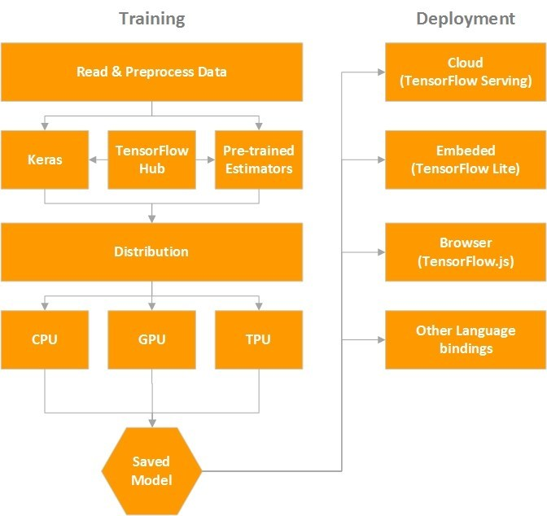
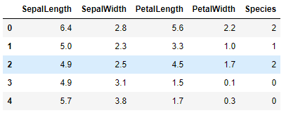
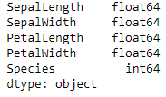
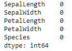
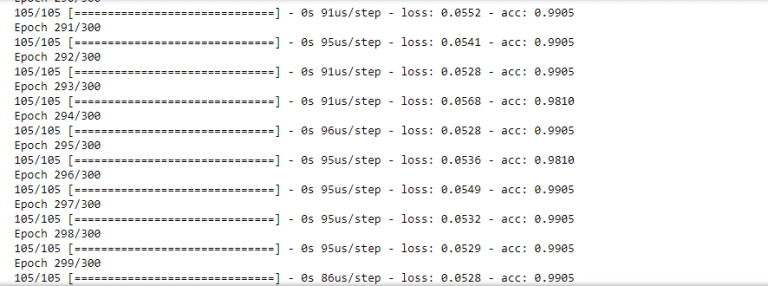
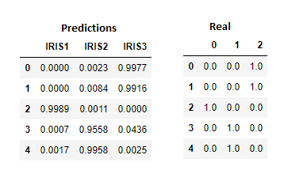

Ultimate Guide to TensorFlow 2.0 in Python

* * *

Code that accompanies this article can be downloaded [here](https://github.com/NMZivkovic/ultimate-tensorflow2.0).

* * *

Last November *TensorFlow *celebrated its **third **birthday. Over the years it became one of the most loved ML **frameworks** and gathered a massive amount of followers. Google has done a great job and incorporated this framework into Java, C++, [JavaScript](http://machine/) and most importantly into major data science language **Python**. If you ask the community what are their favorite combination of tools, the most usual answer would be TensorFlow and Python. Thanks to this, we came to the point where this technology is mature enough to ease up its use and “cross the chasm”. That is certainly one of the main goals of a new version – TensorFlow 2.0. However, let’s start from the beginning and find out what is this technology all about.

In general, a lot of concepts in machine learning and deep learning can be abstracted using multi-dimensional matrices – **tensors**. In math, tensors are described as geometric objects that describe linear relationships between other geometric objects. For the simplification of all concepts, tensors can be observed as multi-dimensional arrays of data, ie. **matrices**. When we observe them like n-dimensional arrays we can apply matrix operations easily and effectively. That is what *TensorFlow *is actually doing. In this framework, a tensor is a **primitive unit** and we can do various operations with them. For example, take a look at the code below:

|     |     |
| --- | --- |
| 1   | import tensorflow as tf |
| 2   |     |
| 3   | const1 = tf.constant([[1,2,3], [1,2,3]]); |
| 4   | const2 = tf.constant([[3,4,5], [3,4,5]]); |
| 5   |     |
| 6   | result = tf.add(const1, const2); |
| 7   | print(result) |

 [view raw](https://gist.github.com/NMZivkovic/069d431ac8b1397775d535b0b04e49ff/raw/9b1b5333ae5cb2291172ea13ec61fef549007ca7/tf20-simple.py)  [tf20-simple.py](https://gist.github.com/NMZivkovic/069d431ac8b1397775d535b0b04e49ff#file-tf20-simple-py) hosted with  by [GitHub](https://github.com/)

The output of the code snippet from above looks like this:
tf.Tensor( [[4 6 8] [4 6 8]], shape=(2, 3), dtype=int32)

As you can see we have defined two constants and we add one value to the other. As a result, we got a *Tensor*  **object **with the result of the adding. Also, we can see the shape of the output and its data type. If you are familiar with *TensorFlow 1.0*, you will notice that we haven’t created a session and then run this code. This is just one of the benefits of using the new version of *TensorFlow*.

## TensorFlow Ecosystem

Of course, we don’t want just to do simple arithmetic operations we want to use this library for building predictors, classifiers, generative models, neural networks and so on. In general, when you are building such solutions, we have to go through **several steps**:

- **Analysis **and preprocessing of the data
- **Building **and **training **a model (machine learning model, neural network, …)
- **Evaluating **model
- Making new predictions

Since training of these models can be an expensive and long process we might want to use different machines to do this. Training these models on CPU can take quite a long time, so using GPU is always better options. The fastest option for training these models is **tensor processing unit** or **TPU**s. These were introduced by Google back in 2016. and they are is an AI accelerator application-specific integrated circuit (ASIC). However, they are still quite expensive. Apart from this, we want to deploy our model to different platforms, like cloud, embedded systems (IoT) or integrate it in other languages. That is why *TensorFlow* ecosystem looks something like this:

TensorFlow Ecosystem

We can see that all these major points of developing these solutions are covered within this **ecosystem**. When it comes to Python, we usually analyze and handle data using libraries like *numpy *and *pandas*. Then we use this data to push it into the model that we have built. This is a bit out of the scope of this article, and data analysis is a topic for itself. However, *TensorFlow *is giving us some **modules **using which we can do some preprocessing and feature engineering. Apart from that, it provides **datasets **(*tensorflow.datasets*) that we can use for training some of our custom solutions and for research in general.

The most important parts of *TensorFlow *is *TensorFlow Hub*. There we can find numerous modules and **low-level APIs** that we can use. On top of these let’s say core modules we can find high-level API – **Keras**. We might say that road for 2.0 version was paved in *TensorFlow *1.10.0 when *Keras *was incorporated as default High-Level API. Before this Keras was a separate library and *tensorflow.contrib* module was used for this purpose. With TensorFlow 1.10.0 we got the news that *tensorflow.contrib* module will be soon **removed **and that *Keras *is taking over. And that was one of the main focuses of TensorFlow 2.0, to **ease up the use and to clean up the API**. In fact, many APIs from 1.0 are either moved or completely removed. For example, *tf.app* and *tf.flags* no longer exist and some less used functions from *tf.** are moved to other modules.

Apart from this High-Level API which we will use later in this article, there are several **pre-trained **models. These models are trained on some set of data and can be customized for your solution. This approach in the development of a machine learning solution is also called **transferred learning**. Transferred learning is gaining popularity among artificial intelligence engineers because it is speeding up the process. Of course, you may choose to use these pre-trained models as out of the box solutions.

There are several **distribution **options for *TensorFlow *as well, so we can choose which platform we want to train our models. This is decided during the installation of the framework, so we will investigate it more in the later chapters. We can choose *TensorFlow *distribution that runs on CPU, GPU or TPU. Finally, once we built our model, we can save it. This model can be incorporated into other applications on different **platforms**. Here we are entering the world of **deployment**. It is important to note that building a model is a completely different process from the rest of the application development. In general, data scientist build these models and save them. Later these models are called from business logic components of the application.

## Installation

*TensorFlow *provides APIs for a wide range of languages and it is available for different operating systems. In this article, we are going to use **Python **on **Windows **10 so only the installation process on this platform will be covered. *TensorFlow *is available only for versions of [**Python 3.5**](https://www.python.org/) and above, so make sure that you have the correct version of Python installed on your system. In this article, we use Python 3.7. For other operating systems and languages you can check the [**official installation guide**](https://www.tensorflow.org/install/). As we will mention in this step we need to decide which **distribution **do we want to use. There are two options for installing TensorFlow:

- TensorFlow with **CPU **support
- TensorFlow with **GPU **support

If your system has an **NVIDIA® GPU** then you can install *TensorFlow *with GPU support. Of course, GPU version is faster, but CPU is easier to install and to configure.

If you are using [**Anaconda**](https://www.anaconda.com/download/) installing TensorFlow can be done following these steps. First, you need to create a conda **environment **“*tensorflow*” by running the command:

conda create -n tensorflow pip python=3.7
Activate created environment using:
activate tensorflow

Finally, you need to call the command to install TensorFlow inside the created environment. For the CPU version run this:

pip install tensorflow==2.0.0-alpha0
If you want to use GPU distribution run the command:
pip install tensorflow-gpu==2.0.0-alpha0
Of course, you can install *TensorFlow *using “native pip”, too.

Now, there is an option if you don’t want to install TensorFlow at all. Guys from Google were so awesome to provide us **virtual environment** so we can train and build our models directly in the browser – [Collaboratory](https://colab.research.google.com/notebooks/welcome.ipynb). It’s a Jupyter notebook environment that runs entirely in the **cloud**. The necessary lines of code you need to add on top of your Collab Jupyter Notebook:

from **future** import absolute_import, division, print_function, unicode_literals

!pip install -q tensorflow==2.0.0-alpha0

Cool, now we have our TensorFlow installed. Let’s see what are some cool things that *TensorFlow *2.0 brings and let’s solve some problems with it.

## Keras – High-Level API

As mentioned previously, **Keras **is default High-Level API of the *TensorFlow*. In this article, we will use this API to build a simple neural network later, so let’s explore a little bit how it functions. Depending on the type of a problem we can use a variety of layers for the neural network that we want to build. Essentially, Keras is providing different types of layers (*tensorflow.keras.layers*) which we need to connect into a meaningful graph that will solve our problem. There are several ways in which we can do this API when building deep learning models:

- Using Sequential class
- Using Functional API
- Model subclassing

The first approach is the simplest one. We are using *Sequential *class, which is actually a **placeholder **for layers and we add layers in the order we want to. We may want to choose this approach when we want to build neural networks in the **fastest **way possible. There are many types of Keras layers we can choose from, too. The most basic one and the one we are going to use in this article is called *Dense.* It has many **options **for setting the inputs, [activation functions](https://rubikscode.net/2017/11/20/common-neural-network-activation-functions/)and so on. Apart from *Dense, *Keras API provides different types of layers for [Convolutional Neural Networks](https://rubikscode.net/2018/02/26/introduction-to-convolutional-neural-networks/), [Recurrent Neural Networks](https://rubikscode.net/2018/03/12/introuduction-to-recurrent-neural-networks/), etc. This is out of the scope of this post. So, let’s see how one can build a **Neural Network** using *Sequential* and *Dense.*

|     |     |
| --- | --- |
| 1   | import tensorflow as tf |
| 2   | from tensorflow.keras import Sequential |
| 3   | from tensorflow.keras.layers import Dense |
| 4   |     |
| 5   | model = Sequential() |
| 6   | model.add(Dense(3, input_dim=2, activation='relu')) |
| 7   | model.add(Dense(1, activation='softmax')) |

 [view raw](https://gist.github.com/NMZivkovic/32b4c5d06ab33450add4f7bdcca3dfe0/raw/1ef38262918f188959a30cea0553423a9213bfc8/neural-network-sequential.py)  [neural-network-sequential.py](https://gist.github.com/NMZivkovic/32b4c5d06ab33450add4f7bdcca3dfe0#file-neural-network-sequential-py) hosted with  by [GitHub](https://github.com/)

First, we import the *Sequential *and *Dense*. After that, we create one object of the *Sequential* class. Then we add the first layer to the Neural Network using function *add *and *Dense* class. The first parameter in the *Dense* constructor is used to define a [number of neurons](https://rubikscode.net/2017/11/13/introduction-to-artificial-neural-networks/) in that layer. What is specific about this layer is that we used *input_dim* parameter. By doing so, we added additional input layer to our network with the number of neurons defined in *input_dim*parameter. Basically, by this one call, we added **two layers**. First one is the input layer with two neurons, and the second one is the hidden layer with three neurons.

Another important parameter, as you may notice, is *activation* parameter. Using this parameter we define [**activation function**](http://rubikscode.net/2017/11/20/common-neural-network-activation-functions/) for all neurons in a specific layer. Here we used *‘relu’ *value, which indicates that neurons in this layer will use [**Rectifier activation function**](http://rubikscode.net/2017/11/20/common-neural-network-activation-functions/). Finally, we call *add* method of the *Sequential* object once again and add another layer. Because we are not using *input_dim* parameter one layer will be **added**, and since it is the last layer we are adding to our Neural Network it will also be the output layer of the network.

The functional approach is similar, but it is more **flexible**. It is easy to understand and we may want to choose this approach when building **complex models** with a lot of operations. Here is how the same network from above looks like when functional API is used:

|     |     |
| --- | --- |
| 1   | import tensorflow as tf |
| 2   | from tensorflow.keras.layers import Input, Dense |
| 3   |     |
| 4   | input_layer = Input(shape=(2,)) |
| 5   | model = Dense(3, activation='relu')(input_layer) |
| 6   | model = Dense(1, activation='softmax')(model) |

 [view raw](https://gist.github.com/NMZivkovic/897133c9d80e0917d4504172d6fab293/raw/20951e55bece604cc067076ed3b795ce1d492a89/neural-network-functional.py)  [neural-network-functional.py](https://gist.github.com/NMZivkovic/897133c9d80e0917d4504172d6fab293#file-neural-network-functional-py) hosted with  by [GitHub](https://github.com/)

Finally, we may want to choose **Model sub-classing** approach. This approach is the favorite one for the people with heavy software developing background, especially for the engineers with **Object Oriented** knowledge. In this approach, we choose to inherit *Model* class and define our own [forward pass](https://rubikscode.net/2018/01/15/how-artificial-neural-networks-learn/). Again, here is how the simple neural network that we implemented with previous approaches looks like:

|     |     |
| --- | --- |
| 1   | import tensorflow as tf |
| 2   | from tensorflow.keras import Model |
| 3   | from tensorflow.keras.layers import Dense |
| 4   |     |
| 5   | class  SimpleNeuralNetwork(Model): |
| 6   |  def  __init__(self): |
| 7   |  super(SimpleNeuralNetwork, self).__init__() |
| 8   |  self.layer1 = Dense(2, activation='relu') |
| 9   |  self.layer2 = Dense(3, activation='relu') |
| 10  |  self.outputLayer = Dense(1, activation='softmax') |
| 11  |     |
| 12  |  def  call(self, x): |
| 13  | x =  self.layer1(x) |
| 14  | x =  self.layer2(x) |
| 15  |  return  self.outputLayer(x) |
| 16  |     |
| 17  | model = SimpleNeuralNetwork() |

 [view raw](https://gist.github.com/NMZivkovic/bef49a0f557e38eec31cb68899a8ffdc/raw/38513cf214395531632e1225575bce9748be8c0e/neural-network-inheritance.py)  [neural-network-inheritance.py](https://gist.github.com/NMZivkovic/bef49a0f557e38eec31cb68899a8ffdc#file-neural-network-inheritance-py) hosted with  by [GitHub](https://github.com/)

## Iris Classification Neural Network

* * *

Code that accompanies this article can be downloaded [here](https://github.com/NMZivkovic/ultimate-tensorflow2.0).

* * *

In this example, we will build a simple **neural network** that can predict the class of the Iris flower. For this purpose, we use the Iris Data Set. This data set is probably one of the best-known datasets to be found in the pattern recognition literature, along with the [**MNIST dataset**](https://en.wikipedia.org/wiki/MNIST_database). In essence, this dataset is used for “Hello World” examples for **classification **problems. We can take different approaches to this problem, but we will use a simple neural network. If you want to learn more about neural networks you can check [our series of articles on the topic](https://rubikscode.net/2018/02/19/artificial-neural-networks-series/). In there you can find information about the [structure of neural networks](https://rubikscode.net/2017/11/13/introduction-to-artificial-neural-networks/), its main components and the ways they [learn](https://rubikscode.net/2018/01/15/how-artificial-neural-networks-learn/).

Dataset itself was first introduced by [Ronald Fisher](https://en.wikipedia.org/wiki/Ronald_Fisher) back in 1936. Ronald was British **statistician **and **botanist **and he used this example in his paper *The use of multiple measurements in taxonomic problems*. The dataset contains **3 classes of 50 instances each**. Each class refers to one type of iris plant: *Iris setosa*, *Iris virginica, *and *Iris versicolor*. First class is linearly separable from the other two, but the latter two are not linearly separable from each other. Each record has five attributes:

- Sepal length in cm
- Sepal width in cm
- Petal length in cm
- Petal width in cm
- Class (*Iris setosa*, *Iris virginica, **Iris versicolor*)

The goal of the neural network, we are going to create is to predict the class of the Iris flower based on other features. Meaning it needs to create a **model**, a neural network, which is going to describe a relationship between attribute values and the class.

In order to solve this problem, we are going to take steps we defined in one of the previous chapters:

- Analysis and preprocessing of the data
- Building and training a model
- Evaluating model
- Making new predictions

### Data Analysis and Preprocessing

Data analysis is a topic for itself. In here, we will not go so deep into **feature engineering** and analysis, but we are going to observe some basic steps:

- **Univariate Analysis** – Analysing types and nature of every feature.
- **Missing Data Treatment** – Detecting missing data and making a strategy about it.
- **Correlation Analysis** – Comparing features among each other.
- **Splitting Data** – Because we have one set of information we need to make a separate set of data for training the neural network and set of data to evaluate the neural network.

Using the information that we gather during this analysis we can take appropriate actions during the creation of the model itself. First, we **import **the data:

|     |     |
| --- | --- |
| 1   | COLUMN_NAMES  = [ |
| 2   |  'SepalLength', |
| 3   |  'SepalWidth', |
| 4   |  'PetalLength', |
| 5   |  'PetalWidth', |
| 6   |  'Species' |
| 7   | ]   |
| 8   |     |
| 9   | data = pd.read_csv('iris_data.csv', names=COLUMN_NAMES, header=0) |
| 10  | data.head() |

 [view raw](https://gist.github.com/NMZivkovic/5d28265a61a0c8a376073273d4c2256f/raw/f4e25628803ae64d72cda96e211c5c18eeeca6a0/import-data.py)  [import-data.py](https://gist.github.com/NMZivkovic/5d28265a61a0c8a376073273d4c2256f#file-import-data-py) hosted with  by [GitHub](https://github.com/)

As you can see we use *Pandas* library for this, and we also print out first five rows of data. Here is how that looks like:

Iris Flower Data

Once this is done, we want to see what is the **nature **of every feature. For that we can use *Pandas* as well:

data.dtypes
Output looks like this:

As we can see the *Species* or the output has type *int64*. However, we understand that this is not what we want it to be. We want this feature to be a **categorical variable**. This means we need to modify this data a little bit, again using *Pandas*:

|     |     |
| --- | --- |
| 1   | data['Species'] = data['Species'].astype("category") |
| 2   | data.dtypes |

 [view raw](https://gist.github.com/NMZivkovic/d86dd11f6e4a7a06000afcefb6e21d2a/raw/722cf410668dcfd30c73156c8ee3abc3ce96a073/to-categorica.py)  [to-categorica.py](https://gist.github.com/NMZivkovic/d86dd11f6e4a7a06000afcefb6e21d2a#file-to-categorica-py) hosted with  by [GitHub](https://github.com/)

Once this is done, we check is there **missing data** in our data set. This is done using this function:

print(data.isnull().sum())
Output of this call is:

Missing data can be a problem for our neural network. If there is missing data in our dataset, we need to define a **strategy **on how to handle it. Some of the approaches are that missing values are replaced with the **average **value of the feature or its **max **value. However, there is no silver bullet and sometimes different strategies give better results than the others. Ok, off to the** correlation analysis**. During this step, we are checking how features relate to each other. Using *Pandas* and *Seaborn* modules we were able to get an image which shows matrix with levels of dependency between some of the features – **correlation matrix**:

|     |     |
| --- | --- |
| 1   | corrMatt = data[["SepalLength","SepalWidth","PetalLength","PetalWidth","Species"]].corr() |
| 2   | mask = np.array(corrMatt) |
| 3   | mask[np.tril_indices_from(mask)] =  False |
| 4   | fig,ax= plt.subplots() |
| 5   | fig.set_size_inches(20,10) |
| 6   | sn.heatmap(corrMatt, mask=mask,vmax=.8, square=True,annot=True) |

 [view raw](https://gist.github.com/NMZivkovic/e9590ca95e8a7f96c5a152b25f5d0bdb/raw/175fc814db7edd7032a73da796cf61fc210c7202/correlation.py)  [correlation.py](https://gist.github.com/NMZivkovic/e9590ca95e8a7f96c5a152b25f5d0bdb#file-correlation-py) hosted with  by [GitHub](https://github.com/)

Here is how that matrix looks like:

We wanted to find the relationship between *Spices* and some of the features using this correlation matrix. The values, as you can see, are between -1 and 1. We are aiming for the ones that have a value close to 1 or -1, which means that these features have t**oo much in common,** ie. too much **influence **on each other. If we have that situation it is suggested to provide just one of those features to a model. This way we would avoid the situation in which our model gives overly optimistic (or plain wrong) **predictions**. However, in this dataset, we are having little information one way or another, so if we would remove all dependencies, we would have no data 

Finally, lets split data into **training **and **testing **set. Because a client will usually give us one large chunk of data we need to leave some data for the testing. Usually, this ratio is 80:20. In this article, we will use 70:30, just to play around. For this purpose we use a function from *SciKit Learn* library:

|     |     |
| --- | --- |
| 1   | output_data = data["Species"] |
| 2   | input_data = data.drop("Species",axis=1) |
| 3   | X_train, X_test, y_train, y_test = train_test_split(input_data, output_data, test_size=0.3, random_state=42) |

 [view raw](https://gist.github.com/NMZivkovic/779388c7005fbbac74ef67e1d195ae9b/raw/2f0a144f6813c1f4de1dbd07cc72736f92c2ef56/split-data.py)  [split-data.py](https://gist.github.com/NMZivkovic/779388c7005fbbac74ef67e1d195ae9b#file-split-data-py) hosted with  by [GitHub](https://github.com/)

In the end, we have four variables that contain **input **data for training and testing, and **output **data for training and testing. We can build our model now.

### Building and Training a Model

We need a quite simple neural network for this **classification**. In here, we use model sub-classing approach, but you may try out other approaches as well. Here is how *IrisClassifier* class looks like:

|     |     |
| --- | --- |
| 1   | class  IrisClassifier(Model): |
| 2   |  def  __init__(self): |
| 3   |  super(IrisClassifier, self).__init__() |
| 4   |  self.layer1 = Dense(10, activation='relu') |
| 5   |  self.layer2 = Dense(10, activation='relu') |
| 6   |  self.outputLayer = Dense(3, activation='softmax') |
| 7   |     |
| 8   |  def  call(self, x): |
| 9   | x =  self.layer1(x) |
| 10  | x =  self.layer2(x) |
| 11  |  return  self.outputLayer(x) |
| 12  |     |
| 13  | model = IrisClassifier() |
| 14  |     |
| 15  | model.compile(optimizer=tf.keras.optimizers.Adam(), |
| 16  |  loss='categorical_crossentropy', |
| 17  |  metrics=['accuracy']) |

 [view raw](https://gist.github.com/NMZivkovic/d3c418118baf430a6e674c700e305b41/raw/3ab4463b57329994f58c644af4c1aa818df1f063/iris-classifier.py)  [iris-classifier.py](https://gist.github.com/NMZivkovic/d3c418118baf430a6e674c700e305b41#file-iris-classifier-py) hosted with  by [GitHub](https://github.com/)

It is the small neural network, with two layers of 10 neurons. The final layer is having 3 neurons because there are 3 classes of Iris flower. Also, in the final layer as the [activation function](https://rubikscode.net/2017/11/20/common-neural-network-activation-functions/) is using *softmax*. This means that we will get an output in the form of **probability**. Let’s **train **this neural network. For this, we are using the *fit* method and pass prepared training data:

|     |     |
| --- | --- |
| 1   | model.fit(X_train, y_train, epochs=300, batch_size=10) |

 [view raw](https://gist.github.com/NMZivkovic/36361a3ade83d2801868e78ea19cac3d/raw/272615f3be6107ab256e21f9653bb1d165564860/train-model.py)  [train-model.py](https://gist.github.com/NMZivkovic/36361a3ade83d2801868e78ea19cac3d#file-train-model-py) hosted with  by [GitHub](https://github.com/)

The number of **epochs **is defining how much time the whole training set will be passed through the network. This can last for a couple of minutes and output looks like this:

And we are done. We created a model and trained it. Now, we have to evaluate it and see if we have good results.

### Evaluation and New Predictions

**Evaluation **is done with the call of the *evaluate* method. We provide testing data to it and it runs predictions for every sample and compare it with the real result:

|     |     |
| --- | --- |
| 1   | scores = model.evaluate(X_test, y_test) |
| 2   | print("\nAccuracy: %.2f%%"  % (scores[1]*100)) |

 [view raw](https://gist.github.com/NMZivkovic/0d13e01c98fe5e550f4d7ff7e9472d45/raw/7f50fb411db5ab54c5ebceaede2d12714dd32de5/evaluate-model.py)  [evaluate-model.py](https://gist.github.com/NMZivkovic/0d13e01c98fe5e550f4d7ff7e9472d45#file-evaluate-model-py) hosted with  by [GitHub](https://github.com/)

In this particular case we got the accuracy of 95.56%:

45/45 [==============================] - 0s 756us/step
Accuracy: 95.56%
Finally, lets get some predictions:

|     |     |
| --- | --- |
| 1   | prediction = model.predict(X_test) |
| 2   | prediction1 = pd.DataFrame({'IRIS1':prediction[:,0],'IRIS2':prediction[:,1], 'IRIS3':prediction[:,2]}) |
| 3   | prediction1.round(decimals=4).head() |

 [view raw](https://gist.github.com/NMZivkovic/8c8d967b9db2b51ac850d092bbbcc513/raw/c6a2da1cbbad550463a337a2e2d6a25127d03c48/predictions.py)  [predictions.py](https://gist.github.com/NMZivkovic/8c8d967b9db2b51ac850d092bbbcc513#file-predictions-py) hosted with  by [GitHub](https://github.com/)

Here are the results that we got in comparison with real results:

These good results would be fishy if we are working on some other dataset with real data. We could suspect that ‘overfitting’ happened. However, on this simple dataset, we will accept these results as good results.

## Conclusion

We covered big ground in this article. We had a chance to see how the ecosystem of TensorFlow is looking in general and how we can install them. Also, we checked some of the major changes from version 1.0 to 2.0. We could see how we can analyze data and how to build neural networks using high-level API *Kreas*. Finally, we solved one problem using these techniques.

Thank you for reading!

* * *

Read more posts from the author at **[Rubik’s Code](https://rubikscode.net/)**.

* * *

### Share:

- [Click to share on Twitter (Opens in new window)](https://rubikscode.net/2019/04/22/ultimate-guide-to-tensorflow-2-0-in-python/?share=twitter&nb=1)
- [Click to share on Facebook (Opens in new window)](https://rubikscode.net/2019/04/22/ultimate-guide-to-tensorflow-2-0-in-python/?share=facebook&nb=1)

-

### Like this:

[Like](https://widgets.wp.com/likes/#)

- 

One blogger likes this.