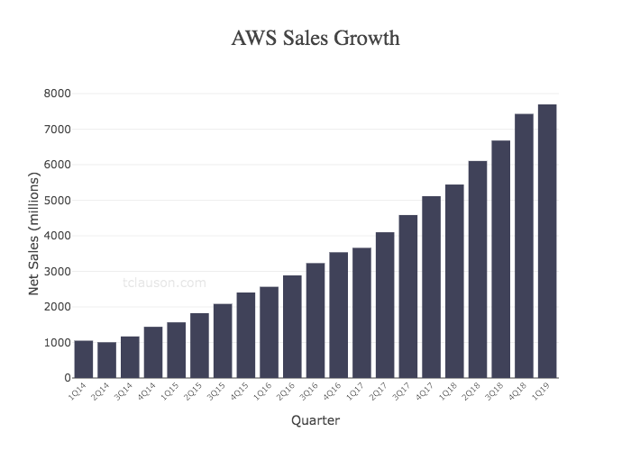
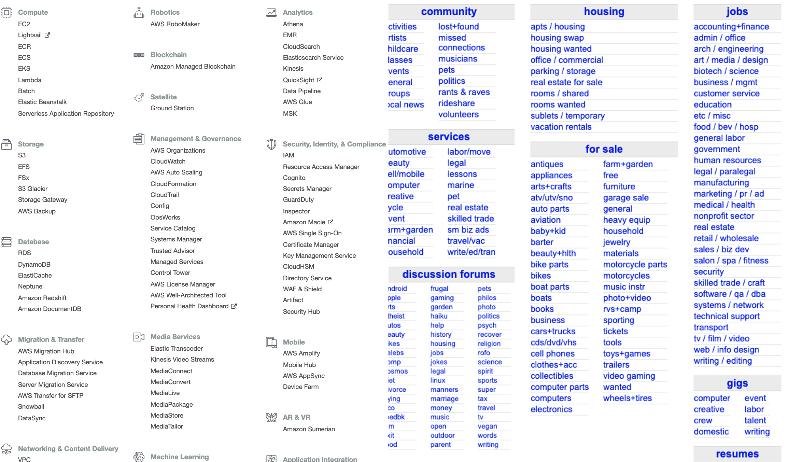

Unbundling AWS

# Unbundling AWS

Sep 11, 2019

Over the past year, I have spent a lot of time digging into cloud infrastructure and technical tools as a space for investing. One of the emergent behaviors of technology trends is the accelerating advantage of being a winner, played out with network effects or scale effects (or both!). Since its mid-2000’s launch, AWS has obviously become a juggernaut, growing so quickly and throwing off so much cash that even Amazon can’t put it to work fast enough (!). Getting a new software product to market has never been as cheap or fast as it is today, despite the fact that the surface area of in-depth knowledge required to build high-performing software has never been higher.

Leveraging lessons from building Amazon’s existing infrastructure, AWS has amassed [almost 50% market share](https://www.parkmycloud.com/blog/aws-vs-azure-vs-google-cloud-market-share/) of public cloud spending. It started out offering a small handful of services (S3, SQS, and EC2), but now has [170 discrete services](https://en.wikipedia.org/wiki/Timeline_of_Amazon_Web_Services) spanning 23 categories (and these are only the public ones!) As an early stage investor, I’m hard-pressed to name any tectonic shifts that have had as much impact on startup formation. The availability of open source tooling and the ease of access to infrastructure on AWS and other IaaS providers, and infrastructure turning into software, which means it’s programmable and, increasingly, thinly-sliced.

Recently, when I opened the AWS Console, I had a moment of *deja vu* that called back to a 2010 post by Andrew Parker, then of Spark Capital, that focused on the [startup opportunities of unbundling Craigslist](https://thegongshow.tumblr.com/post/345941486/the-spawn-of-craigslist-like-most-vcs-that-focus). And it shifted a long-simmering feeling into focus for me: **I am really excited about startups that are unbundling AWS.**

AWS’s growth has started slowing a bit, perhaps due to saturation, perhaps due to competition. Or perhaps it is because [my theory] as they continue to expand into platform-type services, some of their offerings shift from being best-in-class to being very reliable and with a ‘just-ok-but-well-integrated’ user experience. This is a great way to make money, but it also leaves certain of the ‘categories’ on the homepage open to outmaneuvering by a best-in-class experience.

I need to map out something like the awesome graphics that the Spark folks produced for Craigslist, but for now, I have been exploring my intuition about where and why there will be pieces of AWS that will be subject to unbundling. Here are a few that have come to mind already:

- Frameworks and deployment tools that make application software agnostic to the underlying infrastructure provider. Things like the [Serverless framework](https://www.tclauson.com/2019/09/11/serverless.com), containers + orchestration, or IAC tools like [Saltstack](https://www.saltstack.com/), [Terraform](https://www.hashicorp.com/products/terraform)[,](https://www.tclauson.com/2019/09/11/Unbundling-AWS.html)  [Ansible](https://www.ansible.com/), etc

- The overlapping areas of logging, APM, and monitoring. This is a hot area right now, with IPO’s like [Dynatrace](https://www.dynatrace.com/) or [Datadog](https://www.datadoghq.com/), or acquisitions like [SignalFX](https://www.signalfx.com/). Related: [Cloudwatch is terrible](https://www.linuxjournal.com/content/cloudwatch-devil-i-must-use-it)!

- Data science workflows – this is my subjective, anecdotal experience, but most data scientists I know have a preference for Google Cloud for a lot of their work, and [custom hardware like TPUs](https://cloud.google.com/tpu/) likely play a role here

- Authentication and identity – [Auth0](https://auth0.com/), [LoginRadius](https://www.loginradius.com/), [Okta](https://www.okta.com/), etc … where it may make sense to have a third-party handle

- Paradigms that lead to different stack choices – I’m a big proponent of the [JAMstack](https://jamstack.org/), and it’s a prime example of a paradigm where AWS may not be a natural choice for parts of this architecture. I believe that we will continue to see this and other new architectural paradigms evolve

There are obvious differences between Craigslist and AWS. The most important is that Craigslist (and each of the category spawn) is a marketplace, and so has the powerful advantage of network effects. Another distinction is that AWS has relative cost advantages over its unbundlers when it comes to the fundamental components of infrastructure (compute, bandwidth, storage, etc.), and I can’t see a parallel to Craigslist. So it’s not a perfect analogy, but the premise of unbundling certain categories still holds.

**But what if Amazon launches a competing product?**

This is one of those classical questions for any startup. In general, I don’t get too worried about $BIGCO being the reason that a startup dies. In my experience, it’s pretty far down the list of [things that actually kill startups](http://www.paulgraham.com/startupmistakes.html). That said, particular to developer-facing startups, there might be some reason for concern. AWS’s relationship with open source is … [complicated](https://stratechery.com/2019/aws-mongodb-and-the-economic-realities-of-open-source/). Notably, Mongo and Redis have both had to maneuver to combat AWS. The thing to note here is that in both of those situations, it’s a problem that those companies have had to face as they *monetize*, and was not a barrier to adoption. Put another way: we should all be so lucky to be at a scale and level of popularity where this becomes a problem. It’s hard for me to see a lot of cases where AWS will be competing with companies before they reach scale.

**Back to the future**
Thinly-sliced? Purpose-built, best-in-class tools? Sound familiar?
>

> … elaborate computing tasks are typically composed from loosely coupled small parts, often software tools taken off the shelf.

The [UNIX philosophy](https://danluu.com/mcilroy-unix/) strikes back! The history of software development has a lot of patterns in it, and this trend toward tools and component parts that do one thing well is one of my favorite. If every part of our infrastructure is available in ever-smaller pieces, on-demand, then the long narrative arc of this philosophy ought to continue to win out.

There are already billion-dollar companies that focus on relatively narrow niches within the AWS offering space–and I believe there will be many, many more. **If you’re building something that carves out a piece of AWS, I want to talk to you**.