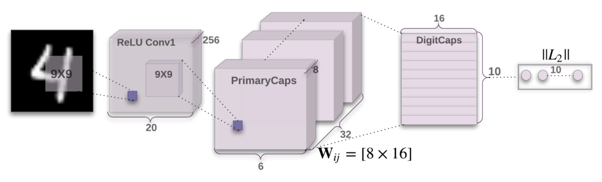
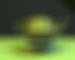
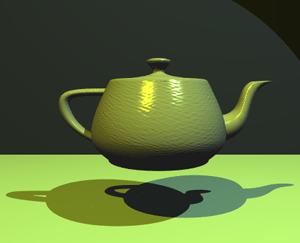
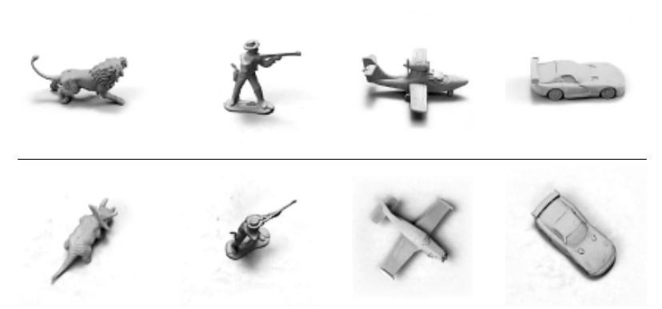

Understanding Hinton’s Capsule Networks. Part I: Intuition.

# Understanding Hinton’s Capsule Networks. Part I: Intuition.

Update: Part II is available [here](https://medium.com/@pechyonkin/understanding-hintons-capsule-networks-part-ii-how-capsules-work-153b6ade9f66).

### 1. Introduction

Last week, Geoffrey Hinton and his team published [two](https://arxiv.org/abs/1710.09829)  [papers](https://openreview.net/pdf?id=HJWLfGWRb) that introduced a completely new type of neural network based on so-called *capsules*. In addition to that, the team published an algorithm, called *dynamic routing between capsules*, that allows to train such a network.

Geoffrey Hinton has spent decades thinking about capsules. [Source](http://condo.ca/wp-content/uploads/2017/03/Vector-director-Institute-artificial-intelligence-Toronto-MaRS-Discovery-District-Hinton-Google-Apple-Siri-Alexa-Condo.ca_.jpg).

For everyone in the deep learning community, this is huge news, and for several reasons. First of all, Hinton is one of the founders of deep learning and an inventor of numerous models and algorithms that are widely used today. Secondly, these papers introduce something completely new, and this is very exciting because it will most likely stimulate additional wave of research and very cool applications.

In this post, I will explain why this new architecture is so important, as well as intuition behind it. In the following posts I will dive into technical details.

However, before talking about capsules, we need to have a look at CNNs, which are the workhorse of today’s deep learning.

Architecture of CapsNet from the [original paper](https://arxiv.org/abs/1710.09829).

### 2. CNNs Have Important Drawbacks

CNNs ([convolutional neural networks](https://en.wikipedia.org/wiki/Convolutional_neural_network)) are awesome. They are one of the reasons deep learning is so popular today. They can do [amazing things](http://www.yaronhadad.com/deep-learning-most-amazing-applications/) that people used to think computers would not be capable of doing for a long, long time. Nonetheless, they have their limits and they have fundamental drawbacks.

Let us consider a very simple and non-technical example. Imagine a face. What are the components? We have the face oval, two eyes, a nose and a mouth. For a CNN, a mere presence of these objects can be a very strong indicator to consider that there is a face in the image. Orientational and relative spatial relationships between these components are not very important to a CNN.

To a CNN, both pictures are similar, since they both contain similar elements. [Source](http://sharenoesis.com/wp-content/uploads/2010/05/7ShapeFaceRemoveGuides.jpg).

How do CNNs work? The main component of a CNN is a convolutional layer. Its job is to detect important features in the image pixels. Layers that are deeper (closer to the input) will learn to detect simple features such as [edges and color gradients](https://arxiv.org/abs/1312.6199), whereas higher layers will combine simple features into more complex features. Finally, dense layers at the top of the network will combine very high level features and produce classification predictions.

An important thing to understand is that higher-level features combine lower-level features as a weighted sum: activations of a preceding layer are multiplied by the following layer neuron’s weights and added, before being passed to activation nonlinearity. Nowhere in this setup there is **pose** (translational and rotational) relationship between simpler features that make up a higher level feature. CNN approach to solve this issue is to use max pooling or successive convolutional layers that reduce spacial size of the data flowing through the network and therefore increase the “field of view” of higher layer’s neurons, thus allowing them to detect higher order features in a larger region of the input image. Max pooling is a crutch that made convolutional networks work surprisingly well, achieving [superhuman performance](https://www.eetimes.com/document.asp?doc_id=1325712) in many areas. But do not be fooled by its performance: while CNNs work better than any model before them, max pooling nonetheless is losing valuable information.

Hinton himself stated that the fact that max pooling is working so well is a [**big mistake and a disaster**](https://www.reddit.com/r/MachineLearning/comments/2lmo0l/ama_geoffrey_hinton/clyj4jv/)**:**

> Hinton: “**> The pooling operation used in convolutional neural networks is a big mistake and the fact that it works so well is a disaster.**> ”

Of course, you can do away with max pooling and still get good results with traditional CNNs, but they still do not solve the **key problem**:

> Internal data representation of a convolutional neural network does not take into account important spacial hierarchies between simple and complex objects.

In the example above, a mere presence of 2 eyes, a mouth and a nose in a picture does not mean there is a face, we also need to know how these objects are oriented relative to each other.

### 3. Hardcoding 3D World into a Neural Net: Inverse Graphics Approach

Computer graphics deals with constructing a visual image from some [internal hierarchical representation of geometric data](https://en.wikipedia.org/wiki/3D_computer_graphics). Note that the structure of this representation needs to take into account relative positions of objects. That internal representation is stored in computer’s memory as arrays of geometrical objects and matrices that represent relative positions and orientation of these objects. Then, special software takes that representation and converts it into an image on the screen. This is called [rendering](https://en.wikipedia.org/wiki/Rendering_%28computer_graphics%29).

Computer graphics takes internal representation of objects and produces an image. Human brain does the opposite. Capsule networks follow a similar approach to the brain. [Source](https://upload.wikimedia.org/wikipedia/commons/a/ad/Utah_teapot.png).

Inspired by this idea, Hinton argues that brains, in fact, do the opposite of rendering. He calls it [**inverse**](https://youtu.be/TFIMqt0yT2I)**  **[**graphics**](http://helper.ipam.ucla.edu/publications/gss2012/gss2012_10754.pdf): from visual information received by eyes, they deconstruct a hierarchical representation of the world around us and try to match it with already learned patterns and relationships stored in the brain. This is how recognition happens. And the key idea is that **representation of objects in the brain does not depend on view angle**.

So at this point the question is: how do we model these hierarchical relationships inside of a neural network? The answer comes from computer graphics. In 3D graphics, relationships between 3D objects can be represented by a so-called ***pose***, which is in essence [translation](https://en.wikipedia.org/wiki/Translation_%28geometry%29) plus [rotation](https://en.wikipedia.org/wiki/Rotation_%28mathematics%29).

Hinton argues that in order to correctly do classification and object recognition, it is important to preserve hierarchical pose relationships between object parts. This is the key intuition that will allow you to understand why capsule theory is so important. It incorporates relative relationships between objects and it is represented numerically as a 4D [pose matrix](http://homepages.inf.ed.ac.uk/rbf/CVonline/LOCAL_COPIES/MARBLE/high/pose/express.htm).

When these relationships are built into internal representation of data, it becomes very easy for a model to understand that the thing that it sees is just another view of something that it has seen before. Consider the image below. You can easily recognize that this is the Statue of Liberty, even though all the images show it from different angles. This is because internal representation of the Statue of Liberty in your brain does not depend on the view angle. You have probably never seen these exact pictures of it, but you still immediately knew what it was.

Your brain can easily recognize this is the same object, even though all photos are taken from different angles. CNNs do not have this capability.

For a CNN, this task is really hard because it does not have this build-in understanding of 3D space, but for a CapsNet it is much easier because these relationships are explicitly modeled. The paper that uses this approach was able to [**cut error rate by 45%**](https://openreview.net/pdf?id=HJWLfGWRb) as compared to the previous state of the art, which is a huge improvement.

Another benefit of the capsule approach is that it is capable of learning to achieve state-of-the art performance by **only using a fraction of the data that a CNN would use** (Hinton mentions this in his famous talk about [**what is wrongs with CNNs**](https://youtu.be/rTawFwUvnLE)). In this sense, the capsule theory is much closer to what the human brain does in practice. In order to learn to tell digits apart, the human brain needs to see only a couple of dozens of examples, hundreds at most. CNNs, on the other hand, need tens of thousands of examples to achieve very good performance, which seems like a brute force approach that is clearly inferior to what we do with our brains.

### 4. What Took It so Long?

The idea is really simple, there is no way no one has come up with it before! And the truth is, Hinton has been thinking about this for decades. The reason why there were no publications is simply because there was no technical way to make it work before. One of the reasons is that computers were just not powerful enough in the pre-GPU-based era before around 2012. Another reason is that there was no algorithm that allowed to implement and successfully learn a capsule network (in the same fashion the idea of artificial neurons was around since 1940-s, but it was not until mid 1980-s when [backpropagation algorithm](https://en.wikipedia.org/wiki/Backpropagation) showed up and allowed to successfully train deep networks).

In the same fashion, the idea of capsules itself is not that new and Hinton has mentioned it before, but there was no algorithm up until now to make it work. This algorithm is called “dynamic routing between capsules”. This algorithm allows capsules to communicate with each other and create representations similar to [scene graphs](https://en.wikipedia.org/wiki/Scene_graph) in computer graphics.

The capsule network is much better than other models at telling that images in top and bottom rows belong to the same classes, only the view angle is different. The latest papers decreased the error rate by a whopping 45%. [Source](https://openreview.net/pdf?id=HJWLfGWRb).

### 5. Conclusion

Capsules introduce a new building block that can be used in deep learning to better model hierarchical relationships inside of internal knowledge representation of a neural network. Intuition behind them is very simple and elegant.

Hinton and his team proposed a way to train such a network made up of capsules and successfully trained it on a simple data set, achieving state-of-the-art performance. This is very encouraging.

Nonetheless, there are challenges. [Current](https://github.com/llSourcell/capsule_networks)  [implementations](https://github.com/XifengGuo/CapsNet-Keras) are much slower than other modern deep learning models. Time will show if capsule networks can be trained quickly and efficiently. In addition, we need to see if they work well on more difficult data sets and in different domains.

In any case, the capsule network is a very interesting and already working model which will definitely get more developed over time and contribute to further expansion of deep learning application domain.

This concludes part one of the series on capsule networks. In the [Part II](https://medium.com/@pechyonkin/understanding-hintons-capsule-networks-part-ii-how-capsules-work-153b6ade9f66), more technical part, I will walk you through the CapsNet’s internal workings step by step.

* * *

*...*

### Thanks for reading! If you enjoyed it, hit that clap button below and follow me! It would mean a lot to me and encourage me to write more stories like this.

*Let’s also connect on *[*LinkedIn*](https://www.linkedin.com/in/maxim-pechyonkin-phd/)*.*