Understanding the Central Limit Theorem - Towards Data Science

# Understanding the Central Limit Theorem

## Diving deep into one of the most important theorems in statistics

[Abhishek Jhunjhunwala](https://towardsdatascience.com/@jjw92abhi?source=post_page-----e598158cc5da----------------------)

[Sep 8](https://towardsdatascience.com/understanding-the-central-limit-theorem-e598158cc5da?source=post_page-----e598158cc5da----------------------) · 5 min read

In this article, I want to talk about the central limit theorem and its applications in statistics. The central limit theorem states that if data is independently drawn from any distribution and the sample size is large enough, the sample mean always appears to be normally distributed. This might be a little difficult to comprehend at the moment so let’s take a look at the sample mean and its properties. Let’s try to calculate the expected value of the sample mean and sample variance which is not very difficult. Here, we assume that our data is identical and independently distributed and start with the definition of sample mean:

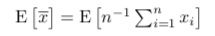
Now we can take the constant 1/n out of the expected value:

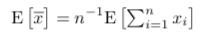
Next, we include the expected value inside the sum:

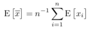
Here, the expected value of each observation is :
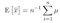
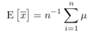

The term on the right side is the sum of over n times and divided by n, which gives us the expected value of the sample means as itself:

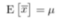
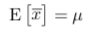

Next, we try to calculate the variance of the sample mean which is a little complicated but important. We take the same assumptions about our data as before and begin with the definition of variance:

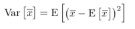

We can see the sample mean in the equation and that is just wonderful because we have already calculated it above:

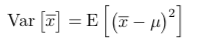

Now we expand the sample mean term into individual data points and combine it with :

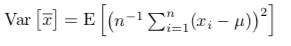
Then we separate the square term into two terms:

This is same as finding the covariance between x*i* and x*j*:

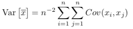

Now, we know that the covariance is 0 when i is not equal to j as they are independent observations according to our initial assumption. So, we are left with only the terms where i = j and we have n of those terms which is equal to the variance of x*i*:

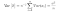
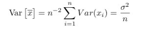
Note that the variance of sample mean approaches 0 as n → ∞.

Now that we know the expected value of the sample mean and variance, we are in a better position to discuss the central limit theorem. But first, we should discuss a type of convergence called convergence in distribution which states that a statistic will converge to an entire distribution possessing some inherent randomness. Which means that the probability density function of a statistic should converge to the pdf of a particular distribution when we take large enough sample sizes. The central limit theorem is an application of the same which says that the sample means of any distribution should converge to a normal distribution if we take large enough samples. And once we standardise the sample means, we can approximate it to a standard normal distribution. Standardisation especially means subtracting the mean from a variable and then dividing by the standard deviation. The central limit theorem can be mathematically denoted as following:

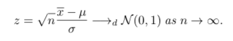

Here, z is the standardised form of the sample mean also known as the z statistic, is the population mean and is the population standard deviation. We get a root n term because as we had derived before, the standard deviation of the sample means is equal to the standard deviation of the population divided by n.

Now that we have an understanding of the central limit theorem, let’s test it on some data. For this, I have written a function in R using which we can take samples of different sizes from a distribution of our choice.

|     |     |
| --- | --- |
| 1   | simulate  <-  function(nsim,nvec){ |
| 2   |  simdx  <- c() |
| 3   |  for(i  in  1:length(nvec)) |
| 4   |  simdx  <- c(simdx,rep(1:nsim,each=nvec[i])+(i-1)*nsim) |
| 5   |  dt  <- data.table(sim=simdx) |
| 6   |  bigN  <- nrow(dt) |
| 7   |  dt$n  <- rep(rep(nvec,nvec),each=nsim) |
| 8   |  dt$one  <-  1 |
| 9   |  dt$simc  <-  dt[,cumsum(one),by=sim]$V1 |
| 10  |  dt$one  <-  NULL |
| 11  |  return(dt) |
| 12  | }   |
| 13  |     |
| 14  | ## Central limit theorem demo |
| 15  | dt  <- simulate(100000,c(1,2,3,5)) |
| 16  | bigN  <- nrow(dt) |
| 17  | dt$x1  <- runif(bigN,-1,1) |
| 18  | dt$x2  <- runif(bigN,-0.5,0.5) |
| 19  | dt$x3  <- runif(bigN,-2,2) |
| 20  | zstats  <-  dt[,lapply(.SD,mean),by=sim] |
| 21  | zstats  <-  zstats[,.(n,x1*sqrt(12*n)/2,x2*sqrt(12*n)/1,x3*sqrt(12*n)/4)] |
| 22  | names(zstats) <- c('n','x1','x2','x3') |
| 23  | zstats |
| 24  |     |
| 25  | ggplot(zstats[n==1],aes(x=x1)) + geom_histogram(position="identity",binwidth  =  0.01) |
| 26  | ggplot(zstats[n==2],aes(x=x1)) + geom_histogram(position="identity",binwidth  =  0.01) |
| 27  | ggplot(zstats[n==3],aes(x=x1)) + geom_histogram(position="identity",binwidth  =  0.01) |
| 28  | ggplot(zstats[n==5],aes(x=x1)) + geom_histogram(position="identity",binwidth  =  0.01) |
| 29  |     |
| 30  |     |

 [view raw](https://gist.github.com/spikar/881cc3aa73c82e61b97e0b5305e20489/raw/5de03a269ca99913dce0b813a43b3509b4adabf3/central_limit.R)  [central_limit.R](https://gist.github.com/spikar/881cc3aa73c82e61b97e0b5305e20489#file-central_limit-r) hosted with ❤ by [GitHub](https://github.com/)

The simulate function takes two inputs: *nsim*, the number of simulations and *nvec*, the number of n samples to use and returns a data.table class of the right shape for the data we generate later. Then we create a table to store 100,000 samples of sizes 1,2,3,5 each using the simulate function. Then we take the samples from a uniform distribution between 1 and -1. Then we calculate the mean of all samples and plot the pdf separately for each sample size.

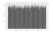
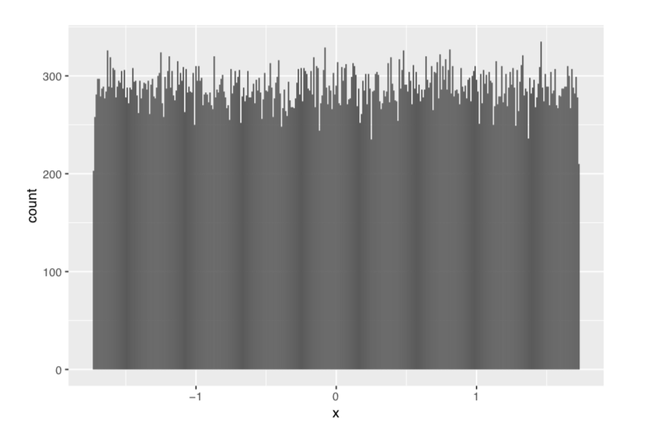
For n=1, and we see that z follows a uniform distribution just like our data.

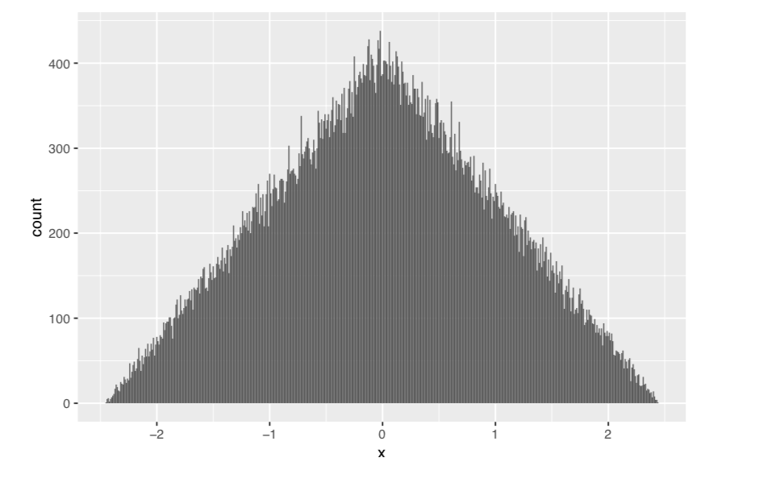
For n=2, z follows a triangular kind of shape.

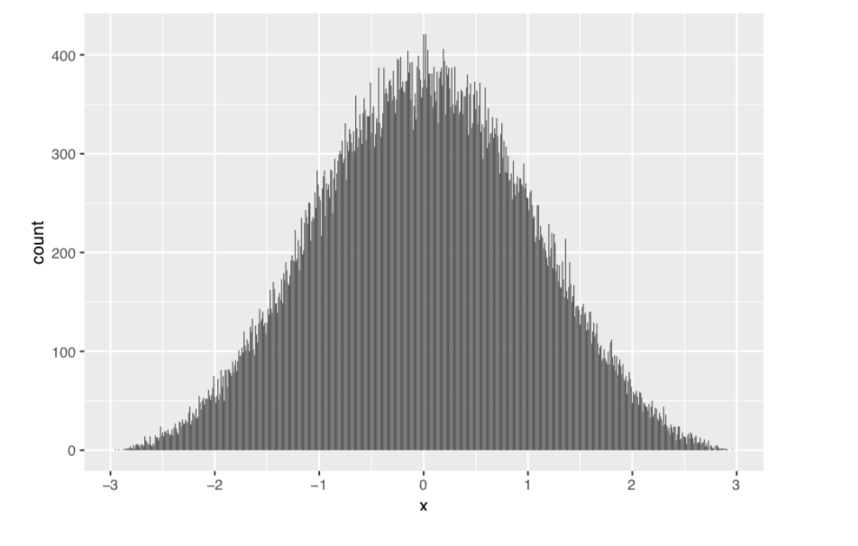

For n=3, things start getting interesting and z begins to look like a bell curve.

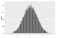
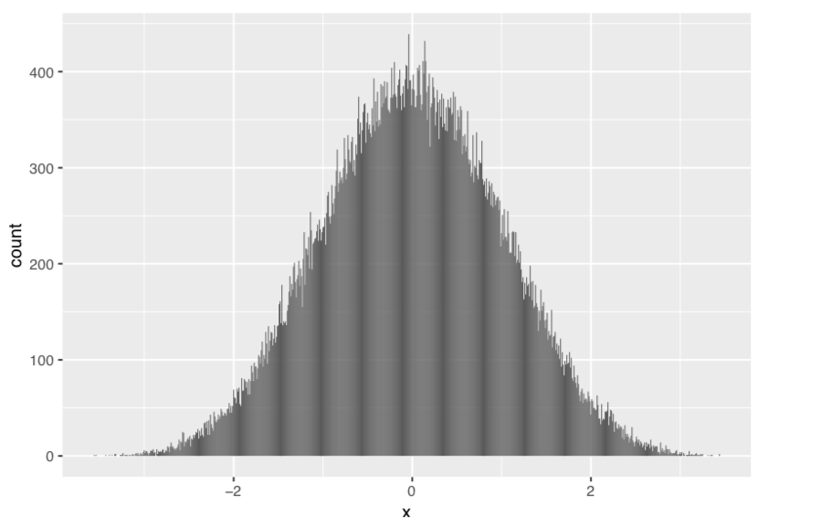

For n=5, z becomes almost completely normal. So, for sample size as small as 5, we are able to observe the central limit theorem which makes it all the more powerful with real data.

We use the central limit theorem when we don’t want to model the distribution of the data and we only need to care about the mean and the variance for our statistical analysis. This is one of the most important and useful theorems in statistics.