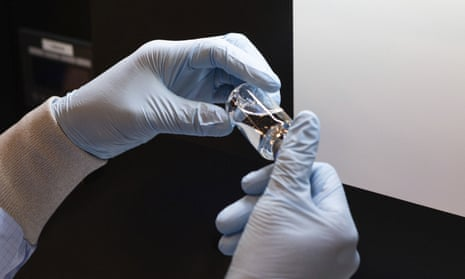
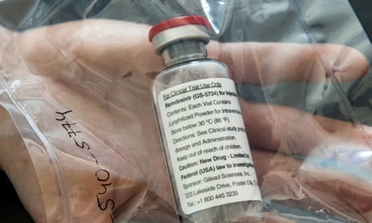

Until we have a vaccine for coronavirus, treatments like remdesivir are our only hope | Jennifer Rohn | Opinion | The Guardian

[Opinion](https://www.theguardian.com/uk/commentisfree)
[Medical research](https://www.theguardian.com/science/medical-research)

# Until we have a vaccine for coronavirus, treatments like remdesivir are our only hope

*[Jennifer Rohn*](https://www.theguardian.com/profile/jennifer-rohn)

Conflicting evidence from early trials is the norm in science. We must be patient as the data unfolds

- [Coronavirus – latest updates](https://www.theguardian.com/world/live/2020/mar/14/coronavirus-live-updates-uk-us-australia-italy-europe-school-shutdown-sport-events-cancelled-latest-update-news)
- [See all our coronavirus coverage](https://www.theguardian.com/world/coronavirus-outbreak)

Thu 30 Apr 2020 09.00 BSTLast modified on Thu 30 Apr 2020 09.14 BST

- 
- 
- 

Shares

53

[ ###   Comments   763](https://www.theguardian.com/commentisfree/2020/apr/30/failed-trials-covid-19-drugs-remdesivir#comments)

‘Although people prefer their science to be black and white, clinical reality is rarely that definitive. New therapies can fail one key trial and still go on to become a marketed drug.’ Photograph: AP

Drug discovery and testing, even under normal circumstances, is a high-risk process full of red herrings and dashed hopes. In the throes of a global pandemic, the stakes are even higher and the risks remain the same. So although the news last week that the promising Covid-19 drug remdesivir [seems to have failed](https://eur01.safelinks.protection.outlook.com/?url=https%3A%2F%2Fwww.theguardian.com%2Fworld%2F2020%2Fapr%2F23%2Fhigh-hopes-drug-for-covid-19-treatment-failed-in-full-trial&data=02%7C01%7C%7Cec0b03ed7fa9477290ed08d7ec1efeec%7C1faf88fea9984c5b93c9210a11d9a5c2%7C0%7C0%7C637237490190642388&sdata=%2Fq5BcHm0dCBYXLmTc7dTY4unYqOgo29kZCYFDfLbsIU%3D&reserved=0) a major trial was certainly disappointing, it was not surprising.

It usually takes about two decades to go from a promising lab “eureka” to a marketed drug. The dicey territory in between is known as “the valley of death” for good reason: the failure rate for a drug entering clinical trials has [been estimated](https://www.ncbi.nlm.nih.gov/pmc/articles/PMC5477974/#R23) at more than 90%, and many startups go under before their therapy idea even makes it that far.

 

##   [First trial for potential Covid-19 drug shows it has no effect]()

   

Read more

 [(L)](https://www.theguardian.com/world/2020/apr/23/high-hopes-drug-for-covid-19-treatment-failed-in-full-trial)

Now years are being compressed into weeks. Researchers are throwing everything they have at the virus, including various drugs that have already been approved for other uses, experimental drugs that didn’t work for other diseases but might just work for Covid-19 – and even banal substances like vitamin C. At the [last count](https://www.thelancet.com/journals/lancet/article/PIIS0140-6736(20)30894-1/fulltext), there were more than 300 clinical trials ongoing or about to recruit worldwide. A lot of drug testing is also happening outside of formal trials under “compassionate use” regulations, which allow unapproved drugs to be used on seriously ill patients with no other recourse.

It’s important to note that these drugs are not vaccines, they are treatments. Vaccines prevent disease altogether, saving a huge amount of healthcare expenditure and heartache, but drugs like these play an important role in treating those who become ill. And even when we have a Covid-19 vaccine, protection is not likely to be 100%, so treatments will still be useful.

Advertisement

Remdesivir was initially developed as an Ebola therapy by the American company Gilead Sciences. It targets the specialised process of genome copying in viruses, which contain an RNA blueprint instead of its cousin DNA. Coronaviruses also have RNA genomes and in animal experiments, remdesivir showed activity against the related coronaviruses that cause Sars and Mers. Hopes were raised further when the drug performed well on primates infected with Sars-CoV2 and was [associated with some improvement](https://eur01.safelinks.protection.outlook.com/?url=https%3A%2F%2Fwww.nejm.org%2Fdoi%2Ffull%2F10.1056%2FNEJMoa2007016&data=02%7C01%7C%7Cec0b03ed7fa9477290ed08d7ec1efeec%7C1faf88fea9984c5b93c9210a11d9a5c2%7C0%7C0%7C637237490190652376&sdata=fQYxAIYZweSP7FSvs%2BModiKRbvZ7i9ZSYtrW0WKGckc%3D&reserved=0) in a small compassionate use patient study published in the New England Journal of Medicine. But the gold standard is a randomised control trial, and an accidentally posted memo suggested that Gilead’s trial had been terminated early due to side-effects with no improvement seen over placebo.

It’s not necessarily the end for remdesivir. [Gilead has since said](https://eur01.safelinks.protection.outlook.com/?url=https%3A%2F%2Fwww.clinicaltrialsarena.com%2Fnews%2Fgilead-remdesivir-covid-19-china-data%2F&data=02%7C01%7C%7Cec0b03ed7fa9477290ed08d7ec1efeec%7C1faf88fea9984c5b93c9210a11d9a5c2%7C0%7C0%7C637237490190652376&sdata=O8hN3jh0h8X%2FrKPa4dzuTRIZZFv6C0Pgv%2BHxcySjQNI%3D&reserved=0) that the early termination of its trial meant the results were inconclusive, not a failure, because recruitment numbers weren’t high enough to necessarily see a difference. A [formal publication](https://www.thelancet.com/journals/lancet/article/PIIS0140-6736(20)31022-9/fulltext) describing all the details has already been fast-tracked. In the meantime, there are [five other trials](https://www.gilead.com/purpose/advancing-global-health/covid-19/remdesivir-clinical-trials) of remdesivir ongoing, including a few gold-standard randomised trials. Reports on Wednesday suggested that the [preliminary results](https://www.reuters.com/article/us-health-coronavirus-gilead-remdesivir/gileads-remdesivir-meets-main-goal-of-trial-in-covid-19-patients-idUSKBN22B1T9?utm_medium=Social&utm_source=twitter) in one of these, conducted by the National Institute of Allergy and Infectious Diseases, showed improved recovery times compared to placebo.

Although people prefer their science to be black and white, clinical reality is rarely that definitive. New therapies can fail one key trial and still go on to become a marketed drug. This is because different trials have different parameters: the patient population can vary, or they might employ different doses, endpoints or measures of success. Crucially for antiviral compounds, which might be expected to work better at earlier stages of the disease, a patient’s level of sickness at the time of treatment is also a key consideration.

##   [What are the prospects for a Covid-19 treatment?]()

   

Read more

 [(L)](https://www.theguardian.com/science/2020/mar/19/prospects-treatment-coronavirus-drugs-vaccines)

But whether remdesivir works or not, there are still all those other possibilities on the horizon. The World Health Organization chose three other potential therapies in addition to remdesivir to back in its [S](https://www.who.int/emergencies/diseases/novel-coronavirus-2019/global-research-on-novel-coronavirus-2019-ncov/solidarity-clinical-trial-for-covid-19-treatments)[olidarity trial](https://www.who.int/emergencies/diseases/novel-coronavirus-2019/global-research-on-novel-coronavirus-2019-ncov/solidarity-clinical-trial-for-covid-19-treatments), which is supporting patient studies all over the world. These are interferon beta-1a, a molecule that our immune system produces; lopinavir, an approved treatment for HIV; and [chloroquine/hydroxychloroquine](https://www.fda.gov/drugs/drug-safety-and-availability/fda-cautions-against-use-hydroxychloroquine-or-chloroquine-covid-19-outside-hospital-setting-or), malaria drugs which have caused controversy due to their side-effects (as well as for being touted by Donald Trump). It’s worth noting that [lopinavir](https://www.nejm.org/doi/full/10.1056/NEJMoa2001282) and [the malaria drugs](https://www.medrxiv.org/content/10.1101/2020.04.07.20056424v2) have also [failed previous trials](https://www.forbes.com/sites/tarahaelle/2020/03/25/chloroquine-use-for-covid-19-shows-no-benefit-in-first-small-but-limited-controlled-trial/) for Covid-19.

One dark horse is Pepcid (famotidine), a widely used over-the-counter heartburn remedy. [This unlikely solution](https://eur01.safelinks.protection.outlook.com/?url=https%3A%2F%2Fwww.sciencemag.org%2Fnews%2F2020%2F04%2Fnew-york-clinical-trial-quietly-tests-heartburn-remedy-against-coronavirus&data=02%7C01%7C%7Cec0b03ed7fa9477290ed08d7ec1efeec%7C1faf88fea9984c5b93c9210a11d9a5c2%7C0%7C0%7C637237490190662374&sdata=REkGCM%2FdL8Vw0jv8qmE9BvK8KNEISPE23RC6biSYXaQ%3D&reserved=0) came into focus when it was noticed that some Covid-19 survivors had been on the medication – a testimony to how serendipity and close observations can play key roles in medicine – and trial results are expected in a couple of weeks.

Advertisement

Ultimately, the most effective way of controlling the pandemic is through immunisation. But with a vaccine months or even years away, and even then not totally assured, a viable therapy could make all the difference in the meantime. The world will be watching the results of these hundreds of trials closely, with fingers very much crossed.

-

Dr Jennifer Rohn is a cell biologist in the division of medicine at University College London.

##  News is under threat …

… just when we need it the most. Millions of readers around the world are flocking to the Guardian in search of honest, authoritative, fact-based reporting that can help them understand the biggest challenge we have faced in our lifetime. But at this crucial moment, news organisations are facing a cruel financial double blow: with fewer people able to leave their homes, and fewer news vendors in operation, we’re seeing a reduction in newspaper sales across the UK. Advertising revenue continues to fall steeply meanwhile as businesses feel the pinch. We need you to help fill the gap.

We believe every one of us deserves equal access to vital public service journalism. So, unlike many others, we made a different choice: to keep Guardian journalism open for all, regardless of where they live or what they can afford to pay. This would not be possible without financial contributions from those who can afford to pay, who now support our work from 180 countries around the world.

We have upheld our editorial independence in the face of the disintegration of traditional media – with social platforms giving rise to misinformation, the seemingly unstoppable rise of big tech and independent voices being squashed by commercial ownership. The Guardian’s independence means we can set our own agenda and voice our own opinions. Our journalism is free from commercial and political bias – never influenced by billionaire owners or shareholders. This makes us different. It means we can challenge the powerful without fear and give a voice to those less heard.

Reader financial support has meant we can keep investigating, disentangling and interrogating. It has protected our independence, which has never been so critical. We are so grateful.

We need your support so we can keep delivering quality journalism that’s open and independent. And that is here for the long term. Every reader contribution, however big or small, is so valuable. **Support the Guardian from as little as £1 – and it only takes a minute. Thank you.**

 [Support The Guardian](https://support.theguardian.com/uk/contribute?REFPVID=k9mrm1zkg04r6wd87ari&INTCMP=gdnwb_copts_memco_2020-04-24_EPIC_ROUND2__UK_NO_ARTICLE_COUNT_CONTROL&acquisitionData=%7B%22source%22%3A%22GUARDIAN_WEB%22%2C%22componentId%22%3A%22gdnwb_copts_memco_2020-04-24_EPIC_ROUND2__UK_NO_ARTICLE_COUNT_CONTROL%22%2C%22componentType%22%3A%22ACQUISITIONS_EPIC%22%2C%22campaignCode%22%3A%22gdnwb_copts_memco_2020-04-24_EPIC_ROUND2__UK_NO_ARTICLE_COUNT_CONTROL%22%2C%22abTest%22%3A%7B%22name%22%3A%222020-04-24_EPIC_ROUND2__UK_NO_ARTICLE_COUNT%22%2C%22variant%22%3A%22CONTROL%22%7D%2C%22referrerPageviewId%22%3A%22k9mrm1zkg04r6wd87ari%22%2C%22referrerUrl%22%3A%22https%3A%2F%2Fwww.theguardian.com%2Fcommentisfree%2F2020%2Fapr%2F30%2Ffailed-trials-covid-19-drugs-remdesivir%22%7D)

Remind me in July

 

Topics

- [Medical research/](https://www.theguardian.com/science/medical-research)
- [Opinion/](https://www.theguardian.com/uk/commentisfree)
- [Vaccines and immunisation/](https://www.theguardian.com/society/vaccines)
- [Health/](https://www.theguardian.com/society/health)
- [Drugs/](https://www.theguardian.com/science/drugs)
- [Coronavirus outbreak/](https://www.theguardian.com/world/coronavirus-outbreak)
- [Infectious diseases/](https://www.theguardian.com/science/infectiousdiseases)
- [Microbiology/](https://www.theguardian.com/science/microbiology)
- [comment/](https://www.theguardian.com/tone/comment)
- 
- 
- 
- [Share on LinkedIn](http://www.linkedin.com/shareArticle?mini=true&title=Until%20we%20have%20a%20vaccine%20for%20coronavirus%2C%20treatments%20like%20remdesivir%20are%20our%20only%20hope%20%7C%20Jennifer%20Rohn&url=https%3A%2F%2Fwww.theguardian.com%2Fcommentisfree%2F2020%2Fapr%2F30%2Ffailed-trials-covid-19-drugs-remdesivir)
- [Share on Pinterest](http://www.pinterest.com/pin/find/?url=https%3A%2F%2Fwww.theguardian.com%2Fcommentisfree%2F2020%2Fapr%2F30%2Ffailed-trials-covid-19-drugs-remdesivir)
- [Reuse this content](https://syndication.theguardian.com/automation/?url=https%3A%2F%2Fwww.theguardian.com%2Fcommentisfree%2F2020%2Fapr%2F30%2Ffailed-trials-covid-19-drugs-remdesivir&type=blog&internalpagecode=7357729)