Up and Down the Ladder of Abstraction

use arrow keys

*"In science, if you know what you are doing, you should not be doing it. In engineering, if you do not know what you are doing, you should not be doing it. Of course, you seldom, if ever, see either pure state."*

—Richard Hamming, [The Art of Doing Science and Engineering](http://www.amazon.com/dp/B000P2XFPA)

How can we design systems when we don't know what we're doing?

The most exciting engineering challenges lie on the **boundary of theory and the unknown**. Not so unknown that they're hopeless, but not enough theory to predict the results of our decisions. Systems at this boundary often rely on *emergent behavior* — high-level effects that arise indirectly from low-level interactions.

When designing at this boundary, the challenge lies not in constructing the system, but in understanding it. In the absence of theory, we must develop an *intuition* to guide our decisions. The design process is thus one of exploration and discovery.

How do we explore? If you move to a new city, you might learn the territory by walking around. Or you might peruse a map. But far more effective than either is *both together* — a street-level experience with higher-level guidance.

Likewise, the most powerful way to gain insight into a system is by *moving between levels of abstraction*. Many designers do this instinctively. But it's easy to get stuck on the ground, experiencing concrete systems with no higher-level view. It's also easy to get stuck in the clouds, working entirely with abstract equations or aggregate statistics.

This interactive essay presents the **ladder of abstraction**, a technique for thinking *explicitly* about these levels, so a designer can move among them consciously and confidently.

I believe that an essential skill of the modern system designer will be using the *interactive medium* to move fluidly around the ladder of abstraction.

Standing on Concrete

We'll start with an in-depth example — designing the control system for a **simple car simulation**. Our goal is to write a set of rules that allows the car to navigate roads, such as the one to the right.

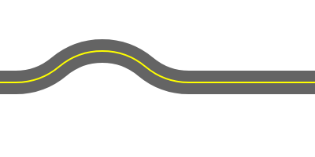

What inputs does our system have? Let's say that our car has a very simple sensor which can only detect three states: the car is on the road, left of the road, or right of the road.

How do we design the rules for the car to follow? We don't understand this system well enough to predict its behavior, so we need to *prototype*. We start with the *simplest possible design*, and thoroughly explore it. As we develop a feel for how it works, we'll get ideas for improvements. We try an idea, explore again, and keep iterating. Our design and our intuition should grow side-by-side.

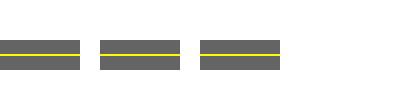

on the road

left of road

right of road

The simplest possible rule here might be to turn right when off-road to the left, and turn left when off-road to the right.

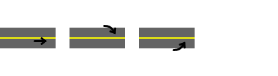

go straight

veer right

veer left

To the right is an algorithm which encodes this strategy.

At each step:

Move forward 1 pixel.

If left of the road, turn right by 2°.

If right of the road, turn left by 2°.

**Click to the right** to find out how this algorithm behaves.

I suspect we all know someone whose driving is accurately modeled by this algorithm.

Controlling Time

Above, we watched the system evolve in real time. A realtime view is useful for getting a direct, visceral sense of a system's behavior, especially for systems that are meant to be experienced by humans, such as visual effects.

However, real time is also quite limiting. Imagine a film editor who has to watch the entire film from the beginning with every edit, and cannot even pause or rewind. That would be absurd. Yet, most of our interactive systems are designed in this fashion.

To understand a system, we must be able to explore it. To explore, we must be able to move freely, under our own control.

**Mouse over the slider at the right** to control time explicitly. Notice that we can easily simulate realtime playback simply by moving the mouse over the slider at a steady rate. But we also have the ability to quickly skim over it, or stop at interesting events and examine them carefully, or quickly jump between interesting events and compare them.

A designer needs direct, interactive control over the independent variables of the system. We must not be slaves to real time.

At each step:

Move forward 1 pixel.

If left of the road, turn right by 2°.

If right of the road, turn left by 2°.

Controlling the Algorithm

In this algorithm, the car turns at a rate of 2° per step. Why 2°? Because we needed to choose *some* value, and with no understanding of the system's behavior yet, we made a wild guess.

Wild guesses are okay! We need to start somewhere. But we also need a way to easily and fluidly *adjust* our guesses, see the consequences, and develop a sense for how they affect the behavior.

The turning rate should be a *parameter* of our algorithm. And like time, we must be able to interactively control our parameters.

Here we have two sliders, one controlling time, and one controlling turning rate. **Click on a slider to "lock" it** at some particular value, so you can skim over the other.

Try looking at the system's behavior for various turning rates. Notice how important it is that we've controlled time, so we can quickly skim over each possibility instead of tediously watching it play out in real time.

Try setting the turning rate to zero. I think we all know someone who drives like this as well.

At each step:

Move forward 1 pixel.

If left of the road, turn right by 2.0°.

If right of the road, turn left by 2.0°.

Abstracting Over Time

We've put our variables under interactive control, but it's difficult to get a clear sense of how the parameter affects the car's motion. We need a broader view.

Imagine looking for parking in a busy city, winding up and down the streets, hoping you'll chance upon an empty spot. Now imagine looking from a helicopter above the city. You'd instantly see every spot available! On the ground, you are limited to seeing a single street at any moment. From the air, you can see *every street at once*.

Likewise, our representation above, at any given moment, only depicts the system at *one particular time*. But we can go higher, and concoct a representation that statically depicts the system *across all time*.

Here, instead of showing the car, we show the car's entire *trajectory*. **Mouse over the slider**, and notice how much easier it is to see patterns. For instance, the system exhibits severe oscillation for turning rates between 1° and 2°, and that oscillation appears to "tighten" around the road as the parameter approaches 2°. This pattern is difficult to notice from the ground.

There is no longer a time control — the function of the slider (to vary time) has been absorbed into the static visual representation. This picture represents the system for *all time*, not *one particular time*. We say that we have **abstracted over time**.

The representation in the previous section was fully **concrete** — the picture was drawn with every variable having a single, specific value. The representation here is **abstract** — it depicts the system for *any* value of the time variable.

By abstracting over a variable, we've taken our first step up the ladder of abstraction. Enjoy the view.

At each step:

Move forward 1 pixel.

If left of the road, turn right by 2.0°.

If right of the road, turn left by 2.0°.

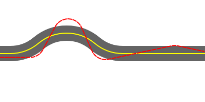

Stepping Back Down

Standing on the first rung of the ladder, we get a much broader view of the behavior. But this benefit comes at a cost. We can no longer see the car! We can no longer viscerally experience the car's motion, and apply our common sense toward analyzing the system.

In real life, you would never use a ladder that only let you go up. Likewise, when creating abstractions, stepping *down* is as important as stepping *up*.

Here, we take the abstraction from the previous section, and overlay a concrete representation on top of it. That is, we draw the trajectory that represents *all time*, but we also draw the car at *some particular time*.

How do we select which particular time to show? We could use the slider, which has reappeared. But we can also **mouse over the trajectory** to see the car at that point.

This is a general and powerful technique. Every point on a visual abstraction typically corresponds to a particular concrete state. Pointing at the abstraction to step down to a concrete representation lets us quickly explore regions of interest.

Try cranking up the turning rate to 8° or so, and then inspecting the car's behavior as it makes its first two turns. It almost pivots in place! This unphysical behavior is not obvious from the trajectory. It's possible to *infer* it from the trajectory, if we know what we're looking for. But in the concrete representation it jumps out at us, because it violates our common sense.

In this case, it's fairly easy to look at the trajectory and *imagine* the car moving along. That is, it's possible to step down from the abstraction just in our heads. But we're not far off the ground yet! As we climb higher on the ladder of abstraction, it will become harder to imagine the concrete steps beneath, and more critical that our abstractions provide a way to interactively step down to a more concrete representation.

At each step:

Move forward 1 pixel.

If left of the road, turn right by 2.0°.

If right of the road, turn left by 2.0°.

Abstracting the Algorithm

In previous sections, we first *controlled time*. This allowed us to interactively explore times of interest. We then *abstracted over time*, with a representation that depicted the system for all time instead of any particular time. This gave us a broader view with which to understand the system's behavior.

We now need to do the same for the algorithm. We've already *controlled the algorithm*, in that we can interactively adjust the turning rate and see the results. The next step is to *abstract the algorithm*, with a representation that depicts the system for all possible algorithms instead of any particular one.

"All possible algorithms" sounds rather daunting! But our simple algorithm has only one degree of freedom. We're stepping up to the second rung of the ladder, looking for a representation that abstracts over both *time* and *turning rate*.

There are several ways to perform this abstraction. In this one here, we simply overlay the trajectories for a range of turning rates.

The purpose of abstraction is to bring out **high-level patterns**. Try to defocus, and tune out the low-level clutter of individual trajectories. We'll step down and explore those details soon enough.

What patterns can we notice? Look at the first turn, where the car first hits the edge of the road. As the parameter increases, the trajectory's angle ramps up accordingly... but then hits a limit. There's a thick bundle of trajectories that seem to take off at around the same angle, regardless of the parameter. (In fact, that angle looks suspiciously like it follows the *law of reflection* — we'll explore this hypothesis later.) This bundle appears to remain tight around the bend, but then spreads apart on the straightaway.

At each step:

Move forward 1 pixel.

If left of the road, turn right by **angle**.

If right of the road, turn left by **angle**.

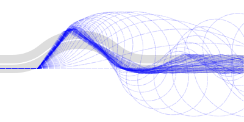

Here's a different representation at this rung of the ladder. This plots the *time to completion* (number of steps the car takes to reach the end of the road) versus the turning rate. Here, we have chosen a **metric** — a number that summarizes the behavior of the system in some interesting way.

In general, there are often multiple ways of abstracting over a given set of variables, and each one will bring out different patterns. The more ways we have of looking at the system, the most insights we can gather.

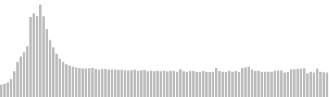
steps to the finish line
turning rate
400
500
600
700
0°
1°
2°
3°
4°
5°
6°
7°
8°
9°
10°

Stepping Back Down

The examples in the previous section are both second-level abstractions — they are both representations of the system for *all time, instead of some particular time*, and *all algorithms, instead of some particular algorithm*.

These representations reveal interesting high-level patterns. But they are too abstract to *explain* those patterns. For example, we observed that most of the trajectories remain in a tight bundle around the bend, but then spread apart on the straightaway. Why? In order to discover these causal relationships, we need to climb down a step on the ladder, and compare individual concrete instances.

Here are the same abstractions as before, although now we can **mouse over the lower plot** to highlight the corresponding trajectory.

Let's investigate why the bundles fall apart. Compare the trajectory for 6.5° to the trajectory for 6.6°. The trajectories are only slightly apart when coming down from the peak. However, they happen to impact the edge at very different angles. At 6.5°, the trajectory hits at a glancing angle, and continues to skate along the edge. At 6.6°, the trajectory hits at a sharper angle, and bounces off. In both cases, it appears like the trajectories follow the law of reflection — they bounce off at the angle that they come in.

Scanning across the other trajectories, it appears that they spread apart because at the end of the bend, the trajectories are aimed almost tangent to a region of high curvature, so small differences in position are magnified into large differences in impact angle, and thus they scatter differently.

Notice what we did here. We stepped up a level of abstraction to *see a high-level pattern*, and then stepped down to *discover the explanation* for that pattern. I believe that this dance is where the deepest insights are born — not at any one level of abstraction, but in the **transitions between them**. This is why it is crucial that our representations provide both a *step up* and a *step back down*.

At each step:

Move forward 1 pixel.

If left of the road, turn right by 2.0°.

If right of the road, turn left by 2.0°.

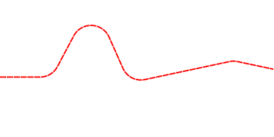

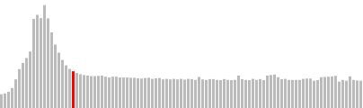
turning rate
400
500
600
700
0°
1°
2°
3°
4°
5°
6°
7°
8°
9°
10°

Controlling the Data

Algorithms run on data. For many systems, that input data comes from some sort of **environment**. A video game character responds to the actions of its opponent. A building's smart lighting system responds to the presence and movement of people through the rooms. In our example here, the data consists of the shape of the road.

So far, we've been examining the algorithm's behavior on one particular road. But our goal is an algorithm that handles any road it encounters.

One approach is to randomly generate various roads, and see how the algorithm performs on them. With good high-level metrics, we can learn something about the overall performance of the algorithm, and where it's strong and weak. When done somewhat systematically, this approach is called "Monte-Carlo analysis".

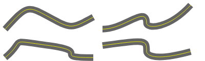

However, it's difficult to deliberately explore a random space that doesn't offer **well-defined dimensions** to move in. In designing this algorithm, we want to understand *why* it behaves as it does for various data.* * This is not necessarily the case for all algorithms. For some algorithms, we don't expect to understand why or how they work. Machine-learning and genetic algorithms, in particular, might design their own rules and associations which we never actually see. (These algorithms obviously present their own challenges for designers!) This essay considers systems whose behavior emerges from human-authored rules, and thus human understanding is an essential part of the design process. It's thus very helpful for our data to have parameters that we can *control*, and thereby *explain*.

An arbitrary road could look like almost anything. In order to tame this data space, we choose some aspect of the road which we suspect is *significant* — an aspect that reflects some *challenge* that our algorithm will face. Our algorithm is currently built around a fixed turning rate which determines how sharply the car turns. We might therefore suspect that the sharpness of the bend in the road will play an important role.

Here, we have called out the bend angle as an explicit parameter of the data. **Mouse over the lower slider** to bend the road.

Note that we're down on the first rung of the ladder now — we've only abstracted over time at this point. We've controlled the data (the bend angle) and controlled the algorithm (the turning rate), but at any given moment, the static representation only depicts one particular bend and one particular turning rate.

Play with these parameters for a bit, and see what you notice. Can you find situations where the car gets so confused that it starts going the wrong way?

Crank up the bend to 75° or so, and notice that there really is no turning rate that yields reasonable behavior. Any turning rate sharp enough to make it around the bend leads to large oscillations on the straightaway. Clearly our algorithm will have to be adaptive in some way. Our insights here will inform our design decisions later on.

At each step:

Move forward 1 pixel.

If left of the road, turn right by 2.0°.

If right of the road, turn left by 2.0°.

Road bends at 40°.

Now that we are able to adjust the road, we can dig into our hypothesis that the trajectories "reflect" off the edge of the road at the same angle that they hit it. Is this exactly true, or an approximation? By examining many examples, can you understand why a fixed turning rate leads to this behavior?

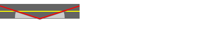
angle in
angle out

Abstracting the Data

Now that we've controlled the data, we're ready to climb up a step for a broader view. We'd like a representation of the algorithm's behavior over *all time* and *all bend angles*. As with our previous second-level abstraction, we have a choice of representations.

At each step:

Move forward 1 pixel.

If left of the road, turn right by 2.0°.

If right of the road, turn left by 2.0°.

We can try **overlapping trajectories**, as we did previously. Unfortunately, each of these trajectories is responding to a different underlying road shape, which cannot be seen. We're attempting to overlay trajectories from different environments in the same space. This representation, though visually attractive, is difficult to make sense of.

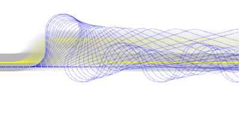

Another approach is an array of **small multiples**. This depicts the range of behavior across different roads, and is in general a very handy visualization. However, because each trajectory is separate and isolated, it's difficult to make *visual comparisons* between them.

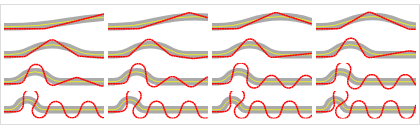

Instead, let's embrace the spirit of abstraction, and omit some details in the interest of exposing patterns. We'll use a **coordinate transformation** to warp the trajectories into the same space, so we can compare them.

This representation essentially "unbends" each road into a straight line, squishing it so all roads line up precisely. The trajectories plot the car's deviation from the center line versus the car's progress down this squished road.

Perhaps you didn't understand that. That's okay! There may be valuable information here, but this representation *on its own* is too abstract to make sense of. In the next section, we'll see another benefit of stepping down to a more concrete representation — it helps us get our heads around powerful but confusing abstractions such as this one.

|
bend
begins
|
bend
peaks
|
bend
ends
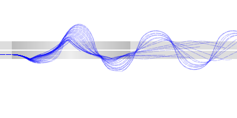

**Adjust the turning rate** and watch all the representations update.

Stepping Back Down

Here is a stack of visualizations that takes us up from ground level to the second rung of the ladder.

At each step:

Move forward 1 pixel.

If left of the road, turn right by 2.0°.

If right of the road, turn left by 2.0°.

Road bends at 40°.

Here we get a trajectory over time (one level up), plus the car at a particular time (concrete).

Here are our warped trajectories from earlier, abstracting over time and bend angle (two levels up). The trajectory of *one particular bend angle* is highlighted (stepping down a level). A marker is shown on that trajectory, corresponding to the car at *one particular time* (stepping down again).

|
bend
begins
|
bend
peaks
|
bend
ends
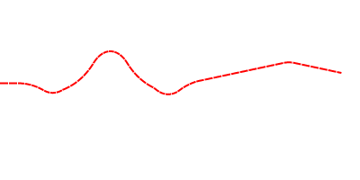

And for another perspective, we've also plotted time to completion versus bend angle.

**Mouse over everything**. See if you can understand the meaning of the warped trajectories on the "unbent" road, by driving the car along the bent road above it, and comparing how the marker moves.

Notice how the interaction *ties together* the abstract representations, as well as *provides steps down* to the more concrete representations.

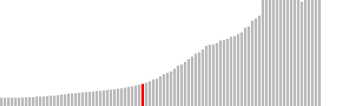
bend angle
400
600
800
1000
0°
10°
20°
30°
40°
50°
60°
70°
80°
90°

Three Steps Up

The higher we climb, the broader our view of the system, and the more high-level patterns we can notice. Here is a third-level abstraction — a representation of the system for *all time*, *all turning rates*, and *all bend angles*. The color represents the time to completion, from red (fast) to black (mid-range) to white (slow).

We're pretty far up in the clouds now — this representation bears no resemblance to the motion of a car, and omits most lower-level details. But as you should expect, those details are available by interactively stepping down.

**Mouse over the chart** to step down two levels, and see the trajectory for that particular turning rate and bend angle. Look for pixels whose color is conspicuously different from their neighbors, and try to figure out why they stand out.

**Mouse over the y-axis** to step down just one level, and see trajectories for that particular turning rate. **Mouse over the x-axis** to step down one level, and see trajectories for that particular bend angle.

Each abstraction from earlier can be seen as a **slice** of this third-level abstraction.

turning
rate
bend
angle
1°
2°
3°
4°
5°
6°
7°
8°
9°
10°
10°
20°
30°
40°
50°
60°
70°
80°
90°

Iteration

We've abstracted over time, the algorithm, and the data. Are we done?

Of course not. Our goal is to design a good algorithm, and this algorithm is clearly *terrible*.

But that's okay! We intentionally started with the absolutely simplest possible algorithm. By thoroughly exploring it, we now understand *why* and *how* it's terrible. The exploration has given us three things:

- We have an **understanding** of the system. Now, this isn't necessarily a logical, conscious understanding! We learn a lot by studying and playing with these representations, even if we *can't put our insights into words*. What we are doing here is feeding the pattern-recognizer in our brains, and building up an intuition for how the system behaves. As the system gets more complex, we'll make subtle connections to patterns that we've seen before, and we can follow our instincts through the space of possibilities.

- We have **ideas** for improving the algorithm. If we had any ideas at the outset, they would have been mere guesses. The ideas we get as we explore are responses to real behavior and real failures of the real system. They are much more likely to be fruitful.

- We have a set of interactive visual **tools** that will continue to serve us throughout the design process. When we change the algorithm, we can immediately see the effects of that change. To design quickly and confidently, we need to be able to try out ideas and verify hypotheses *as fast as we think of them*.

So what now? Now we iterate.

We choose one small specific idea for improving the algorithm. For example, when our car re-enters the road, maybe it should try to correct its course instead of blindly driving forward. We make this change, again in the absolutely simplest manner we can think of. And then we explore again, up and down the ladder of abstraction. We look at concrete instances, climb up to see high-level patterns, and climb down to explain those patterns. If our change introduces a parameter, such as the correction factor in this case, we first control it, and then we abstract over it. If possible, we can even try to control and abstract over the changes themselves, so we can compare algorithms across various changes.

We can improve our model of the road as well. If we want to understand a specific aspect of the behavior, such as what happens when the car hits the edge at various angles, we can make a simplified environment that focuses on just that. If we see the algorithm struggling with some feature of the environment, we can have our environment offer more variations on that challenge, so we can figure out what the problem is.

After each change, we thoroughly explore the system, building our understanding and sparking new ideas. We choose one of those ideas, implement it, and explore again. Step by step, we grow the algorithm and the environment model, following our growing intuition. We can use high-level performance metrics to judge our progress. But we must never lose touch with what the behavior looks like on the ground, and everywhere in between.

Abstracting Over This Example

So far, we've been looking at a toy example. Real-world systems may be more complex, but they all share the same general anatomy: an independent variable (such as time), a structure (such as an algorithm), and a dataset (such as an environment).

- The **independent variable** is usually time. This is our way of thinking about *causality* — a system's state depends on its previous states in time. Even for systems that are normally expressed with multiple independent variables, such as heat diffusion or wave propagation, we typically *think* of the system as evolving over time.

"Time" needn't be real time. Time might be discrete unitless steps, as with our car example above, or the stages of an industrial process, or a sequence of messages in a communications system. Backtracking and divide-and-conquer algorithms have their own peculiar notions of branching time, which may be useful to visualize.

- The **structure** is the set of rules that the system obeys. In a board game or legal system, the rules are in prose. In software, they form an algorithm. In a physical system, they are typically equations implied by coupled components, according to the laws of the governing theory such as Kirchhoff's laws or Maxwell's equations. If the system evolves over time, these are often differential or difference equations. If the system varies over space, they may be partial differential equations or cellular automaton rules.

- The structure is what we control. Typically, there are two levels of control. We can *rearrange* the structure — add a line of code, or connect two transistors. We can also *adjust values* within the structure, such as our car's turning rate, or the value of a resistor. Value changes lend themselves more readily to interactive control and abstraction. But structural changes usually have more impact, and it's important to consider how they can be explored and abstracted over.

- The **data** gets fed to the rules. Sometimes this data is a one-time delivery — a sorting algorithm is given an array to sort; the differential equations of a closed system only need an initial state. But many systems aren't closed, and respond continuously to an environment (such as our car example, or a thermostat) or a stream of input data (such as a speech recognizer). In systems that interact with people, that input data can be notoriously unpredictable.

Designing a system requires designing a model for the input data. This can be as much art, and as much challenge, as designing the structure itself. Sometimes we can use real-life data — a stock market predictor has plenty of historical data to scoop up. But if we want to *understand* how the data influences the behavior, we need to be able to *control* it. We need dimensions, like our road's bend angle, where we can try "more of this" and "less of that". Sometimes we can get these dimensions by organizing real-life data in some way. Sometimes it's easier to synthesize our data, so we can control its characteristics precisely.

The Ladder of Abstraction

To understand a system, we must explore it. The three features above — time, structure, and data — define the territory. We explore this territory by controlling parameters, abstracting over them, and stepping down from these abstractions.

- We start by taking **control**. This forces us to clarify what our parameters are in the first place, and lets us develop a concrete sense for how the parameters affect the system.

We want direct, interactive control of each parameter, so we can go forward and backward, stop, and jump to arbitrary positions. This allows us to travel freely around the territory, investigate areas of interest, and pose and verify hypotheses as quickly we think of them.

- We **step up** to an abstraction by devising a representation that depicts the system across all values of a parameter. This gives us a broad view of the system's behavior, and allows us to discover high-level patterns.

The appropriate visualization varies, and often there are multiple good visualizations, each offering a useful perspective. We can look for metrics that summarize some aspect of the behavior. We can also consider transformations that make it easier to visually compare multiple states of the system.

- We **step down** from the abstraction to a more concrete representation, by interactively selecting one particular value for the abstracted parameter. Ideally, we can point directly to a location on the abstraction itself. Stepping down allows us to investigate the causes of the patterns we've found, as well as make sense of powerful but confusing abstractions.

If possible, we should be able to go all the way down, and experience a fully concrete system. The world is concrete, and at some point, one of these concrete systems will actually exist. We must be able to check one out occasionally to stay grounded. Does it make sense? Does it behave like we expect? Does anything seem surprising? Breakthroughs have been made by noticing details that have fallen through the cracks of an abstraction.

This is a dynamic process. We're always *moving* — examining all angles, following hunches, testing hypotheses, gradually piecing together an understanding to guide our decisions. Our visualizations are not plots on paper. They are worlds that we move within, live within, learn from the inside out.

Appendix: Tools & Implementation

Unfortunately, development environments generally don't support this process. Most are actively hostile to it. We live in primitive times.

If a language requires a "compile" or "refresh" to show the results of a change, it even denies us interactive control. [Some languages](http://processing.org/) are marketed as "sketchbooks", but a real sketching environment would, *at the very least*, offer basic interactive adjustment like to the **right**.

Perhaps someday this will change. Perhaps IDE makers will focus on dynamic exploration instead of static analysis, rich visualization instead of line debugging. Perhaps language theorists will stop messing around with arrows and dependent types, and start inventing languages suitable for interactive development and discovery.

Until that glorious day, it is our sad but unavoidable responsibility as system designers to *build our own tools*.

The good news is that the sorts of visualization and control presented here are not especially difficult to implement. They can be crude, ugly, and fragile. They can crash twice a day. They simply need to serve as scaffolding for our understanding.

void draw() {
fill(192, 192, 192);
for (int i = 0; i < 3; i++) {
ellipse(130 + i * 70, 100, 25, 25);
}
}

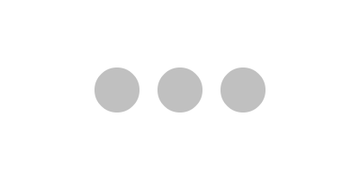

Video games are perhaps our culture's deepest interactive systems, so it shouldn't be surprising that game developers have been building these tools into their games for a long time. On-screen metrics and diagnostics are the norm, and live adjustment of parameters is not uncommon.

At the other end of the scale are the sciences. Despite the fascinating models and high stakes, interactive control and dynamic visualization are shockingly rare. It's an appalling fact that "scientific computing" is a synonym for "high-performance number crunching" — despite Richard Hamming's vehement warning when founding the field: *The purpose of computing is insight, not numbers.*

It's unacceptable that our tools for understanding game worlds outperform those for understanding the real world. Until civilized scientific tools become available,* * ... scientific investigators must take responsibility for creating their own explorable visual environments.

Appendix: Symbolic Abstraction

An "abstraction", as used in this essay, represents a system for all values of a variable, instead of any particular value. However, we've only considered one particular form of abstraction so far — *visual* abstraction — instead of the more common form of *symbolic* abstraction.

Here is a concrete representation of a pendulum, where we've controlled time.

Time:

Here is a visual abstraction — a picture that represents the system over all time.

1s
2s
3s
4s
5s
6s
7s
8s
9s
10s
-45°
0°
45°
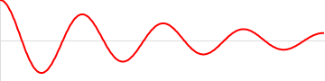

Here is a *symbolic* abstraction — a mathematical expression that represents the system over all time.

 

Both are perfectly valid abstractions. Symbolic abstraction is the traditional form, because it runs well on the pencil-and-paper operating system that was dominant for hundreds of years.* * "Mathematica" is an emulation of the pencil-and-paper operating system on the computer operating system. It's like running a command line terminal in a window, to emulate a VT100 on your Mac. Both emulators offer some extra features — scrollback and selection in Terminal, solving and plotting in Mathematica. But the *way we think about our work* remains the same. Visual abstractions were difficult to generate until recently, and are still difficult to make interactive.

As a result of its long and deep history, symbolic abstraction offers certain benefits. Symbolic expressions can be reasoned about, composed, and decomposed in powerful ways. This allows us to logically prove properties about our systems, such that an invariant always holds or a failure state is impossible. We can also generalize our solutions to apply to many types of systems, as well as implement them efficiently.

However, it is often impractical or impossible to derive a symbolic expression that represents the behavior of most systems. We thus tend to focus on the tiny and contrived subset of systems that happen to yield to symbolic analysis. Even within that subset, symbolic analysis often involves struggling through a deluge of symbols, only to arrive at a solution that is difficult to interpret and offers little insight.

The most important issue is whether our abstractions are *useful*. Can we discover and explain high-level patterns? Do they generate insights that guide our design? Do they spark ideas? Do they lead to great systems?

Both symbolic and visual abstractions can do so. But the human brain is fundamentally a **pattern-matching machine**, easily outperforming any machine we can build — *for certain kinds of patterns*. With visual patterns, we win hands-down. With logical inferences, we're slow and clumsy.

*We are human beings*, and our tools should play to our strengths.

It's worth noting that both abstract representations above are actually approximations. The symbolic expression represents a "linearized" system, which only resembles the actual system for small swings. The visual representation was numerically integrated with a finite time step.

In both cases, it's possible to obtain a better approximation. Symbolic solutions can be improved with perturbation methods, for instance, and numerical solutions can use better integrators.

However, in the symbolic case, this greatly increases the complexity for the designer — the expression explodes into a mass of symbols that is difficult to make sense of. In the visual case, there is no added complexity — the plot just quietly becomes more accurate.

Appendix: Perspectives

A ladder is a simple and useful metaphor, but it has only one dimension — step up, step down. Here are some richer ways of thinking about the abstraction process, which correspond to other concepts you may be familiar with.

**Wildcards.**

A fully-concrete representation has a specific value for every variable.

time: 100

turning rate: 2°

bend angle: 40°

Abstracting over a variable can be thought of as assigning a "wildcard" to that variable.

time:  *****

turning rate: 2°

bend angle: 40°

Each wildcard takes us one step up the ladder.

time:  *****

turning rate:  *****

bend angle: 40°

**High-dimensional space.**

If we think of the variables in the system as forming a space, then a concrete representation corresponds to a point in this space. (If we have interactive control over the variables, we can steer this point around.)

 

An abstraction over a variable can be thought of as a line in this space. (Specifically, our trajectory here is the *image* of this line.)

 

An abstraction over two variables spans a plane, and so on.

 

"Stepping down" from this abstraction corresponds to choosing a line within this plane.

 

**Functions.**

I adopted the notion of "abstracting over a variable" from computer science. In particular, lambda abstraction corresponds directly to the sort of visual abstraction we're doing here.

A concrete representation corresponds to a function that takes no arguments.

This function represents the system at one particular time (t = 100). It can only return a single point [x,y] — the position of the car.

function **f0 ()** {
var t = 100;
// calculate x and y
return [x,y];
}

We abstract over time by turning the time variable into an argument. This function will return a point for any given time — this defines a trajectory.

function **f1 (t)** {
// calculate x and y
return [x,y];
}

Each argument we add corresponds to stepping up a level on the ladder of abstraction. Here we abstract over turning rate as well.

function **f2 (t,r)** {
// calculate x and y
return [x,y];
}

"Stepping down" from an abstraction corresponds to *partial application*. By specializing the previous function to a particular turning angle (2°), it is now just a function of time — a trajectory.

function **f2_at_2_deg (t)** {
return f2(t, 2.0);
}

This work is part of the [Kill Math](http://worrydream.com/KillMath/) project, which is dedicated to enabling people to work with quantitative systems using concrete representations and intuition-guided exploration. For another example of interactive control and visual abstraction, see [Interactive Exploration of a Dynamical System](http://vimeo.com/23839605/).

The keep-the-car-on-the-road algorithm is a favorite example of [Alan Kay](http://www.vpri.org/html/people/founders.htm) when demonstrating [eToys](http://www.squeakland.org/). I got the idea to use it after watching Alan's recent talk on [Programming and Scaling](http://tele-task.de/archive/video/flash/14029/).

Huge thanks to [Oliver Steele](http://osteele.com/), [Chaim Gingold](http://levitylab.com/cog/), [Craig Mod](http://craigmod.com/), and [David Hellman](http://www.davidhellman.net/) for their painfully-valuable suggestions and discussions about this essay.

Extra thanks to Oliver Steele for his comments on an [earlier essay](http://worrydream.com/SimulationAsAPracticalTool/) of mine, where I was just starting to think about these things. His thoughts on abstraction and multiple representations have been poking at my brain for the last two years, and were a primary inspiration for the work here.

[(L)](http://worrydream.com/LadderOfAbstraction/#)Window size:  x
Viewport size:  x

[10 min to Spreed]()