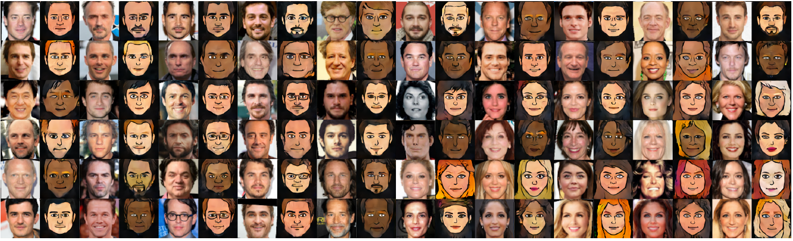

Up to Speed on Deep Learning: February Update – Hacker Noon

# Up to Speed on Deep Learning: February Update

## Sharing some of the latest research, announcements, and resources on deep learning.

*By Isaac Madan*

Continuing our series of deep learning updates, we pulled together some of the awesome resources that have emerged since our last post. In case you missed it, here are our past updates: [**November**](https://medium.com/p/c93663b59923/edit), [**September part 2 & October part 1**](https://medium.com/the-mission/up-to-speed-on-deep-learning-september-part-2-and-october-part-1-d72d7e5df1ea#.bg88ojrbl), [**September part 1**](https://medium.com/the-mission/up-to-speed-on-deep-learning-september-update-part-1-ca27a6ed03cd#.ocrcl97wd), [**August part 2**](https://medium.com/the-mission/up-to-speed-on-deep-learning-august-update-part-2-bfb1554f885#.ps2tqe76u)**,**  [**August part 1**](https://medium.com/the-mission/up-to-speed-on-deep-learning-august-update-part-1-25afc11aea6b#.2mv855gbu), [**July part 2**](https://medium.com/the-mission/up-to-speed-on-deep-learning-july-update-part-2-baacc835d8ab#.n12qybgf6), [**July part 1**](https://medium.com/the-mission/up-to-speed-on-deep-learning-july-update-6c1d9e6741cf#.gcfr1dnjx), [**June**](https://medium.com/the-mission/up-to-speed-on-deep-learning-june-update-bb0f17ccaf0b#.2debdy7eb), and the [**original set**](https://medium.com/life-learning/getting-up-to-speed-on-deep-learning-20-resources-efec21e0aaf9#.r91x02fcd) of 20+ resources we outlined in April. As always, this list is not comprehensive, so [let us know](https://hackernoon.com/up-to-speed-on-deep-learning-march-update-355cb5944f9c#.t5oy0a8zsmailto:hello@requestsforstartups.com) if there’s something we should add, or if you’re interested in discussing this area further.

#### Research

[**High-Resolution Image Inpainting using Multi-Scale Neural Patch Synthesis**](https://arxiv.org/pdf/1611.09969.pdf) by Chao Yang *et al* of USC. A novel deep learning approach to filling in large holes in images effectively. GitHub repo [**here**](https://github.com/leehomyc/High-Res-Neural-Inpainting).

[**Pixel Recursive Super Resolution**](https://arxiv.org/pdf/1702.00783.pdf) by Dahl *et al* of Google. Researchers at Google Brain demonstrates a deep learning method of generating higher resolution images from lower resolution, pixelated images.

[**Domain Transfer Network implemention**](https://github.com/yunjey/dtn-tensorflow)**  **by Yunjey Choi. TensorFlow implementation of [Unsupervised Cross-Domain Image Generation](https://arxiv.org/abs/1611.02200) — generating novel images of previously unseen entities, while preserving their identity.

#### Announcements

[**Deep Learning Summer School and Reinforcement Learning Summer School**](https://mila.umontreal.ca/en/cours/deep-learning-summer-school-2017/) by University of Montreal, organized by Yoshua Bengio. A conference *aimed at graduate students and industrial engineers and researchers who already have some basic knowledge of machine learning (and possibly but not necessarily of deep learning) and wish to learn more about this rapidly growing field of research.* June 26th to July 4th, 2017. Applications due March 20th, apply [**here**](https://docs.google.com/forms/d/e/1FAIpQLSfF4rIP7z0NbaMRrGgfQ9SGHGN9oPDF68Im3s4EWRXa6IEQBQ/viewform?c=0&w=1).

[**The AWS Deep Learning AMI, Now with Ubuntu**](https://aws.amazon.com/fr/blogs/ai/the-aws-deep-learning-ami-now-with-ubuntu/) by Joseph Spisak of AWS. Amazon announces that you can now run deep learning in the cloud via Ubuntu instances that have popular frameworks pre-installed, like TensorFlow, Caffe, etc.

[**Announcing TensorFlow 1.0**](https://developers.googleblog.com/2017/02/announcing-tensorflow-10.html) by Google. At the TensorFlow Developer Summit in mid-February in Mountain View, Google announces the official 1.0 release of TensorFlow. The framework is now being used in over 6000 open source repositories.

#### Resources

[**Generative Adversarial Networks (GANs) in 50 lines of code (PyTorch)**](https://medium.com/@devnag/generative-adversarial-networks-gans-in-50-lines-of-code-pytorch-e81b79659e3f#.hlqwnbpqi) by Dev Nag, CTO of Wavefront. An explanation of GANs and a simple way to get started with them. GitHub repo [**here**](https://github.com/devnag/pytorch-generative-adversarial-networks).

[**Dissecting Reinforcement Learning**](https://mpatacchiola.github.io/blog/) by Massimiliano Patacchiola of Plymouth University. An in-depth explanation of reinforcement learning, with an accompanying GitHub repo for code and resources discussed — found [**here**](https://github.com/mpatacchiola/dissecting-reinforcement-learning).

[**Training a deep learning model to steer a car in 99 lines of code**](https://hackernoon.com/training-a-deep-learning-model-to-steer-a-car-in-99-lines-of-code-ba94e0456e6a#.9c1zy38a6) by Matt Harvey. Using Udacity self-driving car simulator to train a generalized steering model for a car in under 100 lines of code.

[**10 Deep Learning Terms Explained in Simple English**](http://www.datasciencecentral.com/profiles/blogs/10-deep-learning-terms-explained-in-simple-english) by Mike Waldron of Data Science Central. Brief explanations of common deep learning terms like *backpropagation* and *gradient descent*. Also helpful from the same site, [15 Deep Learning Tutorials](http://www.datasciencecentral.com/profiles/blogs/15-deep-learning-tutorials).

[**Creating Human-Level AI**](https://www.youtube.com/watch?v=ZHYXp3gJCaI) by Yoshua Bengio (video). Exploring the path forward to human-level AI at the Beneficial AI 2017 Conference organized by the Future of Life Institute. Also, [**A Path to AI**](https://www.youtube.com/watch?v=bub58oYJTm0) by Yann LeCun at the same conference.

[**Deep Reinforcement Learning: An Overview**](https://arxiv.org/abs/1701.07274) by Yuxi Li. Overview of recent advancements in deep reinforcement learning, alongside background explanation.

[**Learn TensorFlow and deep learning, without a PhD**](https://cloud.google.com/blog/big-data/2017/01/learn-tensorflow-and-deep-learning-without-a-phd) by Martin Gorner of Google Cloud Platform. Course for developers on deep learning basics and leveraging TensorFlow.

[**Duplicate Question Detection with Deep Learning on Quora Dataset**](http://www.erogol.com/duplicate-question-detection-deep-learning/)**  **by Eren Golge. Quora launched their first publicly available [dataset](https://data.quora.com/First-Quora-Dataset-Release-Question-Pairs) in late January for developers to get a sense of the challenges in building a knowledge-sharing network. This exploration takes a deep learning approach to identifying duplicate questions.

[**Recurrent Neural Networks for Steering Through Time**](https://www.youtube.com/watch?v=nFTQ7kHQWtc) by MIT (video). Lecture 4 of course 6.S094: Deep Learning for Self-Driving Cars taught in Winter 2017 at MIT. Course website [**here**](http://cars.mit.edu/). Lecture 4 slides [**here**](https://goo.gl/qG4Ys9).

* * *

*...*

By [Isaac Madan](https://www.linkedin.com/in/isaacmadan). Isaac is an investor at Venrock ([email](https://hackernoon.com/up-to-speed-on-deep-learning-march-update-355cb5944f9c#.t5oy0a8zsmailto:isaac@venrock.com)). If you’re interested in deep learning, we’d love to [hear from you](https://hackernoon.com/up-to-speed-on-deep-learning-march-update-355cb5944f9c#.t5oy0a8zsmailto:hello@requestsforstartups.com).

[**Requests for Startups**](http://www.requestsforstartups.com/) is a newsletter of entrepreneurial ideas & perspectives by investors, operators, and influencers.

***Please tap or click “︎***❤” *to help to promote this piece to others.*

