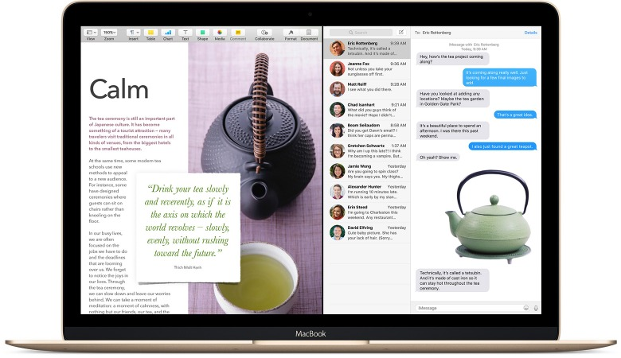
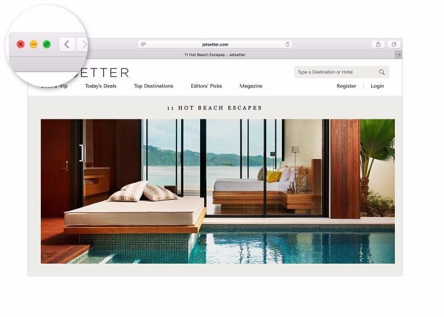

Use two Mac apps side by side in Split View

# Use two Mac apps side by side in Split View

Split View in OS X El Capitan or later lets you fill your Mac screen with two apps, without having to manually move and resize windows.

## Enter Split View

1. Hold down the full-screen button  in the upper-left corner of a window.

2. As you hold the button, the window shrinks and you can drag it to the left or right side of the screen.

3. Release the button, then click another window to begin using both windows side by side.

If you already have a window in full-screen view, you can still view it side by side with another window. Just open [Mission Control](https://support.apple.com/kb/HT204100), then drag a window onto the thumbnail of the full-screen app at the top of the screen.

Apps that need more screen space to enter Split View might display a message that they're not available in full screen. You can [use a higher resolution](https://support.apple.com/kb/PH22157) on your display to give apps more screen space. Apps that don't support Split View at all show a zoom button  instead of a full-screen button .

If holding down the full-screen button doesn't enter Split View, go to Apple menu > System Preferences, click Mission Control, and make sure that “Displays have separate Spaces” is selected.

## Work in Split View

In Split View, you can use both apps side by side, without the distraction of other apps.

- Choose a window to work in by clicking anywhere in that window.
- Show the menu bar by moving the pointer to the top of the screen.
- Swap window positions by dragging a window to the other side.
- Adjust window width by dragging the vertical line between the windows.
- Switch to other apps or your desktop with [Mission Control](https://support.apple.com/kb/HT204100), or use a [Multi-Touch gesture](https://support.apple.com/kb/HT204895) such as swiping left or right with four fingers on your trackpad.

## Exit Split View

1. Move the pointer to the top of the screen to show the window buttons, then click the full-screen button .

2. The other window remains in full-screen view. You can switch to it with [Mission Control](https://support.apple.com/kb/HT204100), or use a [Multi-Touch gesture](https://support.apple.com/kb/HT204895) such as swiping left or right with four fingers on your trackpad.

Published Date: Oct 26, 2016