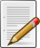

User:Antandrus/observations on Wikipedia behavior - Wikipedia

# User:Antandrus/observations on Wikipedia behavior

From Wikipedia, the free encyclopedia
< [User:Antandrus](https://en.wikipedia.org/wiki/User:Antandrus)

[Jump to navigation](https://en.wikipedia.org/wiki/User:Antandrus/observations_on_Wikipedia_behavior#mw-head)[Jump to search](https://en.wikipedia.org/wiki/User:Antandrus/observations_on_Wikipedia_behavior#p-search)

|     |     |     |
| --- | --- | --- |
|  | **This page is an [essay](https://en.wikipedia.org/wiki/Wikipedia:Essays).** It contains the advice or opinions of one or more Wikipedia contributors. This page is not one of [Wikipedia's policies or guidelines](https://en.wikipedia.org/wiki/Wikipedia:Policies_and_guidelines), as it has not been [thoroughly vetted by the community](https://en.wikipedia.org/wiki/Wikipedia:Consensus#Levels_of_consensus). Some essays represent widespread norms; others only represent minority viewpoints. | [Shortcut](https://en.wikipedia.org/wiki/Wikipedia:Shortcut) - [WP:OWB](https://en.wikipedia.org/w/index.php?title=Wikipedia:OWB&redirect=no) |

Some observations on behavior on Wikipedia, interspersed with recommendations on how to deal with it.

1.  When someone complains loudly about censorship, you may be certain they are up to no good.

2.  Many people leaving the project blame either the project or the people working on it for their departure, rather than recognize that it is normal in life for one's enthusiasm to wane. It does with all things that we once found exciting. This is neither pessimistic nor tragic: one needs always to find new exciting things to do. *All* things in life change and end, and this includes one's involvement with Wikipedia. "He who kisses the joy as it flies / lives in eternity's sunrise."[[1]](https://en.wikipedia.org/wiki/User:Antandrus/observations_on_Wikipedia_behavior#cite_note-1) Enjoy it while you are here, and enjoy what you do after you have gone.

3.  Troublesome editors waste far more of the community's time than vandals. One who sometimes makes good edits, but endlessly bickers, threatens, insults, whines, and is eventually banned, will have taken hundreds of hours from other users who would have better spent that time building the encyclopedia. This is in part due to people's fascination with conflict. Efficiently managing troublesome editors is one of the best ways to improve the project, but also one of the most difficult.

4.  People who have the insatiable need to retaliate for perceived wrongs should be removed from the project as quickly, but gently, as possible.

5.  Since mid-to-late 2005 there has been an increasing focus by Wikipedians, especially new Wikipedians, on designing pretty user pages, userspace widgets, fancy signatures, and other similar stuff rather than contributing content. This is probably not a good trend, but it is unlikely to change. The best content contributors often neglect these things, and vice versa.

6.  Any logged-in user whose first edit is vandalism of a user page, or a nasty personal attack on a talk page, should be immediately and permanently blocked, without comment.

7.  If a user's first and second edits are creations of their user and talk pages, devoid of content, their third edit will be vandalism, a personal attack, or another form of trolling. That people spring up to defend these accounts when they are blocked is neither complicity nor malice, but rather just inexperience.

8.  Using an anonymous IP or creating a sockpuppet to vandalise a user page or leave a nasty personal attack is a particularly despicable form of cowardice. If you have a problem with someone, work it out in the open.

9.   [Single-topic editors](https://en.wikipedia.org/wiki/Wikipedia:SPA) are rarely, if ever, interested in or capable of [NPOV](https://en.wikipedia.org/wiki/Wikipedia:NPOV). Additionally, if you look closely you will often find a [conflict of interest](https://en.wikipedia.org/wiki/Wikipedia:COI).

10.  The more extreme and unencyclopedic the viewpoint, the greater the likelihood of it attracting sockpuppet support.

11.  If an editor is truly writing from a neutral point of view, it should be impossible to tell from that person's edits what their viewpoint is. This is most obvious in political articles, but applies everywhere.[[2]](https://en.wikipedia.org/wiki/User:Antandrus/observations_on_Wikipedia_behavior#cite_note-2)

12.  Wikipedia is an encyclopedia. The primary job of Wikipedians is to write it. Everything else is secondary.

13.  As the primary job of Wikipedians is to write the encyclopedia, any user whose principal activity is to interfere with the writing should be removed from the project, as painlessly as possible. The best way is to persuade them that they will be happier elsewhere, and to wish them well; the worst is to beat them up and make them angry: but however it happens, it must be done.

14.  It is impossible to enumerate all the kinds of vanity. ([La Rochefoucauld](https://en.wikipedia.org/wiki/Fran%C3%A7ois_de_La_Rochefoucauld_(writer)), No. 506)

15.  Wikipedia's worst enemies are those whose vanity has been wounded. They may be moderately notable people who attempted to edit an article on themselves, and failed to control it; or they may be people who worked hard on an article on a subject about which they care, which was deleted by the community; or they may be people who attempted to push a POV which was rejected by the community. Usually they invoke a higher moral principle in support of their campaign against the project, such as censorship, free speech, conspiracy against them, or whatnot, as their own vanity prevents them from recognizing that *vanity itself* is the source of their displeasure.

16.  Some trolls and POV-pushers are best fought with a time delay. Let them make their edit; then change it an hour or two later, or even the next day. Trolls are easily bored, and are more likely to go away if you hold your fire for a bit. (Blatant vandalism of course needs to be reverted immediately.) This tactic is especially useful with the Stormfront or Free Republic types, or versus any group that pushes a POV and is specifically looking for a fight.

17.  There IS a cabal. It's a core group of editors united by the belief that the encyclopedia must protect itself against jerks, and against people who write junk.

18.  As soon as someone attacks the community, or any portion of it, by writing a rant on their user page, Act V of their Wiki Tragedy has begun. It will end, inevitably, with their departure or expulsion from the project.

19.  The Administrators' Noticeboards, RFC, RFArb, and occasionally RFA, are like galleries of spectacular freeway crashes, slowing traffic in both directions as everyone cranes their head around for a better view. Contributions to the encyclopedia decline every time there is a new wreck.

20.  One of the less-noticed reasons for the increase in conflict in the project overall is that almost all of the articles on important subjects are written. There is less "exciting" work to do, such as creating from scratch an article on an important topic, and conflict is the most usual substitute excitement. The early days of the project are over, and just as in a relationship, the truly hard work comes after the initial excitement has faded.

21.  There are no fools more troublesome than those with wit.[[3]](https://en.wikipedia.org/wiki/User:Antandrus/observations_on_Wikipedia_behavior#cite_note-3)

22.  People who announce early in their Wiki careers that they want to be admins, probably shouldn't be. Adminship is better approached as a duty taken on by an established Wikipedian, than as a trophy for a newbie to aspire to. The best admins are those who are drafted, and not those who eagerly await a three-month threshold or a certain edit count. *Adminship is not a trophy* and beware those who want to pin it on like a shiny badge.

23.  All the virtues and vices shown by humanity as a whole can be found on Wikipedia. Anyone who runs from the community because they cannot tolerate its vices, divisions, and politics, will have to face the same vices, divisions, and politics again elsewhere in life.[[4]](https://en.wikipedia.org/wiki/User:Antandrus/observations_on_Wikipedia_behavior#cite_note-4)

24.  Anonymous edits to articles on traditional encyclopedic topics, especially during school hours, are far more likely to be vandalism than edits to popular culture topics.

25.  Vandalism in the form of trolling and nasty personal attacks spikes on Friday and Saturday nights, local time. Look at the bright side: at least they're not driving drunk.

26.  If a vandal insults you, it is a reliable indicator that you are doing something right.[[5]](https://en.wikipedia.org/wiki/User:Antandrus/observations_on_Wikipedia_behavior#cite_note-5)

27.  One of the commonest kinds of vandalism is an assertion that something, someone, or somewhere is "gay". This is a reflection of the common, indeed unavoidable, sexual insecurity of male adolescents, who make up most of Wikipedia's vandals. It's as universal a part of maturing as acne; revert and ignore.

28.  Any new article with exactly the same name as its creator can almost always be immediately deleted as [CSD A7](https://en.wikipedia.org/wiki/Wikipedia:CSD#A7). "Userfying" – moving these pages to the new user's user page – is a slightly more compassionate approach, but it doesn't work as often as it should.

29.  Good people leave the project all the time. Fortunately, good people join the project all the time as well. Bad people also come and go. The project survives in spite of all these arrivals and departures.

30.  Many of our best contributors began with a few shabby edits. Be kind to newbies, even though it is a test of patience to see the same mistake hundreds of times over several years. Patience is one of the most underrated of the virtues, and in our present attention-deficit-disorder age it is one of the most rare.

31.  People who loudly accuse the community of some vice are almost invariably guilty of, but blind to, some variant of that vice themselves.

32.  If you've been blocked, consider first the possibility you did something wrong. Instead of complaining about abuse of power, censorship, or whatever, just behave in such a way that you don't get blocked. There are thousands of editors who have contributed enormously to Wikipedia without ever getting blocked. It's not that hard.

33.  When someone's first edit is reverted, and they are sufficiently angered by this that they leave several paragraphs of invective on the reverter's talk page, it is highly unlikely that that person is suited to become a Wikipedia editor. Hard as it is, we need to leave our egos at the door, or as much of those egos as it is possible to unload. Not only *can* anyone edit, but anyone *does* edit, and reversions of good-faith edits are all part of a day's action here.

34.  Whenever a group of people, particularly if they are administrators, gets together and *agrees* on something, there will inevitably be one or a handful of vocal detractors who oppose because they see something sinister in any group which is in agreement – especially if they perceive that group as having power over them. See [WP:CABAL](https://en.wikipedia.org/wiki/Wikipedia:Words_of_wisdom#On_Wikipedia_and_the_Cabal).

35.  It's good to let your ego be punctured once in a while. Most of us, after several years and tens of thousands of edits, start to put a lot of our egos into our work here, more than we originally either intended or anticipated. While it's natural for this to happen, the unintended consequences include feelings of ownership over one's contributions and a quickness to react in poor faith, and even with arrogance. Someone reverted your edits with a sarcastic edit summary? Let it go. Someone called you a bad name somewhere? Don't retaliate. Let it go. While it hurts at first to let these things go, being able to do so is the true test of strength and maturity. You only gain in the long run. Retaliating not only brings you discredit, but it increases your anger, and corresponding risk of over-reaction, as the number of related provocations rises.

36.  When you are angry, it is extraordinarily difficult to differentiate between a good-faith edit and the other kind. Postpone that decision until you are no longer angry. The consequences of reverting a good-faith edit with a vandalism-reversion tool or "rvv" edit summary are unpredictable, and unlikely to win you friends or trust. As a general rule, do not edit when you are angry. Wait until the feeling has passed, and you are yourself again.

37.  When someone screams about "admin abuse", it's most likely true – they're probably abusing admins again. If there's a block involved, expect to see a battalion of sockpuppets in short order, making even more shrill cries of admin wrongdoing.

38.  Try to be as tolerant as you possibly can regarding edits by established contributors. Should you need to revert one, leave as polite an explanation as possible, with room for compromise: and if they're simply wrong, don't rub their nose in it. The loss of long-established contributors due to avoidable conflict is one of the greatest threats the project faces. People who have been here a year or more, and made thousands of contributions to the project, are its greatest asset, and this cannot be overstated.

39.  While it feels bad to be attacked by one of the persistent, nasty, obsessive trolls, it is helpful to remember that some of these people are profoundly miserable. They are really suffering; life is hell for them: often they are neither in control of their impulses, nor completely sane. A little compassion can help, although one's initial impulse is to strike back. Don't. It's a sign of strength not to retaliate, and a peaceful response may actually do some good.[[6]](https://en.wikipedia.org/wiki/User:Antandrus/observations_on_Wikipedia_behavior#cite_note-6)

40.  "Retired" editors sometimes leave the project forever, especially if they have left out of weariness, or because it is no longer new, fun, and rewarding for them. If, however, they have left in anger, they may not leave permanently: expect to see them return for "revenge" against those they perceive to have done them wrong: and the actions they perform on their return are among the most vile in the project, and the least productive towards its ends. You can find this kind of behavior in greatest abundance at RFA, RFB, RFC, RFArb, and the noticeboards. Sometimes these disgruntled editors return as sockpuppets, but the braver come back under their own names: but as in all vendettas, they do more harm to themselves than their victims, for they only cover themselves in debasement and slime. No human behavior is more despicable than inflicting suffering just to feel good about it, but unfortunately this is a common motivation indeed.

41.  As in the dry season arsonists start fires, so when there is a contentious event on Wikipedia, certain editors will attempt to escalate conflicts, and so enjoy their destructive course. You may recognize the same names appearing again and again in such circumstances. As I have said above, it has become harder to work on articles in the last few years, and it is much easier, and much more pleasurable, for some people to feel the rush and the pride in one's witty put-down of an opponent, than to write or cite or cleanup or reference an article that no one will immediately read. Conflict is as addictive as cocaine, and unfortunately Wikipedia's civility policies only limit incivility among those who respect them in the first place, and who have the personal strength not to need to retaliate. Anonymity is to cowardice what Viagra is to impotence.

42.  A high proportion of Wikipedians have issues with authority. That's why many people are attracted to Wikipedia in the first place. Keep this in mind if you become an administrator, for you may have just become, unwittingly, what these people most resent; and no matter how good a job you do, they'll find your one mistake and beat you up with it. It's best just to accept this demographic for the reality it is. They are often our most capable content contributors, and as long as Wikipedia remains open to all, this situation will remain.

43.  A related point is that Wikipedia is often accused of having a "liberal bias". The only bias it has arises from the self-selection of its members: people are here because they are the ones who want to contribute to an open-content project. You're going to get a lot of "libertarian left" here by the project's very nature.

44.  When you are attacked by a troll, remember that their choice of insult says more about them than about you, and it's an opportunity for compassion. They just told you what hurts them, and obliquely what probably has, in the past. Harper Lee put it well in *[To Kill a Mockingbird](https://en.wikipedia.org/wiki/To_Kill_a_Mockingbird)*: "...it's never an insult to be called what somebody thinks is a bad name. It just shows you how poor that person is, it doesn't hurt you..." My only quibble is this: while it might indeed hurt, it does no harm.

45.  "Envy is more implacable than hatred." An often overlooked motivation for persistent harassment is that the troll wants something you have: recognition, passion, education, skill, knowledge – something. It's usually disguised by some claim of wrongdoing on your part, but the disguise often contains subtle hints that the troll wants acknowledgement as an equal. The more persistent the trolling, the higher the level of insecurity that the troll is unwittingly showing.

46.  A useful two-question test, to apply to dodgy accounts that seem to be stirring up trouble: 1) Is this person helping to build the encyclopedia? 2) If not, is this person actively interfering with those of us who are? If the answers are "no" and "yes", respectively, block immediately and move on.

47.  "And slime had they for mortar."[[7]](https://en.wikipedia.org/wiki/User:Antandrus/observations_on_Wikipedia_behavior#cite_note-7) Every place on earth has nationalists; they are the dupes of demagogues, the tools of conquerors, and a great pestilence upon Wikipedia. Write a thousand good words on an important but neglected figure, and a nationalist will show up to argue over the spelling of his name; his birthplace, ancestry, ethnicity, or category; all in a tone of moral outrage. Look at the "bright" side: they keep our friends in the war industry employed. When some day earth is hidden in its final radioactive dust-shroud, their ghosts will declare: it's not so bad, *they* got what they deserved. Let the sane among you ignore them, and be good citizens of *all* of mankind, rather than just an angry splinter of it.

48.  People who put lists of editors they don't like on their user pages won't be around for long. See #18, as this is closely related.

49.  The highest compliment a troll can pay to you is to create an attack page about you *elsewhere* on the internet. It's as close to an admission of surrender as you will get, in addition to showing that you are doing something very right indeed. As in on-wiki trolling, the insults they choose tell you more about them than about you. Consider such pages to be monuments to your good work, but otherwise ignore them.

50.  Wikipedia is no more a place for people with control issues than mining is a career for claustrophobes. That such people are as common here as they are is a poignant reminder of the all-too-human tendency of the chronically disaffected to seek out environments that make them angry and miserable.

51.  Beware lest you begin to enjoy too much the blocking of vandals, the crushing of trolls, and the banning of troublemakers; spend too much time ridding the project of monsters, you risk taking on the characteristics of those you drive off. Too much troll-fighting can be destructive for one's attention span, sensitivity, and taste. It should be no surprise that the most experienced at troll-fighting often have the shortest tempers. The best way to counter this tendency is to do other things regularly, such as having a life outside Wikipedia.

52.  Trolls, banned editors, and mental defectives will try to annoy you, if you are an active contributor. Do good work anyway. Avenge yourself on your enemies by not becoming like them.[[8]](https://en.wikipedia.org/wiki/User:Antandrus/observations_on_Wikipedia_behavior#cite_note-8)

53.  As sarcasm is the protest of the weak,[[9]](https://en.wikipedia.org/wiki/User:Antandrus/observations_on_Wikipedia_behavior#cite_note-9) so attack sites are the whining of the incompetent, who failed to succeed at editing Wikipedia. They are unimportant. Continue creating useful and beautiful things, and spread good will in the world; if others are consumed by hate and vindictiveness, you may feel compassion for them, and be grateful you are not so afflicted.

54.  Nothing is harder to put up with than the annoyance of good example.[[10]](https://en.wikipedia.org/wiki/User:Antandrus/observations_on_Wikipedia_behavior#cite_note-10) If you want to be liked, screw up once in a while, and apologize.

55.  We all think it's a good idea to stand up to bullies. Not only is it harder to do than you sometimes think, other than under the influence of testosterone or your anger-enhancer of choice, but in doing so you risk becoming a bully yourself. I quote from the Dalai Lama: "...when encountering injustice, take a strong stand – but with no ill intent."

56.  As Freud observed, we are most courageous when we feel most loved. Conversely, the lonely are often the most craven, and their anger is the most vindictive. Wikipedia is filled with the lonely.

57.  "The cut worm forgives the plow."[[11]](https://en.wikipedia.org/wiki/User:Antandrus/observations_on_Wikipedia_behavior#cite_note-11) Trolls and banned editors may harass you repeatedly, attempting to provoke a reaction. Let it go; they'll get over it. The plow already has.

58.  Beware of users so in love with their own virtue, that they are incapable of recognizing when it has become vice; and so in love with their own eloquence, that they cannot see when it has become hypocrisy. The former are those who never admit to any wrong, but yet demand apologies from others for the lapses of judgement to which all human beings are prone; and the latter are the blindest and most intractable of POV-pushers. Skill with words correlates neither with virtue nor wisdom.

59.  When an editor ceases to contribute to articles, but instead writes only in the Wikipedia space, on talk pages, and arbitration cases, and when more than half of that editor's contributions are in conflicts, either beginning or prolonging them, then that editor is very close to departure. As with stars on the [main sequence](https://en.wikipedia.org/wiki/Main_sequence), some departures are shrinkings into dwarf states, with ever-diminishing contributions, giving little light, and with a long decay; and other departures are violent supernova explosions, spewing waste matter and hot gas in all directions.

60.  It is easier to get a sincere "thank you" for reverting "you're a faggot" from someone's userpage, than it is for writing a researched, thorough, and referenced encyclopedia article on an encyclopedic topic. The best way to continue as a *writing* Wikipedian for many years is to be, as the Buddha recommends, "indifferent to both praise and blame." Indifference to praise is a hard task for mere humans, but millions of potential anonymous readers demand it of you, for if you require praise you will burn out with one of the fates indicated in No. 59. And remember this: you *are* allowed to take your work seriously here, and think highly of your own efforts; but be advised, don't talk about it.

61.  When Wikipedians spend too much time on the noticeboards, in Arbcom cases, and on talk pages of contentious articles, they have a high probability of concluding that Wikipedia is dysfunctional, incompetent, and doomed to fail. Once a Wikipedian has reached this realization, expect that person's user page to boast an essay announcing the imminent failure of the project. The best cure for this condition is to leave those places, and instead read a few articles on genuinely encyclopedic topics, noticing just how good they actually are. Similarly, if you were to look at a table at a subatomic level, you would see that it consists mainly of empty space, with innumerable minuscule particles whizzing about angrily, each having an arbitrary and undefinable position; indeed, if you look at them too closely, they will change just to spite you:[[12]](https://en.wikipedia.org/wiki/User:Antandrus/observations_on_Wikipedia_behavior#cite_note-12) but back away, the whole becomes visibly a table again. We're a pretty good encyclopedia, and you will notice it once you back away from the conflict zones.

62.  There will be world peace, and the lion will lie down with the lamb, before banned users realize that they have only themselves to blame for being banned. All campaigns referencing "corrupt admins" and "cabals" arise from this same inexhaustible source of folly: *I can't possibly be wrong – all of them must be*.[[13]](https://en.wikipedia.org/wiki/User:Antandrus/observations_on_Wikipedia_behavior#cite_note-13)

63.  That bad editors seem to be as large and troublesome a group as they are is a form of [selection bias](https://en.wikipedia.org/wiki/Selection_bias), and the more time you spend on noticeboards, the worse it seems. It's rather like the bad drivers you encounter on the roadways: when you reach your destination, you may remember the two or three bad drivers you encountered, but not the hundreds of good ones who escaped your attention by doing everything right. Thus there may be 99 good editors for every bad one, but you'd never notice, for their names do not appear in drama threads, and their angry messages never contaminate your talk page.

64.  Playing the victim makes you *smaller*. This is something that returning banned users, on making their shrill accusations of cabals and conspiracies and personal vendettas, do not realize: it does not make them rise in importance – it shrinks them, diminishes them, makes them even more insignificant and ridiculous on each iteration. It's reminiscent of Richard Matheson's *Incredible Shrinking Man*, that great existential film into which so much can be read. Instead of helping build the largest encyclopedia in the history of the human race, those trolls finish their Wiki lives battling imagined spiders, with toothpicks.

65.  The only one-hundred-percent certain way to get rid of a troll is to close the browser tab. Takes a mouse click. Hard to do though, isn't it?

66.  Any edit that improves the encyclopedia is a good edit. Before clicking "save page", always run this through your final mental checker: does what I just did in that edit box *improve the encyclopedia*?

67.  People still write new articles for the encyclopedia, but with all the sound and fury at the noticeboards, you have to go out of your way to notice. Even more important, *you have to care.*

68.  It's easier to burn down a dilapidated building than to fix it. The bigger the ego, the more pyromaniacal the impulse.

69.  When you realize that editing an article on a current world conflict stresses you out more than the actual conflict does, it is time to take a break. Having your edits bombed to oblivion with an *rvv* is not as bad as losing your entire family to a paramilitary raid, and sometimes it is important to think about it.

70.  It is impossible to love again anything you have truly ceased to love.[[14]](https://en.wikipedia.org/wiki/User:Antandrus/observations_on_Wikipedia_behavior#cite_note-14) Editors who return after retirement, or after a wearied or bitter departure, may edit again, but never with the same passion they once brought to the project. Each successive return will be with diminished dedication and shorter duration.

71.  The very existence of Wikipedia is a massive proof that there are more people in the world wanting to build than to tear down. Were that not true, vandals would have overwhelmed and destroyed us years ago.

72.  "Truth" is a big word. Editors who make abrupt claims about either having, knowing, or insisting on "truth", and editors who include the word in their *usernames*, are probably doing something that does not belong in an encyclopedia; and the more stridently they argue, the more suspicious you are right to be.[[15]](https://en.wikipedia.org/wiki/User:Antandrus/observations_on_Wikipedia_behavior#cite_note-15)

73.  A common insult hurled at dedicated Wikipedia editors is that they "have no life". If you write extensively in an out-of-the-way area, you may well become the most widely read writer in the world on your topic. There are worse ways of "having no life", such as abusing the few actually useful people on the internet, but those who deliver such insults are invariably tone-deaf to irony.

74.  The more one hates, the less one cares about what is true. This is as true in politics as with obsessed sockpuppeteers, and it's the secret sauce in conspiracy theories: look carefully at any, and you’ll find hatred at its core.

75.  We have a noticeboard for everything imaginable, except [competence](https://en.wikipedia.org/wiki/Wikipedia:COMPETENCE).

76.  Beware that moment when you think yourself wise, for you may have just become a fool.

I'm as prone to vanity as anyone, if not more so, and posting these observations is not an attempt to imply that I am above these behaviors myself.

## See also[[edit](https://en.wikipedia.org/w/index.php?title=User:Antandrus/observations_on_Wikipedia_behavior&action=edit&section=1)]

- [Wikipedia:Things that should not be surprising](https://en.wikipedia.org/wiki/Wikipedia:Things_that_should_not_be_surprising)

## Notes[[edit](https://en.wikipedia.org/w/index.php?title=User:Antandrus/observations_on_Wikipedia_behavior&action=edit&section=2)]

1. **[^](https://en.wikipedia.org/wiki/User:Antandrus/observations_on_Wikipedia_behavior#cite_ref-1)**  William Blake, "Eternity"

2. **[^](https://en.wikipedia.org/wiki/User:Antandrus/observations_on_Wikipedia_behavior#cite_ref-2)**  "It is not a writer's business to hold opinions." William Butler Yeats

3. **[^](https://en.wikipedia.org/wiki/User:Antandrus/observations_on_Wikipedia_behavior#cite_ref-3)**  "Il n'y a point de sots si incommodes que ceux qui ont de l'esprit." [François de La Rochefoucauld](https://en.wikipedia.org/wiki/Fran%C3%A7ois_de_La_Rochefoucauld_(writer)), *[Maximes](https://en.wikisource.org/wiki/fr:Maximes)*, No. 451

4. **[^](https://en.wikipedia.org/wiki/User:Antandrus/observations_on_Wikipedia_behavior#cite_ref-4)**  "It is a ridiculous thing for a man not to fly from his own badness, which is indeed possible, but to fly from other men's badness, which is impossible." Marcus Aurelius, *Meditations*

5. **[^](https://en.wikipedia.org/wiki/User:Antandrus/observations_on_Wikipedia_behavior#cite_ref-5)**  "Listen to the fool's reproach! It is a kingly title!" (William Blake, *Proverbs of Hell*)

6. **[^](https://en.wikipedia.org/wiki/User:Antandrus/observations_on_Wikipedia_behavior#cite_ref-6)**  "If we could read the secret history of our enemies, we should find in each man's life sorrow and suffering enough to disarm all hostility." Henry Wadsworth Longfellow: quoted by [Thich Nhat Hanh](https://en.wikipedia.org/wiki/Thich_Nhat_Hanh) in *Peace is Every Step.*

7. **[^](https://en.wikipedia.org/wiki/User:Antandrus/observations_on_Wikipedia_behavior#cite_ref-7)**  Genesis 11:3 (KJV)

8. **[^](https://en.wikipedia.org/wiki/User:Antandrus/observations_on_Wikipedia_behavior#cite_ref-8)**  Marcus Aurelius, *Meditations*

9. **[^](https://en.wikipedia.org/wiki/User:Antandrus/observations_on_Wikipedia_behavior#cite_ref-9)**  John Knowles, *A Separate Peace*

10. **[^](https://en.wikipedia.org/wiki/User:Antandrus/observations_on_Wikipedia_behavior#cite_ref-10)**  Mark Twain, in one of his miscellanies

11. **[^](https://en.wikipedia.org/wiki/User:Antandrus/observations_on_Wikipedia_behavior#cite_ref-11)**  William Blake, *The Marriage of Heaven and Hell*

12. **[^](https://en.wikipedia.org/wiki/User:Antandrus/observations_on_Wikipedia_behavior#cite_ref-12)**  Werner Heisenberg was not a Wikipedian, but if you were to have looked at him too closely, he would have squirmed too.

13. **[^](https://en.wikipedia.org/wiki/User:Antandrus/observations_on_Wikipedia_behavior#cite_ref-13)**  See also [The Truth](https://en.wikipedia.org/wiki/Wikipedia:The_Truth)

14. **[^](https://en.wikipedia.org/wiki/User:Antandrus/observations_on_Wikipedia_behavior#cite_ref-14)**  "Il est impossible d'aimer une seconde fois ce qu'on a véritablement cessé d'aimer." [François de La Rochefoucauld](https://en.wikipedia.org/wiki/Fran%C3%A7ois_de_La_Rochefoucauld_(writer)), *[Maximes](https://en.wikisource.org/wiki/fr:Maximes)*, No. 286.

15. **[^](https://en.wikipedia.org/wiki/User:Antandrus/observations_on_Wikipedia_behavior#cite_ref-15)**  "Violent zeal for *truth* hath an hundred to one odds to be either petulancy, ambition, or pride." Jonathan Swift, "Thoughts on Religion."

[Categories](https://en.wikipedia.org/wiki/Help:Category):

- [User essays](https://en.wikipedia.org/wiki/Category:User_essays)
- [Wikipedia competence essays](https://en.wikipedia.org/wiki/Category:Wikipedia_competence_essays)