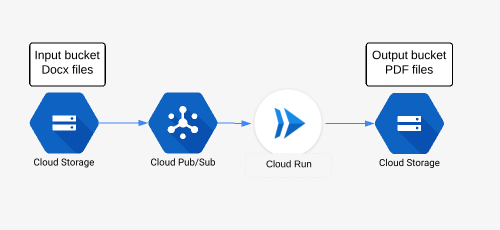

Using Cloud Run service as async worker

## [Using Cloud Run service as async worker](https://www.the-swamp.info/blog/using-cloud-run-service-async-worker/)

- ** May 2, 2019
- **  [English](https://www.the-swamp.info/tag/English/)  [Serverless](https://www.the-swamp.info/tag/Serverless/)  [Google Cloud Run](https://www.the-swamp.info/tag/Google%20Cloud%20Run/)

In my [previous article](https://www.the-swamp.info/blog/making-requests-cloud-run-service-account/), I described the process of deploying private Cloud Run service and then using Service Account to make requests to it. With these properties plays nicely use of Cloud Run as an asynchronous task worker which I want to describe in this article.

I'll use as an example of service from the previous article, Microsoft Word Docx conversion to PDF using Libreoffice but instead of making requests straight to service, PubSub will trigger service. Let's say for example that you have a Cloud Storage bucket to which you upload MS Word docx files and you want to convert automatically to PDF every time docx file is uploaded to bucket.

To do this automatically, the following steps are needed:

- input bucket needs to be set to emit notifications to PubSub topic whenever some file is uploaded (created)
- PubSub subscription is created for the topic in previous raw with HTTP target, which in our case is URL of Cloud Run service
- Cloud Run service converts file from Docx to PDF and save the resulting file to output bucket

This is how the diagram for this process looks like.

One detail is that Cloud Service will be private (not open to the internet) and thus PubSub subscription will need to run under a service account.

## Setting the pipeline

Let's go over practical steps on how to set up such pipeline.

### Cloud Storage PubSub notifications

The first step is to set a notification on Cloud Storage bucket. The only way to do it (at the moment) is using **gsutil** utility from Google Cloud SDK:

>gsutil notification create -t projects/<PROJECT-ID>/topics/gcs-cloud-run -f json -e OBJECT_FINALIZE gs://<BUCKET-NAME>

Created notification config projects/_/buckets/adventures-on-gcp.appspot.com/notificationConfigs/3

option OBJECT_FINALIZE means that notification will be triggered when a new object is created (or overwritten) in a bucket, -f json flag means that notifications will be sent in json format and gcs-cloud-run is name of the PubSub topic, so after executing this command PubSub topic *gcs-cloud-run* should be created.

This is how such PubSub message looks like:
{u'message': {u'attributes': {u'bucketId': u'adventures-on-gcp.appspot.com',
u'eventTime': u'2019-04-23T20:34:34.333805Z',
u'eventType': u'OBJECT_FINALIZE',

u'notificationConfig': u'projects/_/buckets/adventures-on-gcp.appspot.com/notificationConfigs/3',

u'objectGeneration': u'1556051674333936',
u'objectId': u'demo.docx',
u'overwroteGeneration': u'1556050819479767',
u'payloadFormat': u'JSON_API_V1'},
u'data': u'ewogICJraW5kIjogIn==',
u'messageId': u'526259585534714',
u'message_id': u'526259585534714',
u'publishTime': u'2019-04-23T20:34:34.678Z',
u'publish_time': u'2019-04-23T20:34:34.678Z'},
u'subscription': u'projects/adventures-on-gcp/subscriptions/cloud-run-ps-gcs'}

For the case in example, we need fields **bucketId** and **objectId** which corresponds to bucket name and file name (path) which was created.

### Web application

Sample Cloud Run service is written in Python and complete code can be found on Github https://github.com/zdenulo/gcp-docx2pdf/tree/master/cloud_run_pubsub.

Web application accepts HTTP POST JSON message as outlined above, downloads file from bucket to service environment, then does conversion which creates PDF file and uploads PDF file to output bucket and deletes local files (Docx and PDF) since storing data in Cloud Run service goes against RAM memory capacity, i.e. if service instance would be running all the time, and files wouldn't be deleted, it would eventually crash since it wouldn't have more free memory.

The web app itself is contained in the folder app, I am using Cloud Build to build Docker image and deploy it on Cloud Run. Cloud Build configuration is defined in the file [cloudbuild.yaml](https://github.com/zdenulo/gcp-docx2pdf/blob/master/cloud_run_pubsub/cloudbuild.yaml) and can be executed with the following command:

>gcloud builds submit --config=cloudbuild.yaml --substitutions=_SERVICE_NAME="ps-run",TAG_NAME="v0.1",_ENV_VARIABLES="OUTPUT_BUCKET=gcs-upload-test"

SERVICE_NAME is the name of Cloud Run service
TAG_NAME is the image tag

OUTPUT_BUCKET is output bucket (where the output file will be saved) which will be passed as an environmental variable to Docker image.

In build logs during deployment, URL for service will be printed or we can obtain it using the command:

>gcloud beta run services describe <SERVICE-NAME> --format="json(status[address])"

{
"status": "address": {
"hostname": "https://ps-run-sxl5nibnhq-uc.a.run.app"
}
}
}

### PubSub setup

Next step is to create a service account. As I wrote in the beginning, we want this Cloud Run service to be private and in order to access it, we need to set up appropriate IAM role for this service account. This service account will be tied to PubSub subscription and it will work as an identity so that Cloud Run can allow access to the private service. The role which grants making requests to the service is **roles/run.****invoker**.

Using **gcloud** command, service account can be created:

>gcloud iam service-accounts create cr-ps-test --display-name="Cloud Run PubSub"

Created service account [cr-ps-test].
And to allow access for this service account to Cloud Run service:

>gcloud beta run services add-iam-policy-binding ps-run --member=serviceAccount:cr-ps-test@adventures-on-gcp.iam.gserviceaccount.com --role=roles/run.invoker

Updated IAM policy for service [ps-run].
bindings:

- members:
- serviceAccount:cr-ps-test@adventures-on-gcp.iam.gserviceaccount.com

role: roles/run.invoker
etag: BwWHghIlfxk=

The last step is to create PubSub Subscription to PubSub Topic which will be identified with a created service account and to set up HTTP target which will be Cloud Run Service URL.

gcloud beta pubsub subscriptions create <SUBSCRIPTION-NAME> --push-endpoint=<SERVICE-URL> --push-auth-service-account=<SERVICE-ACCOUNT>@<PROJECT-ID>.iam.gserviceaccount.com --topic projects/<PROJECT-ID>/topics/gcs-cloud-run

If you want to test process, you can copy demo.docx file from the repository to your input bucket using gsutil command:

>gsutil cp demo.docx gs://<INPUT-BUCKET>

With this process, you can create a private Cloud Run service which receives PubSub message and further process.

- [0 comments]()
- [**The Swamp**](https://disqus.com/home/forums/theswampx/)
- [Login](https://disqus.com/embed/comments/?base=default&f=theswampx&t_i=page_81&t_u=https%3A%2F%2Fwww.the-swamp.info%2Fblog%2Fusing-cloud-run-service-async-worker%2F&t_e=Using%20Cloud%20Run%20service%20as%20async%20worker&t_d=Using%20Cloud%20Run%20service%20as%20async%20worker&t_t=Using%20Cloud%20Run%20service%20as%20async%20worker&s_o=default#)
- [](https://disqus.com/home/inbox/)
- [ Recommend](https://disqus.com/embed/comments/?base=default&f=theswampx&t_i=page_81&t_u=https%3A%2F%2Fwww.the-swamp.info%2Fblog%2Fusing-cloud-run-service-async-worker%2F&t_e=Using%20Cloud%20Run%20service%20as%20async%20worker&t_d=Using%20Cloud%20Run%20service%20as%20async%20worker&t_t=Using%20Cloud%20Run%20service%20as%20async%20worker&s_o=default#)
- tTweetfShare
- [Sort by Newest](https://disqus.com/embed/comments/?base=default&f=theswampx&t_i=page_81&t_u=https%3A%2F%2Fwww.the-swamp.info%2Fblog%2Fusing-cloud-run-service-async-worker%2F&t_e=Using%20Cloud%20Run%20service%20as%20async%20worker&t_d=Using%20Cloud%20Run%20service%20as%20async%20worker&t_t=Using%20Cloud%20Run%20service%20as%20async%20worker&s_o=default#)

Start the discussion…

###### Log in with

-
-
-
-

######  or sign up with Disqus

?

### Disqus is a discussion network

- Disqus never moderates or censors. The rules on this community are its own.
- Don't be a jerk or do anything illegal. Everything is easier that way.

[Read full terms and conditions](https://docs.disqus.com/kb/terms-and-policies/)

Be the first to comment.

## Also on **The Swamp**

- [

### Sharing local Datastore between GAE and client library

    - 4 comments •

    - a year ago

[ zdenulo — yes I will, thanks again](https://disq.us/?url=https%3A%2F%2Fwww.the-swamp.info%2Fblog%2Fsharing-local-datastore-between-gae-and-client-library%2F&key=lnulyS4s1e-oSxwN4-NYBA)](https://disq.us/?url=https%3A%2F%2Fwww.the-swamp.info%2Fblog%2Fsharing-local-datastore-between-gae-and-client-library%2F&key=lnulyS4s1e-oSxwN4-NYBA)

- [

### Recovering corrupted zip file

    - 1 comment •

    - 5 years ago

[ Randy Niemann — Thank You so much that did the trick!](http://disq.us/?url=http%3A%2F%2Fwww.the-swamp.info%2Fblog%2Frecovering-corrupted-zip-file%2F&key=tAg2FyDiHmAxNhnhDv7gFg)](http://disq.us/?url=http%3A%2F%2Fwww.the-swamp.info%2Fblog%2Frecovering-corrupted-zip-file%2F&key=tAg2FyDiHmAxNhnhDv7gFg)

- [

### Setting WordPress on Google Cloud Platform

    - 2 comments •

    - a year ago

[ zdenulo — thanks for input](https://disq.us/?url=https%3A%2F%2Fwww.the-swamp.info%2Fblog%2Fsetting-wordpress-google-cloud-platform%2F&key=xZc8rntrTfa-uyvbF2mwVA)](https://disq.us/?url=https%3A%2F%2Fwww.the-swamp.info%2Fblog%2Fsetting-wordpress-google-cloud-platform%2F&key=xZc8rntrTfa-uyvbF2mwVA)

- [

### Sound for alarm clock

    - 1 comment •

    - 6 years ago

[ Daniel — That's a funny idea. I like it.](http://disq.us/?url=http%3A%2F%2Fwww.the-swamp.info%2Fblog%2Fsound-alarm-clock%2F&key=gbiUdjF8R7rNU9RijaKG2Q)](http://disq.us/?url=http%3A%2F%2Fwww.the-swamp.info%2Fblog%2Fsound-alarm-clock%2F&key=gbiUdjF8R7rNU9RijaKG2Q)

- [Powered by Disqus](https://disqus.com/)
- [*✉*Subscribe*✔*](https://disqus.com/embed/comments/?base=default&f=theswampx&t_i=page_81&t_u=https%3A%2F%2Fwww.the-swamp.info%2Fblog%2Fusing-cloud-run-service-async-worker%2F&t_e=Using%20Cloud%20Run%20service%20as%20async%20worker&t_d=Using%20Cloud%20Run%20service%20as%20async%20worker&t_t=Using%20Cloud%20Run%20service%20as%20async%20worker&s_o=default#)
- [*d*Add Disqus to your site](https://publishers.disqus.com/engage?utm_source=theswampx&utm_medium=Disqus-Footer)
- [**Disqus' Privacy Policy](https://help.disqus.com/customer/portal/articles/466259-privacy-policy)