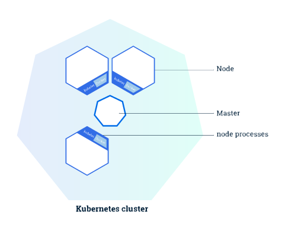

Using Minikube to Create a Cluster

[Edit This Page](https://kubernetes.io/editdocs#docs/tutorials/kubernetes-basics/cluster-intro.html)

#   Using Minikube to Create a Cluster

###   Objectives

- Learn what a Kubernetes cluster is.
- Learn what Minikube is.
- Start a Kubernetes cluster using an online terminal.

###   Kubernetes Clusters

**Kubernetes coordinates a highly available cluster of computers that are connected to work as a single unit.** The abstractions in Kubernetes allow you to deploy containerized applications to a cluster without tying them specifically to individual machines. To make use of this new model of deployment, applications need to be packaged in a way that decouples them from individual hosts: they need to be containerized. Containerized applications are more flexible and available than in past deployment models, where applications were installed directly onto specific machines as packages deeply integrated into the host. **Kubernetes automates the distribution and scheduling of application containers across a cluster in a more efficient way.** Kubernetes is an [open-source](https://github.com/kubernetes/kubernetes) platform and is production-ready.

A Kubernetes cluster consists of two types of resources:

- The **Master** coordinates the cluster

- **Nodes** are the workers that run applications

###   Summary:

- Kubernetes cluster
- Minikube

*Kubernetes is a production-grade, open-source platform that orchestrates the placement (scheduling) and execution of application containers within and across computer clusters.*

##   Cluster Diagram

**The Master is responsible for managing the cluster.** The master coordinates all activities in your cluster, such as scheduling applications, maintaining applications' desired state, scaling applications, and rolling out new updates.

**A node is a VM or a physical computer that serves as a worker machine in a Kubernetes cluster.** Each node has a Kubelet, which is an agent for managing the node and communicating with the Kubernetes master. The node should also have tools for handling container operations, such as [Docker](https://www.docker.com/) or [rkt](https://coreos.com/rkt/). A Kubernetes cluster that handles production traffic should have a minimum of three nodes.

* Masters manage the cluster and the nodes are used to host the running applications. *

When you deploy applications on Kubernetes, you tell the master to start the application containers. The master schedules the containers to run on the cluster's nodes. **The nodes communicate with the master using the Kubernetes API**, which the master exposes. End users can also use the Kubernetes API directly to interact with the cluster.

A Kubernetes cluster can be deployed on either physical or virtual machines. To get started with Kubernetes development, you can use [Minikube](https://github.com/kubernetes/minikube). Minikube is a lightweight Kubernetes implementation that creates a VM on your local machine and deploys a simple cluster containing only one node. Minikube is available for Linux, Mac OS and Windows systems. The Minikube CLI provides basic bootstrapping operations for working with your cluster, including start, stop, status, and delete. For this bootcamp, however, you'll use a provided online terminal with Minikube pre-installed.

Now that you know what Kubernetes is, let's go to the online tutorial and start our first cluster!

[Start Interactive Tutorial ›](https://kubernetes.io/docs/tutorials/kubernetes-basics/cluster-interactive/)

 [Create an Issue](https://kubernetes.io/docs/tutorials/kubernetes-basics/cluster-intro/)[Edit this Page](https://kubernetes.io/editdocs#docs/tutorials/kubernetes-basics/cluster-intro.html)