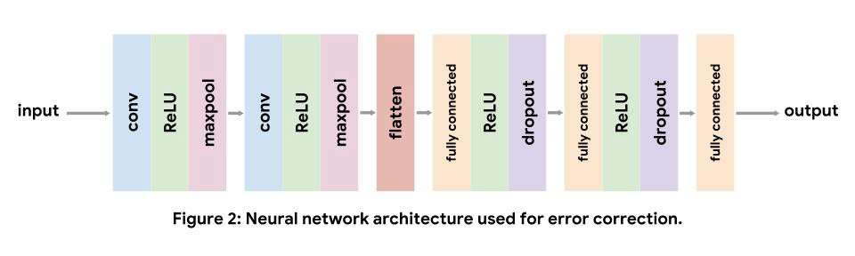
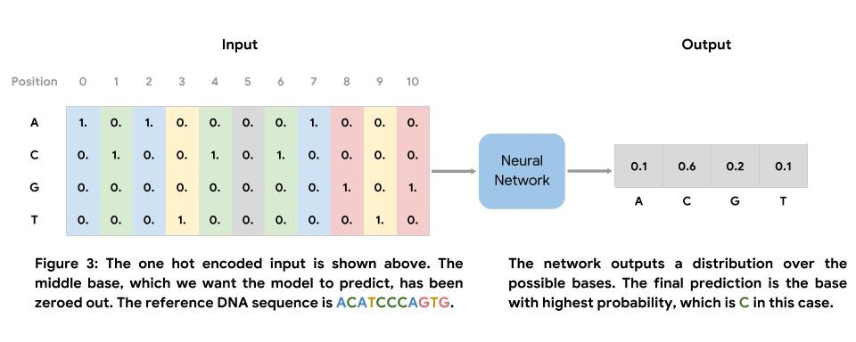
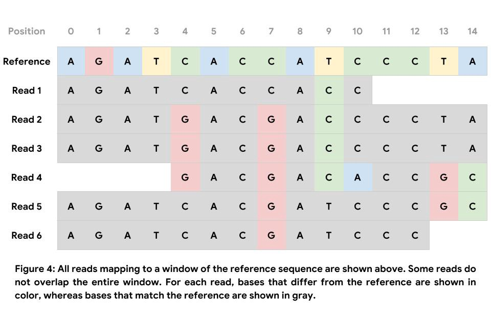
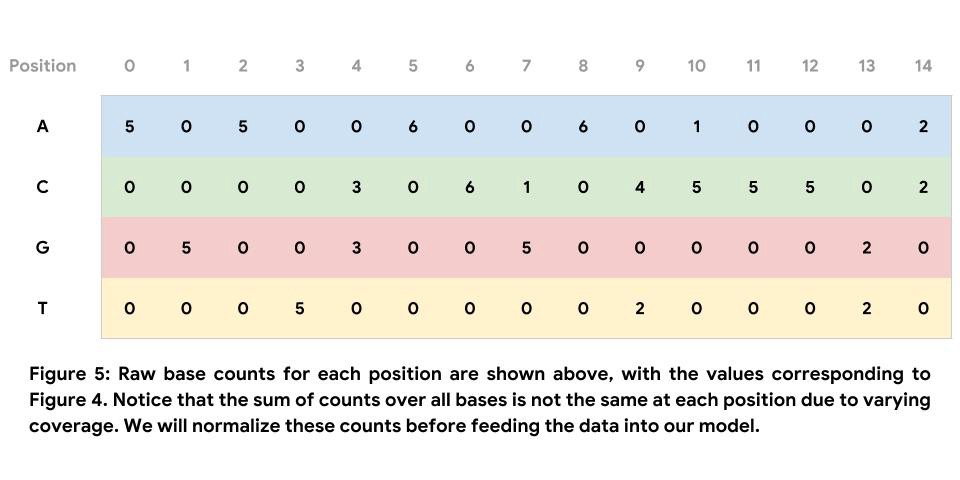
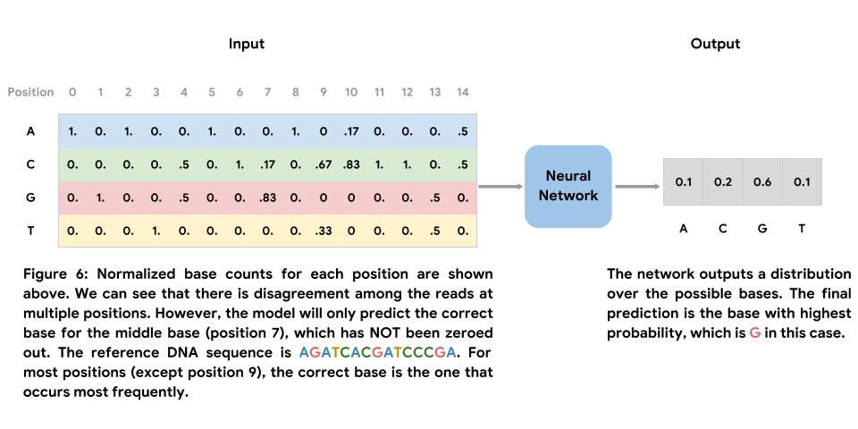

Using Nucleus and TensorFlow for DNA Sequencing Error Correction

# *Using Nucleus and TensorFlow for DNA Sequencing Error Correction*

[TensorFlow](https://medium.com/@tensorflow)
Jan 31·7 min read

Posted by [Gunjan Baid](https://twitter.com/gunjan_baid), [Helen Li](https://twitter.com/xunjieli), and [Pi-Chuan Chang](https://ai.google/research/people/author39216)

Editorial Note: This post is published with identical content on the [Google DeepVariant blog](https://google.github.io/deepvariant/posts/2019-01-31-using-nucleus-and-tensorflow-for-dna-sequencing-error-correction/).

### Introduction

In this post, we formulate DNA sequencing error correction as a multiclass classification problem and propose two deep learning solutions. Our first approach corrects errors in a single read, whereas the second approach, shown in Figure 1, builds a consensus from several reads to predict the correct DNA sequence. Our [Colab notebook tutorial](https://colab.research.google.com/github/google/nucleus/blob/master/nucleus/examples/dna_sequencing_error_correction.ipynb) implements the second approach using the [Nucleus](https://github.com/google/nucleus) and [TensorFlow](https://www.tensorflow.org/) libraries. Our goal is to show how Nucleus can be used alongside TensorFlow for solving machine learning problems in genomics.

#### Problem Overview

While DNA sequencing continues to become faster and cheaper, it is still an error-prone process. Error rates for raw data from next-generation sequencing (NGS) technologies developed by companies such as [Illumina](https://www.illumina.com/) are around 1%. Error rates for increasingly popular third-generation technologies like those developed by [Pacific BioSciences](https://www.pacb.com/) (PacBio) are around 15%. Sequencing errors can be divided into substitutions, insertions, and deletions, the last two of which are commonly referred to as indels. All of these errors can be detrimental to downstream analysis steps such as variant calling and genome assembly.

A simple approach for obtaining higher quality datasets is to discard data that likely contains errors, either by throwing away entire reads or trimming regions of low quality. This approach is not ideal as it leads to a smaller final dataset. In addition, certain sequence contexts have naturally higher error rates, leading to biases in sampling. Thus, there exists a large body of research that is focused on developing more sophisticated methods for error correction. Most methods that have been developed can be categorized into one of two groups:

1. 1 "."Methods that operate on a single read and aim to determine the correct read sequence

2. 2 "."Consensus-based methods that operate on several reads and aim to determine the correct underlying DNA sequence

#### Deep Learning Overview

Both of the methods that we formulate in this post use deep neural networks, which learn functions that map inputs to outputs. A neural network consists of several layers of linear and nonlinear operations applied sequentially to the input. Neural networks have been successfully applied to various problems including [image classification](https://ai.googleblog.com/2016/03/train-your-own-image-classifier-with.html) and [natural language translation](https://ai.googleblog.com/2016/09/a-neural-network-for-machine.html). More recently, they have also been used for problems in genomics, such as [protein structure prediction](https://deepmind.com/blog/alphafold/) and [variant calling](https://ai.googleblog.com/2017/12/deepvariant-highly-accurate-genomes.html).

### Methods

#### Nucleus

Our implementation relies on [Nucleus](https://github.com/google/nucleus), a library developed for processing genomics data by the Genomics team in Google Brain. Nucleus makes it easy to read, write, and analyze data in common genomics file formats like BAM, FASTA, and VCF using specialized reader and writer objects. Nucleus allows us to:

- •Query a VCF file for all variants in a given genomic region
- •Query a BAM file for all reads mapping to a given genomic range
- •Query a FASTA file for the reference sequence starting at a given position

We also use Nucleus to write data out to [TFRecords](https://www.tensorflow.org/tutorials/load_data/tf-records), a binary file format that consists of protocol buffer messages and can be easily read by TensorFlow. After reading in the TFRecords, we use the [Estimator API](https://www.tensorflow.org/guide/estimators) to train and evaluate a convolutional neural network.

#### Data

Below is a list of the files we use in the implementation. All of the data is publicly available, and the [tutorial](https://colab.research.google.com/github/google/nucleus/blob/master/nucleus/examples/dna_sequencing_error_correction.ipynb) contains download links and instructions.

- •`NA12878_sliced.bam` — Illumina HiSeq reads from chromosome 20 (positions 10,000,000–10,100,000), downsampled to 30x coverage.
- •`NA12878_sliced.bam.bai` — Index for `NA12878_sliced.bam`.
- •`NA12878_calls.vcf.gz` — Truth set of variants for NA12878 from Genome in a Bottle.
- •`NA12878_calls.vcf.gz.tbi `— Index for `NA12878_calls.vcf.gz`.
- •`hs37d5.fa.gz` — Reference genome for `hs37d5`.
- •`hs37d5.fa.gz.fai` and `hs37d5.fa.gz.gzi `— Index files for `hs37d5.fa.gz`.

#### Network Architecture

Convolutional neural networks are commonly used for computer vision tasks, but also [work well for genomics](https://doi.org/10.1093/molbev/msy224). Each convolutional layer repeatedly applies learned filters to the input. Convolutional filters appearing early in the network learn to recognize low-level features in the input, like edges and color gradients in images, whereas later filters learn to recognize more complex compositions of the low-level features. For DNA sequence inputs, low-level convolutional filters act as motif detectors, similar to the position weight matrices of [sequence logos](https://en.wikipedia.org/wiki/Position_weight_matrix#/media/File:LexA_gram_positive_bacteria_sequence_logo.png).

For our implementation, we use a standard convolutional architecture consisting of two convolutional layers, followed by three fully connected layers. We use nonlinear ReLU layers to increase the expressive capacity of our model. Maxpooling after convolutional layers shrinks the input volume, and dropout after fully connected layers acts as a regularizer. Note, we do not include a softmax layer after the final fully connected layer as the loss function we use applies the softmax internally. The details of each layer can be found in the [tutorial](https://colab.research.google.com/github/google/nucleus/blob/master/nucleus/examples/dna_sequencing_error_correction.ipynb).

### Approach 1: Error Correction of Single Reads

In order to correct errors in sequenced reads, we can use deep learning to train a neural network that can solve a more general task: fill in missing bases in DNA sequences. The goal of this approach is to develop a model that understands the grammar of DNA sequences. The grammar of real sequences alone likely does not contain enough information to develop a solution that can be used in production. Nonetheless, this serves as a straightforward example application.

For instructional purposes, we simplify the problem in the following ways:

- •Consider only regions with substitution errors and ignore indel errors
- •Consider only regions with no known variants

We can train the neural network on regions of the reference genome. The input to this network is a DNA sequence of fixed length, centered around the base we wish to predict. The output of the network is a distribution over the possible bases, and the final prediction is the base with highest probability. The label set is generated using the bases observed in the reference genome. Since we only use reads mapping to regions with no known truth variants, we can unambiguously denote the base present in the reference genome as the label.

We generate input sequences by splitting the reference genome into non-overlapping sections of a fixed length. At training, evaluation, and test time, we simulate missing bases by zeroing out a base in the reference sequence, as shown in Figure 3 (position 5). In addition to simulating missing data using the reference genome, we can also apply such a model to data from sequenced reads, specifically bases with quality scores below a threshold value.

### Approach 2: Consensus-Based Error Correction

The ultimate goal of error correction is to determine the underlying DNA sequence, as opposed to correcting an individual read. In this section, we use the consensus of multiple reads by aggregating a sequence pileup to directly determine the DNA sequence without the intermediate step of correcting individual reads. An example of a pileup is shown below in Figure 4. Note, the figure only shows the portions of the reads that fall in the window.

For instructional purposes, we again simplify the problem in the following ways:

- •Consider only regions with substitution errors and ignore indel errors
- •Consider only regions with no known variants

Unlike the first approach, we do not train this model on the reference genome. Instead, our training data comes from mapped Illumina HiSeq reads. The input to this network is a matrix of normalized base counts observed in mapped reads, centered around the position at which we wish to predict the correct base. A similar featurization is used by the authors of [Clairvoyante](https://doi.org/10.1101/310458), a neural network for variant calling, and in an [example method by Jason Chin](https://towardsdatascience.com/simple-convolution-neural-network-for-genomic-variant-calling-with-tensorflow-c085dbc2026f). The output of the network is a distribution over the possible bases, and the final prediction is the base with highest probability. Similar to the first approach, the label set is generated using the bases observed in the reference genome. We use a mix of examples that contain errors (at least one read in the pileup does not match the reference at the center position) and examples that do not contain errors (all reads in the pileup match the reference at the center position).

### Conclusion

The [accompanying tutorial](https://colab.research.google.com/github/google/nucleus/blob/master/nucleus/examples/dna_sequencing_error_correction.ipynb) implements the second approach described in this post. Though the examples we develop are not complex enough to be deployed in production, we hope they will help developers learn to efficiently apply Nucleus and deep learning within genomics.