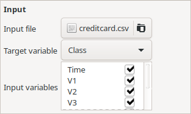
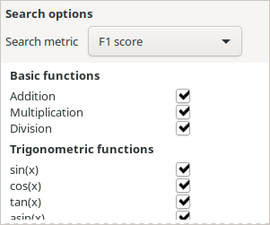
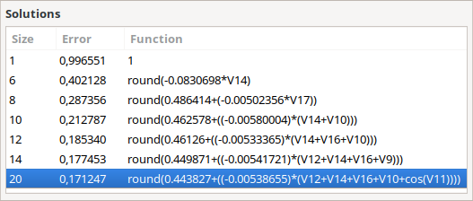

Using Symbolic Regression to predict rare events — TuringBot: Symbolic Regression software

# Using Symbolic Regression to predict rare events

 

The formula above predicts credit card frauds in a real world dataset with 87% precision.

## Introduction

Predicting rare events is a machine learning problem of great practical importance, and also a very difficult one. Models of this kind need to be trained on highly imbalanced datasets, and are used, among other things, for spotting fraudulent online transactions and detecting anomalies in medical images.

In this article, we show how such problems can be modeled using Symbolic Regression, a technique which attempts to find mathematical formulas that predict a desired variable from a set of input variables. Symbolic models, contrary to more mainstream ones like neural networks and random forests, are not black boxes, since they clearly show which variables are being used and how. They are also very fast and easy to implement, since no complex data structures are involved in the calculations.

In order to provide a real world example, we will try to model the credit card fraud dataset [available on Kaggle](https://www.kaggle.com/mlg-ulb/creditcardfraud) using our Symbolic Regression software TuringBot. The dataset consists of a CSV file containing 284,807 transactions, one per row, out of which 492 are frauds. The first 28 columns represent anonymized features, and the last one contains "0" for legitimate transactions and "1" for fraudulent ones.

Prior to the regression, we remove all quotation mark characters from the file, so that those two categories are recognized as numbers by the software.

## Creating the model

Generating symbolic models using TuringBot is a straightforward process, which requires no data science skills. The first step is to open the program and load the input file by clicking on the "Input" button, shown below. After loading, the code will automatically define the column "Class" as the target variable and all other ones as input variables, which is what we want.

 

Then, we select the error metric for the search as "F1 score", which is the appropriate one for binary classification problems on highly imbalanced datasets like this one. This metric corresponds to a geometric mean of precision and the recall of the model. A very illustrative image is shown on the [Wikipedia page](https://en.wikipedia.org/wiki/F1_score) for F1 score explaining what precision and recall are.

 

That's it! After those two steps, the search is ready to start. Just click on the "play" button at the top of the interface. The best solutions that the program has encountered so far will be shown in the "Solutions" box in real time.

Bear in mind that this is a relatively large dataset, and that it may seem like not much is going on in the first minutes of the optimization. Ideally, you should leave the program running until at least a few million formulas have been tested (you can see the number so far in the Log tab). In a modest i7-3770 CPU with 8 threads, this took us about 6 hours. A more powerful CPU would take less time.

## The result

The models that were encountered by the program after this time were the following:

 

The error for the best one is 0.17, meaning its F1 score is 1 - 0.17 = 0.83. This implies that both the recall and the precision of the model are close to 83%. In a verification using Python, we have found that they are 80% and 87% respectively.

So what does this mean? That the following mathematical formula found by our program is capable of detecting 80% of all frauds in the dataset, and that it is right 87% of the time when it claims that a fraud is taking place! This is a result consistent with the best machine learning methods available.

 

## Conclusion

In this article, we have demonstrated that our Symbolic Regression software TuringBot is able to generate models that classify credit card frauds in a real world dataset with high precision and high recall. We believe that this kind of modeling capability, combined with the transparency and efficiency of the generated models, is very useful for those interested in developing machine learning models for the classification and prediction of rare events.