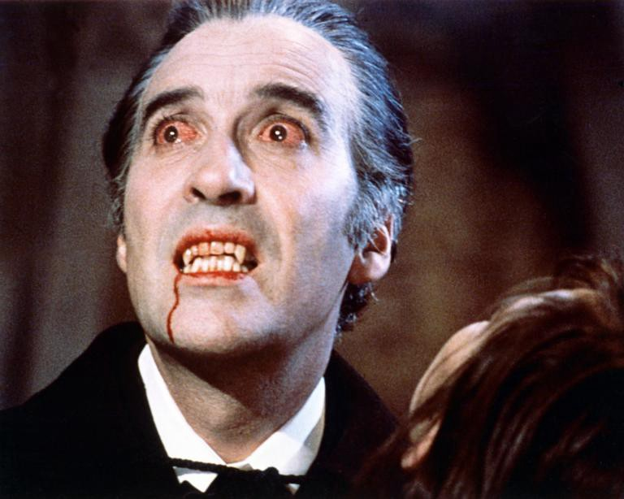
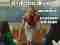
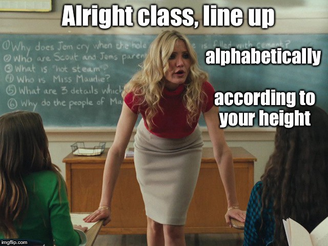

Using the birthday paradox to teach probability fundamentals

# Using the birthday paradox to teach probability fundamentals

## What are the odds that two of your friends share a birthday?

[Cassie Kozyrkov](https://towardsdatascience.com/@kozyrkov?source=post_page-----c08bbcb351d1----------------------)

[Oct 8](https://towardsdatascience.com/using-the-birthday-paradox-to-teach-probability-fundamentals-c08bbcb351d1?source=post_page-----c08bbcb351d1----------------------) · 10 min read

**Short answer:** it depends how many friends you have…

Today’s the birthday of someone dear to me (hip hip hooray!), which is a fabulous excuse to cover some probability basics in birthday language. Our goal is figuring out this perennial stats homework chart topper together:

> If you have N people in a group, what’s the probability that there’s at least one shared birthday?

If you haven’t thought about this one, take a moment to guess. Imagine the group has *N*=30 people in it. What are the chances two people get their cake on the same day? Or, if that’s daunting, just answer this: would you prefer to bet me $10 that there are birthday duplicates or $10 that there aren’t? Let’s see how well-oiled your intuition is!

We’re going to get there as the punchline, but first we’ll develop all the LEGO pieces (in large font below) you need to solve [The Birthday Problem](https://en.wikipedia.org/wiki/Birthday_problem) yourself…

# The most basic basics

For sake of pure pedantry, let’s get this eye-roll-inspiring revelation out of the way: probability lives between 0 and 1 (or 0% and 100%, if you prefer). Cool. Now you know why a sentence like, *“I’m, like, a 1000% sure that, like, they’re going to be late”* turns data folk an alarming shade of, like, purple.

# Three approaches to probability

There are three main approaches to thinking about probability:

- ***Event-based*** (involves enumerating events and counting them)
- ***Frequency-based*** (involves [distributions](http://bit.ly/quaesita_hist) symbolizing how things would shake out if we observed our phenomenon in infinite parallel universes)
- ***Subjective*** (involves [distributions](http://bit.ly/quaesita_hist) symbolizing human belief in what’s likely, ideally as expressed in terms of bets… since putting your money where your mouth is reduces your tendency to spew nonsense)

In case you took a stats class with a professor who didn’t apply the wooden-mallet-to-the-head style of emphasizing the obvious, let me spell out where these tend to lurk in your textbook.

# Event-based probability

> PROBABILITY = [NUMERATOR] / [DENOMINATOR]

The early chapters tend to start with the ***event-based approach to probability***. That’s because it’s an easy playground to get some basics across and most humans probably (heh) already have an intuition for it. *Examples:* What are the chances your fair coin comes up tails? 1/2. What are the chances you roll a 6 on a six-sided die? 1/6. What’s happening here?

> NUMERATOR: number of ways the event we’re interested in can happen.
> DENOMINATOR: number of ways any (relevant) event can happen.

On a coin, the possible relevant events are HEADS and TAILS. That’s where the 2 comes from. Easy peasy.

A small amusement for you on the topic of heads and tails…

# Counting stuff

To work with ***event-based probability***, you need to be able to enumerate events and count them. That’s why your textbook probably drags you through ***combinatorics*** till you’re thoroughly sick of it. [Combinatorics](https://en.wikipedia.org/wiki/Combinatorics) gives you the math that you need for counting the number of ways events can happen (for that nice NUMERATOR and DENOMINATOR you’re after).

Welcome to a bazillion homework problems all about “H*ow many different ways can I select 10 committee members from 100 candidates?” (*[*17,310,309,456,440*](https://www.hackmath.net/en/calculator/n-choose-k?n=100&k=10&order=0&repeat=0)*)* or “*How many different options can I choose from when setting a 4-digit PIN?” (10,000)*

In the event-based world, all building block events are equally probable so as to lend themselves to basic arithmetic unmolested by layers of messy modifiers. It’s a world where all the coins are fair, all the dice are balanced, all the cards are unscuffed, and all the birthdays are equally likely.

Since we’re on the topic of Counting things.

For the birthday problem, we need to know a quick something about [counting](https://en.wikipedia.org/wiki/Combinatorial_principles):

> “AND” asks you to multiply (x) counts
> “OR” asks you to add (+) counts

Go look up a proof if you like… or satisfy yourself with a quick example and move along: If I have 2 options for a vegetarian dish OR 3 options for a meaty dish, then how many meal options do I have? 2 + 3 = 5. What if I can choose a main course AND one of 2 desserts? How many different meals am I choosing from? 5 x 2 = 10. Try it out with concrete examples of dishes and write it all out if you don’t believe me.

What’s the probability a randomly selected meal is veg-friendly?
NUMERATOR = 2 x 2 = 4; DENOMINATOR = 10. ANSWER = 4/10 = 40%

# Beyond events

You’re 3 chapters in and all of a sudden your textbook forgets all about combinatorics. Just when you were getting the hang of all those combinations and permutations, they’re never heard from again. Instead, suddenly there are [distributions](http://bit.ly/quaesita_hist) everywhere. What’s up with that?

Your bus is here!

Consider this question: *“What’s the probability you need to wait more than 10 minutes for the bus?” *This is going to be tricky to count (in nanoseconds?) and a pain because counting events means you can’t work with time as a continuous thing. It gets worse if you have a bus driver who has some probability of stopping for a smoke break that’s dependent on how late the bus is already. How are you going to enumerate that? You’re not. Maybe counting events isn’t your friend here…

Enter the ***frequency-based definition***, which says something like, *“If this were a random event happening in infinite parallel universes (governed by rules I specify, er, assume), in how many of them would the bus take more than 10 minutes to arrive?”* (Parallel universes?! Yeah, no wonder we statisticians have the crazy eyes.)

And then — usually much later — when you hit the ***subjective definition*** in your [Bayesian stats](http://bit.ly/quaesita_stc011) textbook, you get to make the [distributions](https://flowingdata.com/2011/05/13/plush-statistical-distribution-pillows/) up based on what you *feel* is likely. See what kind of twisted stuff you wind up with when we take away your ability to enumerate events? Well, luckily for the birthday problem, *if we assume all 366 birthdays are equally likely**, we can stick with counting. Whew!

*What, you don’t like my assumption? Get over yourself — all of statistics is about making simplifying assumptions — the universe is a terrifying place otherwise. If you don’t like my assumptions, then you need to come up with a different solution because mine is no good to you. Statistics gets creative because we’re all allowed to make any assumptions we like. To misquote [George Box](https://en.wikipedia.org/wiki/All_models_are_wrong): *“All solutions are wrong, but whichever one fits the assumptions you’re willing to live with might be useful to you.”*

# NOT a compliment

The last building block we need for the birthday problem is complements, otherwise known as the humble NOT.

> P(not A) = 1 — P(A)

This is read as *“the probability of an event (which we’ve named event A because we’re uncreative) NOT happening equals 100% minus the probability of that event happening.”*

So what’s the probability of NOT getting a 6 on that die roll? 1–1/6 = 5/6
Okay, that’s all. We’re ready to solve the birthday problem!

# The birthday problem

What was the question again? Ah, this:

> If you have N people in a group, what’s the probability that there’s at least one shared birthday?

So let’s try this with our lego pieces…

## Birthday DENOMINATOR

How many birthday options do we have for one person? 366 (see above).
How many birthday options do we have for N=30 people?

We have 366 for the first person AND 366 for the second person AND 366 for the third person … AND 366 for the Nth person. Put a multiply where all the ANDs are and voilà!

DENOMINATOR = 366 ^ N = Holy cow that’s a lot of digits! 76 of them if N is 30. That’s more than a quattuorvigintillion. (Isn’t naming things fun?)

## Birthday NUMERATOR

Prepare to get dizzy. We have to count all the different ways to have at least one match in any two people. So person 1 has 366 options and person 29 has 1 option because they match person 1 but it could be person 2 and person 17 or or both pairs or maybe three people share a birthday or… or… or… no, this is going to get messy too quickly while we run around trying to keep all the options straight in our heads.

…Which is what makes this such a fun homework problem. You’re supposed to bang your head against it until you see the trick. (Or beg the internet for the cheat code. Is that how you found your way to this blog post? That’s cool, I’ve got ya.)

## **The trick that solves the birthday problem!**

Instead of counting all the ways we can have people sharing birthdays, the trick is to rephrase the problem and count a much simpler thing: the opposite!

> P(At least one shared birthday) =
> 1 — P(All birthdays are unique)

So what we need to find is the answer to this: *“What’s the probability that there’s NOT any birthday sharing in the crowd?”* In other words, what’s the probability all birthdays are unique?

## Unique birthdays DENOMINATOR

Still 366 ^ N. By working with the complementary event, we shifted our focus in the numerator. The denominator is unscathed.

## Unique birthdays NUMERATOR

This is where the beautiful and glorious magic happens!

The first person has 366 options for a birthday (greedy pig) AND the second person has only 365 because we force them to have a different birthday. If person 1 is born on Oct 8 and we’re forcing our room to have N unique birthdays in it, we turn all Oct 8 birthday folk away at the door. Each applicant for the room has fewer options by one.

So it’s 366 options for person 1 AND 365 for person 2 AND 364 for person 3 … AND (367— N) for person N.

If N is 30, put in the multiplication signs and boom!

366 x 365 x 364 x 363 x 362 x 361 x 360 x 359 x 358 x 357 x 356 x 355 x 354 x 353 x 352 x 351 x 350 x 349 x 348 x 347 x 346 x 345 x 344 x 343 x 342 x 341 x 340 x 339 x 338 x 337 = …

Yuck, another big number with 76 digits.

But, luckily for us, computers will just handle the division for us if we ask nicely.

## Probability of NOT what we want

P(All 30 birthdays unique) = (366 x 365 x 364 x 363 x 362 x 361 x 360 x 359 x 358 x 357 x 356 x 355 x 354 x 353 x 352 x 351 x 350 x 349 x 348 x 347 x 346 x 345 x 344 x 343 x 342 x 341 x 340 x 339 x 338 x 337) / (366 ^ 30)

= 0.3 (rounded off to the capacity of my attention span)

## Finally, here comes the answer we want!

P(Shared birthdays in a group of 30) = 1 — 0.3 = 70%
> With a group of 30, there’s a ~70% chance of shared birthdays.

I hope you didn’t bet me $10 that having shared birthdays was less likely than everyone born on a unique day in a group of 30… but if you did, I won’t say no if you’d like to donate it to Wikipedia.

Taking the wrong side of the bet comes from underestimating just how hard it is to get a room without duplicates — if you’re the bouncer at the door tasked with turning away people whose birthday slots are taken, it won’t be very long before you turn away your first disappointed soul.

## It depends on how many friends you have…

With 2 minutes and [R](http://bit.ly/vanillar) open on my laptop, I can plot the answer for any every choice of N. If you’re curious to know the actual numbers (50% happens at N = 23, 99% at N = 55), go [ahead and play](https://rdrr.io/snippets/) with my ugly-but-functional little code snippet below right in your browser, no installs needed.

# Initialize settings for N = 1:

probability <- 0
numerator <- 366
denominator <- 366# Loops are terrible in R, let's make one anyways:
for (N in 2:80) {
numerator <- numerator * (366 + 1 - N)
denominator <- denominator * 366
p <- 1 - (numerator / denominator)
probability <- c(probability, p)
}# Look at the answer to 2 decimal places:
paste("For N =", 1:80, "prob is", round(probability, 2))# Plot!

plot(1:80, probability, xlab = "Group Size", ylab = "P(Shared birthdays)", type = "l", col = "red", main = "The Birthday Solution")

# What did we learn here?

Besides some probability basics (like different approaches to probability, complements, and what to put in the numerator and denominator), and counting principles (rule of sum and rule of product) the thing to take away from this article is *why* you’re being taught certain concepts in a certain order.

Why is counting such a big deal early on in your textbook and then suddenly it disappears, leaving everyone disgruntled? Turns out that it’s mostly a means to an end, since the assumption that all elementary events are equally likely is too amateurish for most pros to stomach… [even for birthdays](https://www.panix.com/~murphy/bday.html). Isn’t it funny that when nonexperts think of what we stats folks do all day, they tend to think of card counting and coin tossing? Some rumors are hard to kill!

A big part of what makes the birthday problem a classic fixture of the statistics undergraduate experience is that it gives you just enough pain to rub a key point in: statisticians need to learn how to rephrase problems so their moving parts are easier to handle. The brute force approach is often too hard to calculate, so we learn to look sideways at things. If you opt for the [statistics](http://bit.ly/quaesita_statistics) life, prepare for a lot of flipping and reversing.

This article was intentionally different from my usual. It’s good to try new things sometimes to see if people like ‘em—if you want more where this came from, likes and shares are how you let me know. ❤