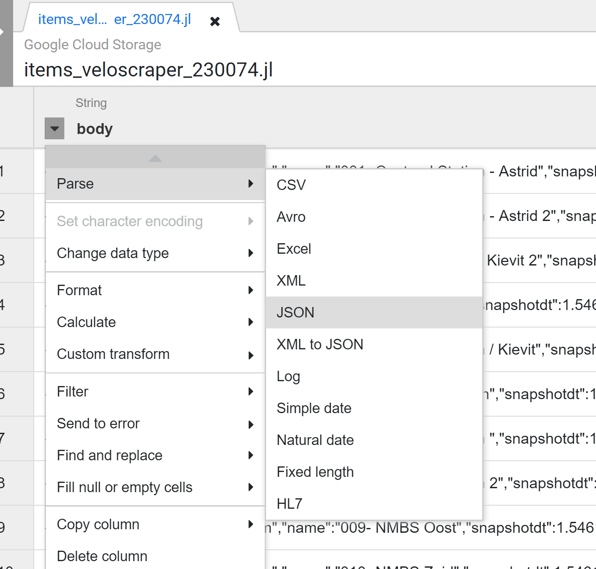
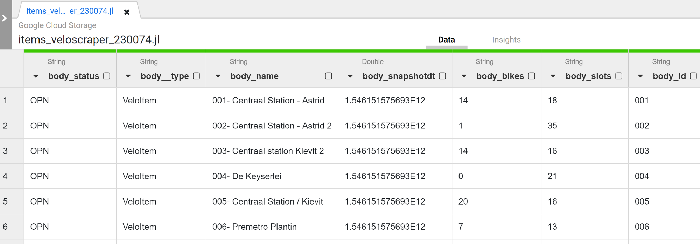
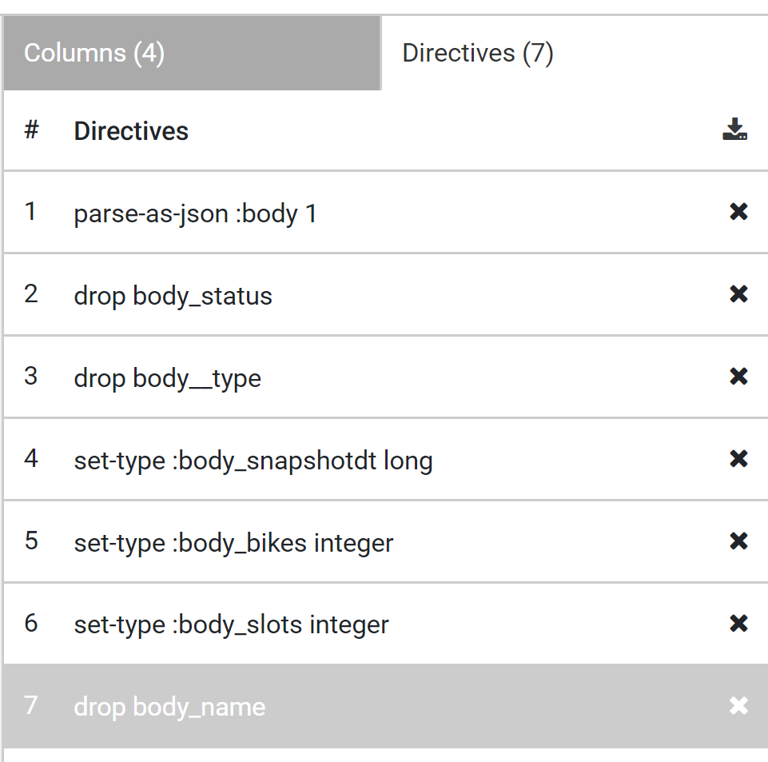
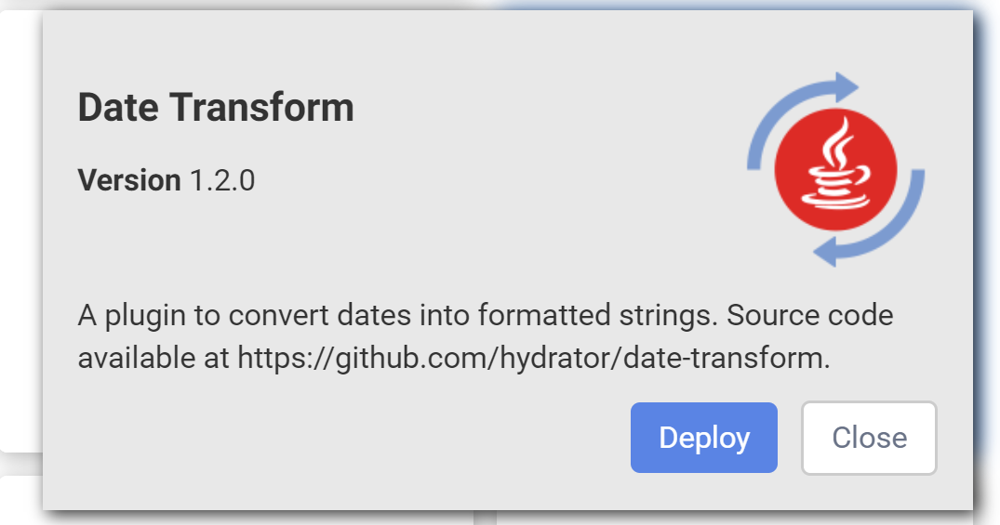
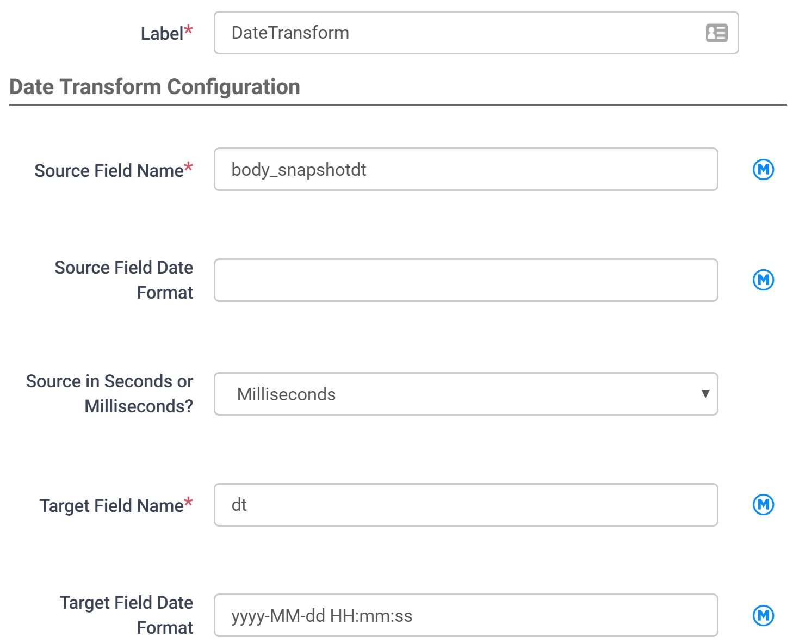
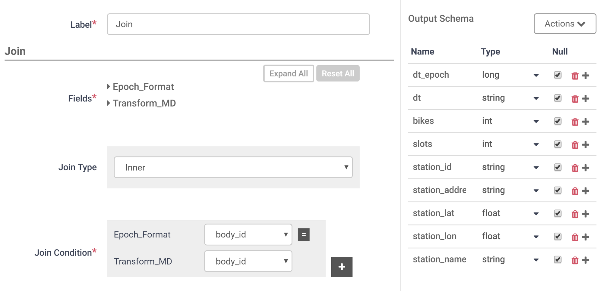
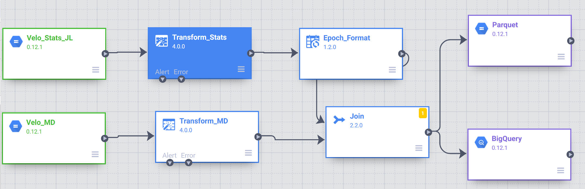
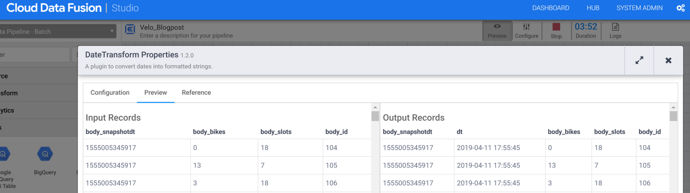
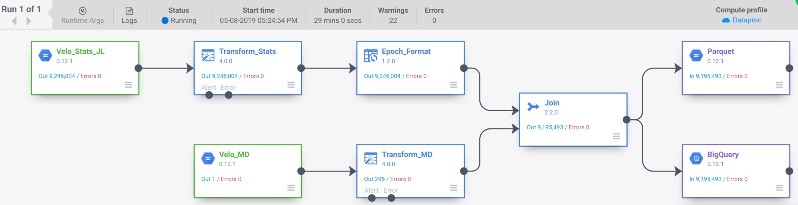

Utilizing Google Cloud Data Fusion to support Data Engineering at ML6

# Utilizing Google Cloud Data Fusion to support Data Engineering at ML6

[Koen Verschaeren](https://blog.ml6.eu/@KoenVerschaeren)
May 9·4 min read

There are various ways to do data engineering on [Google Cloud Platform](https://cloud.google.com/).

At [ML6](https://www.ml6.eu/) we often get the question of what tool is the best solution.

In a lot of cases, it’s not a straightforward decision because it depends on the type of data, data volume, requirements regarding data lineage and latency, preference and experience of the team, budget…

Over the next few months, we’ll have a look at the different tools and frameworks available on [Google Cloud Platform](https://cloud.google.com/). We’ll focus on a simple use case and try to highlight the features that increase productivity.

A few weeks ago I attended the [Google Cloud Data Fusion](https://blog.ml6.eu/google-cloud-data-fusion-how-ml6-can-bridge-the-data-gap-df914eb0fa18)training so let’s build a data set using the “new kid on the block”: [Cloud Data Fusion](https://cloud.google.com/data-fusion/).

* * *

*...*

A few months ago I discovered on [Bike Share Research](https://bikeshare-research.org/#bssid:antwerp)it’s easy to access the Antwerp Velo API. I’ve deployed a scraper written using [scrapy](https://scrapy.org/) on [Scrapinghub](https://scrapinghub.com/) to fetch the bike availability every 5 minutes and store the results in a JSON line file.

We’ll clean, combine the data with the latest master data and load the data into BigQuery and a Parquet file.

Setting up a [Cloud Data Fusion](https://cloud.google.com/data-fusion/) instance is an easy 3 step process as explained in the [documentation](https://cloud.google.com/data-fusion/docs/how-to/create-instance). It takes about 10–15 minutes for the instance to be available.

One of the task people, with a database / ETL background, struggle with is parsing JSON data.

Let’s check how Cloud Data Fusion simplifies this using the “Wrangler” transformation.

After you’ve selected a file in storage [Cloud Data Fusion](https://cloud.google.com/data-fusion/) samples a number of records and displays the data. Click on the arrow in the column and select Parse + JSON. Enter the depth and boom, the data is transformed into columns.

I added 6 more “directives” to drop certain columns and correct the data types.

In 7 clicks I transformed the raw JSON line file into the format needed for the next step.

One of the columns is a date timestamp in E[poch/UNIX format](https://www.epochconverter.com/).

The Parse — Date directive in Wrangler doesn’t support this yet but I found a plug-in in the hub that can do this.

In the Date Transform step, you specify the unix time stamp column and the date format you want to output.

To parse the master data JSON I added another storage source and Wrangler transformation followed by a **joiner** to combine the date.

In this step, I renamed the columns to define the final schema.

Using 2 sinks I write the data to a BigQuery table and Parquet file in storage.

It’s easy to check that the transformations work as expected by running the job in preview mode.

After the preview I save and deployed the job.

It takes about 6 minutes for the job to provision and 25 minutes to process about 9 million records with 1 master node and 2 workers.

This can be improved without any code changes by adding more workers.

### Conclusion

In this blog post, we only scratched the surface of [Google Cloud Data Fusion](https://cloud.google.com/data-fusion/). Transforming JSON files is a smooth process and certainly beats having to write JSONPath or code manually. It’s not as visual as the excellent JSON and XML mapper in Talend.

Managing the schema across all the steps works as expected.

I need to look into the capabilities of the custom transform in Wrangler because maybe the Unix timestamp to date conversion could be done without an additional transformation. It will be great to see a Parse Unix timestamp functionality because Unix timestamps are used a lot in IoT.

The BigQuery sink and sources need more functionality.
It’s essential to be able to set the create and write dispositions.
I also would like to have a SQL query option in the source.

It would be great to have specific BigQuery actions to for example execute a SQL statement, create/drop tables.

About ML6:

We are a team of AI experts and the fastest growing AI company in Belgium. With offices in Ghent, Amsterdam, Berlin and London, we build and implement self learning systems across different sectors to help our clients operate more efficiently. We do this by staying on top of research, innovation and applying our expertise in practice. To find out more, please visit [www.ml6.eu](http://www.ml6.eu/)