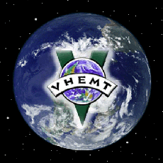

VHEMT

VHEMT

http://vhemt.org/

The Voluntary Human Extinction Movement “May we live long and die out” Phasing out the human race by voluntarily ceasing to breed will allow Earth’s biosphere to return to good health. Crowded conditions and resource shortages will improve as we become less dense. Aragonés | Asturian | Belarusian | Català | Chinese | Corsu | Czech | Dansk | Deutsch | English | Español | Esperanto | Français | Hebrew | Ido | Interlingua | Interlingue | Italiano | Latin | Lingua Franca Nova | Nederlands | Norsk | Occitan | Polski