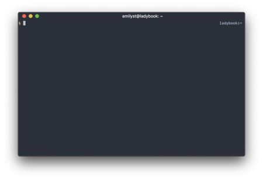
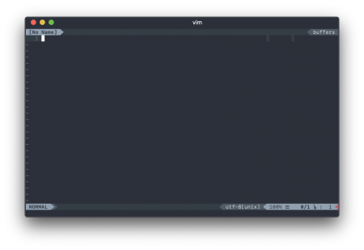
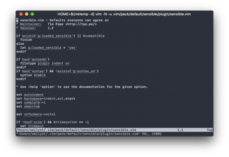
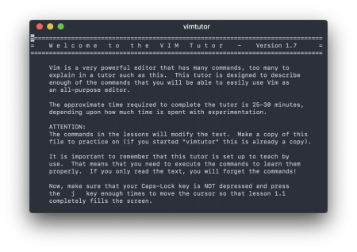

Vim in the Future

Posted on  [13 Nov 18](https://archive.emily.st/2018/11/13/vim-in-the-future/) by [Emily St＊](https://archive.emily.st/author/emilyst/)

# Vim in the Future

There is something of a tradition of programmers writing posts about Vim. Many proselytize, and others are narratives of discovery. What I want to contribute to the conversation about Vim, in this late year of 2018, is what role it still plays in a world that is technologically rushing by. I’m going to tell you more about Vim, why I use it, and how I use it, so that I can say why it might still be worthwhile looking at—or not.

I have learned Vim as a programming-centric tool, but I use it for other tasks, too. This post assumes a reader isn’t necessarily a programmer but is curious about how tech things get done.

## Vim in the Past[(L)](https://archive.emily.st/2018/11/13/vim-in-the-future/#vim-in-the-past)

First, let me talk a little bit about what Vim grew from.

[Vim](https://www.vim.org/) is old. It’s a program that was originally written for the [Amiga operating system](http://www.amigaos.net/), first available in 1991. The even older program it emulates, [`vi`](https://en.wikipedia.org/wiki/Vi), began in 1976 and was available in 1979. Vim has become the most common implementation of `vi` currently in use today, as Vim has become compatible with the vast majority of computers in existence.

This long history implies a couple of important things. First, `vi` predates many ideas which are today so ubiquitous that we consider them integral to how computers work: graphical interfaces, word processing, instant visual editing, multitasking, and so on. Second, it means that `vi` (and by extension, as its modern counterpart, Vim) occupies a special and integral role in the history of computing itself and the standards upon which many server operating systems are built. A `vi` command compatible with its original functionality remains a part of [the POSIX standard even to this day, as well as the Single UNIX Specification](http://pubs.opengroup.org/onlinepubs/9699919799/utilities/vi.html). Vim provides that today.

In other words, Vim is a relic of another time—one which is now over forty years gone. It can be obtuse, arcane, and occasionally downright wrong for today’s world as a result. The original author of `vi` used a *terminal*, not a computer directly: one slow enough that he had to issue instructions without seeing the feedback right away. [This, among many other constraints, guided `vi`‘s design.](https://www.theregister.co.uk/2003/09/11/bill_joys_greatest_gift/) Vim inherited these decisions in turn.

So it may surprise you that Vim has not only endured but flourished. The key lies in its flexibility within its historical constraints.

## Vim in the Present[(L)](https://archive.emily.st/2018/11/13/vim-in-the-future/#vim-in-the-present)

So what is Vim? It edits plain text, and it does so within a *terminal emulator* today.

Most operating systems[1](https://archive.emily.st/2018/11/13/vim-in-the-future/#note-1) offer a program called a terminal emulator which presents a boxy window of text and a prompt at which you can enter commands to execute programs, and the programs will run and usually output text in return as a result. This is also just called *the command line* or just a *terminal*. Nowadays, mine looks like the one below.

iTerm2 running on macOS Mojave 10.14.1

At the top left, there’s a little lightning bolt, which is what I’ve told my prompt to look like, and there’s a little rectangle, which indicates where my cursor is and where text will go if I type something. If I type “`vim`” and press Enter, the entire terminal changes to look like the image below.

Vim running in iTerm 2

Vim has changed the terminal’s screen into a text editor. The cursor is still there, but now it’s on the first line of a nameless buffer (an area of memory for editing).

There is no text there in the buffer, so I can’t really do anything. My options are to open a file which already exists, or I can insert new text into this empty buffer. Either of these options will call on me to take an action which feels pretty unfamiliar to a modern computer user.

If I want to open something, I type a colon followed by a command, like “`:edit`,” followed by the name of a file. This is an “Ex” command, a type of interface which harkens back to the editor which predates even `vi`. Vim has hundreds of these.

If I want to insert text, however, I need to change into Insert mode, by pressing “`i`.”  Now I can type in text as if I were at a normal editor, like Notepad or TextEdit. However, I can no longer enter Ex commands, so I can leave Insert mode by pressing the Escape key. Doing so puts me back in Normal mode. In this mode, I can move the cursor around, enter Ex commands (by entering a colon), and use some other commands, but I can’t directly insert text. In Insert mode, I can insert text, but I can’t access the other commands. So I have to switch back and forth.

This switching process is one of the relics of the 1970s which remains in the editor today: modal editing. It is simultaneously a frustrating obstacle to new users and a profitable tool to those who learn to appreciate it.

How can it be useful to be unable to enter text in a text editor? Consider that, in Normal mode, your keys do *not* enter text. That means they’re freed up to do other things. Vim therefore overloads every character on the keyboard in Normal mode with a meaning, such as an action (called an operator) or a modifier (such as a motion).

For example, the “`d`” key means delete in Normal mode. Yet it does not delete on its own. It’s merely an operator. For it to achieve something, it needs to be paired with a motion—some amount of text over which to accomplish the action. Motions are usually over text objects like words, sentences, paragraphs, lines, and so on. So to delete a word, it’s possible in Vim to put your cursor over that word, press “`dw`” (the combination of the “`d`” operator followed by the “`w`” motion), and Vim will delete the word. The combination of an operator and a motion is a command.

Throw in numbers (such as “`d3w`” for “delete three words”), and Normal mode provides a fully composable set of primitives for building up a language of text editing expressions. There exist other operators for changing, copying (“yanking” in Vim parlance—`vi` predates the existence of a clipboard), pasting (“putting”), formatting, swapping case, filtering through another program, and so on.

Vim is meant to be used primarily in Normal mode, where this language can be used for navigating the text, rearranging it, copying things around, manipulating things precisely, and so on. The number of operators and motions are relatively few (perhaps several dozen each—they can each be a couple of characters long). Yet from these, thousands and thousands of expressions may be formed.

This may sound overwhelming to learn at first, but there’s always time to learn as you go. `vi` has functioned this way for over forty years. Vim continues to function exactly the same way. If you learned only one operator or motion every week for a year, you’d know hundreds of expressions by heart after that time.

## Vim in the Future[(L)](https://archive.emily.st/2018/11/13/vim-in-the-future/#vim-in-the-future)

Vim has already been around almost thirty years just in its current incarnation. Every time I learn something new about Vim, or every time I customize it a little more, I benefit from that indefinitely. For all its problems, idiosyncrasies, and hangups, I know that I will likely never have to learn another text editor again for the rest of my life. Vim is capable enough and flexible enough to carry me into the future and meet whatever need I have without changing substantially. I feel relatively sure of this because it’s already lasted this long. At the heart of how it endures are those parts of Vim that resist change.

There is a large core component of its functionality guaranteed to work a certain way (the `vi` compatibility). The maintainer’s vision for Vim’s future firmly roots the editor to its past and its place within the wider Unix ecosystem. For example, I run the editor within a terminal, and while this is limiting (it has no native interface of its own), I appreciate the constraints. There are fewer things to change over time; the customization is tied to that environment, which I also control; and it is more closely integrated with the other tools I know.

I have heavily edited Vim to meet my needs over time. My `[.vimrc](https://github.com/emilyst/home/blob/master/.vimrc)` file is only the beginning. [The `.vim` directory I use](https://github.com/emilyst/home/tree/master/.vim) contains a massive number of plugins, some written by me, and others written by a number of online authors.

I write, and my writing is contained in hundreds of plain text files ([Markdown formatted](https://daringfireball.net/projects/markdown/syntax)) containing tens of thousands of words, all edited and formatted in Vim. These files’ formatting can be converted into whatever I need on the fly, but the editing remains as plain text so that I can use the same tool I’ve always known. I won’t have to worry about Vim replacing its toolbar with a “[ribbon](https://en.wikipedia.org/wiki/Ribbon_(computing))” next year or suddenly changing to a subscription model or dropping compatibility for my operating system.

Individually, those changes never bother me much, but other time, I noticed with most programs that I end up moving around from one thing to the next through the years as the platforms shift under me, as people learn how to do things differently. For example, I have switched web browsers several times over the years. With text, maybe we’ll learn some new tricks, but Vim is just a tool among many, and I imagine it will thrive as it has so far because it knows how to harmonize with a bigger ecosystem and learn to interoperate with new ideas without becoming something new.

In other words, I feel confident continuing with Vim and learning more about it over time because the core of how it works is stable, integral, and flexible enough to ensure it will work in the future.

## Vim in Your Future[(L)](https://archive.emily.st/2018/11/13/vim-in-the-future/#vim-in-your-future)

Do you want to use Vim after reading all that? The world is full of advice on how to do just this. Maybe you’ve already tried, and you came away frustrated.

I won’t say my advice is the only way to go. I think of Vim as a single cog in the larger clockwork of the terminal’s command-line interface. Some familiarity with the command line is helpful before enmeshing yourself in the teeth of Vim’s gears. (I hope to write about this wider someday soon.) But if you’re determined, I’ll give you a primer with the first steps. What you do after that is up to you.

Before you begin, you’ll want Vim on your computer, and if you’re using macOS or Linux, you’ve probably already got it. On some versions of Linux, you’ll need to install something like “`vim`” (Ubuntu) or “`vim-enhanced`” (Red Hat/CentOS/Fedora). For macOS users, the default version installed is fine, but a newer version through [Homebrew](https://brew.sh/) is available if you want it.

### A Gentle Ascent[(L)](https://archive.emily.st/2018/11/13/vim-in-the-future/#a-gentle-ascent)

If you’ve tried Vim before and it didn’t take, I’m willing to guess someone advised you to try Vim in a “pure” or strict way that makes no compromises on how you use it—as close to the original 1979 vision as possible. I don’t believe this makes sense in a modern world.

There’s another extreme available: pre-packaged configurations of Vim which come juiced to the gills with bells and whistles that make it seem polished, utterly flexible, and even magical. Possibly the most popular variant on this is called “`[spf13-vim](https://vim.spf13.com/)`.”

I suggest a compromise. You want to ease the transition in to Vim so you can be productive as soon as possible, but you also want to have your feet planted firmly on a solid bedrock so that you feel confident with each step you take. Below, I’ll try to guide you through how to do this by

- first, smoothing the transition with some minimal settings;
- next, providing a very minimal set of commands to do the most basic tasks;
- then, showing how to run the tutor and suggesting a reasonable pace for it; and
- finally pointing to the help system.

### Baseline Settings[(L)](https://archive.emily.st/2018/11/13/vim-in-the-future/#baseline-settings)

Now, remember how I said Vim is old? Yeah, it’s old. By default, it starts in something called “compatible” mode. This mode isn’t like the text editing modes I mentioned earlier. This means all its settings are modified to make it as much like the original `vi` as possible.

This default [changed in version 7.4.2111](https://github.com/vim/vim/commit/8c08b5b569e2a9e9f63dea514591ecfa2d3bb392), which happened back in 2016, so compatible mode might not affect you. If you have a newer version of Vim (8 or above), you probably have a “`defaults.vim`” somewhere which came with your version which sets a few things to more reasonable settings without your having to do anything.

However, let’s cover our bases and just lay the groundwork for a configuration file. This will accomplish a few things. First, the mere presence of a user configuration file will cause Vim to kick out of compatibility mode and behave more like you would expect, regardless of its version. Second, by having one, you will know where to stash new settings as you think to add them. Third, we’ll have a few more reasonable default settings—nothing too weird, just things that almost everyone universally ends up configuring almost right away.

The `defaults.vim` file is a fine place to start, but I’d suggest taking it a step farther. Tim Pope (a prolific Vim plugin writer) [has written a baseline settings file he calls “`sensible.vim`.”](https://github.com/tpope/vim-sensible/blob/master/plugin/sensible.vim) You can copy this wholesale to your home directory as a file called `.vimrc`.

Let’s add one final thing to it, though. If you’re the sort who uses the mouse ever, you might appreciate these few lines.

if has('mouse')
set mouse=a
endif

That little fragment can go on any line. Save that file to your home directory as `.vimrc`, and when you start vim, you’ll see something very minimal, but not entirely unreasonable. Here’s what you would see if you edited the sensible settings file itself.

iTerm2 running Vim with only sensible.vim settings, editing sensible.vim

We could tinker with these settings, but let’s just move on for now. You can do all that later. You have the entire rest of your life.

### Basic Tasks[(L)](https://archive.emily.st/2018/11/13/vim-in-the-future/#basic-tasks)

You really only need to accomplish a very small handful of things to get the barest of functionality from Vim. Let’s cover each.

1. **Open Vim.** You type “`vim`” on the command line. Easy, right? You can also type “`vim`” followed by a filename to open a file directly (e.g., “`vim path/to/a/file.txt`“). That’s one way to open a file.

2. **Open a file.** If you’re already in Vim, though, you want to open files without closing the program entirely and then reopening it. Easiest way to do that is with the Ex command “`:edit`” followed by the filename, such as “`:edit path/to/a/file.txt`.” You can use “`:e`” as a shorthand for “`:edit`.”

3. **Change a file.** You can move the cursor around with your arrow keys in both Insert mode and Normal mode. (The Vim purists will tell you to use one of “`h`,” “`j`,” “`k`,” or “`l`,” to move the cursor around, and you may do so, but this works only in Normal mode, and it may feel unnatural at first.) Use “`i`” to put Vim into insert mode. Change the text as you like. Then use the Escape key to leave Insert mode.

4. **Save a file.** You can do this with an Ex command, “`:write`.” You can use “`:w`” as a shorthand for “`:write`.”

5. **Close Vim.** You can use “`:exit`” to do this, another Ex command. If you want to, you can shorten this to “`:xit`” or just “`:x`.” This command happens to save any file you’re working on before quitting. If it can’t write a file, it will balk and tell you. If you merely want to bail out without saving, you can use “`:quit!`” to force the matter (this has a “`:q!`” counterpart as well).

That’s it. With that set of commands, strictly speaking, you don’t need anything else. You could use Vim the rest of your life, configured or not, old or new, and never worry about the rest. In fact, all those commands are `vi`-compatible, so you could go back to 1979 and be fine.

Of course, if you’ve configured the mouse, it’ll be nice being able to scroll and click things, but otherwise, you’re ready to start.

### The Vim Tutorial[(L)](https://archive.emily.st/2018/11/13/vim-in-the-future/#the-vim-tutorial)

You might find your 1979 life very dull and slow, though. You’ll want to learn new things, and the place to start is with Vim’s own tutorial.

Many Vim users never actually look at the tutorial, which is a shame. The tutorial is actually just a text file. If you run the command “`vimtutor`” from the command line, Vim opens in a bare, minimally configured mode with a copy of this text file.

iTerm2 running the Vim tutor

The tutorial is divided into multiple brief lessons, each on a different topic which builds on the last. The tutorial itself, being text, is designed to be edited so that you can interact with it and learn by example.

Though the tutorial says it will take about a half hour to complete, I do not recommend chewing through the whole thing in a single half hour and never returning. Instead, I suggest you take in the first few lessons and then skim the rest. After that, come back to it a few days later, take a few more lessons, and so on. It’s a very information-dense resource, and I believe it takes a few reads before it sinks in. I believe it’s reasonable to spend some weeks just absorbing it.

It never hurts to return to the tutorial even after you’re settled in and feeling more confident. There are always dusty, cobwebby corners of expertise which could use some refreshing, and the tutorial hits upon a broad swath of topics.

Finally, there are several suggestions from the tutorial which you need not incorporate into your life at all. Use your judgment on what is appropriate for you. It suggests moving away from the arrow keys, for example. I have never done this. I probably never will. It’s not appropriate for me because I have difficulty distinguishing right and left, and so mapping “`j`” and “`k`” (which are laterally adjacent) to up and down in my mind is extremely confusing. The spatial layout of the arrow keys on my keyboard helps me keep things straight. So from the tutorial, take what you need and leave what you don’t.

### Further Learning[(L)](https://archive.emily.st/2018/11/13/vim-in-the-future/#further-learning)

If you have mastered the tutorial, you stand head and shoulders above many Vim users already in sheer ability to manipulate text. A lot of people learn whatever commands they need piecemeal and never go out of their way to discover new ones until they see them in action or feel the need to look.

Yet you may feel many things are lacking. You might start to wonder how to accomplish the same task over and over again and wonder whether Vim has a way to do so (it does, using the repeat operator or recording). Or you might wonder what some of the settings in your `.vimrc` file mean. Or wonder how to switch between open files (buffers).

Here, the Vim manual can be very helpful. It is shockingly extensive. Almost every kind of functionality, topic, setting, or concept is documented by name in the manual somewhere. It’s a matter of typing “`:help`” followed by some word related to what you want to know.

Don’t know what word to search for? Vim will take parts of words and try to find the best match. For example, “`:help reco`” will teach you about the “`:recover`” command. Want to see what’s available? If you’ve used the sensible configuration from above, you can use tab-completion on the command line in Vim to see available help topics and cycle through them. For example, typing “`:help reco`” and then pressing Tab shows a range of possibilities in the statusline. The first one is filled in automatically. Press Tab again, and the second suggestion is filled in. You can press Tab to cycle through all the available options.

Sometimes you can’t find the answer within Vim’s help, and you need an Internet search. Very often, this will bring the suggested fix of using a plugin to provide a piece of functionality. As you learn Vim, I suggest you incorporate plugins slowly at first.

Being choosy and slow to adapt plugins will help you learn Vim’s core internals better instead of overriding them in a fragile or even nonsensical way. I have added many plugins to my configuration over time, but I’ve removed at least as many. Some have gone unused, but others actively interfered with Vim’s workings because the plugin was not designed to harmonize with the design of the editor itself.

[Tim Pope](https://github.com/tpope) has written dozens of plugins and is expert in knowing how to write ones which extend Vim in nearly invisible ways. For example, the [vim-surround](https://github.com/tpope/vim-surround) plugin adds operators and motions for wrapping or unwrapping quotes, tags, and blocks of text with parentheses, brackets, and so on. It operates so fluently within the context of Vim that it’s difficult to remember that it’s not part of the original program.

Less harmonious plugins attempt to do things like create kinds of UIs (such as for navigating filesystems) or override parts of Vim in fragile ways (such as faking multiple-cursor support by coloring parts of the buffer to *look* like cursors and then repeating the actual cursor’s actions at those regions). Sometimes these plugins work out. Sometimes they don’t.

My suggestion here is to use Vim as is for a little while, and if some process feels particularly painful or annoying for a few days, then seek out a better way—first through Vim itself then through a plugin if available.

If the idea of tweaking Vim to your liking (or learning some of the really interesting Vim commands) sounds appealing, a really great resource is a book called *[Practical Vim](https://pragprog.com/book/dnvim2/practical-vim-second-edition)*. It’s a fully modern approach to Vim with plenty of things that feel very empowering, and it’s arranged in a recipe-like fashion so that you don’t have to read from end to end (unlike the Vim tutorial).

Finally, I am always happy to answer questions if no other resource is helpful or available.

## Editing Your Future[(L)](https://archive.emily.st/2018/11/13/vim-in-the-future/#editing-your-future)

That’s the plan. Set up a basic configuration so that you have an easier start of it, read the tutorial, and know where to go when you need more info. Take things slow, but feel free to beat your own path. It’s your program, and you’re free to determine what works best for you. Don’t let anyone tell you what the “Vim way” is.

You’re not at all obligated to stick with Vim or even try it. My only goal is to tear down whatever obstacles may have been in your way to begin with—overly rigid guidance, misconceptions, mystification—if you were curious to begin with.

I fully admit Vim is imperfect and may not be the best text editor for this century altogether. However, for my own part, I’m certain I can look forward to a long future of return on my investment in Vim. For this reason alone, I think it’s worth a look.

Categories[Technology](https://archive.emily.st/category/tech/)![](data:image/svg+xml,%3csvg xmlns='http://www.w3.org/2000/svg' class='icon icon-hashtag js-evernote-checked' aria-hidden='true' role='img' data-evernote-id='346'%3e %3cpath class='path1 js-evernote-checked' d='M17.696 18.286l1.143-4.571h-4.536l-1.143 4.571h4.536zM31.411 9.286l-1 4q-0.125 0.429-0.554 0.429h-5.839l-1.143 4.571h5.554q0.268 0 0.446 0.214 0.179 0.25 0.107 0.5l-1 4q-0.089 0.429-0.554 0.429h-5.839l-1.446 5.857q-0.125 0.429-0.554 0.429h-4q-0.286 0-0.464-0.214-0.161-0.214-0.107-0.5l1.393-5.571h-4.536l-1.446 5.857q-0.125 0.429-0.554 0.429h-4.018q-0.268 0-0.446-0.214-0.161-0.214-0.107-0.5l1.393-5.571h-5.554q-0.268 0-0.446-0.214-0.161-0.214-0.107-0.5l1-4q0.125-0.429 0.554-0.429h5.839l1.143-4.571h-5.554q-0.268 0-0.446-0.214-0.179-0.25-0.107-0.5l1-4q0.089-0.429 0.554-0.429h5.839l1.446-5.857q0.125-0.429 0.571-0.429h4q0.268 0 0.446 0.214 0.161 0.214 0.107 0.5l-1.393 5.571h4.536l1.446-5.857q0.125-0.429 0.571-0.429h4q0.268 0 0.446 0.214 0.161 0.214 0.107 0.5l-1.393 5.571h5.554q0.268 0 0.446 0.214 0.161 0.214 0.107 0.5z' data-evernote-id='997'%3e%3c/path%3e %3c/svg%3e)Tags[history](https://archive.emily.st/tag/history/), [programming](https://archive.emily.st/tag/programming/), [terminal](https://archive.emily.st/tag/terminal/), [text](https://archive.emily.st/tag/text/), [vi](https://archive.emily.st/tag/vi/), [vim](https://archive.emily.st/tag/vim/)